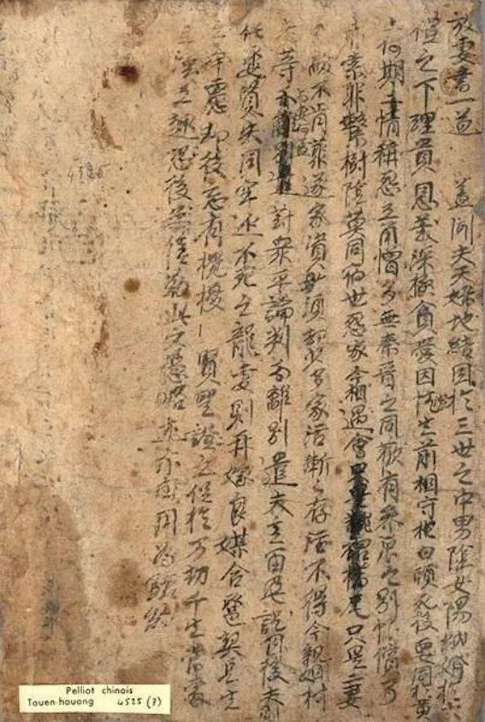

# 敦煌文献

### 放妻书几则

> 来自[知乎](https://zhuanlan.zhihu.com/p/189880489)

* 第1则：
  * 
```
某李甲谨立放妻书。
盖说夫妇之缘，恩深义重，论谈共被之因，结誓幽远。
凡为夫妇之因，前世三生结缘，始配今生夫妇，若结缘不合，比是怨家，故来相对。
妻则一言十口，夫则反目生嫌，似稻鼠相憎，如狼羊一处。
既以二心不同，难归一意，快会及诸亲，各还本道。
愿妻娘子相离之后，重梳蝉鬓，美裙娥眉，巧逞窈窕之姿，选聘高官之主。
解怨释结，更莫相憎。一别两宽，各生欢喜。

于时年月日谨立除书。
```

* 第2则
```
盖以伉俪情深，夫妇义重，幽怀合卺之欢，须□同牢之乐。
夫妻相对，恰似鸳鸯，双飞并膝，花颜共坐。两德之美，恩爱极重。
二体一心，死同棺椁于坟下。三载结缘，则夫妇相和。
三年有怨，则来作仇隙。今已不和，想是前世怨家。
眅目生怨，作为后代增嫉，缘业不遂，因此聚会六亲，夫□妻□，具名书之。
□归一别，相隔之后，更选重官双职之夫，弄影庭前，美逞琴瑟合韵之态。
解□舍结，更莫相谈。三年衣粮，便献柔仪。
伏愿娘子千秋万岁。
时次×年×月日
```