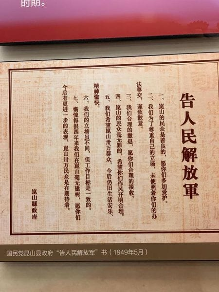
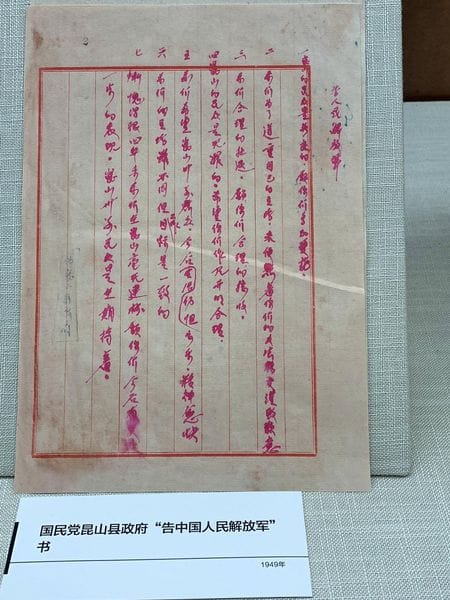

# 篇章摘录（中文）

## 诗文

> - 无论什么黑暗来防范思潮，什么悲惨来袭击社会，什么罪恶来亵渎人道，
>   人类的渴仰完全的潜力，总是踏了这些铁蒺藜向前进。
>
> - 所以我时常害怕，原中国青年都摆脱冷气，只是向上走，不必听自暴自弃者流的话。
>   能做事的做事，能发声的发声。
>   有一分热，发一分光，就令萤火一般，也可以在黑暗里发一点光，不必等候炬火。
>   此后如竟没有炬火：我便是唯一的光。
>   倘若有了炬火，出了太阳，我们自然心悦诚服的消失，不但毫无不平，而且还要随喜赞美这炬火或太阳；
>   因为他照了人类，连我都在内。我又愿中国青年都只是向上走，不必理会这冷笑和暗箭。
>
> - 做了人类想成仙；生在地上要上天；
>   明明是现代人，吸着现在的空气，
>   却偏要勒派朽腐的名教，僵死的语言，侮蔑尽现在，这都是“现在的屠杀者”。
>   杀了“现在”，也便杀了“将来”。——将来是子孙的时代。
>
> ——[鲁迅](../wiki/鲁迅.md)《热风》

---

> 炭起初是树木，后来死了，
> 现在，身子里通过红隐隐的火，又活过来，
> 然而，活着，就快成灰了。
>
> ——[张爱玲](../wiki/张爱玲.md) 《留情》

---

> 当你老了，回顾一生，就会发觉：
> 什么时候出国读书、什么时候决定做第一份职业、
> 何时选定了对象而恋爱、什么时候结婚，
> 其实都是命运的巨变。
> 只是当时站在三岔路口，眼见风云千樯，你作出选择的那一日，
> 在日记上，相当沉闷和平凡，当时还以为是生命中普通的一天。
>
> ——[陶杰](../wiki/陶杰.md)《杀鹌鹑的少女》

---

> 世间所有相遇 都是久别重逢  
> ——白落梅同名散文集, [豆瓣读书](https://book.douban.com/subject/33462204/)

---

> 天下治安， 一统久矣，势必驯至分剖，然主威素重，风采未开，若非抽心一烂， 则土崩瓦解之局不成。
> 以烈度之， 异日之祸， 必先根本颠仆，而后方州无主，人自为政，殆不出五十年矣。
>
> 恐遂陆沉，未必能效晋、宋也。
>
> 君德正矣，而国势之隆，食报已不为不厚。国初创业太易，诛戮太重，所以有天下者太巧。
> 天道难知，善恶不相掩，后君之德泽，未足恃也。
>
> ——[赵烈文](../wiki/赵烈文.md)，《能静居日记·同治六年六月》与曾国藩对答

---

## 网络

> 你若安好，便是晴天。

```
[知乎讨论](https://www.zhihu.com/question/20143171)

出处1:
古罗马人写信的常用语句：Si vales, valeo.
大意：你若安好，我亦安好。 / If you are well, I am well

出处2（时间序）:
1.快男陈翔粉丝团口号“陈翔陈翔，伴你飞翔。你若安好，便是晴天。”，“你若幸福，便是终点”。
2.唯美散文《后宫甄環传》，开头第一句就是“时光如水，总是无言。若你安好，便是晴天”，结尾最后一句是“此生，你若安好，便是晴天”。
3.白落梅作品《你若安好便是晴天：林徽因传》
```

---

## 其他

> 一、昆山的民众是善良的，愿你们多加爱护。  
> 二、我们为了尊重自己的立场，未便照着你们的办法移交，谨致歉意。  
> 三、我们合理的撤退，愿你们合理的接收。  
> 四、昆山的民众是无罪的，希望你们作风开明合理。  
> 五、我们希望昆山卅万群众，今后仍旧生活安乐、精神愉快。  
> 六、我们的立场虽不同，但工作目标是一致的。  
> 七、惭愧得很四年来我们在昆山毫无建树，愿你们今后有更进一步的表现，昆山卅万民众是在期待着。  
> 
> ——国民党昆山县政府“告人民解放军”书，1949 年 5 月撤退前留。现藏昆山档案馆。



