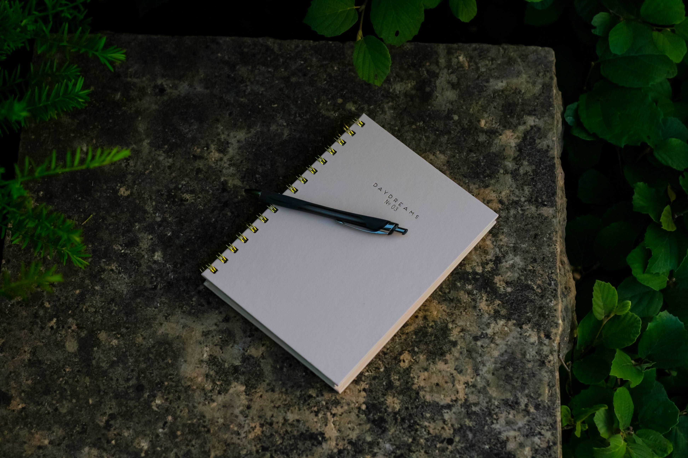

# 索引

import TOCInline from '@theme/TOCInline';

TOC

<TOCInline toc={toc.filter((node) => node.level >= 2 && node.level <= 4)} 
/>

---

## 温故知新

### hist`温故`

- [温故 2018](../hist/hist-2018.md)
- [温故 2018 续](../hist/hist-2018x.md)

### item`新知`

- [新知-管理定律](info-gl.md)
- [新知-机构学校](info-jg.md)
- [新知-历史地理](info-ld.md)
- [新知-社会综合](info-sh.md)
- [新知-文化生活](info-wh.md)
- [新知-国朝新学](info-zh.md)
- [新知-自然科技](info-zr.md)

### dict`辞章`

- [外国诗歌](../dict/poem-intl.md)
- [对联集句](../dict/poem-zh-couplets.md)
- [古诗名句](../dict/poem-zh-gushi.md)
- [新诗摘录](../dict/poem-zh-xinshi.md)
- [影视台词](../dict/quote-ent.md)
- [未知的格言摘录（外文）](../dict/quote-intl-unk.md)
- [格言警句（外文）](../dict/quote-intl.md)
- [哏/梗/网络流行语/迷因/MEME](../dict/quote-meme.md)
- [篇章摘录（中文）](../dict/quote-zh-long.md)
- [未知的格言摘录（中文）](../dict/quote-zh-unk.md)
- [格言警句（中文）](../dict/quote-zh.md)
- [网络流行词/MEME](../dict/word-meme.md)
- [音译/意译词](../dict/word-trans.md)
- [字集](../dict/word-zh-char.md)
- [词库](../dict/word-zh-idiom.md)
- [谚语俗语](../dict/word-zh-idiom2.md)

---

## 分类

### wiki`人物`

- [Agatha Christie（阿加莎·克里斯蒂）](../wiki/阿加莎·克里斯蒂.md)
- [Alan Kay（艾伦·凯）](../wiki/艾伦·凯.md)
- [Albert Einstein（阿尔伯特·爱因斯坦）](../wiki/爱因斯坦.md)
- [Albius Tibullus（提布鲁斯）](../wiki/Tibullus.md)
- [Alexandre Dumas，père（大仲马）](../wiki/大仲马.md)
- [Antoine de Saint-Exupéry（安托万·德·圣-埃克苏佩里）](../wiki/圣-埃克苏佩里.md)
- [Arthur Schopenhauer（阿图尔·叔本华）](../wiki/叔本华.md)
- [Benedetto Croce（贝奈戴拖·克罗齐）](../wiki/克罗齐.md)
- [Bertrand Russell（伯特兰·罗素）](../wiki/罗素.md)
- [Boris Pasternak（鲍利斯·帕斯捷尔纳克）](../wiki/帕斯捷尔纳克.md)
- [C.R.Rao](../wiki/C.R.%20Rao.md)
- [Carl Friedrich Gauss（卡尔·弗里德里希·高斯）](../wiki/高斯.md)
- [Dante（但丁）](../wiki/但丁.md)
- [Douglas MacArthur（道格拉斯·麦克阿瑟）](../wiki/麦克阿瑟.md)
- [Edgar Allan Poe（埃德加·爱伦·坡）](../wiki/爱伦·坡.md)
- [Edward Livingston Trudeau（爱德华·利文斯顿·特鲁多）](../wiki/Edward%20Livingston%20Trudeau.md)
- [F. Scott Fitzgerald（弗·斯科特·菲茨杰拉德）](../wiki/菲茨杰拉德.md)
- [Friedrich Wilhelm Nietzsche（弗里德里希·威廉·尼采）](../wiki/尼采.md)
- [Fritz Stern（弗里茨·斯特恩）](../wiki/弗里茨·斯特恩.md)
- [Gaius Octavius Augustus（盖维斯·屋大维·奥古斯都）](../wiki/屋大维.md)
- [George Box（乔治·博克斯）](../wiki/乔治·博克斯.md)
- [George Bush（乔治·布什）](../wiki/老布什.md)
- [Godfrey Harold Hardy（G.H·哈代）](../wiki/G.H·哈代.md)
- [Gustave Flaubert（居斯塔夫·福楼拜）](../wiki/福楼拜.md)
- [Heinrich Heine（海因里希·海涅）](../wiki/海涅.md)
- [Hippocrates（希波克拉底）](../wiki/希波克拉底.md)
- [Isaac Newton（艾萨克·牛顿）](../wiki/牛顿.md)
- [Jean de La Fontaine（让·德·拉·封丹）](../wiki/拉·封丹.md)
- [Jean-Paul Sartre（让-保罗·萨特）](../wiki/萨特.md)
- [Jeanette Winterson（珍妮特·温特森）](../wiki/珍妮特·温特森.md)
- [Johann Hölderlin（约翰·荷尔德林）](../wiki/荷尔德林.md)
- [Khat Thi（克席）](../wiki/Khat%20Thi.md)
- [Leonard Cohen（莱昂纳德·科恩）](../wiki/莱昂纳德·科恩.md)
- [Linus Benedict Torvalds（林纳斯·本纳第克特·托瓦兹）](../wiki/托瓦兹.md)
- [Lord Acton（阿克顿勋爵）](../wiki/阿克顿.md)
- [Ludwig Wittgenstein（路德维希·维特根斯坦）](../wiki/维特根斯坦.md)
- [Max Weber（马克斯·韦伯）](../wiki/马克斯·韦伯.md)
- [Michael Jackson（迈克尔·杰克逊）](../wiki/迈克尔·杰克逊.md)
- [Murakami Haruki（村上春树）](../wiki/村上春树.md)
- [Nagaya（长屋王）](../wiki/长屋王.md)
- [Neil Postman（尼尔·波兹曼）](../wiki/尼尔·波兹曼.md)
- [Omar Nelson Bradley（奥马尔·纳尔逊·布莱德雷）](../wiki/奥马尔·布莱德雷.md)
- [Phil Karlton（菲尔·卡尔顿）](../wiki/Phil%20Karlton.md)
- [Philip Leslie Graham（菲利普·莱斯利·格雷厄姆）](../wiki/Philip%20Graham.md)
- [Prist（刘垚）](../wiki/Prist.md)
- [Rainer Maria Rilke（赖内·马利亚·里尔克）](../wiki/里尔克.md)
- [René Descartes（勒内·笛卡尔）](../wiki/笛卡尔.md)
- [Richard Yates（理查德·耶茨）](../wiki/理查德·耶茨.md)
- [Romain Rolland（罗曼·罗兰）](../wiki/罗曼·罗兰.md)
- [Ryuichi Sakamoto（坂本龙一）](../wiki/坂本龙一.md)
- [Stan Lee（斯坦·李）](../wiki/斯坦·李.md)
- [Terauchi Jutarō（寺内寿太郎）](../wiki/寺内寿太郎.md)
- [Tertullianus（德尔图良）](../wiki/Tertullianus.md)
- [Warren Buffett（沃伦·巴菲特）](../wiki/巴菲特.md)
- [William Blake（威廉·布莱克）](../wiki/威廉·布莱克.md)
- [William Faulkner（威廉·福克纳）](../wiki/福克纳.md)
- [William Somerset Maugham（威廉·萨默塞特·毛姆）](../wiki/毛姆.md)
- [William Wordsworth（威廉·华兹华斯）](../wiki/威廉·华兹华斯.md)
- [Winston Churchill（温斯顿·丘吉尔）](../wiki/丘吉尔.md)
- [Wolfgang Behringer（沃尔夫冈·贝林格）](../wiki/沃尔夫冈·贝林格.md)
- [何兹全](../wiki/何兹全.md)
- [余光中](../wiki/余光中.md)
- [佚名](../wiki/佚名.md)
- [关汉卿](../wiki/关汉卿.md)
- [冯唐（张海鹏）](../wiki/冯唐.md)
- [冯道](../wiki/冯道.md)
- [刘健群](../wiki/刘健群.md)
- [刘子翚](../wiki/刘子翚.md)
- [刘琨](../wiki/刘琨.md)
- [刘过](../wiki/刘过.md)
- [刘长卿](../wiki/刘长卿.md)
- [唐珙](../wiki/唐珙.md)
- [唐鉴](../wiki/唐鉴.md)
- [姚燧](../wiki/姚燧.md)
- [姜夔](../wiki/姜夔.md)
- [完颜亮](../wiki/完颜亮.md)
- [岑参](../wiki/岑参.md)
- [巫马行](../wiki/巫马行.md)
- [常建](../wiki/常建.md)
- [弄清风](../wiki/弄清风.md)
- [张爱玲](../wiki/张爱玲.md)
- [张超（黑眼睛）](../wiki/张超.md)
- [彭玉麟](../wiki/彭玉麟.md)
- [戚继光](../wiki/戚继光.md)
- [智鉴](../wiki/智鉴.md)
- [曹松](../wiki/曹松.md)
- [曹雪芹](../wiki/曹雪芹.md)
- [李商隐](../wiki/李商隐.md)
- [李梦唐](../wiki/李梦唐.md)
- [李涉](../wiki/李涉.md)
- [李白](../wiki/李白.md)
- [李颀](../wiki/李颀.md)
- [杜甫](../wiki/杜甫.md)
- [杜荀鹤](../wiki/杜荀鹤.md)
- [梁启超](../wiki/梁启超.md)
- [梁遇春](../wiki/梁遇春.md)
- [欧阳修](../wiki/欧阳修.md)
- [毛泽东](../wiki/毛泽东.md)
- [汤恢](../wiki/汤恢.md)
- [汪洙](../wiki/汪洙.md)
- [汪精卫（汪兆铭）](../wiki/汪精卫.md)
- [王守仁](../wiki/王守仁.md)
- [王安石](../wiki/王安石.md)
- [王昌龄](../wiki/王昌龄.md)
- [王维](../wiki/王维.md)
- [王薄（知世郎）](../wiki/王薄.md)
- [白居易](../wiki/白居易.md)
- [罗隐](../wiki/罗隐.md)
- [胡兰成（胡积蕊）](../wiki/胡兰成.md)
- [苏轼](../wiki/苏轼.md)
- [苏辙](../wiki/苏辙.md)
- [范仲淹](../wiki/范仲淹.md)
- [诸葛亮](../wiki/诸葛亮.md)
- [贯休](../wiki/贯休.md)
- [赵烈文](../wiki/赵烈文.md)
- [赵艳雪](../wiki/赵艳雪.md)
- [辛弃疾](../wiki/辛弃疾.md)
- [邱琼](../wiki/邱琼.md)
- [邵雍](../wiki/邵雍.md)
- [钱谦益](../wiki/钱谦益.md)
- [钱钟书](../wiki/钱钟书.md)
- [陆九渊](../wiki/陆九渊.md)
- [陆机](../wiki/陆机.md)
- [陆贾](../wiki/陆贾.md)
- [陈沆](../wiki/陈沆.md)
- [陈著](../wiki/陈著.md)
- [陶弘景](../wiki/陶弘景.md)
- [陶杰（曹捷）](../wiki/陶杰.md)
- [陶渊明](../wiki/陶渊明.md)
- [韦应物](../wiki/韦应物.md)
- [韩淲](../wiki/韩淲.md)
- [马致远](../wiki/马致远.md)
- [高晓松](../wiki/高晓松.md)
- [高蟾](../wiki/高蟾.md)
- [鱼玄机（鱼幼薇）](../wiki/鱼玄机.md)
- [鲁迅（周树人）](../wiki/鲁迅.md)
- [黄景仁](../wiki/黄景仁.md)
- [龚自珍](../wiki/龚自珍.md)

### book`书籍`

- [三国志](../book/三国志.md)
- [世说新语](../book/世说新语.md)
- [华严经](../book/华严经.md)
- [史记](../book/史记.md)
- [后汉书](../book/后汉书.md)
- [后汉记](../book/后汉记.md)
- [周礼](../book/周礼.md)
- [孟子](../book/孟子.md)
- [宋史](../book/宋史.md)
- [左传](../book/左传.md)
- [庄子](../book/庄子.md)
- [拜月亭（幽闺记）](../book/拜月亭.md)
- [敦煌文献](../book/敦煌文献.md)
- [新约圣经](../book/新约圣经.md)
- [旧约·圣经](../book/旧约圣经.md)
- [明史](../book/明史.md)
- [春秋左传正义](../book/春秋左传正义.md)
- [晋书](../book/晋书.md)
- [法华经](../book/法华经.md)
- [礼记](../book/礼记.md)
- [诗经](../book/诗经.md)
- [贞观政要](../book/贞观政要.md)

### post`文章`

- [Anthes-Unix40 年昨天今天和明天](../post/anthes-2009.md)
- [Barlow-赛博空间独立宣言](../post/barlow-1996.md)
- [C.R. Rao-《统计与真理》序言](../post/rao-1987.md)
- [Eric Raymond-提问的智慧](../post/raymond-2014.md)
- [Gu-研究生须知的十个简单法则](../post/gu-2007.md)
- [Hebert-小 Printf](../post/hebert-2015.md)
- [Seph Gentle-编程的 3 个部落](../post/gentle-2017.md)
- [Tozzi-从 UNIX 到 GitHub 十个关于自由和开源软件历史的重要事件](../post/tozzi-2017.md)
- [WWF-2017 可持续生活指南](../post/wwf-2017.md)
- [三书-火车外一闪而过的风景](../post/sanshu-2022.md)
- [亚伦·斯沃茨-游击队开放访问宣言](../post/swartz-2008.md)
- [亚伯拉罕·林肯-葛底斯堡演讲](../post/lincoln-1863.md)
- [亨利·奥古斯特·罗兰-为纯科学呼吁](../post/rowland-1883.md)
- [亨利·沃兹沃斯·朗费罗-生命礼赞](../post/longfellow-1838.md)
- [人力资源社会保障部-2021 年版《国家职业资格目录》](../post/mohrss-2021.md)
- [伯特兰·罗素-我为什么而活着](../post/russell-1956.md)
- [伯特兰·罗素-自由主义十诫](../post/russell-1951.md)
- [但丁-神曲地狱篇](../post/dante-1313.md)
- [余光中-等你在雨中/寻李白/欢呼哈雷](../post/yuguangzhong-1962.md)
- [余凌云-中国宪法史上的国歌](../post/yulingyu-2015.md)
- [你们的隔壁老王啊-反下岗攻略](../post/weibo-2023.md)
- [兽爷-疫苗之王](../post/shouye-2018.md)
- [冯至-歧路](../post/fengzhi-1943.md)
- [冲浪鸽-25 年前互联网大佬在最原始的论坛网上冲浪](../post/chonglangge-2019.md)
- [北岛-太阳城札记](../post/beidao-1979.md)
- [北岛-波兰来客](../post/beidao-1999.md)
- [半月谈-共和国词典 1949-2009](../post/banyuetan-2010.md)
- [叶敬忠-在权力的包围中不要熄灭真善美的光](../post/yejingzhong-2023.md)
- [叶首部-家乡啤酒兴亡史](../post/yeshoubu-2018.md)
- [周兴嗣-千字文](../post/zhouxingsi-502.md)
- [周剑辉-怎样看待简体字](../post/zhoujianhui-2017.md)
- [坂本龙一-采访和书信等](../post/sakamoto-2023.md)
- [塞缪尔·厄尔曼-青春](../post/ullman-1918.md)
- [大卫·范伯格-孤独的根号三](../post/feinberg-2008.md)
- [孤独力命-晋江小说的人物姓氏](../post/dugumingli-2016.md)
- [岩井俊二-情书](../post/iwai-1995.md)
- [帕斯捷尔纳克-日瓦戈医生哈姆雷特](../post/pasternak-1957.md)
- [席慕容-一棵开花的树和雕刀](../post/ximurong-1984.md)
- [张曼菱-烽火读书声](../post/zhangmanling-2015.md)
- [张枣-镜中](../post/zhangzao-1984.md)
- [张梅-给我未来的孩子](../post/zhangmei-1997.md)
- [张皇琦-看不到的焦虑和看得到的质疑北大 120 年校庆见闻](../post/zhanghuangqi-2018.md)
- [张鸣飞-网络小说二十年推荐](../post/zhangmingfei-2017.md)
- [新华社-中华人民共和国大事记 1949 年 10 月－2019 年 9 月](../post/xinhuashe-2019.md)
- [新华社-中国共产党一百年大事记 1921 年 7 月至 2021 年 6 月](../post/xinhuashe-2021.md)
- [新华社-新华社新闻信息报道中的禁用词和慎用词](../post/xinhuashe-2016.md)
- [李可-流感下的北京中年](../post/like-2018.md)
- [李沉简-挺直脊梁 拒做犬儒](../post/lichenjian-2018.md)
- [村上春树-高墙与鸡蛋耶路撒冷文学奖获奖演讲](../post/murakami-2009.md)
- [杨小凯-中国向何处去](../post/yangxiaokai-1968.md)
- [杨小凯-我的一生](../post/yangxiaokai-2003.md)
- [杨飞-深度调查为什么我们不能访问谷歌](../post/yangfei-2016.md)
- [林楚方-布什总统在美国国庆日在中国网友会上的演说代拟](../post/linchufang-2002.md)
- [梁启超-呵旁观者文](../post/liangqichao-1900.md)
- [梁遇春-人死观](../post/liangyuchun-1930.md)
- [毛泽东-星星之火可以燎原](../post/maozedong-1930.md)
- [毛泽东-给江青的信](../post/maozedong-1966.md)
- [沈甫宣-没有悲伤的十五秒](../post/shim-2008.md)
- [洪波-以 Linux 的名义](../post/hongbo-2003.md)
- [洪蔚琳-如此打工 30 年](../post/hongweilin-2023.md)
- [海子-祖国或以梦为马](../post/haizi-1987.md)
- [清和-香港往事 | 一人，一城](../post/qinghe-2019.md)
- [爱伦·坡-致海伦](../post/poe-1831.md)
- [爱因斯坦-主权的限制](../post/einstein-1931.md)
- [爱因斯坦-我的世界观](../post/einstein-1930.md)
- [王伟凯-传销三十年净衣帮和污衣帮](../post/wangweikai-2017.md)
- [王奕-从论坛到微信网络水军的前世今生](../post/wangyi-2015.md)
- [王小波-我为什么要写作](../post/wangxiaobo-1994.md)
- [王志纲-再回首邓公的遗产](../post/wangzhigang-2018.md)
- [王羲之-兰亭集序](../post/wangxizhi-353.md)
- [玛莉·伊丽莎白·弗莱-不要伫立在我的墓前哭泣](../post/frye-1934.md)
- [班宇-漫长的](../post/banyu-2022.md)
- [瓦茨拉夫·哈维尔-1990 年新年献辞](../post/havel-1990.md)
- [田余庆-一位学者的学术自传](../post/tianyuqing-2010.md)
- [穆旦-冥想](../post/mudan-1976.md)
- [章诒和-一阵风留下了千古绝唱](../post/zhangyihe-2004.md)
- [等离子的氯-化学术语用字正音表](../post/denglizidelv-2013.md)
- [约翰·多恩-没有人是一座岛屿自成一体](../post/donne-1623.md)
- [约翰·肯尼迪-我是柏林人](../post/kennedy-1963.md)
- [维克多·雨果-明天，待天一亮](../post/hugo-1847.md)
- [网易新闻-何必为北大痛心疾首](../post/netease-2012.md)
- [老榕-大连金州没有眼泪](../post/laorong-1997.md)
- [老舍-断魂枪](../post/laoshe-1936.md)
- [胡启立-我心中的耀邦](../post/huqili-2005.md)
- [至道书院-思极恐的万科宝能之争门口的野蛮人背后的赵家人](../post/zhidaoshuyuan-205.md)
- [艾伦·凯-预测未来](../post/kay-1989.md)
- [艾兹赫尔·戴克斯特拉-为什么应该从 0 开始计数](../post/dijkstra-1982.md)
- [艾略特-荒原](../post/eliot-1922.md)
- [艾米莉·狄金森-如果我不曾见过太阳](../post/dickinson-1872.md)
- [艾米莉·狄金森-如果我能教一颗心免于破碎](../post/dickinson-1864.md)
- [苏珊·桑塔格-百年电影回眸](../post/sontag-1996.md)
- [蓝莲安-动漫婆罗门消亡史](../post/lanlianan-2017.md)
- [袁伟时-现代化与历史教科书](../post/yuanweishi-2006.md)
- [西格夫里·萨松-于我过去现在以及未来](../post/sassoon-1918.md)
- [詹姆斯·泽摩曼-思想之空旷](../post/zimmerman-2015.md)
- [谷川俊太郎-二十亿光年的孤独和春天](../post/tanikawa-1952.md)
- [赖内·马利亚·里尔克-挽歌为沃尔夫伯爵封卡尔克洛伊特而作](../post/rilke-1908.md)
- [赛人-陈凯歌天真张艺谋心狠冯小刚悲凉姜文羞涩](../post/sairen-2017.md)
- [赵明波-全票当选不一定都是民意等几则](../post/zhaomingbo-2012.md)
- [迪兰·托马斯-不要温和地走进那良夜](../post/thomas-1945.md)
- [道格拉斯·麦克阿瑟-国会大厦告别演讲](../post/macarthur-1951.md)
- [郭伽-博士研磨记](../post/guo-2012.md)
- [金春洙-花](../post/kim,chunsu-1952.md)
- [金素月-山有花](../post/kim,sowol-1925.md)
- [针尖-中国娱乐产业四十年](../post/zhenjian-2020-03.md)
- [针尖-耽美文学 100 年](../post/zhenjian-2020-05.md)
- [阮晓寰-上海二中院刑事判决书](../post/ruanxiaohuan-2023.md)
- [阿橹-阿橹之死](../post/alu-1989.md)
- [阿瑟·兰波-感觉](../post/rimbaud-1870.md)
- [陈天庸-我为什么离开中国](../post/chentianyong-2019.md)
- [陈季冰-真正的新闻正在死去更可怕的是无人在意](../post/chenjibing-2018.md)
- [陈季冰-肺炎 50 天全体中国人都在承受媒体死亡的代价](../post/chenjibing-2020.md)
- [陈衍强-一份讲稿和仰望天空](../post/chenyanqiang-2000.md)
- [陈雨露-青苗法系列](../post/chenyulu-2014.md)
- [陶杰-隔世身影当时只道是寻常](../post/taojie-2012.md)
- [陶行知-我们的信条](../post/taoxingzhi-1926.md)
- [雪珥-激进主义害死中国](../post/xueer-2013.md)
- [雷军-我的程序人生路](../post/leijun-1996.md)
- [马克思-黑格尔法哲学批判导言](../post/marx-1843.md)
- [鲁迅-文化偏至论](../post/luxun-1907.md)
- [鲁迅-记念刘和珍君](../post/luxun-1926.md)
- [黄宗智-重新认识中国劳动人民](../post/huangzongzhi-2013.md)
- [黄志杰-甘柴劣火](../post/huangzhijie-2019.md)
