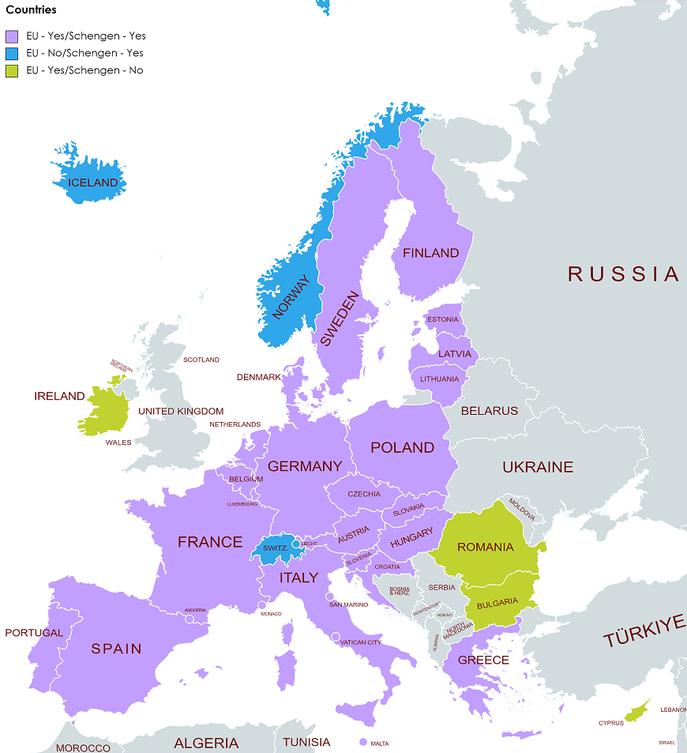
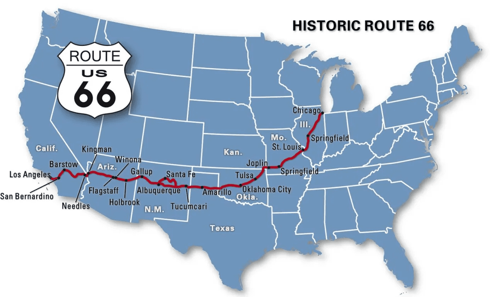

# 新知-历史地理

[[toc]]

- [新知-历史地理](#新知-历史地理)
  - [地理](#地理)
    - [欧洲](#欧洲)
    - [德国](#德国)
    - [法国](#法国)
    - [美国](#美国)
    - [日本](#日本)
    - [中东](#中东)
    - [其他](#其他)
  - [历史](#历史)

---

## 地理

### 欧洲

- 欧洲/欧盟/欧元区/申根区
  - 

### 德国

- 德国首都
  - 联邦德国（西德，德意志联邦共和国）首都波恩（西柏林是一处飞地，美英法共管）。
  - 民主德国（东德，德意志民主共和国）首都柏林（东柏林）。
  - 1989 年 11 月 9 日深夜，东德被迫宣布开放柏林墙。1990 年 10 月 3 日，德国重新统一迁往柏林。

### 法国

- 法国象征：
  - 公鸡 le coq，（高卢-Gallia，高卢人-Gallus，在拉丁语里的另一个意思是公鸡）
  - 卡芒贝尔干酪 camembert，发源于法国布列塔尼一个名为卡芒贝尔的村庄。
  - 玛丽安娜 Marianne：画作《自由引导人民》，雕塑《自由女神像》
  - 可颂（牛角包/羊角包） croissant
  - 埃菲尔铁塔 La tour Eiffel
  - 环法自行车赛 le tour de France

### 美国

- **威基基海滩**（Waikiki Beach, 怀基基）
  - 位于美国夏威夷州火奴鲁鲁市，世界著名海滩。

- **洛杉矶**
  - 天使之城。Los Angeles 在西班牙语里是“天使”相当于英文的 the angels。
  - 起源于 17 世纪西班牙远征队在此设立教会，并将此称为天使女王圣母玛丽亚的城镇。

- 美国 **66 号公路**（Route 66）：

  - 东起芝加哥，西到洛杉矶，“母亲之路”、“美国主大街”（the Main Street of America）以及“梦想之路”、“开拓之路”。1926 年开始建造）
  - 

### 日本

- 日本行政区划：
  - **五畿七道**：日本自奈良时代到明治初期的废藩置县期间的行政区划管理。
    - 奈良时代：710 年，日本天皇迁都平城京（今奈良）；794 年迁都平安京（今京都）
  - 明治废藩：（1871 年明治 4 年 7 月）

### 中东
- **麦加大清真寺**
  - 位于沙特阿拉伯麦加城中心，是伊斯兰教第一大圣寺。
  - 据《古兰经》经文启示，在此禁止凶杀、抢劫、械斗，故又称禁寺。
  - 禁寺广场中央稍南是圣殿克尔白（即天房--真主的房子）；克尔白，意思是“方形房屋”。终年用从天降下的黑丝绸帷幔蒙罩
  - 在天房外东南角 1.5 米高的墙上，镶嵌着一块 30 厘米长的带有微红的褐色陨石，即有名的黑石，或称玄石

### 其他

- **纽伦港**（Nylonkong）
  - 是指世界上三大重要国际都会：纽约、伦敦及香港的合称。特点：金融中心。
  - 源出：《时代》周刊编辑迈克尔·艾略特 2008 年的文章 A Tale of Three Cities。
  - 纽伦坡：纽约、伦敦、新加坡。

---

## 历史

- **条顿骑士团**：
  - 也叫德意志骑士团
  - 神圣罗马帝国中世纪时期天主教军事组织，早期成员均为德意志人。
  - 三大骑士团，即医院骑士团（马耳他骑士团）、圣殿骑士团和条顿骑士团。

- **楚德湖战役**：
  - 诺夫哥罗德共和国（俄国前身）与条顿骑士团（德意志十字军）在 1242 年 4 月 5 日于楚德湖上爆发的战役

- **厨房辩论（Kitchen Debate）**
  - 指 1959 年 7 月在莫斯科举行的美国国家展览会（American National Exhibition）开幕式上，时任美国副总统理查德·尼克松和时任苏联共产党第一书记兼苏联部长会议主席的尼基塔·赫鲁晓夫之间的一场关于东西方意识形态和核战争的论战（两人之间的辩论均通过了他们的口译员传达）。

- **屋顶上的韩国人（roof Koreans）**
  - 1992 年洛杉矶骚乱期间，洛杉矶韩国城的在美韩裔（大多在韩国服过兵役，部分参与过越南战争）为自卫和暴乱分子（主要是黑人和拉美裔）进行激斗。期间击毙 59 名黑人，仅 1 名韩裔死亡。

- **平权法案（Affirmative Action）**
  - 1961 年，对少数族裔、土著美国人、妇女等群体予以关照，以纠正群体之间的歧视（“谁成绩好谁有权优先升学”对少数群体（美国黑人/非洲裔美国人、拉丁裔）不公平），集中在教育和就业，进而发展为多元文化主义。争议：对亚裔有极大的不公平，形成种族优待，政治正确导致言论自由设禁。

- **印尼**：
  - 9·30 印尼屠华事件：1965 年 9 月 30 日后政变后，苏加诺下台，苏哈托上台，之后对印尼共产党的血腥屠杀，但牵连数十万华人在屠杀中丧命。
  - 1998 年 5 月印尼排华暴乱事件
