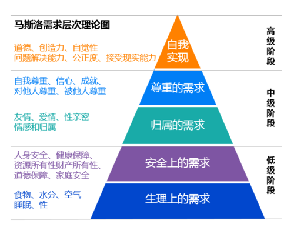
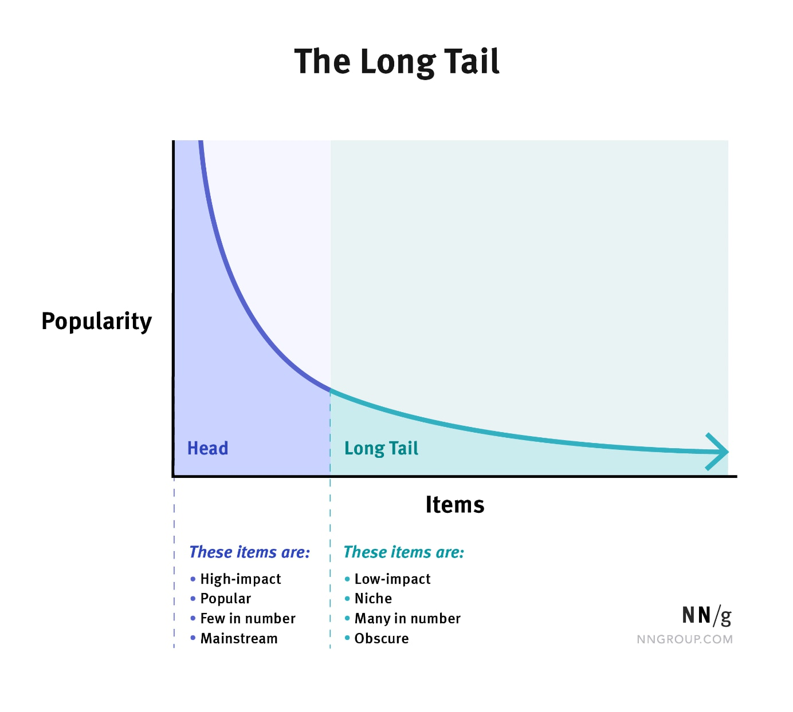
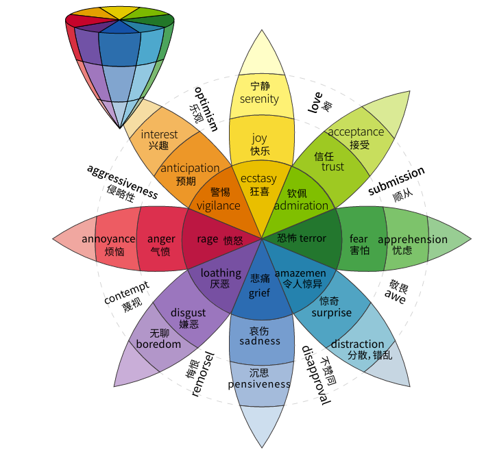
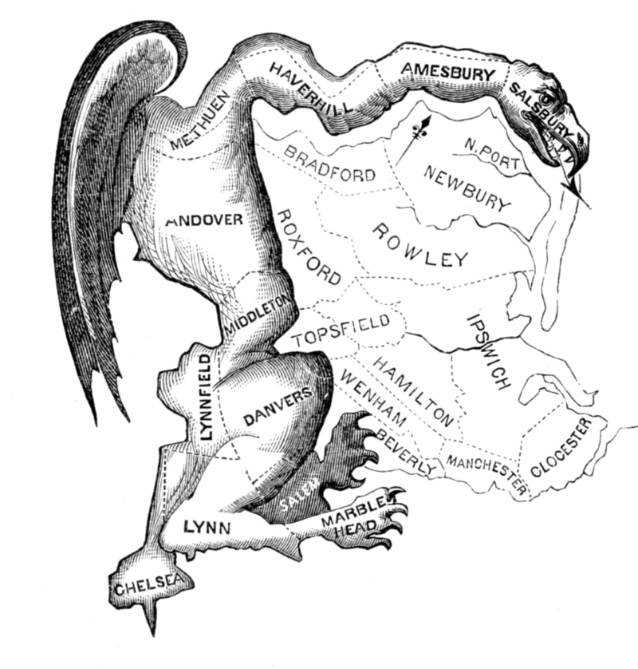
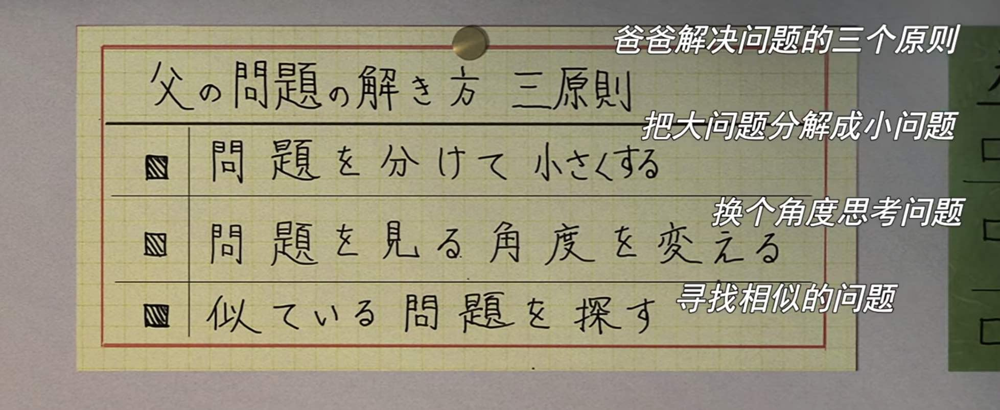

# 新知-社会综合

- [新知-社会综合](#新知-社会综合)
  - [理论](#理论)
    - [评估指数](#评估指数)
    - [定律](#定律)
    - [法则](#法则)
    - [理论/原理](#理论原理)
    - [心理学](#心理学)
  - [经济/商业](#经济商业)
  - [政治](#政治)
  - [历史](#历史)
  - [其他](#其他)
    - [解决问题的三个原则](#解决问题的三个原则)

## 理论
### 评估指数

- **HHI 指数**（赫芬达尔—赫希曼指数，Herfindahl-Hirschman Index）
  -  一种测量产业集中度的综合指数（完全垄断-完全竞争）
- **H 指数**（H Index）
  - 一个人在其所有学术文章中有 N 篇论文分别被引用了至少 N 次，他的 H 指数就是 N。

### 定律
- **斯蒂格勒定律**（Stigler’s law）
  - 【名字命名法则】
  - > 没有科学的发现是因其原有发现者的名字而命名（no scientific discovery is named after its original discoverer）。
  - 来自芝加哥大学统计学家史蒂芬·史蒂格勒（Stephen Stigler）尽管他承认他并不是第一发现的人】，
  - 其父亲是芝加哥经济学派代表成员、1982 年诺贝尔经济学奖得主的经济学家乔治·约瑟夫·斯蒂格勒（George Joseph Stigler）。

- **特威曼定律**(Twyman law)
  - > 数据越引人注目（显性突出），错误的可能性就越大。
  - > "Any piece of data or evidence that looks interesting or unusual is probably wrong"
  - 这是因为错误的实验或者采集远比这种引人注目的突出结果更为常见，发生的概率更多 ；反之，数据越枯燥，越值得信赖。
  - 威廉·安东尼·特威曼（William Anthony Twyman）是英国广播和电视收视率测量的资深人士（MR Web 2014）

- **本福特定律**（Benford's law）：
  - 说明一堆从实际生活得出的数据中，以 1 为首位数字的数的出现概率约为总数的三成。
  - 推广来说，越大的数，以它为首几位的数出现的概率就越低。
  - 它可用于检查各种数据是否有造假。
  - 1938 年，物理学家法兰克·本福特重新发现这个现象。在 b 进位制中，以数 n 起头的数出现的概率为：$P(n) = log_b(n+1)-log_b(n)$

### 法则

- **费斯汀格法则**：
  - 生活中的 10％是由发生在你身上的事情组成，而另外的 90％则是由你对所发生的事情如何反应所决定。
  - 换言之，生活中有 10%的事情是我们无法掌控的，而另外的 90%却是我们能掌控的。
  - 美国社会心理学家费斯汀格（Festinger）例子。
    - 卡斯丁早上起床后洗漱时，随手将自己高档手表放在洗漱台边，妻子怕被水淋湿了，就随手拿过去放在餐桌上。儿子起床后到餐桌上拿面包时，不小心将手表碰到地上摔坏了。
    - 卡斯丁疼爱手表，就照儿子的屁股揍了一顿。然后黑着脸骂了妻子一通。妻子不服气，说是怕水把手表打湿。卡斯丁说他的手表是防水的。
    - 于是二人猛烈地斗嘴起来。一气之下卡斯丁早餐也没有吃，直接开车去了公司，快到公司时突然记起忘了拿公文包，又立刻转回家。
    - 可是家中没人，妻子上班去了，儿子上学去了，卡斯丁钥匙留在公文包里，他进不了门，只好打电话向妻子要钥匙。
    - 妻子慌慌张张地往家赶时，撞翻了路边水果摊，摊主拉住她不让她走，要她赔偿，她不得不赔了一笔钱才摆脱。
    - 待拿到公文包后，卡斯丁已迟到了 15 分钟，挨了上司一顿严厉批评，卡斯丁的心情坏到了极点。下班前又因一件小事，跟同事吵了一架。
    - 妻子也因早退被扣除当月全勤奖，儿子这天参加棒球赛，原本夺冠有望，却因心情不好发挥不佳，第一局就被淘汰了。

- **帕累托法则**（Pareto principle）
  - 巴莱多定律、80/20 法则、**二八定律**
  - 罗马尼亚/美国管理学家约瑟夫·朱兰（Joseph M. Juran）提出
  - 命名的名字意大利经济学家维尔弗雷多·帕累托（Vilfredo Pareto）
    - 帕累托于 1906 年提出了关于意大利社会财富分配的研究结论：20％的人口掌握了 80％的社会财富。
  - 衍生思想：在任何情况下，事物的主要结果只取决于一小部分因素。

- **丛林法则**：
  - 弱肉强食，优胜劣汰
  - 霍布斯《利维坦》、刘慈欣《三体·黑暗森林》

### 理论/原理

- **马斯洛需求层次理论**（Maslow's hierarchy of needs）：
  - 美国心理学家亚伯拉罕·马斯洛于 1943 年提出，
  - 其基本内容是将人的需求从低到高依次分为生理需求、安全需求、社交需求、尊重需求和自我实现需求，是人本主义科学的理论之一。
  - 

- **蒙塔古原理**（Montagu Principle）
  - “礼贤下士无需代价，却能赢得一切”。粗鲁无礼只会降低政客的支持率。
  - 以 18 世纪英国贵族蒙塔古夫人（Lady Mary Wortley Montagu）命名

- **长尾理论**
  - “如果把足够多的非热门产品组合到一起，实际上就可以形成一个堪与热门市场相匹敌的大市场。” 
  - 统计学中幂律（Power Laws）和帕累托分布（Pareto）特征的口语化表达。
  - 

- **奶头乐理论** （tittytainment）
  - 帕累托法则之下，80%的被边缘话，剩余 20%的精英为了避免阶层冲突，通过给 80%的大众提供大量“奶头”（指娱乐和游戏等）进行安慰，让他们丧失思考能力，化解他们的不满情绪，麻醉马太效应带来的负面影响。
  - 理论出处可疑，和布热津斯基可能毫无关系
  - [为什么“奶头乐”是一个不值得重视的“理论”，方可成](https://zhuanlan.zhihu.com/p/44412694)

### 心理学
- **普卢奇克情绪轮**（Emotion Wheel）
  - 

- **登门槛技巧**（foot-in-the-door technique）
  - 先向他人提出一个小的要求，等他人满足该要求之后，再向其提出一个较大的要求，此时对方满足较大要求的可能性也增加。　

- **门前技巧**（door-in-the-face technique）
  - 先向他人提出一个很大的要求，在对方拒绝之后，紧跟着提出一个小的要求，这时候小要求被满足的可能性增加。
  - ~~贝勒定律：先提一个高要求，再提一个低要求，人们往往会很容易接受那个低要求。~~

## 经济/商业

- **阿米巴经营**（Amoeba operating）
  - 将组织分成小的集团，通过与市场直接联系的独立核算制进行运营，培养具有管理意识的领导，让全体员工参与经营管理，从而实现“全员参与”的经营方式。
  - 稻盛和夫（京瓷，第二电信）
  - “阿米巴”(Amoeba)在拉丁语中是单个原生体的意思

- **棚改货币化安置**
  - 早期拆迁安置主要以实物安置为主，即拆房还房。
  - 2015 年起快速转向货币化安置，政府以土地质押，向国开行贷款，直接将钱发给拆迁户，再由后者自己买房。
  - 背景：2008年，全国启动棚户区改造

- **香肠战术**
  - 萨拉米香肠战术/蚕食战/循序渐进的战术
  - 萨拉米香肠是欧洲流行的一种香肠，在意大利、法国、德国深受民众喜欢。这种香肠直径 5 厘米，又长又粗，像一根擀面杖。
  - 人们在食用萨拉米香肠时，通常每次切上薄薄的几片。看似巨大笨重的香肠，就这样一片一片被切掉，直到把整根香肠吃完。人们把这种循序渐进的方法，总结成香萨拉米香肠战术。

## 政治

- **西化分化陷阱**
  - “和平演变”、“颜色革命”、“茉莉花革命”，
  - 其含义都是指通过非暴力的手段推翻不奉行西方价值观的国家政权。

- **中等收入陷阱**
  - 源于世界银行发布的《东亚经济发展（2006）报告》，是一个国家发展到中等收入阶段（人均国内生产总值 3000 美元左右）后，可能出现两种结果：1.持续发展，逐渐成为发达国家。2.出现贫富悬殊、环境恶化甚至社会动荡等问题，导致经济发展徘徊不前。后一种结果称走入了中等收入陷阱。
  - 新自由主义与中等收入陷阱

- **修昔底德陷阱**
  - 是指一个新崛起的大国必然要挑战现存大国，而现存大国也必然会回应这种威胁，这样战争变得不可避免。

- **塔西佗陷阱**
  - 古罗马历史学家塔西佗的《塔西佗历史》，对一位罗马皇帝的评价：“一旦皇帝成了人们憎恨的对象，他做的好事和坏事就同样会引起人们对他的厌恶。”
  - 之后被中国学者引申成为指政府部门或组织失去公信力时而陷入无论做好事坏事都会被人怀疑的困境的社会现象。

- **寒蝉效应**（chilling effect）：
  - 指涉及个人思想、言论、集会等核心价值和自由权利的社会存在及其影响。
  - 或专指人民因恐惧于遭受国家刑罚，或是无力承受所必将面对的预期耗损，就必将放弃行使其正当权利，进而打击公共事务、社会道德、个人信心。
  - 只要是被上层权力阶级控制，造成下层阶级无法有效发表意见。

- **悬浮议会**(Hung Parliament)
  - 无任何党派赢得下议院（House of Commons）席位中的大多数席位。
  - 英国比较少见（两党制），而德国等比较常见（多党联合政府）
  - 悬浮议会是议会民主制中独有的情况

- **杰利蝾螈**（Gerrymander）
  - 指选区划分的方式是专为某方选举利益而设计的。
  - 词源：埃尔布里奇·杰利（Elbridge Gerry） +蝾螈（salamander）
  - 背景：1812 年，美国马萨诸塞州时任州长埃尔布里奇·杰利（Elbridge Gerry）签署了一项重新划分选区的法案，通过刻意重新划分州内选区的方式，将联邦党的支持者集中在同一个选区，浪费大量联邦党人选票，从而使其所在的民主共和党（共和党前身）相对联邦党（民主党前身）更加获益。
  - 其中在波士顿地区新划定的一个选区貌似蝾螈，一名报业人士（1812 年 3 月 26 日发表于《波士顿公报》）将该地图称为“杰利蝾螈”。以此事件形成的地图加上了翅膀、爪子和可怕的牙齿，同时还配有讽刺性描述，讲述了这种生物的“自然史”，并称之为“Gerry-mander”。
  - “杰利蝾螈”的操作遵从两大策略：一是尽可能扩大己方票源使用率，二是尽可能减少对方票源使用率。
  - 

- **野猫罢工（wildcat strike）**
	- 不是由工会正式发动、而是由群众自下而上地发动的罢工，就叫野猫罢工。
	- 这种罢工往往发生在合同期内，所以它们是非法的。在一些情况下，工会干部可能会对野猫罢工睁一只眼闭一只眼。
	- 例子：法国五月风暴
  - 其他相关：
  	- **无限期罢工（open-ended strike）**：这是一种经典的罢工方式。在劳资双方达成暂定协议之前，这种罢工都不会停止。
  	- **一日罢工（one-day strike）或短期罢工（short strike）**：在这种罢工中，工会往往会提前宣布罢工要持续多长时间。短期罢工对工人的损伤较小——但它也不能对老板造成多大伤害。这种罢工有时也叫“示威性罢工”，因为它有可能是罢工升级之前的警告。
  	- **总罢工（general strike）**：这是威力最大的罢工，全城、全州甚至全国的工人一齐停工。1947年以后，真正的总罢工遭到了法律禁止，现在也很少见了。

* **凯恩斯“流动陷阱”**：
  * 货币需求弹性变得无限大，即无论增加多少货币，都会被人们储存起来。
  * 发生流动性陷阱时，货币政策失效。

* **明斯基时刻（Minsky Moment）**：
  * 资产价格崩溃的时刻，
  * 在信贷周期或者商业周期中，经济长时期稳定可能导致债务增加，但最终资产价格的大幅下跌。

* **刘易斯拐点（Lewis Turning Point）**：
  * 是劳动力由过剩向短缺的转折点。
  * 劳动力过剩的农业部门向工业部分转移，但随时间推移工业部门的劳动力供给会逐渐短缺。劳动力价格上涨。

## 历史
- “**哥伦布交换**”（the Columbian exchange）
  - 1492 年   克里斯托弗·哥伦布首次航行到达美洲大陆，之后引发“哥伦布交换”（the Columbian exchange），动植物、粮食作物（农作物）、人口（移民，黑奴）和病菌、文化在美洲和欧洲，乃至全球进行大范围的交换，永久地改变了世界的人口分布和自然环境。
  - 阿尔弗雷德·克罗斯比在他 1972 年的著作《哥伦布大交换》中，首先提出这个观念。
  - 相关：《人类简史》的背后是《枪炮、病菌与钢铁》，《枪病钢》背后是《哥伦布大交换》。如果说《人类简史》是试图讲大历史，《枪病钢》是试图从大灾难讲起，那《哥伦布大交换》也许可以给出大历史和大灾难背后的东西。

## 其他

### 解决问题的三个原则

- 《企鹅公路》“爸爸解决问题的三个原则”：
	- 把大问题分解成小问题
	- 换个角度思考问题
	- 寻找相似的问题
  - 

