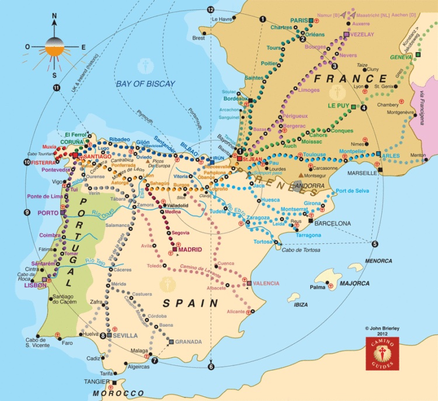
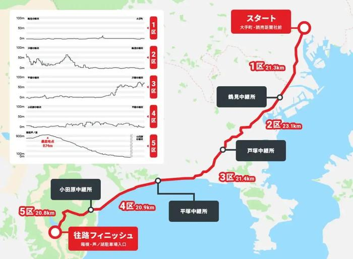
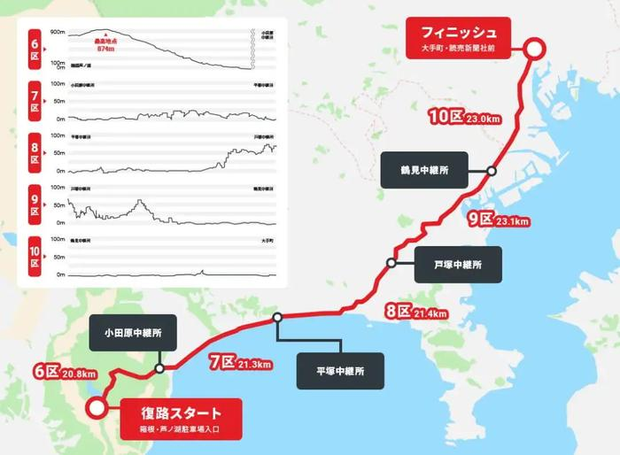
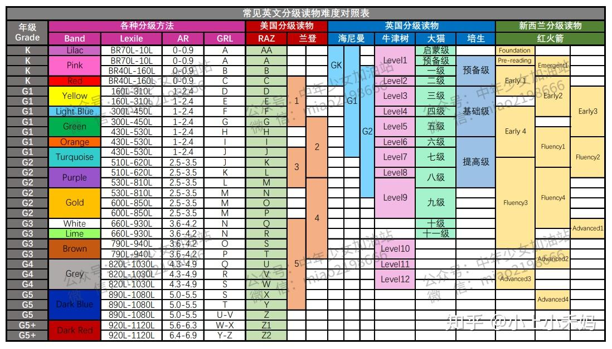
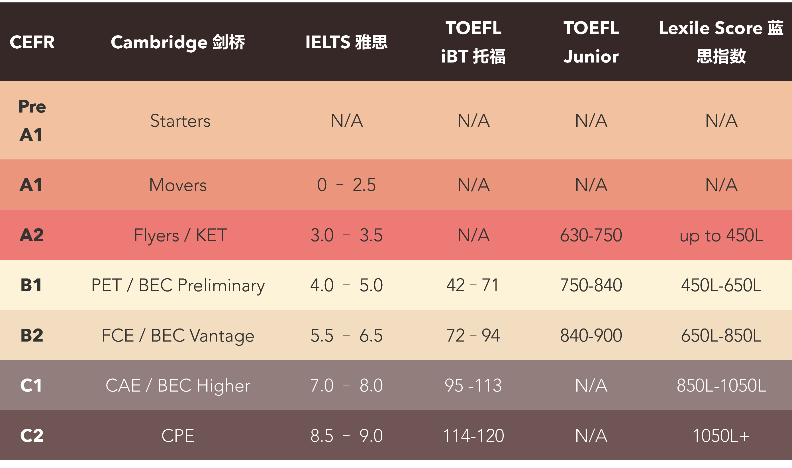
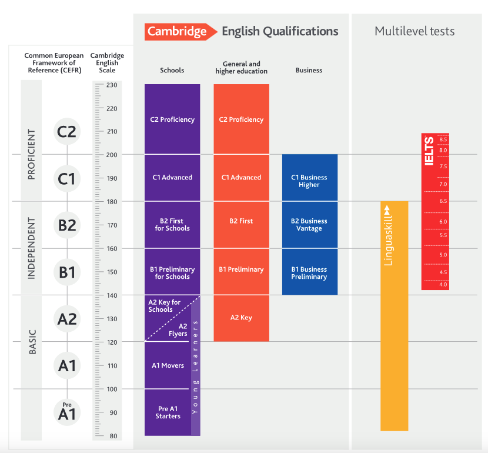
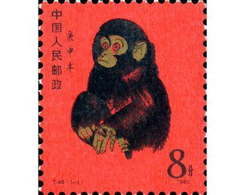
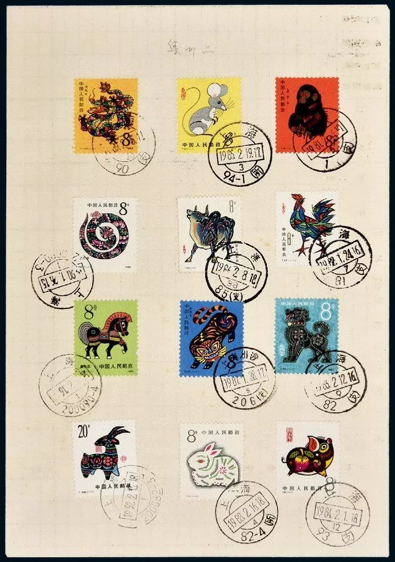
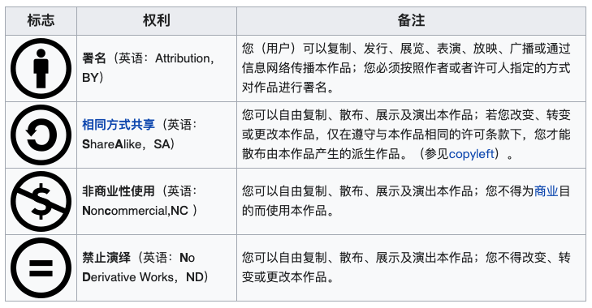
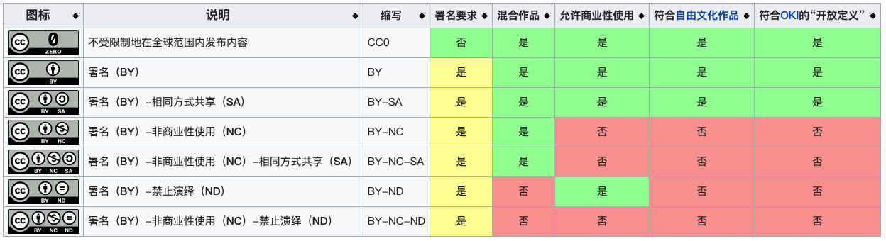

# 新知-文化生活

[[toc]]

- [新知-文化生活](#新知-文化生活)
  - [旅游](#旅游)
    - [圣地亚哥朝圣之路](#圣地亚哥朝圣之路)
  - [体育](#体育)
    - [箱根驿传](#箱根驿传)
  - [阅读学习](#阅读学习)
    - [分级阅读](#分级阅读)
    - [语言参考标准](#语言参考标准)
    - [报刊版式](#报刊版式)
  - [收藏](#收藏)
    - [邮票](#邮票)
  - [节日](#节日)
    - [（中国）行业性节日](#中国行业性节日)
  - [其他](#其他)
    - [版权](#版权)
    - [CC 许可](#cc-许可)
    - [记者证](#记者证)

---

## 旅游

### 圣地亚哥朝圣之路

三大朝圣地（“朝圣之路“是宗教信徒朝圣时经过的路）：
- 一、意大利的梵蒂冈（Roma），“先知之城”梵蒂冈，是世界天主教中心
- 二、以色列的耶路撒冷（Jerusaem），是耶稣受难的地方，最后的晚餐诞生地，宗教的发源地
- 三、西班牙的圣地亚哥（Santiago de Compostela ）。全名叫圣地亚哥-孔普斯特拉，耶稣的门徒雅各的埋葬处，三条朝圣路中最著名的一条。

## 体育

### 箱根驿传
- 箱根驿传：
  - 正式名称为**“东京箱根间往复大学驿传竞走”**，是一项驿站接力赛。
  - 由日本的马拉松之父金栗四三等人于 1920 年所创办，是日本历史最悠久的长跑接力比赛。
  - 与“出云驿传”、“全日本大学驿传” 并称为日本三大大学驿传。
  - 时间：每年 1 月的 2 到 3 日。
  - 路径：在两天时间内完成约 217 公里共 10 区的接力，去程 5 区，回程 5 区。
  - 由关东学生田径联盟主办（日本关东学生陆上竞技联盟）。
  - 参赛选手来自日本关东地区大学，共 21 个队伍每个大学派出 10 位选手参赛
- 路线：
  - 
  - 
- 相关作品：
  - 根据三浦紫苑同名小说改编的日本动画《强风吹拂》

## 阅读学习

### 分级阅读

1. BandBook Band 是英国的分级方法，最直观。按照颜色区分难度，
2. Lexile 兰斯/蓝思 分级法，来自美国，最系统。具体算法有点复杂，记住数值越大越难。
3. AR 分级法，来自美国，最好用。例如：AR2.6 表示美国小学二年级第 6 个月孩子的平均阅读水平。
4. GRL 也是美国的分级方法，最容易跟 RAZ 级别混淆。按照 26 个英文字母顺序分为 26 个级别。

> 示意图来自[知乎](https://zhuanlan.zhihu.com/p/317285180)
> ，

### 语言参考标准

欧洲共同语言参考标准（The Common European Framework of Reference for Languages，简称 CEFR）

- 
- 

### 报刊版式
- 柏林版式（Berliner）
  - 英国的《卫报》（_The Guardian_）；法国《世界报》、《回声报》等
- 小报版式（Tabloid Format），起源并主要流行与英国，特点：格调不高的通俗报纸
  - 英国的《太阳报》（_The Sun_）、《每日镜报》（_The Daily Mirror_）
- 大报版式（Broadsheet Format），特点：相比小版式，内容上更深刻、严肃，“质报”
  - 英国的《金融时报》（The Financial Times）、《每日电讯报》（The Daily Telegraph）；美国、加拿大大部分日报
- 更多：<https://papersizes.io/newspaper/>

## 收藏

### 邮票

- 邮票志号：
  - 邮票志号是邮票发行情况的记录，亦称邮票编号。一般印在邮票的底边上，表示票种、发行年份、套号、枚号。
  - 1974 年 5 月至 1991 年年底，我国发行的邮票重新开始使用：
    - “J”表示纪念邮票，
    - “T”表示特种邮票

- 1980 年猴票（《庚申年》金猴邮票）：
  - 志号 T46，发行日期：1980.2.15，面值 8 分。中国第一套生肖邮票：庚申猴/金猴，
  - 原画作者黄永玉，邮票设计者邵柏林，雕版雕刻人是姜伟杰，北京邮票厂印刷。
  - 
  - 

## 节日

### （中国）行业性节日
- 国际护士节：5 月 12 日
  - 纪念现代护理学科的创始人弗洛伦斯·南丁格尔（1820 年 5 月 12 日-1910 年 8 月 13 日）于 1912 年设立的节日

- 中国教师节：9 月 10 日
  - 1985 年 1 月，第六届全国人大常委会第九次会议通过了国务院关于建立教师节的议案，1985 年 9 月 10 日为中国第一个教师节。
  - 此前：1931 年 6 月 6 日；1939 年 9 月 28 日（孔子诞辰夏历 8 月 27 日）

- 中国记者节：11 月 8 日
  - 国务院于 2000 年 8 月 1 日正式批复中国记协，同意 11 月 8 日确定为中国“记者节”。
  - 中国记协前身于 1937 年 11 月 8 日

- 中国医师节：8 月 19 日
  - 2017 年 11 月 3 日，国务院通过了卫计委关于“设立中国医师节”的申请，同意自 2018 年起，将每年的 8 月 19 日设立为“中国医师节”
  - （2016 年的 8 月 19 日，全国卫生与健康大会，近 20 年最高规格的全国性卫生工作会议，提出“健康中国”的伟大工程）

- 中国农民丰收节：9 月 23 日左右，秋分
  - 中国农民丰收节，于 2018 年设立（国函〔2018〕80 号，节日时间为每年“秋分”，具体工作由农业农村部和有关部门组织。

- 中国人民警察节：1 月 10 日
  - 2020 年 7 月 21 日，《国务院关于同意设立“中国人民警察节”的批复》发布，同意自 2021 年起，将每年 1 月 10 日设立为“中国人民警察节”。
  - 1981 月 10 日，广东省广州市公安局率先建立我国第一个 110 报警服务台。

---

## 其他

### 版权

- 相关条约
  - 世界版权公约（Universal Copyright Convention。1955）规定 C 标是版权人应当进行的必要版权声明。
  - 之后，大部分国家伯尔尼公约（Berne Convention,1971）的内容，确立了版权自动保护原则（作品创作完成之日即享有版权），并取消了 C 标强制性使用规定。

- C 标常见的格式：
  - `Copyright ©[时间] by [author/owner], All Rights Reserved.`如：
  - 其中`Copyright`和`All Rights Reserved.`可以省略）

### CC 许可

创作共用许可协议 （Creative Commons license），目前是 4.0 版本。
- 4 个基本权利：
  - 
- 7 个常用有效组合
  - 

### 记者证

记者证编号由大写英文字母加 12 位数字组成：

- “B”为报纸记者，前 6 位数字为报刊国内统一刊号，后 6 位为内部顺序号
- “G”为广播电影电视记者，前 8 位为单位代码，后 4 位为内部顺序号；单位代码前 6 位为地区码，第 7 位为类别码（1 为广播电台，2 为电视台，3 为新闻电影制片厂），第 8 位为同一地区同类单位区别码
- “J”为解放军记者，
- “K”为期刊记者，
- "W"为网络新闻记者
- “X”为新华通讯社记者，前 3 位数字为单位代码，后 9 位为内部顺序号
- “Z”为中国新闻社记者.

记者证相关历史

- “记者”一词最早出现在 1899 年《清议报》第 7 期。
- 最初的“记者证”多由新闻机构自主发放，有的也由兵团或党派宣传部印发。（职员证）
- 新中国成立初期，全国亦无统一的“记者证”。
- 1989 年，新闻出版署颁布《关于重新核发记者证的通知》，开始发放首批全国通行记者证。
- 1998 年，统一印制编号 每 5 年换发一次
- 2003 年，记者证定名为“新闻记者证”，取消特约记者证；增设年检制度
