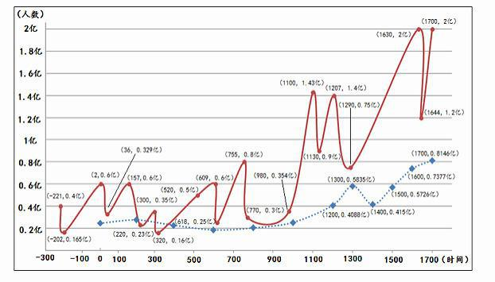
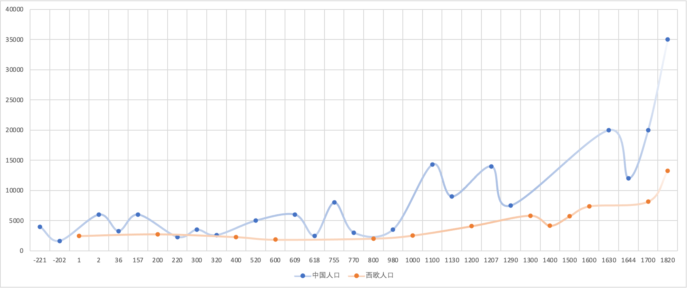
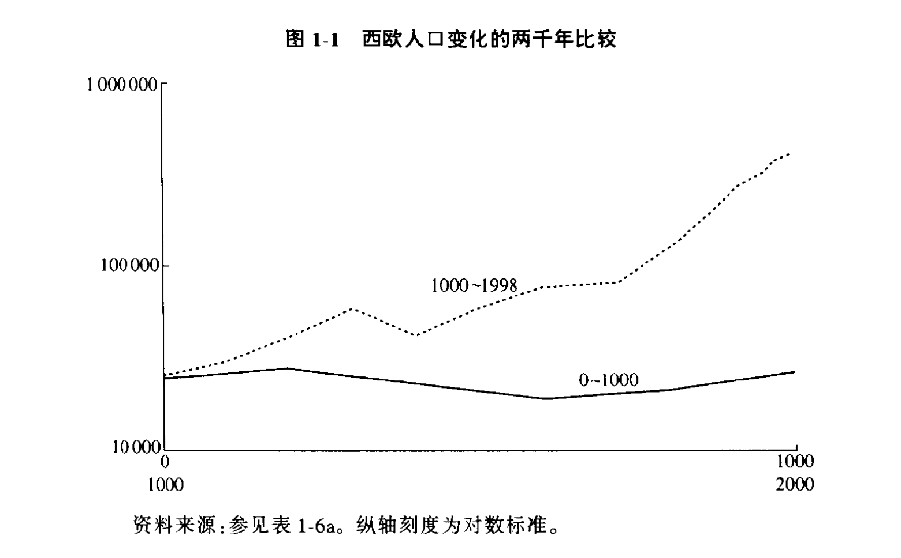
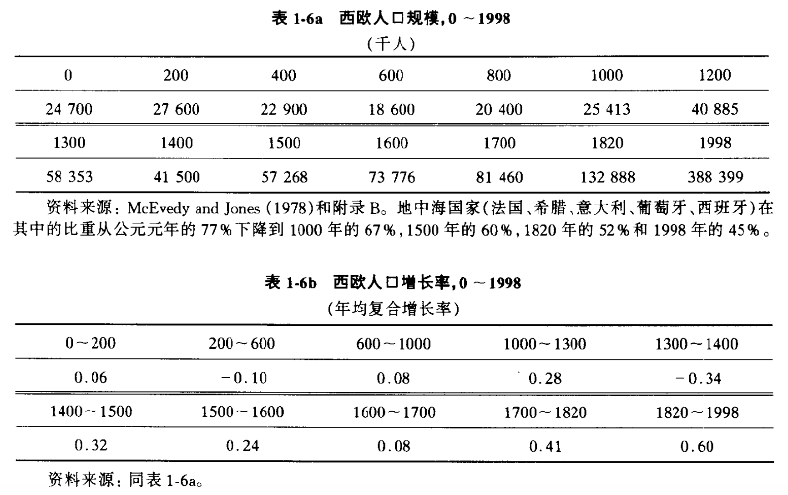
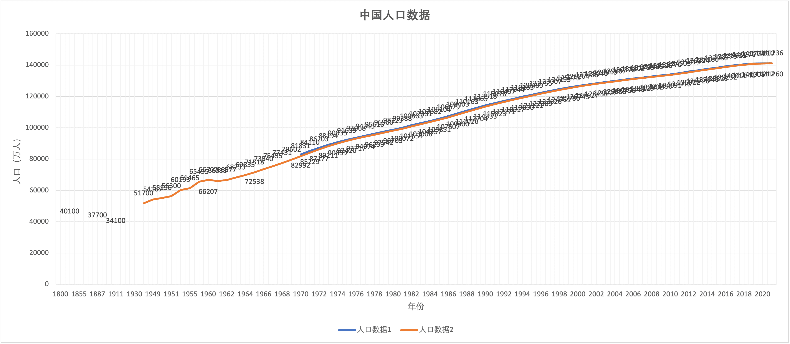

# 新知-自然科技

- [新知-自然科技](#新知-自然科技)
  - [云](#云)
  - [天文](#天文)
  - [人口](#人口)
    - [人口增长](#人口增长)
  - [地图投影](#地图投影)
  - [簿记](#簿记)

---

## 云

- 云的分类和命名：卢克·霍华德（Luke Howard）在 1803 提出的拉丁语系统。
  - 高层（5500m 以上）：卷云、卷积云、卷层云
  - 中层（2000m-5500m）：高积云、高层云
  - 底层（2000m 以下）：层积云、积云、积雨云、雨层云、层云

## 天文

- 比邻星/毗邻星（proxima centauri）
  - 是距离太阳最近的恒星（4.22光年），属于红矮星，编号半人马座α星C，于1915年苏格兰天文学家Robert Inners在南非发现。
- 奥尔特云/奥匹克-奥尔特云（Öpik-Oort cloud）
  - 理论上围绕太阳、主要由冰微行星组成的球体云团，在柯伊伯带外侧。
- 柯伊伯带/伦纳德-柯伊伯带（Edgeworth-Kuiper belt）:
  - 海王星外侧的黄道面附近、天体密集的圆盘状区域，类似小行星带，但大得多。

- 尼斯模型：Ranis-Fei model：哈特马尼斯和斯特恩斯在1964—1965年提出的计算复杂性理论。

- 北半球三大流星雨：
	- 象限仪座流星雨（1月，原名“天龙座流星雨”）、
	- 英仙座流星雨（8月，圣洛朗的眼泪）、
	- 双子座流星雨（12月）

## 人口

### 人口增长

概念：
- 人口机械增长（population machinery growth）: 指一国或一地区在一定时期内（通常为一年）由于人口迁入和迁出引起的人口数量变化。
  - 一般表现为经济落后地区（负增长）向经济发达地区迁移（正增长）
- 人口自然增长率：一定时期内人口自然增长数（=出生人口-死亡人口）与同期平均人口之比（常用千分率）。
  - 20 世纪以来，发达国家人口自然增长率较低，而发展中国家较高（主要是较高的出生率）

人口变化：
- 张宏杰《简读中国史：世界坐标史下的中国》
  - 
  - 
- 《世界千年经济史》第一章
  - 
  - 
- 中国人口
  - 

## 地图投影

- 高尔-彼得斯投影（Gall–Peters projection）：特别设计成面积相等的地图投影方式，属于圆柱等积投影
- 传统的地图：墨卡托投影法（荷兰地图学家墨卡托「Gerhardus Mercator」于 1569 年拟定的“等角正切圆柱投影”）
- 联合国标志：波斯特尔投影法（中心在北极点而不是太平洋或大西洋，法国数学家波斯特尔于 1581 年修订，等距离方位投影）

## 簿记

**簿记**（bookkeeping）
- 单式簿记（也称「流水账」），每笔交易只涉及一个账户.

- 复式簿记是一种把每笔交易都记录到复数个账户中的簿记方法。
  - 5 个部分：
    - 资产 Assets —— 现金、银行存款、有价证券等；
    - 负债 Liabilities —— 信用卡、房贷、车贷等；
    - 收入 Income —— 工资、奖金等；
    - 费用 Expenses —— 外出就餐、购物、旅行等；
    - 权益 Equity —— 用于「存放」某个时间段开始前已有的
  - 会计恒等式：货币在这五个桶里倒来倒去，出入相抵，这便是会计恒等式。
    - 其中「收入和负债通常为负数」、「资产和费用通常为正数」
    - `(Income + Liabilities) + (Assets + Expenses) + Equity = 0`

- 簿记软件
  - gnucash `https://www.gnucash.org/`
  - ledger: `https://ledger-cli.org/`
  - Beancount `https://github.com/beancount/beancount`
