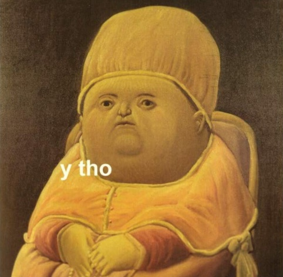

# 网络流行词/MEME

- 迷因 （meme）
- 食知动物 （infovore）
- 融梗
- 積讀、積ん読、積読（Tsundoku）
- 吸猫
- 水逆，水星逆行
- 可小刀；可刀，可大刀，关公刀，指甲刀

## 缩略词

- `A2A`: Ask to Answer
- `AKA`: also known as
- `AoE`: Anywhere on Earth
- `ASAP`: as soon as possible
- `GIYF`: Google Is Your Friend, "I will use Google before asking dumb questions.", [jfgi.herokuapp.com](http://jfgi.herokuapp.com/)
- `JFGI`: Just Fucking Google It, [justfuckinggoogleit.com](http://justfuckinggoogleit.com/)
- `LGTM`: Looks Good To Me. 朕知道了 代码已经过 review，可以合并
- `LOL`: Laughing Out Loud, Laugh Over Loud,或 Laugh Out Loudly；大声地笑。
- `NSFW`: Not Safe for Work
- `OOTD`: outfit of the today, 今日穿搭，常用 hashtag`#OOTD`
- `P.P.S.`: Post Post Signature
- `P.S.`: 来源拉丁语 post scriptum，含义 written after（postscript, Post Signature）
- `PR`: Pull Request. 拉取请求，给其他项目提交代码
- `PTAL`: Please Take A Look. 你来瞅瞅？用来提示别人来看一下
- `R.S.V.P`: 法语 répondez, s'il vous plaît，敬请回复（response if you please; please reply）
- `RIP`: “Rest in Peace”的缩写，愿 (死者)安息
- `RTFM`: Read The Fuking Manual, [readthefuckingmanual](http://www.readthefuckingmanual.com/)
- `SGTM`: Sounds Good To Me. 和上面那句意思差不多，也是已经通过了 review 的意思
- `STFW`: Search The Fucking Web
- `TBD`: To Be Done(or Defined/Discussed/Decided/Determined). 根据语境不同意义有所区别，但一般都是还没搞定的意思
- `TBR`: To Be Reviewed. 提示维护者进行 review
- `TL;DR`: Too Long; Didn't Read. 太长懒得看。也有很多文档在做简略描述之前会写这么一句
- `WIP`: Work In Progress. 传说中提 PR 的最佳实践是，如果你有个改动很大的 PR，可以在写了一部分的情况下先提交，但是在标题里写上 WIP，以告诉项目维护者这个功能还未完成，方便维护者提前 review 部分提交的代码。

## 其他

- `Leet`: 由 elite 转为 eleet 后再转变为 leet
  - （L337, 3L337, 31337, leetspeak, eleet, Leetors, L3370rz, 1337）
- `Pwn`: 黑客俚语，类似“砰”，指破坏设备或系统后获得管理权限。
- `jovyan`: Jovian means "related to Jupiter", ergo jovyan and Jupyter.an inhabitant of Jupyter. [GitHub - Who is jovyan?](https://github.com/jupyter/docker-stacks/issues/358)

- `w/o`: without；
- `w/`: with；
- `b/c`: because；
- `c/o`: care of
  - 相关讨论: [w-o-w-b-c-common-abbreviations](https://english.stackexchange.com/questions/115367/are-w-o-w-b-c-common-abbreviations-in-the-us)
- `y, tho?` == Why, though? (美国俚语)
  - 
