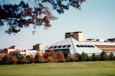
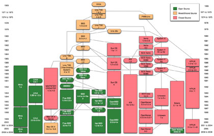

[[toc]]

# Gary Anthes

## Unix turns 40: The past, present and future of a revolutionary OS
《Unix 40年：昨天，今天和明天》

### 说明
作者：Gary Anthes

文章来源：
* 原文：[computerworld.com, unix-turns-40](https://www.computerworld.com/article/2524456/unix-turns-40--the-past--present-and-future-of-a-revolutionary-os.html)
* 翻译： [酷壳 - 陈皓, Unix 40年：昨天，今天和明天](https://coolshell.cn/articles/1023.html)

### 正文

<!-- tabs:start -->

#### **English**

## Unix turns 40: The past, present and future of a revolutionary OS

> After four decades, the future of the operating system is clouded, but its legacy will endure.

By Gary Anthes

Computerworld | Jun 4, 2009 12:01 am PST

Forty years ago this summer, a programmer sat down and knocked out in one month what would become one of the most important pieces of software ever created.

In August 1969, Ken Thompson, a programmer at AT&T subsidiary Bell Laboratories, saw the month-long departure of his wife and young son as an opportunity to put his ideas for a new operating system into practice. He wrote the first version of Unix in assembly language for a wimpy Digital Equipment Corp. (DEC) PDP-7 minicomputer, spending one week each on the operating system, a shell, an editor and an assembler.

Thompson and a colleague, Dennis Ritchie, had been feeling adrift since Bell Labs had withdrawn earlier in the year from a troubled project to develop a time-sharing system called Multics (Multiplexed Information and Computing Service). They had no desire to stick with any of the batch operating systems that predominated at the time, nor did they want to reinvent Multics, which they saw as grotesque and unwieldy.

After batting around some ideas for a new system, Thompson wrote the first version of Unix, which the pair would continue to develop over the next several years with the help of colleagues Doug McIlroy, Joe Ossanna and Rudd Canaday. Some of the principles of Multics were carried over into their new operating system, but the beauty of Unix then (if not now) lay in its less-is-more philosophy.

"A powerful operating system for interactive use need not be expensive either in equipment or in human effort," Ritchie and Thompson would write five years later in the Communications of the ACM (CACM), the journal of the Association for Computing Machinery. "[We hope that] users of Unix will find that the most important characteristics of the system are its simplicity, elegance, and ease of use."

Apparently they did. Unix would go on to become a cornerstone of IT, widely deployed to run servers and workstations in universities, government facilities and corporations. And its influence spread even farther than its actual deployments, as the ACM noted in 1983 when it gave Thompson and Ritchie its top prize, the A.M. Turing Award for contributions to IT: "The model of the Unix system has led a generation of software designers to new ways of thinking about programming."

### Early steps


> Thompson and Ritchie in the early days of Unix.

Of course, Unix' success didn't happen all at once. In 1971 it was ported to the PDP-11 minicomputer, a more powerful platform than the PDP-7 for which it was originally written. Text-formatting and text-editing programs were added, and it was rolled out to a few typists in the Bell Labs Patent department, its first users outside the development team.

In 1972, Ritchie wrote the high-level C programming language (based on Thompson's earlier B language); subsequently, Thompson rewrote Unix in C, which greatly increased the OS' portability across computing environments. Along the way it picked up the name Unics (Uniplexed Information and Computing Service), a play on Multics; the spelling soon morphed into Unix.

It was time to spread the word. Ritchie and Thompson's July 1974 CACM article, "The UNIX Time-Sharing System," took the IT world by storm. Until then, Unix had been confined to a handful of users at Bell Labs. But now with the Association for Computing Machinery behind it -- an editor called it "elegant" -- Unix was at a tipping point.

"The CACM article had a dramatic impact," IT historian Peter Salus wrote in his book The Daemon, the Gnu and the Penguin. "Soon, Ken was awash in requests for Unix."

### Hackers' heaven

Thompson and Ritchie were the consummate "hackers," when that word referred to someone who combined uncommon creativity, brute force intelligence and midnight oil to solve software problems that others barely knew existed.

Their approach, and the code they wrote, greatly appealed to programmers at universities, and later at startup companies without the mega-budgets of an IBM, Hewlett-Packard or Microsoft. Unix was all that other hackers, such as Bill Joy at the University of California, Rick Rashid at Carnegie Mellon University and David Korn later at Bell Labs, could wish for.

"Nearly from the start, the system was able to, and did, maintain itself," wrote Thompson and Ritchie in the CACM article. "Since all source programs were always available and easily modified online, we were willing to revise and rewrite the system and its software when new ideas were invented, discovered, or suggested by others."

Korn, an AT&T Fellow today, worked as a programmer at Bell Labs in the 1970s. "One of the hallmarks of Unix was that tools could be written, and better tools could replace them," he recalls. "It wasn't some monolith where you had to buy into everything; you could actually develop better versions." He developed the influential Korn shell, essentially a programming language to direct Unix operations, now available as open-source software.

Author and technology historian Salus recalls his work with the programming language APL on an IBM System/360 mainframe as a professor at the University of Toronto in the 1970s. It was not going well. But the day after Christmas in 1978, a friend at Columbia University gave him a demonstration of Unix running on a minicomputer. "I said, 'Oh my God,' and I was an absolute convert," says Salus.

He says the key advantage of Unix for him was its "pipe" feature, introduced in 1973, which made it easy to pass the output of one program to another. The pipeline concept, invented by Bell Labs' McIlroy, was subsequently copied by many operating systems, including all the Unix variants, Linux, DOS and Windows.



> Unix was developed at Bell Labs' headquarters in Murray Hill, NJ. Credit: Alcatel-Lucent/Bell Labs

Another advantage of Unix -- the second "wow," as Salus puts it -- was that it didn't require a million-dollar mainframe to run on. It was written for the tiny and primitive DEC PDP-7 minicomputer because that's all Thompson and Ritchie could get their hands on in 1969. "The PDP-7 was almost incapable of anything," Salus recalls. "I was hooked."

A lot of others got hooked as well. University researchers adopted Unix in droves because it was relatively simple and easily modified, it was undemanding in its resource requirements, and the source code was essentially free. Startups like Sun Microsystems and a host of now-defunct companies that specialized in scientific computing, such as Multiflow Computer, made it their operating system of choice for the same reasons.

### Unix offspring

Unix grew up as a non-proprietary system because in 1956 AT&T had been enjoined by a federal consent decree from straying from its mission to provide telephone service. It was okay to develop software, and even to license it for a "reasonable" fee, but the company was barred from getting into the computer business.

Unix, which was developed with no encouragement from management, was first viewed at AT&T as something between a curiosity and a legal headache.

Then, in the late 1970s, AT&T realized it had something of commercial importance on its hands. Its lawyers began adopting a more favorable interpretation of the 1956 consent decree as they looked for ways to protect Unix as a trade secret. Beginning in 1979, with the release of Version 7, Unix licenses prohibited universities from using the Unix source code for study in their courses.

No problem, said computer science professor Andrew Tanenbaum, who had been using Unix V6 at Vrije Universiteit in Amsterdam. In 1987 he wrote a Unix clone for use in his classrooms, creating the open-source Minix operating system to run on the Intel 80286 microprocessor.

"Minix incorporated all the ideas of Unix, and it was a brilliant job," Salus says. "Only a major programmer, someone who deeply understood the internals of an operating system, could do that." Minix would become the starting point for Linus Torvalds' 1991 creation of Linux -- if not exactly a Unix clone, certainly a Unix look-alike.

Stepping back a decade or so, Bill Joy, who was a graduate student and programmer at the University of California at Berkeley in the '70s, got his hands on a copy of Unix from Bell Labs, and he saw it as a good platform for his own work on a Pascal compiler and text editor.

Modifications and extensions that he and others at Berkeley made resulted in the second major branch of Unix, called Berkeley Software Distribution (BSD) Unix. In March 1978, Joy sent out copies of 1BSD, priced at $50.

So by 1980 there were two major lines of Unix, one from Berkeley and one from AT&T, and the stage was set for what would become known as the Unix Wars. The good news was that software developers anywhere could get the Unix source code and tailor it to their needs and whims. The bad news was they did just that. Unix proliferated, and the variants diverged.

In 1982 Joy co-founded Sun Microsystems and offered a workstation, the Sun-1, running a version of BSD called SunOS. (Solaris would come about a decade later.) The following year, AT&T released the first version of Unix System V, an enormously influential operating system that would become the basis for IBM's AIX and Hewlett-Packard's HP-UX.
Unix versions chart


> The Unix family tree. Credit: Eraserhead1 (cc-by-sa-3.0, GFDL)

### The Unix Wars

In the mid-'80s, users, including the federal government, complained that while Unix was in theory a single, portable operating system, in fact it was anything but. Vendors paid lip service to the complaint but worked night and day to lock in customers with custom Unix features and APIs.

In 1987, Unix System Laboratories, a part of Bell Labs at the time, began working with Sun on a system that would unify the two major Unix branches. The product of their collaboration, called Unix System V Release 4.0, was released two years later and combined features from System V Release 3, BSD, SunOS and Microsoft's Xenix.

Other Unix vendors feared the AT&T/Sun alliance. The various parties formed competing "standards" bodies with names like X/Open, Open Software Foundation, Unix International and Corporation for Open Systems. The arguments, counter-arguments and accomplishments of these groups would fill a book, but they all claimed the high road to a unified Unix while taking potshots at each other.

In an unpublished paper written in 1988 for the Defense Advanced Research Projects Agency (DARPA), the noted minicomputer pioneer Gordon Bell said this of the just-formed Open Software Foundation, which included IBM, HP, DEC and others allied against the AT&T/Sun partnership: "OSF is a way for the Unix have-nots to get into the evolving market, while maintaining their high-margin code museums.'"

The Unix Wars failed to settle differences or set a true standard for the operating system. But in 1993, the Unix community received a wakeup call from Microsoft in the form of Windows NT, an enterprise-class, 32-bit multiprocessing operating system. The proprietary NT was aimed squarely at Unix and was intended to extend Microsoft's desktop hegemony to the data center and other places owned by the likes of Sun servers.

Microsoft users applauded. Unix vendors panicked. All the major Unix rivals united in an initiative called the Common Open Software Environment, and the following year more or less laid down their arms by merging the AT&T/Sun-backed Unix International group with the Open Software Foundation. That coalition evolved into today's The Open Group, certifier of Unix systems and owner of the Single Unix Specification, now the official definition of "Unix."

As a practical matter, these developments may have "standardized" Unix about as much as possible, given the competitive habits of vendors. But they may have come too late to stem a flood tide called Linux, the open-source operating system that grew out of Prof. Tanenbaum's Minix.

#### Just what is "Unix," anyway?

```
Unix, most people would say, is an operating system written decades ago at AT&T's Bell Labs, and its descendents. The major versions of Unix today branched off a tree with two trunks: one emanating directly from AT&T and one from AT&T via the University of California at Berkeley. The stoutest branches today are AIX from IBM, HP-UX from HP and Solaris from Sun.

However, The Open Group, which owns the Unix trademark, defines Unix as any operating system that has been certified by it to conform to the Single Unix Specification (SUS). This includes OSes that are usually not thought of as Unix, such as Mac OS X Leopard (which descended from BSD Unix and Mach) and IBM's z/OS (which descended from the mainframe operating system MVS), because they conform to the SUS and support SUS APIs. The basic idea is that it is Unix if it acts like Unix, regardless of the underlying code.

A still broader definition of Unix would include Unix-like operating systems -- sometimes called Unix "clones" or "look-alikes" -- that copied many ideas from Unix but didn't directly incorporate code from Unix. The leading one of these is Linux.

Finally, although it's reasonable to call Unix an "operating system," as a practical matter it is more. In addition to an OS kernel, Unix implementations typically include utilities such as command line editors, application program interfaces, development environments, libraries and documentation. -- Gary Anthes
```

### The future of Unix

The continued lack of complete portability across competing versions of Unix, as well as the cost advantage of Linux and Windows on x86 commodity processors, will prompt IT organizations to migrate away from Unix, suggests a recent poll by Gartner Group.

"The results reaffirm continued enthusiasm for Linux as a host server platform, with Windows similarly growing and Unix set for a long, but gradual, decline," says the poll report, published in February 2009.

"Unix has had a long and lively past, and while it's not going away, it will increasingly be under pressure," says Gartner analyst George Weiss. "Linux is the strategic 'Unix' of choice." Although Linux doesn't have the long legacy of development, tuning and stress-testing that Unix has seen, it is approaching and will soon equal Unix in performance, reliability and scalability, he says.

But a recent survey by Computerworld suggests that any migration away from Unix won't happen quickly. In the survey of 130 Unix users among 211 IT managers, 90% said their companies were "very or extremely reliant" on Unix. Slightly more than half said, "Unix is an essential platform for us and will remain so indefinitely," and just 12% said, "We expect to migrate away from Unix in the future." Cost savings, primarily via server consolidation, was cited as the number one reason for migrating away.

Weiss says the migration to commodity x86 processors will accelerate because of the hardware cost advantages. "Horizontal, scalable architectures; clustering; cloud computing; virtualization on x86 -- when you combine all those trends, the operating system of choice is around Linux and Windows," he says.

"For example," Weiss says, "in the recent Cisco announcement for its Unified Computing architecture, you have this networking, storage, compute and memory linkage in a fabric, and you don't need Unix. You can run Linux or Windows on x86. So, Intel is winning the war on behalf of Linux over Unix."

The Open Group, owner of the Single Unix Specification and certifier of Unix systems, concedes little to Linux and calls Unix the system of choice for "the high end of features, scalability and performance for mission-critical applications." Linux, it says, tends to be the standard for smaller, less critical applications.

AT&T's Korn is among those still bullish on Unix. Korn says a strength of Unix over the years, starting in 1973 with the addition of pipes, is that it can easily be broken into pieces and distributed. That will carry Unix forward, he says: "The [pipelining] philosophy works well in cloud computing, where you build small reusable pieces instead of one big monolithic application."

### The Unix legacy

Regardless of the ultimate fate of Unix, the operating system born at Bell Labs 40 years ago has established a legacy likely to endure for decades more. It can claim parentage of a long list of popular software, including the Unix offerings of IBM, HP and Sun, Apple's Mac OS X and Linux. It has also influenced systems with few direct roots in Unix, such as Microsoft's Windows NT and the IBM and Microsoft versions of DOS.

Unix enabled a number of startup companies to succeed by giving them a low-cost platform to build on. It was a core building block for the Internet and is at the heart of telecommunications systems today. It spawned a number of important architectural ideas such as pipelining, and the Unix derivative Mach contributed enormously to scientific, distributed and multiprocessor computing.

The ACM may have said it best in its 1983 Turing award citation in honor of Thompson and Ritchie's Unix work: "The genius of the Unix system is its framework, which enables programmers to stand on the work of others."

### Appendix: Timeline: 40 years of Unix

Year-by-year details of Unix' history

Ever wonder about how Unix got started, not to mention all the twists and turns it took along the way? Here are some milestones of the operating system's four-decade-long history.

- **1956**
  - A U.S. Department of Justice consent decree enjoins AT&T from "engaging ... in any business other than the furnishing of common carrier communication services."

- **1969**
  - **Mar.** -- AT&T-owned Bell Laboratories withdraws from development of Multics (Multiplexed Information and Computing Service), a pioneering but overly complicated time-sharing system. Some important principles in Multics will be carried over into Unix.
  - **Aug.** -- Ken Thompson at Bell Labs writes the first version of an as-yet-unnamed operating system, in assembly language for a DEC PDP-7 minicomputer.

- **1970**
  - Thompson's operating system is named Unics, for Uniplexed Information and Computing Service and a pun on "emasculated Multics." (The name is later mysteriously changed to Unix.)

- **1971**
  - **Feb.** -- Unix moves to the new Digital Equipment Corp. PDP-11 minicomputer.
  - **Nov.** -- The first edition of the "Unix Programmer's Manual," written by Ken Thompson and Dennis Ritchie, is published.

- **1972**
  - Dennis Ritchie develops the C programming language.

- **1973**
  - Unix matures. The "pipe," a mechanism for sharing information between two programs, which will influence operating systems for decades, is added to Unix. Unix is rewritten from assembler into C.

- **1974**
  - **Jan.** -- The University of California at Berkeley receives a copy of Unix.
  - **July** -- "The UNIX Timesharing System," by Dennis Ritchie and Ken Thompson, appears in the monthly journal of the Association for Computing Machinery (ACM). The authors call it "a general-purpose, multi-user, interactive operating system." The article produces the first big demand for Unix.

- **1976**
  - Bell Labs programmer Mike Lesk develops UUCP (Unix-to-Unix Copy Program) for network transfer of files, e-mail and Usenet content.

- **1977**
  - Unix is ported to non-DEC hardware: Interdata 8/32 and IBM 360.

- **1978**
  - Bill Joy, a graduate student at Berkeley, sends out copies of the first Berkeley Software Distribution (1BSD), essentially Bell Labs' Unix V6 with some add-ons. BSD becomes a rival Unix branch to AT&T's Unix; its variants and eventual descendents include FreeBSD, NetBSD, OpenBSD, DEC Ultrix, SunOS, NeXTstep/OpenStep and Mac OS X.

- **1980**
  - 4BSD, with DARPA sponsorship, becomes the first version of Unix to incorporate TCP/IP.

- **1982**
  - Bill Joy co-founds Sun Microsystems to produce the Unix-based Sun workstation.

- **1983**
  - AT&T releases the first version of the influential Unix System V, which will become the basis for IBM's AIX and Hewlett Packard's HP-UX.
  - Ken Thompson and Dennis Ritchie receive the ACM's Turing Award "for their development of generic operating systems theory and specifically for the implementation of the UNIX operating system."
  - Richard Stallman announces plans for the GNU (GNU's not Unix) operating system, a Unix look-alike composed of free software.

- **1984**
  - At the Winter USENIX/UniForum meeting, AT&T describes its support policy for Unix: "No advertising, no support, no bug fixes, payment in advance."

- X/Open Co., a European consortium of computer makers, is formed to standardize Unix in the X/Open Portability Guide.
- **1985**
  - AT&T publishes the System V Interface Definition (SVID), an attempt to set a standard for how Unix works.

- **1986**
  - Rick Rashid and colleagues at Carnegie Mellon University create the first version of Mach, a replacement kernel for BSD Unix intended to create an operating system with good portability, strong security and use in multiprocessor applications.

- **1987**
  - AT&T Bell Labs and Sun Microsystems announce plans to co-develop a system that would unify the two major Unix branches.
  - Andrew Tanenbaum writes Minix, an open-source Unix clone for use in computer science classrooms.

- **1988**
  - The "Unix Wars" are underway. In response to the AT&T/Sun partnership, rival Unix vendors including DEC, HP and IBM form the Open Software Foundation (OSF) to develop open Unix standards. AT&T and its partners then form their own standards group, Unix International.
  - The IEEE publishes Posix (Portable Operating System Interface for Unix), a set of standards for Unix interfaces.

- **1989**
  - Unix System Labs, an AT&T Bell Labs subsidiary, releases System V Release 4 (SVR4), its collaboration with Sun that unifies System V, BSD, SunOS and Xenix.

- **1990**
  - The OSF releases its SVR4 competitor, OSF/1, which is based on Mach and BSD.

- **1991**
  - Sun Microsystems announces Solaris, an operating system based on SVR4.
  - Linux Torvalds writes Linux, an open-source OS kernel inspired by Minix.

- **1992**
  - The Linux kernel is combined with GNU to create the free GNU/Linux operating system, which many refer to as simply "Linux."

- **1993**
  - AT&T sells its subsidiary Unix System Laboratories and all Unix rights to Novell. Later that year Novell transfers the Unix trademark to the X/Open group.
  - Microsoft introduces Windows NT, a powerful 32-bit multiprocessor operating system. Fear of NT will spur true Unix standardization efforts.

- **1994**
  - NASA invents Beowulf computing based on inexpensive clusters of commodity PCs running Unix or Linux on a TCP/IP LAN.

- **1996**
  - X/Open merges with Open Software Foundation to form The Open Group.

- **1999**
  - U.S. President Clinton presents the National Medal of Technology to Ken Thompson and Dennis Ritchie for their work at Bell Labs.

- **2001**
  - Apple releases Mac OS X, a desktop operating system based on the Mach kernel and BSD.

- **2002**
  - The Open Group announces Version 3 of the Single UNIX Specification (formerly Spec 1170).
  - Sources: Peter H. Salus, A Quarter Century of Unix; Microsoft; AT&T; The Open Group, Wikipedia and other sources.

#### **中文翻译**

## Unix 40 年：昨天，今天和明天

陈皓, 2009 年 06 月 11 日

> 经历了四个十年，操作系统的未来充满了变数，但传奇将会是永久的。

40 年前的一个夏天，一个程序员只用了一个月的时间就创造出了这个世界上迄今为止最重要一个软件的原型。

在 1969 年 8 月，Ken Thompson，AT&T 公司 Bell 实验室的一个程序员，因为妻儿不在身边，所以有机会把他的一些关于新的操作系统的想法付诸实现。他用汇编语言在 DEC（Digital Equipment Corp.）的 PDP-7 微机上写了第一个版本 Unix，他只用了一周的时间就完成了一个简单的操作系统，包括一个 shell，一个编译器还有一个汇编编译器。

Thompson 和他的一个同事 Dennis Ritchie 当时在开发一个叫“Multics（Multiplexed Information and Computing Service 复杂指令和计算服务）”的分时(Time-Sharing)操作系统，因为这个项目当时遇上了很多麻烦，所以 Thompson 和 Dennis 当时感到很没劲，他们即不想去做当时主流的“批处理（Batch）操作系统”，也不想去做那个看上去怪异和笨拙的 Multics。

所以，在他们来来回回讨论经了一些关于新系统的想法后，Thompson 写下了第一个版本的 Unix，然后，这两位老搭档在以后的几年里继续开发着这个操作系统，当然，后面有更多的同事（Doug McIlroy, Joe Ossanna 和 Rudd Canaday）加入了进来。一些当时 Multics 的理念也被带入到这个新的操作系统中来，不过，更为漂亮的 Unix 则带来了–“更少则为更多（less-is-more）”的哲学。[^1]

“一个强大的用于交互式的操作系统不应该在价格成本和人力成本上都是昂贵的” Ritchie 和 Thompson 在开发这个操作系统 5 年后，他们在”计算机协会（ACM- Association for Computing Machinery）杂志”上发表了一篇文章《_Communications of the ACM_ (CACM)》，文中说，“我们希望 Unix 的用户会找到那些非常重要的系统特性就是它是‘简单的’，‘一流的’和‘易用的'”。

显然，他们做到了，Unix 的确成为了 IT 领域中的一块基石，被广泛地部署到了大学，政府和企业的服务器和工作站上。并且，Unix 的影响力开发迅速地传播开来，这恐怕超出了所有人的估计，正如 ACM 在 1983 年给 Thompson 和 Ritchie 颁发最具价值的图灵奖（计算机领域的诺贝尔奖）所记录的那样–“Unix 系统的模式已经在以一种全新的编程思想领导着新一代的软件开发”。

### Unix 早期

当然，Unix 的成功不是一蹴而就的。 在 1971 年，它首先被移植到了 PDP-11 微机（一个比 PDP-7 更强的微机）。文本格式和文本编译程序在这时被加入进了 Unix。并且，当时的实验室专利部门已经开始用这些文本编译器，这也是 Unix 系统除开发团队之外的第一个用户。

在 1972 年，Ritchie 引入了一个更高级的语言–C 语言（基于 Thompson 的 B 语言），此后，Thompson 用 C 语言重写了 Unix，这极大地增加了 Unix 的可移植跨平台性。然后，他们为这个操作系统命名 Unics(Uniplexed Information and Computing Service)，这是和 Multics 玩的一个文字游戏。但最后，Unix 成了最终的名字。[^2]

是时候向全世界宣布这个系统系统了。Ritchie 和 Thompson 于 1974 年 7 月在 _CACM_ 上发表了一篇论文– “The UNIX Time-Sharing System”《Unix 分时操作系统》，这篇论文就像一个风暴一样席卷了都个 IT 界。直到有一天，Unix 被限制在了只能由 Bell 实验室中的少数人使用。但是，因为有计算机协会的支持，当时的 Unix 处于一个引爆点。

“ _CACM_ 的那篇论文产生了一个戏剧化的影响”， IT 历史学家 Peter Salus 在他的书《_The Daemon, the Gnu and the Penguin_》中写到， “很快，Ken 被铺天盖地的 Unix 的请求所淹没”。

### 黑客的天堂

Thompson 和 Ritchie 算得上是史上最名副其实的”黑客”，当时”黑客 hacker”一词指的是那些把非同寻常的创意组合起来， 以一种超常智力，并以废寝忘食的态度解决了某个鲜为人知的软件问题的人。

Thompson 和 Ritchie 他们的所使用的开发方法，他们所写下的代码，极大地吸引了大学里的程序员，并在以后，这些大学中其中的一些程序员因为 Unix 开创了自己的公司，他们都是在 Unix 发展过程中的黑客，就像，加利福尼亚州大学的 Bill Joy，卡内基梅隆大学的 Rick Rashid ，以及 Bell 实验室 David Korn。当然，他们开创的这些公司都没有 IBM，HP 和 Microsoft 的资助。

“几乎从一开始，Unix 就能够，也确实是开始了自我进化”，Thompson 和 Ritchie 在*CACM* 论文中说到，“因为所有的源代码总可以容易被人在线地更改，所以，当有一个新的想法被发明，发现或是被建议出来的时候，大家都非常自愿地修订或重写 Unix 系统和上面的软件”。

Korn，一个今天还在 AT&T 工作的员工，上世纪 70 年代曾是 Bell 实验室的一个程序员。“Unix 的一个特点是，一个小工具刚被完成，就被另一个更好的工具所代替”，他回忆起来说，“如果你觉得不好的话，你完全可以开完一个更好的版本”。Korn 当时为 Unix 开发了一个很具影响力的 _Korn shell_，本质上来说，当年的 Unix 就像今天的开源软件。

Salus，作为一个作家和技术历史家，回忆起，他上世纪 70 年代在多伦多大学时当教授时，在 IBM System/360 大机上使用 APL 编程语言工作时的情景——那并不很好用，但是自从 1978 年圣诞节以后，一个哥伦比亚大学的朋友给我演示了一下在微机上运行的 Unix，“我说，‘我的上帝啊’，我彻底被你征服了”。

他说，Unix 最关键的优势是他有一个“管道”特性（1973 年引入），这么我们可以把上一个程序的输出轻松地传给下一个程序。“管道”的概念，由 Bell 实验室的 McIlroy 发明，随后“管道”这个东西被其它几乎所有的操作系统复制，包括所有的 Unix， Linux，DOS 和 Windows。

Unix 还有一个不错的地方。 “哇”，正如 Salus 所惊叹的，这个操作系统并不需要一个需要一百万美金的大型机才能运行的操作系统。它在极其原始的小型的 DEC PDP-7 微机上开发出来，因为这是当是 Thompson 和 Ritchie 可以找到用来写这个操作系统最好的机器。[^3]

很多很多的大学研究者们使用 Unix 就是因为这是一个简单和容易修改的操作系统，而且对硬件资源要求的很少，代码也是开源和免费的。就像 Sun Microsystems 公司，或是一些用于特定的科学计算的主机公司，例如 Multiflow Computer，他们在选择 Unix 作为操作系统时都和那些大学研究者们有相同的原因。

### Unix 家谱

Unix 成长为一个非私有的操作系统，是因为 1956 年的 AT&T 公司受命于联邦去经营电报电话服务。当然也可以开发软件，甚至那个软件可以有”合理”收费的许可证，但是这个公司却被禁止从事任何和计算机有并的商业活动。

Unix，在开发的过程中，没有任何的奖励制度和管理，从一开始在 AT&T 公司出现时，其是一种近似于好奇或兴趣的东西。

然而，20 世纪 70 年代，AT&T 公司开始意到 Unix 所带来的商业价值。公司的律师开始寻找一些手段来保护 Unix，并让其成为一种商业机秘。从 1979 年 Unix 的版本 V7 开始，Unix 的许可证开始禁止大学使用 Unix 的源码，包括在授课中学习。

没问题！一个荷兰阿姆斯特朗 Vrije 大学使用版本 V6 的计算机科学系的教授 Andrew Tanenbaum 说。在 1987 年，他为教学目的克隆了一个 Unix，创建一个叫 Minix 的开源的操作系统，并可以在 80286 的 Intel 芯片上运行。

“Minix 使用了所有和 Unix 一样的想法，并且这是一个非常灿烂的事物”，Salus 说，”只有一个专门是程序员的并且非常了解操作系统内部的人才成干出这件事来”。Minix 从此变成了另一个起点——Linus Torvalids 在 1991 年使用 Minix 创造了 Linux —— 这并不是一个简单的 Unix 克隆版本，只不过它长得像 Unix。

让我们再回到 Linux 出现的十年以前，Bill Joy，毕业于加利福尼亚州大学伯克利分校，当年，他在学校的时候拷贝了 Bell 实验室的 Unix 版本，并且所到了这是一个很不错的可以使用 Pascal 编译器和文本编译器的操作系统平台。

于是，他更改变扩展了 Unix，形成了 Unix 的第二个最主要的分枝——BSD（Berkeley Software Distribution）Unix。在 1978 年 3 月，Joy 卖出了第一个 BSD 的拷贝：50 美金。

到了 1980 年，有两个最主要的 Unix 的版本线，一个是 Berkeley 的 BSD，另一个是 AT&T 的 Unix，在这个时候，很显然，竞争最终引发了 Unix 的战争。在这场战争中，好的是，软件开发人员还是能够得到 Unix 的源码并对其按照自己的需要和兴致进行裁剪。而不好的是，Unix 开始一发不可收拾地开发不停地出现各种各样的变种。

1982 年，Joy 创建了 Sun Microsystems 公司并提供了工作站——Sun-1，运行在当一个 BSD 的版本，叫 SunOS（Solaris 以之后的十年出现）。而 AT&T 则在随后的几年中发布了 Unix System V 的第一版，一个具有强大影响力的操作系统，最终造就了 IBM 的 AIX 和 HP 的 HP-UX。

### Unix 战争

在上世纪 80 年代中期，大量的用户包括联邦政府，开始抱怨”Unix 是一个理论上单一的可移植的操作系统”，但事实上应该如此却并不是这样。Unix 软件供应商们，一方面为这些抱怨而为其买单（“空头人情”），而另一方面，他们却在没日没夜地给用户们定制 Unix 的各种功能和 APIs，旨在为了留下用户。

而其它的 Unix 产商害怕 At&T 和 Sun 的联盟，所以，有各种各样的派别组织开始在”标准”上竞争，这些组织大多在 X 或 Open 命名，开放软件基金会（Open Software Foundation），Unix 开放系统国际和公司（Unix International and Corporation for Open Systems）等等，在这些组织中形成的各种各样的争论，辩论，抗辩和观点可以写一本厚厚的书，但他们无一例外地以肆意相互评击来主张一个统一的 Unix 局面。

刚形成的开放软件基金会，其包括了 IBM，HP，DEC 和其它公司共同来反抗 AT&T 和 Sun 的联盟。在一个 1988 年未出版的文件中，DAPRA（Defense Advanced Research Projects Agency）一个著名的小型机先驱 Gordon Bell 说， “开放软件基金会 OSF 是一条’Unix 穷人’进入正在发展的市场的一条路，他们以此来供养那个的高利润代码博物馆”。

Unix 战争在解决差异和设定一个操作系统标准中以失败告终。但在 1993 年，Unix 社区听到了一个”警钟”—— Microsoft 发布了 Windows NT，一个企业级的，32 位的，支持多处理的操作系统。而 Windows NT 的所有者瞄准了 Unix 领域，并企图扩展 Microsoft 的桌面系统霸权到各种数据中心以及被 Sun 服务器所占领的地方。

Microsoft 的用户欢呼雀跃，Unix 的产商开始惊慌。所有的主流的 Unix 竞争者们开始主动地联合起来形成了一个通用开放式软件环境（Common Open Software Environment），并在随后的几年中放下了他们的武器并开始着手把 AT&T 和 Sun 联盟为背景的”Unix International Group”并入开放软件基金会 OSF。这个合并在今天叫做——The Open Group，而证明 Unix 系统和所有者的是 Single Unix Specification，现在官方叫法是——“Unix”。

但在实践过程中，所有关于 Unix 的开发的确需要一个尽可能”标准化的”Unix，但是由于这些产商热衷于竞争的习惯，在 Unix 下并没有做到，但这一”标准化”被随后如潮水一样涌来的一个叫 Linux 的操作系统给完成了，这是一个开源的系统系统，则我们的 Tanenbaum 教授开发的 Minix 发展而来。

#### 什么是“Unix”?

Unix，许多人会说，是一个几十年前在 Bell 实验室写的操作系统，Unix 包括其所有的派生版本。今天，最主要的 Unix 版本是从两个主干上分出来的：一个当然是从 AT&T 出来的，另一个则是通过加利福尼亚伯克利分校产生的。今天，最顽强的分枝是 IBM 的 AIX 和 HP 的 HP-UX 以及 Sun 的 Solaris。

然而，只有“The Open Group”拥有 Unix 的注册商标，定义一个 Unix 需要遵从 Single Unix Specification (SUS)。这包含了那些从来没有 Unix 思想的操作系统，比如 Mac OS X Leopard（这是从 BSD 和 Mach 那边发展来）以及 IBM 的 z/OS（这是从大型机操作系统 MVS 发展来的），因为它们遵从了 SUS 的 API 规范。基本上来说，只要那看起来像是一个 Unix，那他就是一个 Unix，而不管它是由什么代码写的。

当然，一个比较宽松的 Unix 定包含了 Unix-Like 的操作系统，有些时候，也叫做 Unix-Clones 或 Look-Alikes，这些都是复制了 Unix 的东西但他们却并不直接使用 Unix 的代码。在这堆操作系统中，领头羊是 Linux。

最后，我们可以把 Unix 叫做一种”操作系统”因为这是已成了实际习惯。另外，对于一个操作系统的内核，Unix 实现了很多典型的工具比如命令行编辑器，应用程序接口，开发环境，开发库和文档
——Gary Anthes

### Unix 的未来

由于这些长期竞争的各种版本的 Unix 缺乏可移值性，以及在价格方面没有优势，在 x86 芯片上占据主导地位的 Linux 和 Windows 将会快速地让所有的 IT 机构把 Unix 替换掉。调查机构 Gartner Group 最近公布了这项调查结果。

“在主机服务器方面，调查结果继续显示公众对 Linux 的热情，而 Windows 也有相应的增长，而 Unix 系统还会长期存在，但是其逐渐地下滑”，这个调查报告由 2009 年 2 月发布。

“Unix 还会像以前那样长期存在，但它已不如从前，而这种局面只会愈演愈烈” Gartner 分析师 George Weiss 说，”Linux 将会是 Unix 的另一选择”，虽然 Linux 并没有像 Unix 那样经过了这么长的开发、性能调整和压力测试的过程，但很明显他很快就要达到像 Unix 那样的性能，可靠和扩展性”。

但是，最近一个由 Computerworld 发起一个民意调查，暗示了所有一切把 Unix 踢开的举动不会很快地发生。在一个由 130 个 Unix 用户和 211 个 IT 经理的问卷调查中显示，其 90%的人说他们的公司”非常极端地信任 Unix”。不到半数的被访者说，”Unix 是一个非常基本的平台，但我们并不确定其未来是否会被保留”，而只有 12%的受访者说，”我们期望在未来把 Unix 迁走”。节省成本，是诸多原因中最主要是一个原因。

Weiss 说，移值到 x86 处理器上会越来越快，因为这些硬件的价值实在是太便宜了。”水平扩展架构，集群技术，云计算，虚拟化技术，你只需要把这些技术合并一下，通过这些技术应用的趋势，我们可以看到操作系统的选择基本上就是 Linux 和 Windows”，他说。

“例如”，Weiss 说，”在最近 Cisco 宣布的 Unified Computing 架构，你可以拥有网络，存储，计算，内存，光纤连接，但你不需要 Unix。你可以安装 Linux 或 Windows 并使用 x86 平台。所以 Intel 赢得了 Linux 取代 Unix 的那半壁江山”。

The Open Group，目前 Single Unix Specification 和 Unix 系统认证的所有者，开始有点退步并有点承认 Linux 也是一个 Unix 系统的选择，因为 Unix 是”高端性能，可扩展性和性能可以用于很多相当重要的应用”，而 Linux 则是一个更为小的，注重于并不太注重的应用。

AT&T 的 Korn 是其中一个对 Unix 仍然看到的人。Korn 说，Unix 的长处是它的历史，自从 1973 年来引入”管道”技术，它就可以被分成几个部分来部署。这会把 Unix 带向前方，他说，”这个哲学体系可以运用在云计算中，在那里，你只需要创建一些小的可重用的碎片而不是一个巨大的应用”。

### Unix 传奇

无论最后的 Unix 命运会怎么样，这个从 Bell 实验室出生的 40 岁的家伙，已经书写了一段传奇，而且这个传奇可能还会继续几十年。它影响并产生了一个相当相当长的流行软件列表，包括给 IBM，HP 和 Sun 提供的 Unix，以及 Apple 的 Mac OS X 和 Linux。它同样影响了 Microsoft 的 Windows NT 以及 IBM 和 Microsoft 弄出来的 DOS。

因为 Unix，产生了许多公司，并走向了成功，因为当时 Unix 给了一个低成本的平台。在 Internet 上的服务器，Unix 是核心的建筑区，今天它也是所有通讯系统的心脏。由它孕育了许多架构上的创意，比如管道，并且，Unix 引出的 Mach 为科学作出了巨大的贡献，同时也为多处理器计算作出了贡献。

ACM 在 1983 年因为 Unix 授予 Thompson 和 Ritchie 图灵奖时说过：“Unix 系统最天才的部分是它的 framework，它激发了程序员们沿着这一方向工作”。

---

**译者陈皓注：**
[^1]在我们所认识的历史中，这两位程序员当时是在 Multics 下开发一个叫”太空旅行”的游戏，后来 Multics 项目解体了，这两位哥们觉得自己的游戏白弄了，所以就为了这个游戏开发了一个新的操作系统 Unix，Unix 的取名和 Multics 是相反的，Multics 有”复杂的”的意思，而 Unix 则是”小巧的”意思。后来他们觉得这个操作系统非常不错，所以在后来发表了一篇论文向全世界宣布了这一操作系统，从此开启了计算机世界崭新的文化，详情可参看我的《Unix 传奇》上篇，下篇。

[^2]Unix 下的经常出现缩写，如 usr 是 user, ed 是 edit，gp 是 group，这也是 Unix 的文化。Unix 的更名可能也是因为这个吧。

[^3] 当时这个机器像垃圾一样被扔在实验室角落里。

<!-- tabs:end -->
