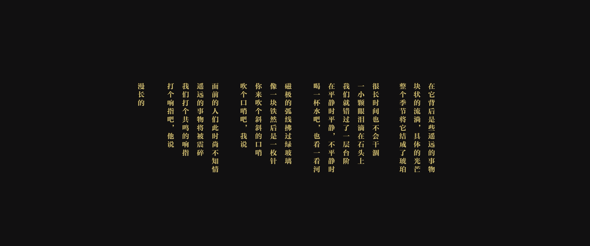

# 班宇

## 《漫长的》

**漫长的**  
班宇  

打个响指吧，他说  
我们打个共鸣的响指  
遥远的事物将被震碎  
面前的人们此时尚不知情  

吹个口哨吧，我说  
你来吹个斜斜的口哨  
像一块铁然后是一枚针  
磁极的弧线拂过绿玻璃  

喝一杯水吧，也看一看河  
在平静时平静，不平静时  
我们就错过了一层台阶  
一小颗眼泪滴在石头上  

很长时间也不会干涸  
整个季节将它结成了琥珀  
块状的流淌，具体的光芒  
在它身后是些遥远的事物  

### 备注

> 原诗收录在小说集《缓步》。
> 电视剧《漫长的季节》中引用。

