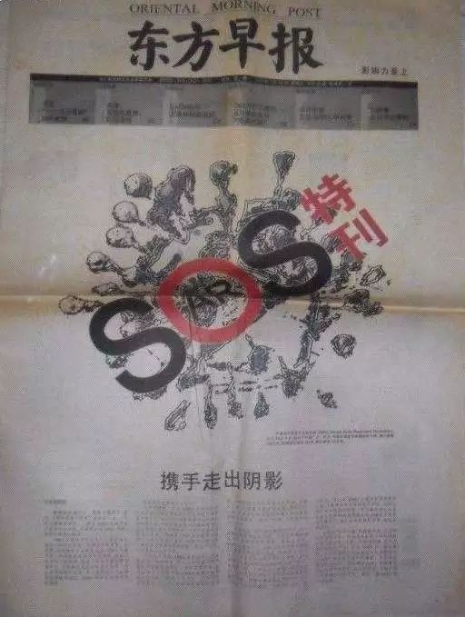
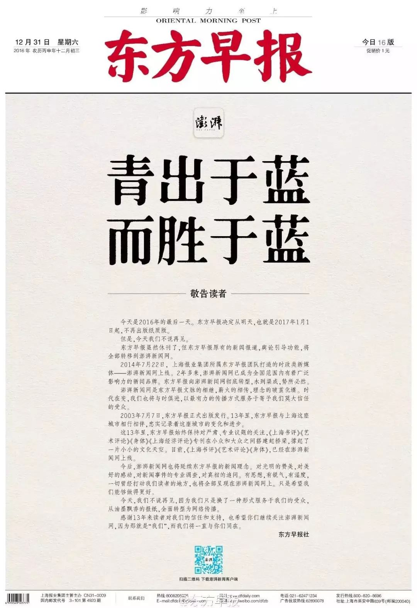
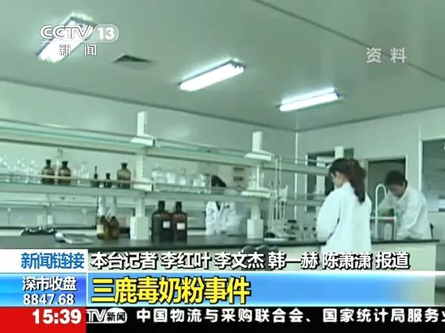

[[toc]]

# 陈季冰

## 真正的新闻正在死去，更可怕的是无人在意

(本文转载自微信公众号“大家”，原题为《真正的新闻正在死去，更可怕的是无人在意》）

（陈季冰冰川思想库研究员公号ID：ibingchuansx）

真正的新闻正在死去，更可怕的是无人在意 | 冰川话题

陈季冰

> 人们常说，股市是国民经济的晴雨表。其实，新闻业就是整个社会的晴雨表或布谷鸟。

> 本文首发于腾讯大家专栏（微信号：ipress)
如果真正的新闻注定要死去，我们身处的这个世界又将会是一幅怎样的图景？

在这个信息泛滥到令人不胜其烦的时代提出这个问题，你也许会说我是矫情做作。然而，作为一个从事
新闻工作已近30年的“资深”媒体人，我确实思考这个问题有一段时日了。其实，是忧虑。

### 1

下周，我的中学同学Zhu就要离开上海，返回她在德国亚琛的家了。但这次与以往任何一次回国探亲都不
同，两个多月前她揣着满心的焦虑不安来，如今又将带着无尽的惆怅与哀思去。

Zhu的父亲不幸倒在不久前席卷全国的大流感中。他先前似乎仅仅是患上了一次寻常的感冒，或许与他体
质本来就不太好有关，在持续发烧不退后，病情加重成了肺炎，然后是呼吸障碍、肺积水，直至心肺功
能衰减，春节前在嘉兴一所医院的重症监护病房去世。

就我所直接了解到的，不仅是上海或者嘉兴，甚至在一些四五线的县城，被这场流感夺取生命的大有人
在。感染到这次流感的人更是不计其数，有段时间我周围的同事亲友中随处可见有咳嗽发烧的。我自己
也没有幸免，所幸不算太严重。

可以说，这已是一起范围和程度都十分严重的公共事件了。然而令我感到不解的是，无论是传统的报纸、
电视，抑或是如今每天刷屏的网络新媒体，几乎没有哪一家花比较多的笔墨提到过近在身边的大流感。
它的预计平均发病率有多少？疾控部门采取了哪些应急措施？医院的现有治疗能力如何？……我几乎就
没有看到过一条关于这些问题的详实新闻，更不用说来自现场的第一手报道了。

更奇怪的是，老百姓们好像也没什么兴趣关注和议论这次的流感，仿佛它根本就没有发生过似的。

回想起2003年春SARS爆发，有段时间，几乎所有人都在目不转睛地盯着最新的疫情报道和政府信息。那
时我们正在筹办《东方早报》，还专门出过一期关于SARS的48大版专刊，其他媒体当然也不甘人后。

▲《东方早报》SARS特刊（试刊）

媒体和社会公众对这次大流感的关注度的涣散，一部分原因大概是，流感毕竟不像SARS会导致那么高的
死亡率，因而还不够可怕吧？但从坏的一面想，以今天的这种舆情状况，若是真的再面对一次SARS，后
果简直不堪设想。

如果说流感尚属“非典型”案例的话，那么最近的另一起事件，就足以淋漓尽致地说明，今天的新闻媒
体在对涉及重大公共利益的事件报道方面的能力，已经衰退到了何种地步！

今年1月上旬，一艘伊朗油轮在长江口以东约160海里处与一艘中国散货船相撞，导致油轮起火，30名水手
失踪。10多天以后，这艘伊朗油轮爆炸沉没，并造成100平方公里油污带……

这期间，我看到许多外媒连续报道了此事。但由于事发在中国，事发地又在海上，这些报道大多语焉不
详。让我感到震惊的是，这么大的一起公共灾难，全世界媒体都在努力试图探究原委，但中国国内媒体，
除了《财新周刊》等极少数几家，几乎不见只字片语！就发生在上海边上的事，上海的老百姓好像也无
人关心，甚至自媒体上道听途说的文章及微信朋友圈里的转发的小道消息都极少。

撞船事件为何发生？失踪船员营救和灭火进展如何？爆炸造成油品泄露的概率是多少？泄露以后对东海
造成的污染损害程度有多大？……所有这些问题，难道不都是事关所有人的切身利益吗？难道它都不如
同期发生的“李小璐出轨”对我们更重要？

这使我想起《世说新语》里的一条笔记，说有几个人在一起比赛作“危语”。一曰“矛头淅米剑头炊”，
二曰“百岁老翁攀枯枝”，三曰“井上辘轳卧婴儿”，最后一人说道：“盲人骑瞎马，夜半临深池。”
旁边人忍不住惊呼出声：“实在太危险了！”（见南朝·宋·刘义庆《世说新语-排调》第61条）

我近来经常觉得，我们的社会正越来越陷入这种“盲人骑瞎马，夜半临深池”的境地。
人们常说，股市是国民经济的晴雨表。其实，新闻业就是整个社会的晴雨表或布谷鸟。

在今天这样大规模、开放的陌生人社会，人们每天都在和不认识的人、不熟悉的事务打交道，比以往更
需要了解全世界、整个国家，以及自己生活的城市和社区的状况：它现在是个什么样子？有些什么样的
优势和缺陷？正面临着哪些问题和挑战？……

高质量的新闻媒体通过对各种事关重大公共利益的新闻事件的及时报道和深入分析，为人们解答上述这
些问题，从而勾勒出一幅社会的概貌。没有这样一幅概貌图，人们将无所适从。

就好像气象台应该向居民报告明天是晴天还是下雨，是刮风还是打雷。如果它不做这些正经事情，而是
喋喋不休地告诉我们：范冰冰喜欢在雨中与情人接吻、汪峰爱在大热天吃涮羊肉……那么，我们又将如
何安排我们明天的出行？

但这就是今天中国新闻媒体的真实写照。

### 2

可以说，除了像《财新》周刊和《新京报》这样的极少数，今日中国已经很少有真正称得上合格的新闻
媒体。这是一个多么可怕的真相！

不久前，当我把上述感慨发表在微信朋友圈以后，立刻就收到了许多朋友的留言。其中绝大多数是反驳，
有些从语气看得出来还相当不快。个中滋味想必不少人大概也能够猜得到一二。

套用一句人们常说的话，我并不是外宾，也不想装外宾。我自己就在新闻行业里度过了半生，还有多少
人比我更了解我们这个行业的窘境。

我并没有责怪中国的媒体及媒体中人的意思，责怪他们就是在责怪我自己。我只是想要指出这样一个需
要重视和忧虑的客观事实：在这个新媒体雨后春笋般涌现出来的生机蓬勃的新时代，中国的新闻生产及
新闻产品的质量变得更糟了，而不是更好了。

造成这种现状的原因之一，首先在于传统媒体不可挽回的衰败。
我必须立刻要承认，传统的报纸、广播、电视在总体上也是不合格的。因为它们存在的根本理由就不是
为了报道真正的新闻，报道真正的新闻只会让它们吃力而不讨好。

然而，在传统媒体业经济上兴旺的年代，它们中总有一些不安分的个体怀着各种动机，甘愿冒着巨大的
风险，千方百计突破重重障碍，试图努力挖掘一些能够引起公众普遍关注的大新闻。他们可能怀有崇高
的新闻职业理想，也可能是想要一战成名，以便在日后名利双收……

随着时代和技术的变迁，传统媒体所依赖的“内容-受众-广告”模式日益不再能够支撑它庞大的成本支出，
变得难以维系，传统媒体也不可避免地衰败了。

经济上的雪崩式滑坡导致了一个恶性循环：削减开支使优质内容的新闻更不可能产生，降低成本使越来
越多这个行内的优秀人才流失，而它们又使传统媒体的受众也越来越萎缩，自然广告收入就更少……

这已是另一个更加专业的问题了，我在这里无法详细讨论。反正目前的概况就是：大多数传统媒体即便
没有停刊关门，也都是在勉强维持，其中有些甚至还不得不靠变相的有偿新闻来获得一点令正派媒体人
尊严尽失的嗟来之食。

▲《东方早报》最后一期

既没有钱，更没有人，指望今日的传统媒体再能够产生像“三鹿奶粉”案这样的报道，自然是不切实际
的。
那么，看起来一派繁荣的新媒体又如何呢？
首先，在目前的条件下，非机构类新媒体没有从事第一手新闻报道的操作空间。严肃新闻尤其如此，哪
怕它们有这方面的意愿。

其次，它们绝大多数是个体户，面临着比传统媒体更大的直接经济压力。可以说，政策和市场的双重枷
锁，牢牢地束缚着新媒体人从事真正有意义的重要新闻报道的职业理想。这迫使他们不得不去削尖脑袋
追逐那些能够迎合受众非理性情绪的无聊的所谓热点，这些热点都是转瞬即逝。

如果你本人就是一个“公号狗”，在费力而提心吊胆地挖掘伊朗油轮爆炸沉没事件的前因后果，与肆无
忌惮地倾泻对“李小璐出轨”的情绪化吐槽之间，你会选择哪一个？答案不是一目了然的吗？

尤其令人印象深刻的是，在谁应该对“新闻之死”负责这个问题上，媒体与社会大众之间似乎还存在着
一种明显的共谋关系。
的确，过去所有这些事关重大公共利益的真新闻也都很难去报道。但它们一旦报道出来了，往往总是会
轰动一时。

十年前，我《东方早报》的年轻同事简光洲不就因为报道了“三鹿奶粉”事件而在一夜之间家喻户晓吗？
现在的新情况似乎是：即便有人冒了巨大风险，做了许多艰苦努力，将一个真正有意义的重要新闻报道
出来了，大多也会很快淹没在浩如烟海的信息垃圾中，产生不了什么应有的社会反响。

▲“三鹿”事件新闻截图

因此，传统媒体的衰败、自媒体的碎片化与公众注意力的漫不经心，可能是一个互为因果的关系。
但我们已经知道，社会公众和新闻媒体对真正重要的新闻漠不关心，是会产生严重后果的，这种趋势确
实令人强烈忧虑。

### 3

上个周末中午，我和原来《财经》杂志及“财经奖学金”项目的两位老朋友和老同事一起吃饭。
谈及近年来媒体市场发生的翻天覆地的变化，我们都感叹：

真正的新闻，未来会成为一种“公共产品”——它不可或缺，但又无法直接产生经济收益从而维持自身
运转。于是，它就需要有人出钱来供养着。
这种“供养模式”在逻辑上是完全能够成立的。
随着科技进步和经济格局的变迁，过去的许多“产业”如今都变成了公共产品，从教育、医疗到经典艺
术……在发达国家，甚至农业在很大程度也是靠国家养着的。
这种“供养模式”在实践上也早有先例。

2004年的这个时候，我受当时的上海文汇新民联合报业集团派遣，远赴瑞典考察学习当地的报业经营管
理。在那里，我看到政府一直对报纸给予直接或间接的补贴。政府这么做的理据是：报纸是民主政治不
可或缺的重要工具。

瑞典政府对报纸的补贴，与报纸的内容倾向毫无关系，后者是政府绝对不能干涉的。我调研过的一家地
方报纸的总编辑曾骄傲地说：“我们报纸立场偏右，我们评论版每天发表的观点都为了一个目的：让社
会民主党政府下台。”然而，这家报纸年复一年地得到社民党掌控的政府的大量直接经济补贴。

在我去的前一个财年，它得到的政府补贴占到它总利润的将近60%。换句话说，它从它不遗余力反对的那
个政府那里拿到的钱，比它自己挣来的还要多！

瑞典政府发放补贴的指导原则是看是否能够促进报纸竞争，从而增加言论的多元化。例如，一个城市原
来只有一份报纸，如果有人去创办第二份报纸，它就将得到补贴；而如果原来那家单一垄断的报社愿意
拿出自己的发行渠道让新报纸分享，那么它也将获得政府补贴。补贴的金额既与报纸的发行量有关，也
取决于报纸的性质，比如说，综合性日报所得的政府补贴往往多于周报或专业财经报纸……

除了政府补贴，瑞典许多报纸的老板不是个人或商业性企业，而是一些基金会。它们当然会有各自完全
不同的价值立场，但都有一个共同点：办报纸的首要诉求不是为了赚钱，这就使这些报纸没有迫在眉睫
的财务压力，有可能做出真正高质量的严肃新闻。

也就是说，在瑞典这样的国家，新闻媒体还获得了大量来自民间的财务支持。而且，由于这些扶持的背
后诉求是多元化的、竞争性的，因而就不必担心这些媒体发出一边倒的统一声音。

当然，这样的“供养模式”放到中国当下的语境中，显然是不可想象的。伴随着传统媒体的衰落，“新
闻之死”是一个全球性的趋势。

它已经造成了显著的后果，比如近年来民粹主义思潮在西方国家的兴起，在我看来就与高质量客观新闻
报道衰败、各种假新闻和无法验证的阴谋论泛滥脱不了干系。在中国，情况就更加错综复杂，一言难尽。

我写这篇文章，并不是为了指责这是谁的责任，更没有雄心和抱负去为它提供一个解决方案。是的，这
种境况既不能怪那个盲人，也不能怪那匹瞎马，更没有理由去怪前方的那个深池……

然而我觉得，当我们看到了“盲人骑瞎马，夜半临深池”的危险一幕后，我们总是应该大声指出来。只
有更多人关注了，重视了，甚至参与了讨论，事态才会有一线希望。

如果所有人都说，这不是我的责任，然后任由盲人骑着瞎马在漆黑的夜里继续朝着深池迈过去，那么我
想，结果无论对于中国的新闻管理部门、媒体行业本身，还是对社会大众，其结果都将是难以承受的。
