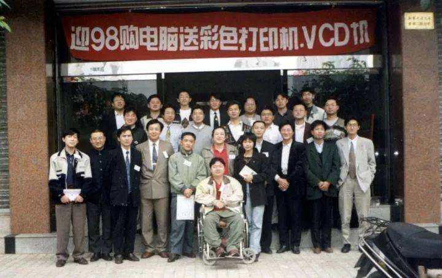

[[toc]]

# 冲浪鸽

## 25年前，互联网大佬在最原始的论坛网上冲浪

本文来自公众号：【网上冲浪记事（ID：djyjs0219）】，
作者：冲浪鸽，题图来自：视觉中国
2019-09-09 19:30

上世纪九十年代初，互联网尚未普及之际，通过电话线路连接起来的BBS网络——CFido，曾是国内第一批网民的聚集地。他们在那里共同营造了一段中国互联网不可磨灭的，但却鲜为后来人了解的故事。

### 1

许多互联网名人都曾在CFido活跃过，但在二十多年前互为网友的他们，尚不知此后的人生会发生怎样的变化。

**那时，丁磊不顾领导反对离开宁波电信局，来到广州准备闯一闯，润迅马化腾、金山雷军都正开发着各自的软件。**多年以后马化腾回忆：“当年一起喝啤酒的时候，我们只是打工仔而已，都还不知道未来。”

一群二三十岁的年轻人，通过一条条电话线连成的网络，聚在了一起。他们使用的网络ID多为真实姓氏或全名，字里行间透露着初代网友间纯真的网络友谊，在CFido上更是无所不谈。马化腾曾与网友交流歇后语“小母牛跳高——挺牛B”；雷军因想要通过媒体推广CFido而引起讨论；求伯君用计算机术语写起过段子……

> CFido历史快照截图

当拨号上网成为往事，Windows替代了DOS系统，曾经运行CFido的软件也随风逝去。CFido就像是隔着一道高墙的互联网古迹，让越来越年轻的网民难以触及。不仅是新一代网民，就连CFido的老人想回去看看，都要安装虚拟机，模拟当年的DOS环境，十分不便。

2016年，CFido老网友们找回了当年的数据，整理出一个历史快照网站以便浏览。参与其中的梁韦江感慨：

“最近可能真的是老了，经常有种怀旧的感觉。在和当年的老朋友聊天时，突然想看看当年我们都在说什么，于是找新月站的老站友找回了当年的邮件数据，并整理成为大家现在看到的这个网站，也让我们这批最古老的网友，在过了差不多20年后，重新看我们当年的言论。”

> 1998年，CFido站长聚会合影

网站发布当月，梁韦江连续更新了三次版本日志，自此以后，CFido历史快照网站就像曾过去的二十多年一样，安静地立于属于自己的那片领地。

三年后的2019年2月，安静的CFido起了些变化。梁韦江第四次更新了网站日志，但这次与版本无关。

“说出来都没人信，时隔20多年后，当年的一群人又聚集在一个微信群了，甚至连马化腾、雷军、求伯君这些风云人物也加入到群里面。”

又过了六个月，一张照片小范围流传开来。几十位中年男士合影留念，马化腾站在人群中央，背后的电子屏显示着“CFido 25周年”字样。

不管是在百度、微博还是微信等平台搜索这次聚会的关键词，几乎都找不到与之有关的信息。偌大的互联网，只有维基百科的中国惠多网（CFido的中文名）词条下，有一句简短的介绍：

“第三次CFido聚会于2019年8月18日在（Pony的提议和邀请）深圳腾讯滨海大厦48楼举行，一众CFido站长、老网友齐聚深圳。”

时隔多年，即便众人已在各行各业成为精英，他们依旧选择了私人聚会的形式。一如1996年CFido第一次站长代表大会上一致通过的原则：

**“不过分打扰别人，不轻易被别人打扰。”**

### 2

上世纪九十年代流行起来的CFido，其源头可以追溯到更早。

1984年，美国人Tom Jennings在已有的电子公告板系统（BBS）基础上，开发出了可以互传信息的FidoNet。FidoNet可以看做是众人利用业余时间共同搭建组成的一个非盈利性网络，每个人都是信息的提供者，同时也是分享信息的人。

起初FidoNet只是在两个站台之间，通过公共电话网拨号，试验性的接收和发送信息。然而仅仅数月时间，这种新奇的交流方式，就吸引了30多人加入建立新站台。**到了1991年，FidoNet遍布全世界，超过12000个站台通过电话拨号在电脑上聊天。**

中国的CFido是FidoNet的一个分支。1991年，罗伊在北京架设了中国大陆的第一个站台——长城。1992年，北京长城站台与汕头手拉手站台组成了国内最早的BBS交换系统，CFido的雏形由此诞生。但最初罗伊的站台每天顶多只有十几个人连接，其中大多数还都是来自拨打海外长途的留学生。

CFido在之后的两三年才逐渐步入发展期，随着国内站台数量和影响力的提升，不少拥有电脑的人开始寻找相关杂志、报纸，学习如何连接上CFido来同天南海北的网友聊天。

一台电脑、一台调制解调器（Modem，又称“猫”）、一条电话线，组成了连接CFido所需的硬件设备。而仅仅拥有这些设备还不够，用电话线连接的“猫”，需要通过电脑上一个叫做“Telix”的专用软件来进行拨号连接站台，收发信息。

由于连接CFido产生的费用是按照时长计费，为了节省话费，还需要一个可以离线编辑的客户端——**蓝波快信。**CFido网友曾在月光博客中介绍，“有了这个软件，不需要一直在线就可以上CFido BBS。使用Telix拨号后，下载蓝波快信格式的压缩信包，再将自己的回复信包上传，可以节省很多电话费。”

### 3

比普通网友连接站点更难的是建站，这种难不仅体现于技术层面，还需要站长无偿投入一笔不小的资金。

当时的站台普遍为单条线路，当有一个用户通过拨号软件连接到站台上网，直到断线之前，其他用户只能在电脑前等待。由于CFido本身并非盈利性质，因此只有一些有条件的站长，才会考虑投入更多的资金，增加线路提升用户体验，从而吸引更多的网友来到自己的站台。

马化腾1993年毕业后，靠着开发股票软件收获了第一桶金。1994年，技术出身的他第一次接触到了CFido。十七年后，他在中国互联网站长年会上回忆第一次登陆CFido的心情：

“那时候我们所有计算机软件编程人员，以为所有的编程都是在本地进行的。第一次看到通过远程的站台，看到屏幕上吐出文字的时候，非常激动，感觉开启了一个新的大门一样，我觉得这是当时网络的开始。”

1995年，在CFido当了半年活跃用户后，马化腾决定掏出5万块钱，搞来了4部电话和8台电脑，在家中建起了一个叫做Ponysoft的四线站台。

吴晓波在《腾讯传》中曾提到，马化腾在创办Ponysoft时，国内CFido站台总共还不到十个，他的生活也因此变得忙碌和丰富了起来。在CFido建站的头两年，马化腾没日没夜泡在网上，收信包，发回复。出差时还要给母亲留下字条，教她如何排查网络故障，以防网友无法连接网络。

> 1998年，CFido站长大会上的马化腾

除了马化腾这样个人背景的站长，CFido上还有一些企业背景的站台。求伯君的金山公司曾在珠海和北京分别开设过西线和西点两个站台，其中西点与马化腾的Ponysoft一样拥有4条电话线，但建站首月就已经有818人注册上站，使得这4条电话线看起来远远不够。1996年《中国计算机用户》杂志曾记录下当时的盛况：“笔者经常要拨一二十次才能进去，此外，线路太少也减少了用户在站上逗留的时间，一个新用户只有几分钟的连网时间。”

### 4

根据用户等级限制上网时间，以便其他人也有机会连接进来，是每个站长拥有的权力。各个站台也会根据自身情况建立不同的机制，而在整个FidoNet里面，还有更加庞大的网络结构。

为了维护FidoNet这样一个跨越洲际的、非企业性质的网络正常运行，开创者采用了一套层层分级的网络结构。从站点到城市，从国家到大洲，每个上游都有相应的负责人，每个站台的站号也据此划分。

> 图片来源：CFido用户施彤宇

而在国内的CFido，还细分出了一套机构体系。除了站长负责各自站台之外，多个邻近站台组成的网区，会选出一名网区协调人，而在此之上还有级别最高的CFido总协调人。

虽然管理上有明显的上下游关系，但是在CFido全国站长代表大会中曾明确提出过，“CFido中的所有用户一律平等”。这也是为什么，不论第一届总协调人罗伊，还是第二届总协调人求伯君，更多的是以网友身份参与CFido日常交流。

每个站台的用户发送的信件，有些会经过筛选投递到相应的信区，全国网友都可以查看并回复。在CFido鼎盛期，信区种类五花八门。

网友可以在游戏区讨论“国产RPG系统的缺憾”，也可以在硬件区与人交流“华硕主板TX97E真伪辨别方法”，甚至在体育板块，还可以看到来自1996年“永远争第一”的北京国安足球队。

### 5

马化腾1995年成为站长时，全国只有不到十个站台，而到了第二年，全国站台数量猛增至50个。当时CFido“程序人生”板块的信管，同时也是金山总经理的雷军，在接受《电子爱好者报》采访时说：“同发展Internet相比，国内发展BBS更有优势。”

BBS确实是那时的风口。不管是学校、政府等组织的机构BBS，还是与电信部门合作的商业性质BBS，亦或是CFido这样由网友自发建立的BBS，都开始见诸于媒体报道中。CFido在这样的环境中，迎来了一波用户猛增期。但突如其来的用户，给原本小众、稳定的CFido造成了冲击，直至衰落。

CFido曾将“爱国、高尚、勇敢、忠实、进步、友爱、守分，业余精神万岁！”奉为价值观。浓郁的技术讨论氛围，互帮互助的网上体验，使最初一批网友将CFido称为是物欲横流的世界中最后一片精神净土.

但随着用户数量的膨胀，不断涌入的新人冲破了原有的秩序。见证CFido发展的网友施彤宇针对此事评论：“**知无不言，言无不尽的风格却助长了某些素质不高的站友的依赖、甚至无赖的行为。使得他们认为业余BBS站台既然是免费服务，那么他们提出任何无理要求都必须在站长那里得到满足，任何对他们出格行为的规劝和约束，都被他们指责为背离业余BBS精神的行为**。”

其实CFido老站友曾提出过的问题，并不比后来的站友高明多少。但问题在于，初期技术水平较低的站友更具有钻研精神，提出的问题多半是经过一番琢磨后有感而发，而后来的站友则是遇到问题不假思索就发到信区。这与如今的问答社区颇有一丝相像，一些通过查阅资料唾手可得的答案，往往会有众多用户发起“如何看待”。

### 6

1998年，受社区氛围的变化，互联网逐渐普及的影响，曾经活跃的老站友渐渐消失于CFido。而受媒体影响蜂拥而至的新站友又很难产生有价值的内容，加速了CFido走向衰落。

CFido的网友曾收集站上的帖子（当时称为信件），整合出了质量颇高的《龙音》电子杂志。但本应在1998年7月发布的第十三期《龙音》，却成了一则停刊感言——《净土的迷惘》。

利用业余时间收集站内优质内容的《龙音》编辑部，在这篇停刊感言中说：

> 《龙音》从第一期开始，就将自己立足在CFidoNet的信件基础上，但随着时间的推移，这个立足点的稳固程度越来越成为威胁《龙音》存在和发展的大问题，而也因为CFidoNet上的信件日益无聊，身为《龙音》编辑的我们，也越来越少在CFidoNet上露面了。

与“日益无聊”相对的，是CFido曾经犹如百家争鸣一般的景象。

今年，围绕在华为左右的操作系统风波，让不少人都开始认识到操作系统的重要性。而早在1997年，CFido上就已经讨论起“中国是否有必要开发自己的OS”。

求伯君在当时的讨论中认为“完全有必要”，他的理由有三：

> 1. 如果我们现在放弃OS，则我们以后就永远没有机会再涉足OS领域，因为从技术的更新来看， 距离越来越远了，则若干年之后，中国必须要完全依赖微软的OS了。若有那么一天，战争爆发了，中国所有电脑的OS都“罢工”，后果不堪设想。

> 2. 即使现阶段我们研究出来的OS BUG很多，甚至根本没法使用，但我认为也必须要坚持研究下去，其主要目的是为了保持OS领域的技术研究，尽量缩短与微软之间的距离。正像我国的战斗机很落后，但我们绝对不能完全依靠进口Su-27过日子，必须要走进口-组装-自主研制的路线。

> 3. 有了乐凯胶卷，富士与柯达的价格才一直升上不去，同样，我们如果有自己的OS可供选择， 对微软来说也是一种约束。

> 1998年，CFido站长大会上的求伯君

求伯君还在CFido上发过一些轻松的段子，比如下面这个你可能曾见过的句子，其实是节选自1997年《龙音》杂志的《Girlfriend V6.0与Wife V1.0》。

> 去年我的一位朋友将GirlFriend 6.0版升级到了Wife 1.0版，发现这耗费了大量内存，几乎没有给其它应用程序留下一点系统资源。现在他还注意到Wife 1.0正在孕育着Child-Processes，这将消耗更多有价值的资源。

《龙音》电子杂志，就像是微缩版的CFido历史。从最初无所不谈的“网虫小技”“游戏人生”“神舟业界”“历史风云”“太空桃源”等栏目，到停刊时无话可说的“累了”，最终在千禧年前后，CFido走到了尽头。

而对于如今那些头上长出缕缕银丝的参与者来说，CFido也终于以另一种方式回归净土，永远成为他们对年轻那段时光的回忆。
