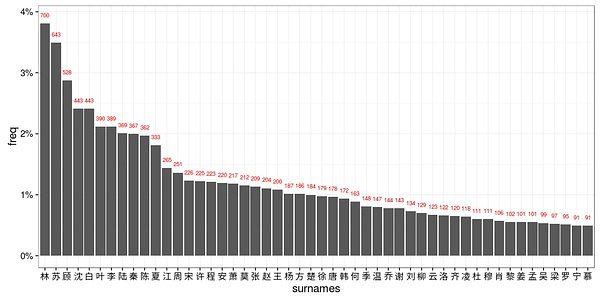
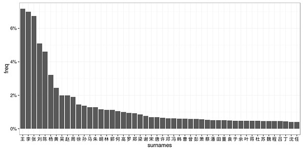
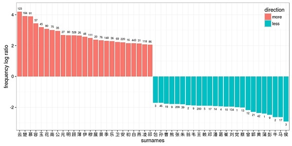
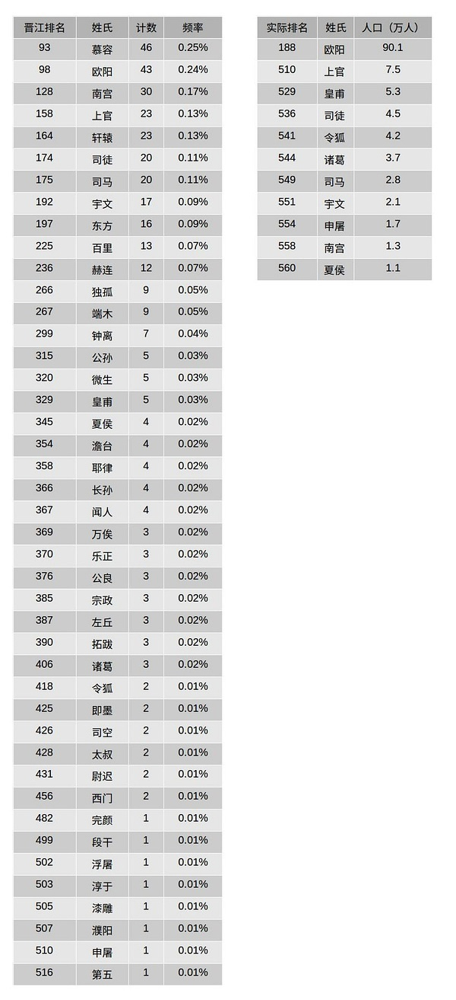

# 孤独力命

## 晋江小说的人物姓氏

[独孤力命](https://www.douban.com/people/1121769/)2016-11-07 11:46:33

人名实在是很有意思的东西。以前翻阅《史记》《汉书》，只觉汉朝人流行“安国”、“延年”之类的
名字，及至见到余英时先生在《东汉生死观》中的论述，才恍然明白其中深味。不久前读了一篇介绍陀
斯陀耶夫斯基小说中“人名的诗学”的文章（https://www.douban.com/note/589188004/），颇
获教益，乃知名字可以是精心撰构的隐喻，可以作为理解作者深意的津梁。长久以来还有另一个印象，
中国现当代文艺作品中，知识分子的名字常含有文言虚词。叶圣陶写过《倪焕之》，话剧《陈毅市长》
中有个科学家叫齐仰之，电影《创业》里那个地质师叫章易之，等等。说起来似乎也可以解释，“之乎
者也”入人名，传达出文绉绉却又酸腐无用的感觉，正与此类作品中知识分子的定位相合。这只是随手
举例，说服力不够过硬，但可能也不算妄断。

上面提到的那篇讲老陀的妙文中有一段说，“在中国文学中，为人物姓名赋予文学性的往往是名、字或
绰号，因为姓只能在给定范围中选择，而起名则有自由发挥的空间。而在一神教传统影响下的俄罗斯，
情况恰恰相反：名和父称往往只能从为数不多的几打基督教教名中选取，姓却不受太多限制，可随意杜
撰。”话虽如此，但陀氏还是利用名字传递了不少讯息，反过来在中文里，姓氏虽然只有几百个选择，
但却也有不少可发掘的模式，在流行文化中更是明显。拜网络所赐，这个模糊的印象，可以用数据来验
证了。

中文的自由度实在太大，用有特点的数据，可能更容易找出有意义的结论，这样看来，晋江文学城网站
上的小说实在是非常好的数据来源。此念一兴，委实手痒不已。以我低下的编程水平，连滚带爬，勉强
搞个网络抓取和html处理，也能弄到一些信息，作个初步分析。十年以来，中国（主要是女性）人民在
晋江上写了近90万部小说，每本书的页面上都标记有作者、书名、主角、配角、分类、性向和文案，实际
上用这套数据能做的事情，远远超出我的水平，只能以待来者了。

这里分析的，仅仅是晋江上最近发表的10万部原创小说（不包括同人小说）。只计算已完结的，再除去一
些读取错误的，共计13980部，从这些页面里找出主角名字24047个，其中符合中文姓名习惯的有18391个。
这一步因为网页数据不尽整齐，涉及一点中文分词（tokenize）的问题。我也没那个能耐用语料库，所
做的只是简单的用一个姓氏列表来查找，外加排除掉一些明显的不符合标准的情况（如名字只有一个字
或超过五个字）。用我的低级山寨算法，“路西法”和“米迦勒”会被算成一个姓路的和一个姓米的，
不过这个比例并不太高。就用这么九牛一毛的数据，得到的结果也很有意思。

在“近来的晋江主角”这个人群中，频率最高的50个姓如下图：

这些姓氏占所有有效统计姓氏的60.2%（绝对计数用红字标明）。其中频率最高的10个姓是林、苏、顾、
沈、白、李、叶、陆、秦、陈，这些姓氏总计占25.1%。无论是前50大姓还是前10大姓，都与现实世界中
的统计数据（来源：维基“中国姓氏排名”词条）非常不同：

两相比较，前50大姓只有25个重合，前10大姓更是只有李、陈两姓重合。若根据“晋江人群”姓氏频率和
实际人群的姓氏频率计算一个比值，再取对数（log ratio），那么正数表明该姓在“晋江人群”中比
较富集，负数则表明该姓在“晋江人群”中相对偏少，这个数值可以部分说明晋江作者们对姓氏的“偏
好”和“嫌弃”。位于这个光谱两端的50个姓如下图（“晋江人群”中的绝对计数用黑字标明）：

值得指出的是，一些姓氏在已统计的晋江数据中十分罕见（如蒲、党、牛等），这个比值对于这些姓来
讲就不是一个太可靠的指标，需要更多数据才能得到更确定的结论。

“晋江人群”偏离现实之处，很容易从姓氏的实际分布和字面含义的角度作出解释。首先，在“晋江人
群”中，真实人群中的“大俗姓”明显偏少，而江南、广东的常见姓氏占了不小比例。王姓是目前中国
第一大姓，频率高达7%，但在“晋江人群”中只占1%，排名22（“隔壁老王”想来不是晋江文的主人公）。
集中分布在江苏省顾姓、沈姓在全国人口中的比例虽然分别只有0.2%和0.41%，却是“晋江大姓”前五。
“昔晋氏平吴，利在二陆”，陆姓不是如今的典型江南姓，也是历史上的江南姓。林姓和苏姓多分布在
广东福建，在现实人群中也是相对常见的姓，但比例只有1.13%和0.46%，在“晋江人群”中提高了数倍。
萧姓及其俗写肖姓，因为是南朝齐梁皇室姓氏，间接与“江南”意象有关，双双进入前五十。

其次，“晋江大姓”从字面上很多含有“草木江河，四时风物”的意象（如夏林柳叶，江洛白云）。这
或许也能解释为何相对“俗”的李姓，在“晋江人群”中虽然频率大为降低，但排名却依然靠前。当然，
同为草木，如音韵不够和谐，或形象杂乱微贱，则反而易遭弃用（如葛姓，可能还有蒲姓）。另外，动
物意象的姓几乎没有（言情主角，甚少姓马牛羊侯，甚至也不怎么姓朱）。虽然牛、侯等姓本身相对罕
见，但在晋江世界中则更是凤毛麟角。本字的含义不够风雅的，也不大出现。黄、孙、胡在现实中都是
常见姓氏，但就算有黄药师黄蓉珠玉在前，晋江作者们也不怎么爱用这个姓。再其次者，“晋江姓”都
或多或少能激发某些文化联想。如唐宋之为时代，秦楚之为地域，独孤澹台，南宫慕容之于特定人物，
都提升了该姓氏的使用频率。复姓在“晋江人群”中的比例虽然不是最高，但也远远超出现实中的水平
了：

不得不说，晋江作者们在罕见复姓上是下过功夫的。

晋江小说的这种姓氏诗学，倒也源远流长。楚辞离骚，每有兰桂杜蘅，香草美人之譬；诗三百篇中，多
草木鸟兽之名，也涉溱涉洧，溯洄溯流。江南水乡，如何不是才子佳人戏的舞台？至于霸道总裁，姓唐
姓龙，姓冷姓厉，总比张王李赵刘老根要带感。林字的本意既好，红楼梦用了它，更兼有林琴南、林徽
因，还有林月如。粤闽地区近代以降对中国的巨大影响，也能由此微中见著。如此想来，《琅琊榜》的
主人公，如何能不先姓林，再姓梅，偶尔还姓一回苏？

符号意义如此显白，当然俗套。俗套又如何？三百年前的通俗作家，做的是一样的事。如临川四梦之中，
紫钗、南柯、邯郸在今天都要算唐传奇的同人，唯有牡丹从人物上，算是明代的原创。男主柳梦梅，是
柳宗元苗裔；女主杜丽娘，是杜少陵之后。别的不说，光是这两人名字里草木缤纷的程度，就已经晋江
得不能再晋江了。

--------------------------

### 附注

附注1：网络抓取的部分是用python urllib实现的，分词和数据分析是用R做的。大家如有改进提高的建议，感激之至。
附注2：看到有网友指出林姓的流行很可能和红楼梦有关，这个之前想到了，但写着写着就忘了，应该补上，特此致谢。
附注3：干完这一票之后，更觉得我那豆瓣昵称不改不行了……

技术性附注：

这个分析采用的是非常简单的方法，没有什么高级的技术（作者本人的水平实在有限）。晋江每一部小
说的目录页面上有很多信息，用查找标记的方法就能直接从html里提取。很多情况下，作者在输入信息
的时候，会把名字用分隔符分开，这是最简情况，稍微麻烦一点的是写成了一整个字符串，这时候就需
要做一点分词。比如“薄靳言/简瑶”，“薄靳言X简瑶”，“薄靳言。简瑶”都很好办，如果是“薄靳言
简瑶”，就要分词了。这里只利用了几百个中文姓氏做简单切分，因为很多名字本身含有姓（比如程言
夏安，四个字都是姓氏；要是有篇林苏X顾沈白的文，五个字都是），所以需要再加一点步骤。大致办法
为：查找字符串中所有匹配姓氏的位置；去掉匹配在最后一个字的；从第一个匹配位置开始，如果一个
匹配与上一个距离小于1个字符，则移除这个位置；如果最后一个匹配位置被移除，但最后产生的名字长
度大于3且倒数第二个匹配不是复姓，恢复最后一个匹配，移除倒数第二个匹配。这个办法没有用其他语
料，也没有计算likelihood之类，所以并不理想，而且会略为偏向复姓。例如“薄靳言简瑶”用这种方
法会分成“薄靳/言简瑶”,“马明宇文征明”（这个例子纯属杜撰，没人写过这种CP）会被分成“马明/宇
文征明”。改进的方法有很多，比如每部小说的文案中多半有主角名字的正确形式，通用的语料库可以
识别已经存在的人名和常见名字组合；姓氏的频率可以作个加权，等等。但本人水平太烂，实现起来太
慢，还是留给真正做自然语言处理的高手吧。实际上，结果表明，就算直接简单粗暴地提取主角名字字
符串的第一个字，“林苏顾沈白”的地位也基本难以撼动。这个结果非常robust，data好才是真的好。

另外，因为网页抓取速度太慢，这里只分析了不到百分之一的数据，也没有按类别细分。将来可以做的
还有很多，比如比较古代/现代，BG/BL，悲剧/喜剧，等等。我深刻怀疑“晋江前50大姓”里面的王、张、
刘，很多都应该是搞笑文种田文的主角。
