# Fred Hebert

import TOCInline from '@theme/TOCInline';

TOC

<TOCInline toc={toc.filter((node) => node.level >= 2 && node.level <= 5)} 
/>

## The Little Printf

- [PDF: The Little Printf](../assets/pdf/hebert-printf.pdf)

<!-- tabs:start -->

#### **English**

##### The Little Printf: why do we code?

> This text is a transcript of a presentation I have given on October 9, 2015,
> at the CityCode conference in Chicago. This content is also available in video
> and as a PDF Document better suited for printing.

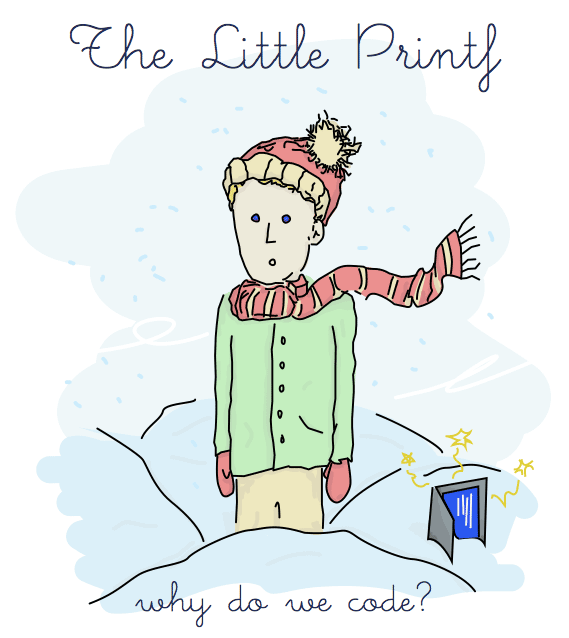

###### Chapter 1

I've been lucky enough to have been born before computers and video
games were ubiquitous. I had the luck to play outdoors with friends and
my brother, and of inventing our own games.

We could be our own heroes, use a twig that would instantly become a
bow, a gun, a sword, or a telescope. It could be anything, except maybe
a boomerang because once you throw the stick away, you have to go fetch
it back.

At some point I grew up, and it became embarrassing to play that way.
You can't treat a pinecone as a grenade and pretend to have magical
powers when other kids think being an adult is cool. You just don't fit
in anymore. You eventually get pressured into growing up. Still, that's
a very lucky childhood.

At some point I got the chance to play video games, and to use
computers. **There** could be the imaginary world you had wanted
all this time, materialized in front of you. It's consuming you, and for
a moment you live a different life.

But there's something particular about most video games: you don't
create, you react, you consume. I eventually did improvisational theatre
as a teenager. Then, again, it was okay to be with people and create and
pretend out of nothing.

Of course, improvisational theatre in Quebec is different; there's an
ice rink in there — everything's hockey.

When I got to a vocational college to study multimedia from 2005 to
2008, I eventually tripped into programming work. I found it amazing!
Creativity was there again, and it could get me money! I then designed
the mechanism of my first game, and it blew my mind.

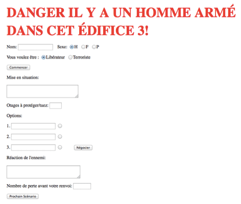

“That's not a real video game,” I was told.
“That's just an HTML form. You should have used an array for the text
and options it would have been better. The code needs cleaning up.”

I was a bit disheartened; the game was really about the 11 pages of text
I had written for the “choose your adventure” aspect of it. But I
realized that if I wanted to make stuff more people thought was good,
I'd have to learn a lot.

I'd have to learn “real programming”. Move from JScript in a GUI toolkit
to something better, like PHP. So I learned that, along with Javascript.
Then eventually I was told to learn how to do real programming again;
PHP is terrible. I was told to maybe try Python, which I then learned.

But real programmers knew fancier stuff, and python's lambdas didn't cut
it, object-oriented programming was not where you wanted to be. Reading
SICP would be the next good step, I was told, because it was like the
bible of computer science.

That got me to Scheme. And I got the K&R book because real
programmers in the real world did C, and I registered for part time
classes at my local university while juggling them with work, because
real programmers knew data structures and math, which I learned to some
extent. I started reading papers and books, because real programmers
stayed up to date and knew fancy algorithms.

Somewhere through that I picked up Erlang and started making a career
out of it. I wrote a book on it. Curiously enough, nobody ever
questioned if I were a real author, or a real writer, or a real
illustrator. Hell, I got a job teaching Erlang without ever having used
it in a production system.

###### Chapter 2

So I lived my life flying around the world, telling people how to do
things I had sometimes never done myself, while everyone suddenly seemed
to believe I was a real programmer because of things I did that were
mostly not related to programming in the first place.

One day, I was stuck in an airport coming back from a conference,
furiously typing at a terminal, when an odd, gentle voice asked me:

“If you please, design me a system!”

“What?!”

“Design me a system!”

I looked up from my screen, surprised by the request. I looked around
and saw this kid who aspired to be a developer and wanted me to call him
“printf”, which I felt was very stupid and gimmicky. He looked a bit
like this:

“I don't know computers much yet, but it seems you do. I want to write
programs and blog about them and have people use and read them.
Please, design me a system!”

Now that was a surprising request, and I had been awake for 20 hours by
then, not too sure I fully understood or felt like it. I told him
systems were hard. I didn't know what he wanted to do, how he wanted it
to fail, how many readers it should support, where he'd want to host it,
and I could therefore not design a proper system with so little
information.

“That doesn't matter. Design me a system.”

So I made the following architecture diagram:

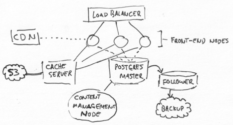

He looked at it and said
“No, this system is not good enough. Make me another.”

So I did:

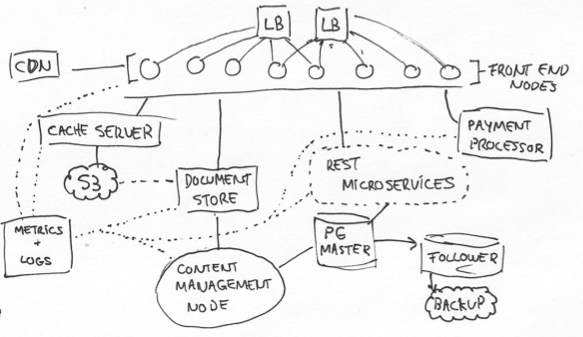

and I gave him a rundown of how it would work.

My new friend smiled politely.
“That is not what I want, it's way too complex and does a lot of stuff
I don't need”

I felt a bit insulted, having considered redundancy, monitoring,
backups, caches and other mechanisms to reduce load, external payment
processor for legal protection, failovers, easy deployment, and so on. I
could have charged decent money as a consulting fee for that! Out of
patience, I just drew this:

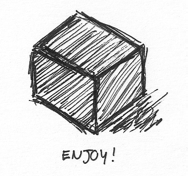

And I added:
“this is your design. The system you want is inside the black box,”
hoping this shitty answer would have him leave me alone. But I was
surprised to hear back:

“That is exactly the way I wanted it!”

And that is how I made the acquaintance of the little printf.

###### Chapter 3

I soon learned of this little guy's portfolio. In his repositories were
only small programs, simple web pages with forms, trivial command line
utils. They would be unspectacular, would come into being, and no sooner
disappear.

Then at some point, he started working on a bigger program, that used
multiple modules. It needed sockets, accessed the disk, talked to an
actual database. When it first built and ran properly, little printf was
amazed. But the program was not enough yet.

It needed refactorings, better tests, documentation, linting and
analysis. The program would run for a while, and one morning, it
crashed.

And it crashed again, and again.

The configurations were wrong, the logs would not rotate, the disk had
unpredictable speed, the network would get the hiccups, bugs would show
up, the encodings would be confused, the database needed vacuuming,
transactions would hang, certificates would expire, CVEs would keep
coming, and the metrics would remain silent.

It kept turning to Spaghetti.

He told me:
“the fact is I didn't know anything! I ought to have judged by my
needs. I got the hubris of writing a fancy system, and I spent so much
time fixing it, it felt like it cancelled the time it saved me. Still,
I should have known what a wonderful thing it was.”

One morning, he decided to leave his office.
“Goodbye”, he said to a blinkenlight that seemed to
have burnt out. He left to see what the world of software had to offer
aside from his messy little server.

The logs would keep accumulating, until the hard drive would fill no
more.

###### Chapter 4

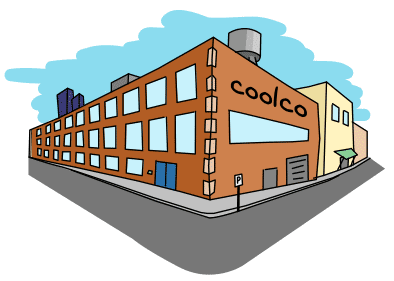

He went to a workspace, looking for experienced developers from whom to
get tips and help.

The first one he met was a very proud senior engineer who seemed to feel
rather superior.

“Ah, here comes a learner! Welcome to my domain, of which I am the
expert”
he said.

“An expert?” Little printf asked.
“Does this mean you can program anything and everything?”

“Yes!” the expert answered. He added
“Well almost; I only program programs that are worth programming. I
don't lose my time on trivialities. Many programs I have never written
but could write with all the ease in the world.”

“Ah, so could you help me with my system?” As soon
as the little printf started explaining his business, the domain expert
interrupted him:

“I'm sorry, but I don't really see the point of doing that.”

“Why not?”

“Experience. I am good at programming the things I program, and I
program things I am good at. By getting better at this fairly
restricted set of things I'm already good at, I make sure I'm more
valuable than ever at it. Call it job security, call it survival of
the fittest, but that's how I roll.”

“And why can't you help me?”

“Well you see, taking my time away to help you means I divert
important self-investment into furthering the progress of others —
that's a losing strategy for me. The best way to learn for you is the
way I took myself: struggle very hard and figure it out yourself. It
helps forge character.”

“That doesn't seem very efficient...”

“Well you can go to school and learn, or you can learn on your own.
Really what it does is weed out the lazy people who just want it easy,
and forces everyone who stays here to be those who really deserve it.
The moment we let moochers in, the very value of the work I produce
goes down with it.”

“Do you not think cooperation or colleagues could help you?”

“Not really. I work best when left alone and not being distracted.
Every time I end up forced working with others, it's nigh impossible
to get our stuff working together. Out of exasperation, I grab their
work and rewrite most of it in a sane way; then it works right.”

Little printf was surprised to meet an expert who seemed so
disinterested in helping others, yet so annoyed by their perceived lack
of skill. It was a bit sad that this man narrowed his vision of himself
to just the one area he knew, to the point where he didn't do anything
else than create problems for himself to fix!

“I see... well I guess I'm happy you won't give me your help”, said my little friend

“What do you mean?” asked the meritocratic man, whose
value seemed suddenly downgraded.
“Don't you think the work I do is interesting?”

“Oh that I do. It just seems like you would see me as a hindrance and
annoyance more than anything else, and what I am looking for is help,
not affliction.”

And little printf left swiftly, leaving the expert to realize he had
made himself untouchable in more ways than just his job security.

###### Chapter 5

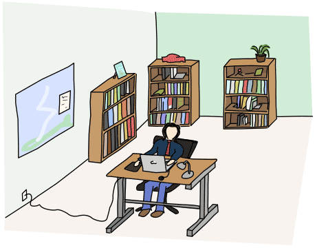

On his way, little printf went in front of the door to an office
occupied by a man surrounded by thick hardcover books, with fancy images
on them like wizards and dragons and fractals and mathematical patterns.

“Nice books, sir”, said printf

“Thanks. I think they're essential material for programmers. If you
don't have them, you're not really a pro”

“I guess I'm not a pro then”, said little printf.
“Which one is your favorite?”

“Oh, well I haven't read most of them.”

“Are you not a good programmer then?”

“No, I am not.” The developer proudly added:
“In fact, I'm a terrible programmer.”

“That's a shame”, said little printf, who continued:
“I'm getting better myself.”

“Have you heard of the Dunning-Kruger effect?”, asked
the man.

“No, what is it?”

“It's a cognitive bias thing. It basically says that people who are
less competent tend to overestimate their qualifications, and people
who are competent tend to systemically underestimate theirs.”

“So if I think I'm getting better, I'm probably not great”

“Yeah, exactly. You're probably bad. On the other hand,
**I** openly say I'm a terrible programmer. But according to
Dunning-Kruger, I'm probably underestimating myself, and that makes me
a good developer, don't you see?”

“I guess?”

“That's because self-deprecation is a vital tool of the developer. The
moment you feel you're good, you relax and stop improving.”

“Doesn't this mean that the moment you feel good about yourself,
you're on your way to failure and then you should feel bad?”

“yes. But the way to go about this is to say that everything is
terrible, even if you have no solutions to offer. That way you look
smart, but don't have much to contribute.”

“What do you mean?”

“Say I go online and see a project I dislike. The trick is to point
out everything that is wrong, give no more information than that. You
can probably subtly point ways in which the person who did the thing
is an idiot and get away with it.”

“And how is anyone better for this?”

“Well I like to think they are better for knowing they're on the wrong
track, and I'm better off for showing them that. It's a bit of smoke
and mirrors. Nobody knows what they're doing but that way it looks
like **I** do.”

“And what happens when you are asked for help and can't do anything
about it?”

“That's when you go back to saying everything is terrible; you have
too much yak shaving to do, improving other things, and being overly
pessimistic. They're on their own.”

“So this is all posturing? You're gaming your way through? You're the
person who pretends to be incompetent at things they know, which makes
people who actually know nothing there feel even worse, and you're the
person who pretends to be competent at things you don't know, so that
people trying to improve there also feel bad.”

“In any case, competence has very little to do with it. Reputation is
pretty important though. People hire friends, and people who aren't
liked and non-essential get fired first; try to change the system and
you become disliked. It's all a very social game. It's how it works in
the industry, and probably in academia too, though I wouldn't know,
now would I? It's all about who you know, selling yourself, your own
personal brand you know? That's how you get jobs in the business.”

“If this is how things are and that you must feel bad and make others
feel bad to do well, maybe I don't want a job in the business”, said little printf, before walking out.

###### Chapter 6

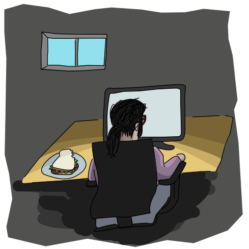

During the time that would have been lunch break, Printf interrupted a
person who had seemingly forgotten to eat their lunch, a sandwich
growing cold by the minute, while sitting at their desk and looking at
their screen.

That seemed like quite a busy person who might have known what they were
doing. Printf asked:

“If a primary database can fail, can the follower fail too?”

“Everything you run”, the person said,
“can and will sooner or later fail.”

“Even the things telling you things have failed?”

“Yes, even these ones. All large systems are in some state of partial
failure at any given time.”

“Then, trying to make reliable systems, what use is it?”

The person did not know, for at that moment, they were trying to answer
a page for the sky falling out onto their head due to a broken cloud,
wondering the same thing.

“Then making reliable systems, what use is it?”
pressed little Printf again

Upset as the person was dealing with a production issue, with this kid
not letting go and a sandwich going to waste, the person impatiently
shot back:

“It's of no use at all. Programming is all shit anyway.”

“oh!”, he gasped.

Then there was a moment of complete silence.

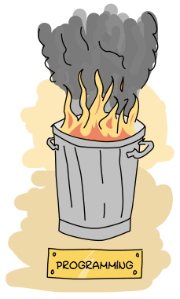

The little guy responded, with a hint of resent:

“I don't believe you. Programs are fragile, but programmers can make
good efforts and make things better and useful.”

No answer came back. At that point the person had opened the document
explaining how to boot a new copy of the whole cluster from scratch, and
things seemed to go from bad to worse.

“And you actually believe good reliable prog-”

“Oh no!” the person said.
“No no no! I don't believe in good or reliable programs! Not anymore!
They're all terrible! I just told you the first thing that came to my
head because I'm dealing with one of these shitty systems right now.
Don't you see I'm trying to keep this stuff running?
**This** shit is actually of consequence.”

Printf stared back, with a shocked expression.

“Actually of consequence? You talk just like a 'real programmer'.”

He added:

“You mix everything up, confuse everything. There's been millions of
programs, and for years they've been running and failing just the
same. And people have used them and needed them. And I know of some
programs that run nowhere but on a single laptop, and in a single
mistake could destroy entire communities, without even noticing. And
you think that this is not important?”

The person remained silent.

###### Chapter 7

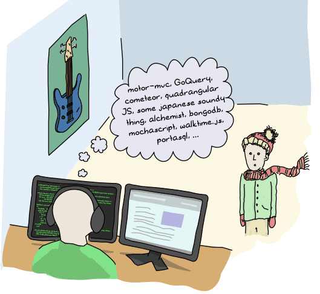

The fourth workspace my friend visited had a man whose computer was
covered in so many stickers nobody could tell what brand it was.

“motor-mvc, quadrangular JS, GoQuery, cometeor, some japanese soundy
thing, ...”

“Hi,” interrupted printf.
“What are you doing?”

“alchemist, bongodb, mochascript, walktime.js, portasql, ...”, the man kept going

“What are you doing?”, he asked again, louder this
time.

“Oh, I'm trying out new frameworks, tools, databases, languages.”

“Whoa, you seem to be going fast, maybe as fast as 10 programmers put
together!”

“yes! well, the industry moves so very fast!”, he
looked at his phone for a second, and added
“there! the cardboard.io framework came up with version 3.5 which
broke compatibility with 3.4 and this yielded 4 forks in the
community! I have to try them all to know which to choose!”

“and what do you do learning all of these?”

“I'm an early adopter. If you don't stay up to date you get stuck
writing COBOL or MUMPS for a living. You want to find the next big
thing, and ride the wave to the top!”

“Has it ever worked?”

“Oh yes! I found out about Rails before it got big, and I figured out
node.js before it was popular, and I was on the first beta copies of
redis and mongodb and riak! I was the first one to use vagrant and
then I got us to switch to docker but of course now it's all about
unikernels..”

“Cool, and all these things you were at the forefront of, how did it
pay off?”

“oh it didn't; by the time rails became huge I had moved on to the
next big thing so I didn't get left behind. Similarly for the other
ones. Here's hoping for unikernels though”

“I see”, added little printf, pensively.
“What problems do you solve with all of these frameworks?”

“Oh, I make sure we don't use something that is not going to be big,
so that this company doesn't get to bet on technologies that have no
future. It's very important work, because if you don't do that, you
can't find anyone to hire except old grey beards behind the times, and
you want self-motivated go-getters, who are also early adopters.”, said the man.

“That is funny”, chimed our friend.

“It is very hard! in the startup world, if you want a-players, you
need good technology to bring them in! Otherwise you're stuck with
inflexible laggards. Nobody wants to be an inflexible laggard.”

The little printf interjected:
“No, that's not what I mean,” and he then added
“I mean it's funny that tools are meant to solve problems for us, but
for you, the tools themselves have become a problem.”

And while the man stood there in silence (on his new cool treadmill
desk), little printf hopped out of the room.

###### Chapter 8

In the next office over sat a tired employee, with dozens of empty
coffee cups, slouched over, typing angrily.

“Hi,” said little printf.

The woman didn't stop what she was doing. She kept typing furiously.

“Hello?” he asked again.

The woman stopped at once, got a flask out of a drawer in her desk, and
took a swig.

“I have a terrible job,” she said.
“I do devops. It started okay, where I'd mostly develop and then
sometimes debug stuff, but as time moved on, it got worse and worse. I
started fighting fires in our stack, and then more fires kept
happening. I got rid of most of them, pulling small miracles here and
there to then meet the deadlines on dev stuff I also had to do”

“And did they hire anyone to help?”

“No, that's the thing. Small fires kept happening here and there, and
because of the time I took to fight them, I couldn't be as careful as
before with the dev stuff, so I created more fires all the time. Now
I'm fighting fires all day and all night and I hate my job”

“Why doesn't your employer do anything?”

“I'm good at my job, and I managed to keep things under control long
enough that everyone got used to it. When you make a habit of small
miracles, people get used to it. Then you're stuck doing miracles all
the time or they will think you won't do your job at all.”

“That sounds very sad”

“It is; and because you're the most familiar person with these fires,
you get to only work on them more and more, until your employer hires
someone else to cover your old job, the one you loved. If you care
hard enough about your work to be the one doing the stuff everyone
else hates, you're thanked by doing more and more of that work you
don't like, until that's all you do. And then there's nothing left for
you to enjoy.”

“Then you're unlucky”, said little printf.

And her pager went off again.

“That woman,” said little printf to himself, as he
continued farther on his journey,
“that woman would be scorned by all the others: by the senior expert,
by the rockstar developer, by the serial early adopter. Nevertheless
she is the only one of them all who seems helpful. Perhaps that is
because she is thinking of something else besides herself.”

###### Chapter 9

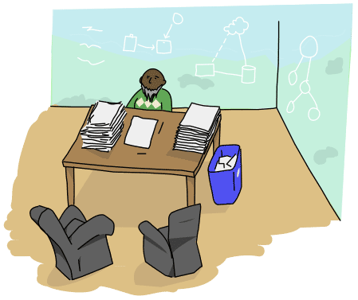

At the corner of the building, printf found a large office with big
windows giving a stunning view of the area. In it sat an old gentleman
with reams of documentation on his desk.

“Ah, here comes a developer” exclaimed the man, as
printf stood in the doorway. “Come in!”

Looking through the windows, little printf noticed that they were full
of writing. With the help of a dry-erase pen, the view to the outside
world was masked by tons of circles, arrows, cylinders, and clouds.
While it was curious the man needed clouds drawn where real ones could
be seen outdoors, the whole ensemble was more intriguing.

“What is this?”, asked our friend, pointing at the
windows.

“Oh this? This is our production system!” Said the
man, not once thinking the question was about the outside world.
“I am a software architect.”

“What's a software architect?”

“Mostly, it's someone who knows how to best structure and coordinates
the components of a large system so they all fit together well. It's
someone who has to know about databases, languages, frameworks,
editors, serialization formats, protocols, and concepts like
encapsulation and separation of concerns.”

“That is very interesting!” said little printf,
“here is someone who can answer all my questions!”
He glanced at the architecture diagrams.
“Your system is very impressive. Is it running very fast?”

“I couldn't tell you,” said the architect.
“It should, though”

“How's the code then, is it good?”

“I couldn't tell you”

“Are the users happy about it?”

“I couldn't tell you either, I'm afraid”

“But you're a software architect!”

“Exactly! But I am not a developer. It is not the architect who goes
and writes the modules and classes, combines the libraries. The
software architect is much too important to go around touching code.
But he talks with programmers and developers, asks them questions,
provides them guidance. And if the problem is looking interesting
enough, the architect takes over the planning.”

“And why is that?”

“Because we are more experienced. We know more about systems and what
works or not. Developers can then be an extension of our knowledge to
produce great systems!”

“But how do you know if things are going well without getting involved
with code?”

“We trust the developers”

“So you trust them to implement your ideas correctly, but not enough
to come up with their own ideas?”

The software architect was visibly shaken by this comment.
“I guess I might have been a bit disconnected”, he
finally admitted.
“The problem is that after a while you are asked to work with ideas so
much you don't have a good way to get them tested or verified...”
he stared down, pensively.
“Sometimes a software architect does neither software nor
architecture, it seems.”

Little printf left the room, and being done with his visit, exited the
building.

###### Chapter 10

Little printf, once outside, met a man collecting money for some
charity.

“Hi,” said the man.
“how would you feel about helping someone today?”

“It would probably make me feel better,” said little
printf back.
“I have been in this office all day, and now I'm more confused than
ever.”

“Ah I see. These people are all developers. They are not really
helpful, are they? What they love to say is that they're changing the
world, and they pretty much succeed at that, in fact.”

“Why does it feel so awkward, then?” Asked little
printf.

“Well, the best they do is often help convert some people's jobs into
programs, or make everyone's leisure more leisurely. Software is
eating the world and that changes its face for sure... but deep down
it's the same old world, with a mangled face. The reason it feels
awkward is that changing in that way doesn't mean things are getting
any better. We have the same flaws and problems we always had, the
same holes to fill deep down inside.”

“So how can I feel better?” Little Printf was
visibly anxious.

The man thought for a while, and offered printf to come help him help
others, as this was this man's way of feeling better. During the
afternoon, printf told the man about his problems and his adventure.
After a long silence, the man said:

“The games people play, the roles and reputations they chase and
entertain, the fleeting pleasure they derive from solving intricate
problems, is all fun for a while. Ultimately though, if you do not
solve anything worthwhile, if you forget about the people involved,
it's never gonna be truly fulfilling.”

“And that may be fine, and it might not be, and you may or may not get
that from somewhere else than your workplace when you grow up. Work
can be work; it can be for the money, it can be for the fun of it.
That's okay. As long as you manage to get that fulfillment somewhere
in your life.”

“In the end though, it is only when you solve problems with a human
face that you can feel truly right; What is essential is invisible to
the computer.”

“It is the time you have spent on your system that makes it so
important”, the man added, “and when you lost sight of why it made
sense to spend time on it, when it became a game of pride, it caused
more grief than relief.”

“Developers have often forgotten this truth; If you lose sight of
things, working on your system becomes its own problem, and the most
effective solution is to get rid of the system, given it's the
problem.”

“It is only when you solve problems with a human face that you can
feel truly right”, repeated little printf to himself, so he would remember.

###### Chapter 11

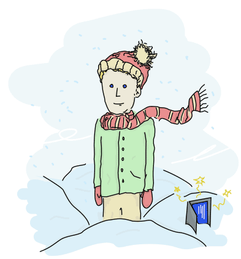

Printf, who's now sitting right in front of me, is on his way home.
Talking with him made me realize how much of what I do flies in the face
of what I liked, what I started programming for. Each of the people
Printf met are roles I see myself taking one day or another over time. I
was encouraged by them to become them, and probably encouraged people to
do the same.

Where I got dragged in the game of trying to become a real programmer,
Printf didn't. He said he was okay with not being a real programmer,
that he preferred to be a programmer with a human face.

Today I'm stuck in the situation where I look back, and have to figure
out if I can, too, become a programmer with a human face; or if
everything I do is just a job. There doesn't seem to be too much that's
worthwhile in-between.

In any case, where printf felt he didn't need to be a real programmer, I
think I feel the same now.

#### **中文翻译**

##### 小 Printf: 我们为何编程？

> 来自`https://mogeko.me/posts/zh-cn/043/
> 部分笔误的字词进行了修正。

    - [第一章](#第一章)
    - [第二章](#第二章)
    - [第三章](#第三章)
    - [第四章](#第四章)
    - [第五章](#第五章)
    - [第六章](#第六章)
    - [第七章](#第七章)
    - [第八章](#第八章)
    - [第九章](#第九章)
    - [第十章](#第十章)
    - [第十一章](#第十一章)

###### 第一章

我很幸运能够出生在一个计算机和游戏还没有普及的年代。我很幸运能有机会与朋友和兄弟在户外玩耍，
同时发明一些属于我们的游戏。

我们都是自己的英雄，用一根树枝做成弓箭、枪、剑甚至是望远镜。树枝可以做成任何东西，除了回旋
镖。因为你一旦把它扔出去，你需要自己捡回来。

到某个时间点，突然长大了，上面的游戏变得很幼稚。当周围的人开始以成熟为荣时，你不能再把松果
当成手榴弹扔出去，也不能假装自己会魔法。你最终会在压力中长大。不过总的来说是一个非常幸福的
童年。

一次偶然的机会，我接触到了计算机和电子游戏。这可能是你曾经想象中的某一个虚拟的世界。你花时
间玩游戏，寻求着与现实生活不一样的体验。

但大多数游戏都有一个共同点：你不能创造，你只能花费时间玩已经设定好的程序。我在十多岁时参加
过“即兴表演”。在那里我可以与人合作并发挥我的创造力。

当然，魁北克的即兴表演舞台是不同的；这里是一个溜冰场。

我在大学学习的专业是“多媒体”，但最终我却从事了与编程相关的工作。编程真奇妙！我可以发挥我
的创造力，还能赚钱！之后我做了我的第一个游戏：

“这不是一个真正的视频游戏。”，我被告知。“那只是一个HTML表单。您使用数组作为文本和选项会
更好。而且代码需要简化。”

这些评价让我有点沮丧；但这游戏确实只是我写的11页关于“选择你的冒险”的文档而已。我意识到如果
我想创造更多被人认可的东西，我必须要学习更多的知识。

我必须要学习“真正的编程”。我从GUI工具包中的JavaScript开始，慢慢学习更多的语言，比如
PHP。但这一切不是很顺利。其他人建议我尝试一下Python，然后我学会了。

但真正的程序员知道一些更高级的特性，比如lambda表达式和面向对象编程都不是你现在想要的。后来
别人建议我去读一下《计算机程序的构造和解释》(SICP)，因为它就像计算机科学的圣经。

就这样，我知道了Scheme。后来我通过K&R的书学习了C语言，因为真正的程序员都会写C语言，我在当
地的大学注册了兼职课程，因为真正的程序员都知道数学和数据结构，虽然我只学到了一点皮毛。我开
始阅读技术类文章和书籍，因为真正的程序员与时俱进，知识更新得很快。

经过一段时间，我学会了Erlang，并以此开始了我的职业生涯。分奇怪的是：我这个没有用Erlang做过
任何生产级别的开发的人，却得到了一份教Erlang的工作。

> 备注：原文作者写过一本 Erlang 入门书: [Learn You Some Erlang for Great Good!](https://book.douban.com/subject/10822017/)

###### 第二章

我忙于到世界各地去演讲，告诉人们如何做那些“我从没做过的事情”。而每个人似乎都相信我是一个
真正的程序员，因为我讲的事情大多与程序无关。

一天，从会议回家的路上，我因为飞机晚点被困在了候机室。我愤怒的敲击着键盘，一个温柔的声音问
我：

“如果你愿意，可以请你给我设计一个系统吗？”

“什么？”

“给我设计一个系统！”

我对这一请求感到惊讶。我抬起头，看到一个渴望成为程序员的孩子。他自称“Printf”。我觉得这个
名字很傻很花哨。他大概长这样：

“我还不是很了解电脑，但你看起来像是这方面的专家。我想写一些程序，并附带博客让人们可以使用
和访问它们。请你帮我设计一个系统！”

这是个令人惊讶的请求，而且我已经二十多个小时没有合眼了，我不太确定有没有完全get到他的意思。
我告诉他设计系统很难。我不知道他的需求是什么：需要供多少人使用？在哪里部署？我无法根据他提
供的如此少的信息设计一个合适的系统。

“没关系，给我设计一个系统吧。”

所以我画了一张架构图：

他看了后说：“不，它还不够好。请再给我设计一个别的。”

于是我画了这个：

然后我给他讲了这个系统的工作原理。

我的新朋友礼貌的笑了笑。“这不是我想要的系统，它太复杂了，有很多我不需要的东西。”

我感到有点不爽，我的设计中考虑到了冗余、监控、备份、缓存、负载、故障转移、部署简单等等。我
的工作都可以收取一笔可观的咨询费了！我已经失去耐心了，所以我画了这个：

我告诉他：“这是你要的系统，在这个黑盒子里面。”我希望这个敷衍的答案能够让他离开。但我很惊
讶的听到：

“这就是我想要的！”

这就是我与小Printf的相识过程。

###### 第三章

我很快了解到了这个小家伙的编程水平。在他的代码仓库里只有一些小程序、网站的小demo、琐碎的命
令行工具。都是些不引人注意的小东西，很快出现就又消失了。

然后他开始去做一些使用多个模块的大型程序。这个程序需要处理套接字、读写磁盘、用到数据库。当
它第一次跑起来的时候，小Printf十分兴奋。但是，这个程序称之为好还为时尚早了点。

这个程序需要重构、更好的测试、文档、Linting (代码静态检测)、分析。这个程序跑了一段时间，到
某天早上最终还是崩了。

然后一次又一次地崩溃！

配置错误，日志不工作，磁盘读写不稳定，网络卡顿，有bug，编码混乱，数据库里有脏数据，证书过期，
没有异常处理等等原因导致问题找不到根源。

简直像意大利面一样一团糟。

小Printf跟我说：“我简直是一无所知！我应该根据我的需求去判断。我写了一个花哨但难以伺候的系
统，后来我花在修复bug上的时间和精力比它带给我的好处完全不成正比。不过，我确实学到了不少东西。
”

一天早上，他决定离开这里。“再见”，他跟我做最后的道别。他想去看看外面的世界，看看别的程序
员写的程序。

小Printf写的程序，最后因为不断增加的日志，撑爆了硬盘，彻底崩溃了。

###### 第四章

小Printf来到一个办公楼，寻找最有经验的开发人员，并希望获得他的提示和帮助。

他遇到了一个骄傲的高级工程师，他对自己的技术相当有自信。

“嘿，菜鸟！欢迎来到我的地盘，我可是这一领域的专家！”

“专家？”小Printf问道。“专家的意思是可以搞定任何程序吗？”

“是的！”骄傲的程序员回答到，接着他又补充到：“准确的说是大多数程序。我只编写有价值的程序，
我不会在琐事上浪费时间。有很多程序我没写过，虽然它们对我来说不费吹灰之力。”

“那么，你能帮助我完善我的程序吗？”小Printf问道，接着小Printf开始阐述他的网站系统，但骄
傲的程序员打断了他：

“对不起，我觉得你的网站没有任何意义。”

“为什么？”

“经验。我擅长开发我开发的东西，我也只在我擅长的领域做开发。我确保我的领域永远有价值。这叫
工作保障，也叫适者生存，这就是我的风格。我只专注于我的领域！”

“所以你为什么不愿意帮我呢？”

“Emm…你看，如果我花时间帮助了你，意味着我也要花时间帮助别人，而不是提高我自己——这对我来
说不是个好主意。我的建议是：求人不如求己。这样可以磨练你的品质。”

“你说的方法好像不是很高效……”

“你可以去学校学习，或者自学。这种方法可以淘汰那些懒惰的，只喜欢简单的人。只有真正渴望知识
的人才能成功！如果我纵容了伸手党，我所创造的作品的价值也会随之降低。”

“你认为团队合作或者同事不能帮助你吗？”

“是的。我喜欢独处，没有任何让我分心的事。每次让我和团队合作的时候，都不是什么好的经历。解
决问题的最好的方法就是把他们的代码拿过来重写。然后程序就能够运行了。”

小Printf对这样一位专家感到十分惊讶，他表面上无私的帮助别人(重构代码)，但却嫌弃别人技术差。
更可悲的是，这个男人眼界十分狭隘，他只关心与自己相关的领域，只活在自己的世界里。

“我明白了……很庆幸你没有帮助我”，小Printf说道。

“你什么意思？”傲慢的专家问道，好似自己的权威受到了威胁。“你在质疑我的能力？”

“这道没有。看起来你只是把我视为累赘和包袱，我是来寻求帮助的，不是来找骂的。”

小Printf飞快的跑出了专家的办公室。骄傲的专家依然心安理得的做起了自己领域的权威。

###### 第五章

然后，小Printf来到了另一间办公室。里面有一个男人，他的周围都是厚厚的精装书籍。书上印着奇异
的图像，如巫师、恶龙、分形、数学模式……

“先生，好多书啊！”小Printf说道。

“谢谢，这些都是程序员必看的书，没看过这些，你就不是一个真正的专业人士。”

“我想我还差得远呢”小Printf说道。“哪一本是你的最爱呢？”

“哦，这些书的大部分我都还没怎么读过。”

“那你现在是大佬吗？”

“不，我不是”这个程序员骄傲补充到：“我想我应该是一个很垃圾的程序员。”

“这有什么好值得骄傲的”，小Printf说。“我感觉我的技术变得越来越好了。”

“你听过**达克效应**吗？”

“那是什么？”

“这是一种认知偏见。简单的说，能力高的人总是低估自己，而能力菜的人总是高估自己。”

“也就是说，如果我认为自己在变强，其实自己并没有在变强？”

“是的。你甚至可能原地踏步，或者更糟。另一方面，我宣称自己是个很菜的程序员，但根据达克效应，
我是低估了自己，所以我其实是一个大佬。你怎么看？”

“额……我？”

“这也是为什么程序员都喜欢自嘲。当你认为自己足够好了，你就放松了，也就没有前进的动力了。”

“那是不是说你对自己感觉良好，实际上你正走向失败；你应该时刻感觉自己还不够好？”

“是的。不过，你虽然明白了自己的不足，但并没有提出任何解决方案。这让你看起来很聪明，但并没
有什么用。”

“你的意思是？”

“比方说我在网上看到了一个我不喜欢的项目。我留言说项目一无是处，但又不明确指出哪里不好。最
后你还可以说这个项目的作者简直是个傻逼，应该从这里滚出去(大概是‘滚出GitHub’之类的意思)。”

“但是这样做又什么好处呢？”

“我想让他们知道他们很垃圾，但又不明确指出来他们哪里做的不对。这就显得我比较厉害。然而他们
毫无头绪，不知道自己做错了什么。哇咔咔咔～～”

“那如果别人请教你问题，你又正好不知道呢？”

“这种情况你就说到处都是问题，还有很多东西需要优化，总之就是转移话题。让他们感到绝望，最后
还是要靠自己来解决问题。”

“所以这就是你的立场？这是你的一贯作风？你会的问题装作对此无能为力，使得真正无法解决这个问
题的人抓狂；你不会的问题又装作很了解，使得别人根据你的建议改善其它的地方，而与真理相行渐远，
浪费时间。”

“很多情况下，才能不是最重要的，口碑才是。老板只会雇佣自己喜欢的人，不被喜欢的人和无关紧要
的人会第一个被炒鱿鱼。要不就改变环境，改不了就要适应，适应不了就被淘汰。这就是‘社会’。企
业中就是这样，学术界没准也是。做这行，你认识谁，学会推销自己，建立自己的声望。这样你才能在
企业里站住脚。”

“如果在企业中工作是这么恶心，要给别人‘使绊’。那么我还真不想在这种环境下工作！”

> 备注：
> 达克效应，全称邓宁-克鲁格效应（Dunning-Kruger effect）: 完成特定领域的任务时个体对自己的能力作出不准确的评价的现象——能力低者会高估自己的能力，甚至显著超过平均水平，能力高者会低估自己的能力。
>
> - 巫师（Wizard）指的是 Structure and Interpretation of Computer Programs（SCIP）
> - 恶龙（Dragons）指的是 Compilers: Principles, Techniques, and Tools（编译原理），编译领域”龙虎鲸“之一。

###### 第六章

在午休期间，小Printf遇到了一个忘记吃饭的人。他桌子上的三明治已经完全凉掉了，但他还是盯着屏
幕。

他好像十分的忙，但没人知道他在做什么。小Printf问：

“如果主数据库挂掉了，从数据库也会挂掉吗？”

“你运行的所有程序“，这个人说，”早晚都要挂掉。”

“你以往的经验告诉你的？”

“是的，不仅如此。所有的大型系统都处在部分故障的状态”

“那么，人们依然试图建立最可靠的系统，这又有用呢？”

那个人没有回答，而是忙着做自己的事情。

“那么，人们依然试图建立最可靠的系统，这又有用呢？”小Printf又问了一遍。

这个人在忙于自己的事，而小Printf一直问个不停，并且他还没有吃午饭。

“完全没用！无论如何，程序都TM是一坨屎！”

小Printf倒吸了一口气，半天说不出一句话。

小Printf回应到，声音中透露这一丝不满：

“我不相信你。程序确实很脆弱，但程序员可以作出努力，增强程序的鲁棒性，让事情变得更好。”

没人回答。那人正翻阅文档，准备重启一个新的集群，不过这似乎会让事情变得更糟。

“并且你应该相信又好的，可靠的程序…”

“不可能！”那人粗鲁的打断了Printf，接着说道：“我不相信有可靠或者好的的程序！根本不可能！
我从一开始就知道。我正在处理一个垃圾的系统，你没看见我想方设法地让这个狗东西跑起来时焦头烂
额的样子吗？事实如此！”

Printf楞了一下，表情震惊。

“事实如此？说得好像自己是个专家一样！”

Printf接着说：

“是你自己把这一起搞砸的。这世界上有数百万个久经考验的程序，多年来它们一直在运行，它们也有
bug，也崩溃过。但人们还是在改进它们，使用它们。据我所知，很多程序本身是没有问题的。真正的问
题出在计算机和椅子之间——糟糕的环境配置、错误的操作。你不认为这才是问题所在吗？”

那人听完哑口无言。

###### 第七章

小Printf拜访的第四个工作区有一个男人，他的电脑被很多标签纸所覆盖，以至于看不出来电脑的品牌。

“motor-mvc, quadrangular JS, GoQuery, cometeor, some japanese soundy thing,…”

“Hi”，小Printf打断了他的自言自语。“你在做什么？”

“alchemist, bongodb, mochascript, walktime.js, portasql,…”，男人并没有理会
Printf继续自顾自的念着什么。

“你在干什么？”小Printf提高音量又问了一次。

“哦，我正在尝试新的框架、工具、数据库还有编程语言。”

“哇！你接触的这样东西都好新鲜啊！有的我听都没听说过。”

“是的，这个行业的技术更新的速度非常快！“他看了眼手机，然后说道”看，cardboard.io框架又
推出了3.5版本，它宣布不兼容3.4了。于此同时社区中已经有4个衍生版本了。我必须尝试所有的版本才
能知道哪一个是最合适的！”

“但是你为什么要学会所有的版本呢？”

“我是最早的尝鲜者，如果你不保持更新技能树，还是用老掉牙的COBOL或者MUMPS。你还想抓住成功的
契机，抢占先机，占领下一个风口？”

“你成功预测过热门技术吗？”

“是的！我发现Rails的时候它还很小，我学会Node.js的时候它还没有流行。我是Redis、MongoDB和
Riak的内测用户。我是第一批试用Vagrant的用户，然后我转去使用Docker，但是现在我全身心的关注
Unikernels…”

“哇哦～你从这些前沿技术中学到了些什么？”

“额，并没有。当Rails壮大的时候，我就去关注另外的新鲜东西了。同样的，其他的几门技术我也是
这样的。我现在把希望寄托在Unikernels上。”

“那么…”，小Printf沉默了一会儿。“你用这些框架解决了哪些问题？”

“我每次都确保不使用不成熟的东西，不能用公司做赌注。这一点十分重要，因为如果你使用最新的技
术，你就可能招不到人，而不关注新的技术，有可能脱离时代的步伐。所以我们鼓励学习新的技术。”

“这很有趣。”小Printf说道。

“这很难的。在这个飞速发展的世界中，如果你想参加这场游戏，你需要有先进的技术。否则你就会被
时代淘汰，没有人想被时代淘汰。”

小Printf打断到：“不，我不是这个意思，”然后他补充说“我的意思是说好的工具是用来解决问题的。
但对你来说工具却成了问题。”

听完这些话，那个人呆住了（站在他新的很酷的跑步机办公桌上），小Printf跳跃着离开了房间。

###### 第八章

在办公室里，坐着一位疲惫的员工。桌子上杂乱无章的摆放这很多空咖啡瓶子，整个人窝在那里，疯狂
的打字。

“Hi”，小Printf说。

那个女人没有停下手中的工作，继续疯狂敲键盘。

“Hello?”小Printf再次打招呼。

那女人终于停了下来，端起一杯饮料，喝了一口。

“我有一份十分糟糕的工作”，她说。“我是一名DevOps。刚开始我还挺喜欢这工作的，原来我大多数
时间在开发，然后debug，但随着时间的推移，这份工作变得越来越糟。bug变得越来越多。我必须在规
定时间内修复所有的bug，创造奇迹。”

“他们可以找人其他人来帮你啊？”

“没有，这就是问题所在。小的bug接连发生，因为我必须在规定时间内解决问题，所以我不能像以前一
样小心翼翼，结果我制造了更多的bug。我整天都忙于救火，我讨厌我的工作。”

“为什么他们不雇更多的人来帮你呢？”

“因为我很擅长我的工作，而且我没办法确保每个人都能像我一样在规定时间内解决问题。当你创造的
奇迹越来越多时，人们会习惯它，会认为这一切都是理所当然的。然后，当哪天你没有创造奇迹时，他
们会认为你能力不够。”

“真是个悲伤的故事”

“没错。因为你是最熟悉这些问题的人，你只能变得越来越累，直到老板招了一个新人顶替掉你的工作。
如果你担心自己的其他人会因为你的工作遇到麻烦，那么你只能修复一个又一个的bug，直到麻木。”

“何其不幸”，小Printf说道。

她又被叫去工作了。

“这位女士”，当她走远后，小Printf自言自语到，“这位女士会被我原来遇见的那群人嘲笑：资深专
家、愤世嫉俗的开发者、永远追求最新技术的人。但是她是唯一一个为别人着想的人。或许是因为，她
认为一切事情还是亲力亲为的好。”

###### 第九章

在大楼的一角，小Printf找到了一间带有巨大落地窗的房间。其中坐着一位老绅士，桌子上摆放着大量
文件。

“啊，来了个小开发者”那男人惊呼，并邀请小Printf进来。“进来吧！”

小Printf环顾四周的窗户，发现上面写满了东西。上面画了各种圆形，箭头，圆柱和云。虽然小
Printf搞不懂那个男人为什么要画这些图形，但透过这些‘云’可以看到天空上真正的云，非常有趣的
组合。

“这是什么？”，小Printf指着窗户上的图形问道。

“哦，这个？这是我们的线上系统！”那男人说道，随后介绍到。“我是一名软件架构师。”

“什么是软件架构师？”

“总的来说，就是知道如何构建大型系统并且让系统中的每个部分都非常稳定的人。架构师必须了解数
据库、编程语言、框架、编辑器、数据结构、协议以及封装、分布式等概念”

“太好了！”小Printf说，“终于有人能回答我的所有问题了！”他瞥了一眼玻璃上的架构图。“你的
系统真大，它跑得快吗？”

“我也说不准”，架构师说道。“不过理论上跑得挺快的。”

“那它的代码怎么样？鲁棒性高吗？”

“这个我没法回答你。”

“用户喜欢这个系统吗？”

“这个我恐怕也没法回答你。”

“但你是架构师啊！”

“没错！但我总归不是一线开发人员。架构师不关心模块、类、怎么整合库等问题。架构师的重要性不
是体现在写代码上的，而是引导开发人员。如果开发人员遇到棘手的、无法解决的问题时，架构师才会
接手。”

“为什么呢？”

“因为我们经验丰富。我们了解系统的方方面面。然后，我们可以用我们的知识和经验指导开发人员开
发出最棒的系统。”

“但是你不参与一线开发，怎么知道开发是否顺利呢？”

“我们相信我们的工程师。”

“所有你相信你的工程师能够正确的实现你的想法，那他们自己的想法呢？他们有机会提出自己的想法
吗？”

这个软件工程师愣了一下。“我想……”，他最终承认。“这确实是个问题，其实工作中很多提议没有
被测试或者实验过……”他沉思了一会儿。“有时软件架构师既不做软件也不做架构。”

小Printf离开了房间，离开了大楼。结束了他的旅行。

###### 第十章

小Printf走到外面，遇见了一个为慈善机构募集钱的男人。

“你好”，那男人说道说道。“你愿意帮助一些需要帮助的人吗？”

“那样可能会让我感到好受些”，小Printf说。“我去那栋楼里寻求帮助，待了一天。结果现在，我比
以前更加困惑了。”

“啊，我明白了。哪些开发者，他们没有真正的帮到你？他们喜欢说‘程序员改变世界’，虽然他们确
实做到了。”

“那为何我仍会感到困惑呢？”小Printf问道。

“因为他们最擅长的事情帮助人们是将复杂的工作变为程序，使人们的工作生活变得更加的轻松。软件
正蚕食着这个世界，使世界(看起来)革新换面……但本质上仍然是那个原来的世界。技术并不能将所有事
情都变好。我们仍有些根深蒂固的问题。”

“那我应该怎么做？”小Printf显得很焦虑。

那个男人想了一会儿，然后提出小Printf可以来帮助他一起为需要帮助的人提供帮助，他觉得这样可以
让小Printf好受一点。下午，小Printf讲述了他的问题以及他的遭遇。这个男人沉默了一段时间，然
后说道：

“在这场游戏中，他们追逐声誉，他们从解决错综复杂的问题中获得短暂的愉悦(成就感)。但最终，如果
你仅仅是为了解决问题而解决问题，忽略了‘以人为本’，那么你永远也无法获得真正的满足。”

“这可能不是个问题，也可能是一个问题。随着你的成长，你需要在工作生活中得到点什么，它可以是
钱，也可以是兴趣爱好，这都不是重点。重点是你必须设法在生活中获得满足感。”

“最后，当你解决了人类真正面临的问题的时候，你会觉得真正的满足！即使不使用计算机。”

“你在你的程序上花费了大量心血，(对你来说)你的程序因此变得重要”，男人补充到，“但如果你忘记
了当初为什么要设计怎么一个系统，而只是将它作为炫技的游戏。这才是最可悲的。”

“程序员经常会忘记这样一个事实；如果你忘记了自己的初衷，那么你在程序上花费再多的时间都是没
有意义的。而最有效的解决方法是‘忘记’问题本身，因为这才是问题所在。”

“只有在解决人们真正面对的问题的时候，才能获得真正的满足！”，小Printf不断重复这句话，想要
印在脑子里。

###### 第十一章

现在小Printf正坐在我的面前。与他聊天让我开始认真思考，我为什么要走上编程的道路？Printf遇
到的每一个人都是我今后可能成为的那个。我曾被他们鼓励成为他们中的一员，将来也有可能鼓励其他
人也这样做。

我被拖进一个名为“成为真正程序员”的游戏中，小Printf没有。他说相比与成为一个“真正的程序员”
，他更想成为一个真正为人类解决问题的程序员。

我呆坐在这里，回顾我的整个编程生涯，我想弄清：成为解决真正问题的程序员；还是一个为了完成工
作而工作的程序员。这两者是完全不同的。

不管怎么样，小Printf认为他不需要成为一个“真正的程序员”。现在，我也是这样认为。

<!-- tabs:end -->
