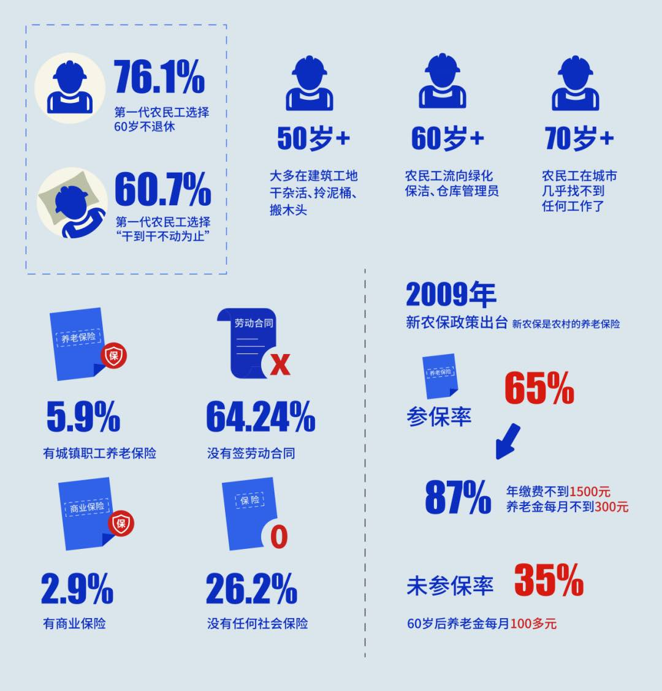
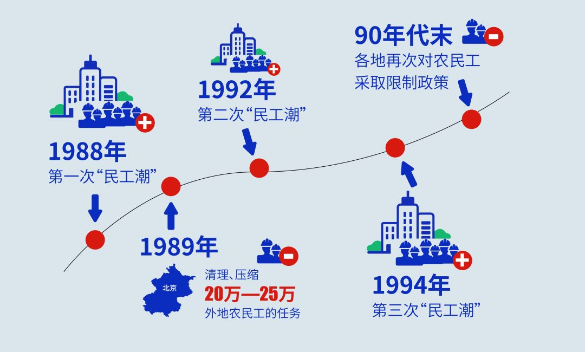
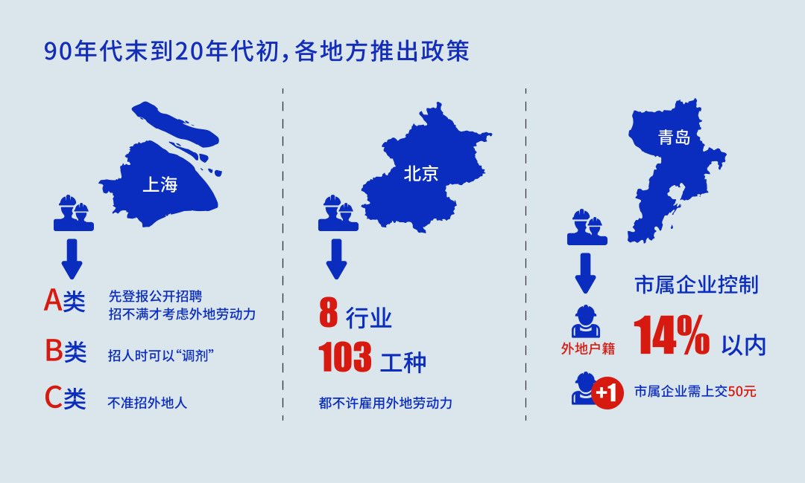
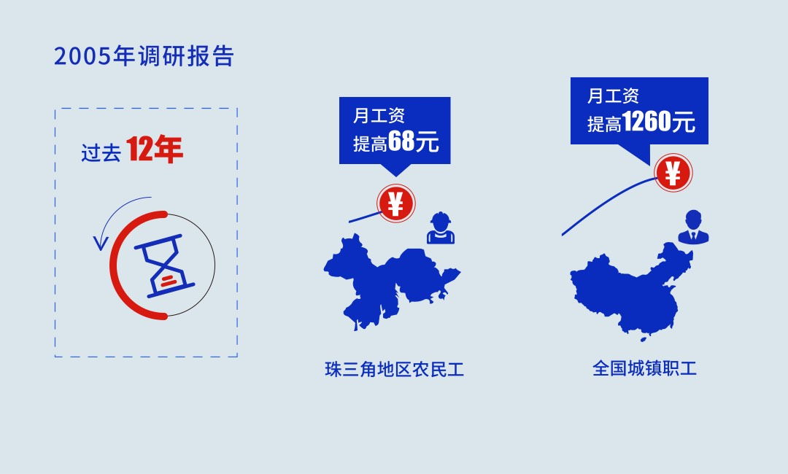
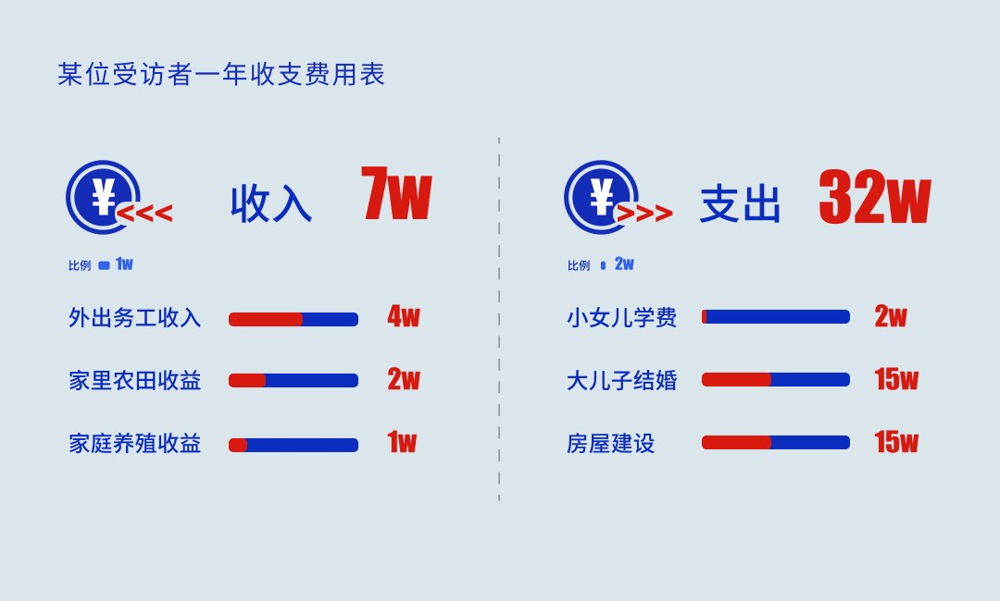
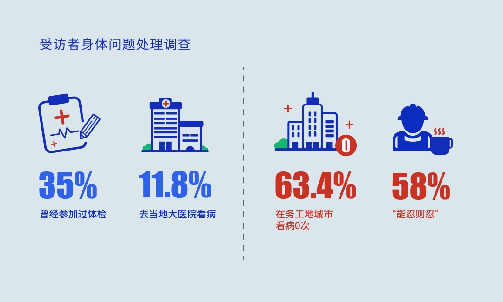
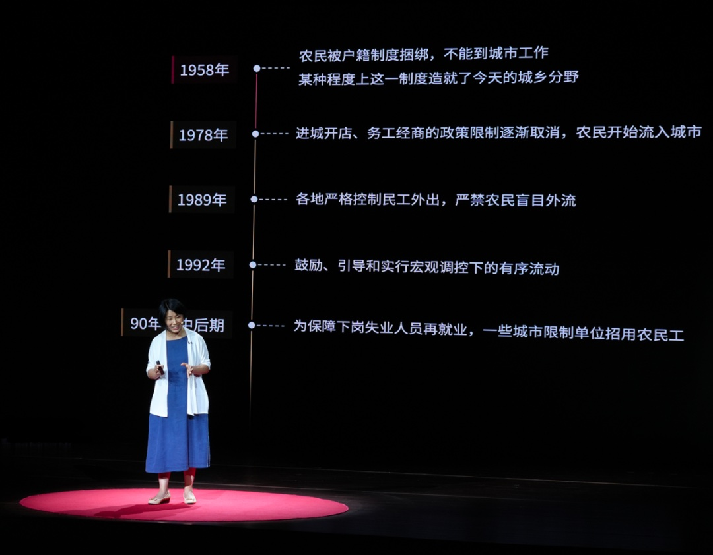

# 洪蔚琳

## 如此打工30年

> 正面连接
> 
> 作者———洪蔚琳
> 编辑—曾鸣 于蒙 顾问——王天挺
> 封面插画——xiang文中插图——曾杏
> 头图插画——Felipe Vargas
> 视觉——pandanap 版式——日月
> 创意—Vicson 运营——川丰
> 出品人/监制——曾鸣

个人奋斗有用吗？在发了2500份问卷、访谈了200人之后，调研最终显示，努力并不能真正改变他们的处
境，决定命运的主要是社会因素。

我家小区的保洁老赵，来北京打工了23年，60岁时却没法退休。他未来的养老金每月只有100多元，因此
打算打工到70岁为止。

他这代农民工，也是我国“第一代农民工”，生于70年代前，在八九十年代进城打工，不少人务工超过
30年。但这8600万余人到晚年，情况和老赵大致相同。

老赵是河南驻马店人，2000年来到北京，那年他32岁，看过门，做过绿化，2007年来到我们小区做保安。
如此又过了10年，49岁了，还没攒够钱结婚，一个人住在冬天没暖气、夏天潮湿发霉的10平米地下室。

我知道这些，是因为我当时在报社实习，需要出一篇农民工的稿子，而老赵是离我最近的农民工。

“我7年没有休假，一天工作10小时，一个月2700。这不是我一个人的情况，大家都是这样的。”临走他
叮嘱，“这几句话你千万不能删”。

不止这几句，关于老赵的整个部分都被删掉了，原因是“负能量”。老赵不符合我们对于农民工生活的
美好愿景，但这个人群的实际处境，比我们能想到的还要更糟。

安徽师范大学的副教授仇凤仙做了一项研究。她发了2500份问卷，访谈了200人，想知道第一代农民工老
去后如何维生。我在报告的字里行间看到了无数老赵——

当我们热议“延迟退休”，担心60岁不能休息，他们中60.7%只能“干到干不动为止”；

当城市老人每月平均能领到3000元退休金，他们的养老金只有一两百元；

他们都打工超过15年，但到了晚年，一半以上的存款还不到5万元；

他们挣到钱都寄回家里，供孩子上学，但结果，下一代阶层跨越不到20%。

我们更容易忽视的一点是，他们既是工人，也是老人。他们在本该退休的年纪不得不继续努力工作，但
结果是，他们既得不到老年生活所承诺他们的，譬如天伦之乐和医疗保障，也得不到工人应有的回报和
尊严。

1993到2005，全国城镇职工的月工资提高了1260元，而农民工的增长幅度是：68元。

他们并非不努力，但调研最终显示，努力并不能真正改变命运。仇凤仙最后用“社会脆弱性”来描述他
们的处境，即这是一个时代性问题，深受社会排斥性政策的影响，远非个人能决定。

他们的困境，和今天很多人面临的困境惊人地相似，这或许是一个社会中，弱者们常见的命运。

### “退休”不存在

现实中的老赵，已经整整两年没有领到过一分钱工资了。4年后，小区取消了保安岗位，于是他就转去做
保洁，不料又过3个月，保洁岗位也不给发钱了。

老赵仍然在坚持给小区做保洁，他每天早6点来清理两个垃圾桶，7点垃圾站开门时“永远第一个到”，然
后回去清扫6栋楼。为了挣出饭钱，收垃圾时他自己分类去卖废品，每月能卖出600多元。

“你可以不做，但以前的钱他都不给你咋整呢？”他说要耗到拿回工资。

他不是没考虑过劳动仲裁，那是在他没领到工资的第21个月，但他不知道仲裁需要合同，而这份14年的工
作从来都没有劳动合同。

因此，这份工作的状态，处在一个薛定谔猫的状态，如果最后他能领到工资，它就是，如果领不到，那
就不是。但在老赵眼里，这个“工作”仍然“来之不易”，因为他已经55岁了，在劳务市场，这个年龄只
能去做更不稳定的日结工。由于“清退令”的出台，他即将连去工地搬砖也失去资格——政策严禁60岁以
上的农民工再进入工地。

老赵不是孤例，站在60岁前后这个坎上，好多农民工为了能有份工作，想尽了办法。

为了在上海工地上找一份工作，一位64岁的农民工办了张假身份证，把年龄改小7岁，结果刚上工两天，
就在检查时被抓获。他被罚500元，拘留了1天。

也是在上海，一位49岁的保洁员想跳槽，但总因年龄被拒。她也花300元办假证，把年龄改小11岁，最后
被行政拘留5天。

即便工作难找，即便冒风险，第一代农民工大都不打算退休。接受调研的农民工里，76.1%决定60岁以后
继续在城市里打工。

他们并不具备退休享福的条件。城市里的老人有养老金保底，平均每月3000元，在第一代农民工群体里，
这个数字不到300元。即便如此微薄，也只有65%的人可以领到。

他们中的大部分人，在年轻时顾不上考虑晚年，只能把工资用在当下。2009年养老金政策出台，35%的人
不相信或不理解这项政策如何与自己的未来有关，于是没有参保。他们60岁后只能领基础养老金，每月仅
100多元。

参保的人也很少能搞明白养老金是“多缴多得”的。一位45岁工人已缴了11年养老金，但其实一直按低档
缴费，60岁后每月只能领195元。他在得知这个数字后问，这有什么用？第二句：我交了这么多年，为什
么一个月就拿这点钱？

为了领到较高的养老金（每月600-700元），一位女工需要在60岁时一次性补齐此前15年的保险费，共8万
元。她凑不出这笔钱。她每月只挣几千元。“都让我交养老保险，我吃什么呢？”她决定放弃，继续做
环卫工人。

这些农民工也没有什么存款。接受调研的的人里，接近一半（41.22%）打工超过20年，但是超过一半（
55.2%）存款不到5万元。

他们只能继续工作。但市场和政策限制，却让他们随年龄增长，越来越挣不到钱。

50来岁的农民工还可以在建筑工地上找到日薪300元的活儿。虽然“一天不能坐”，有人喊一声让拎泥桶、
搬木头，就要立刻去帮忙，很多人还会自愿加班多挣些钱。一位山东56岁的工人最多一天干14小时，有时
加班一整夜，第二天白天还能继续干。

当年纪超过60岁，他们连挣这份辛苦钱也失去资格。近两年，各地出台“清退令”，严禁60岁以上的农民
工再进入建筑工地。他们只能转去做绿化、保洁、仓库管理员，薪水不到工地上的1/3。

再超过70岁，他们在城市几无生路了。一位农民工71岁被迫回乡，在村里帮忙盖房子，工钱一天100元。
75岁时，一家劳务中介下乡招保洁员，工资一天110元。虽然只多10元，他还是去了，69岁的老伴刚做完胆
结石手术3个月，好在也能干活，两人收入加一起就有200多元。

从此他带着老伴，每天早6点坐1小时车进城，到一处工地上倒垃圾、扫地，下午4点再坐车回乡，一周干7天。
他说：“能动是福气，不能动就可怜了。”

### 工作、收入被时代限定 努力也存不下钱

第一代农民工大多在80年中期、90年代初进城打工。他们最能挣钱的青壮年时代，恰好是城市发展最快的
三十年。但时代红利为什么没给他们带来好处？他们打工半辈子，为什么还是没能存下钱？

我们来看看这三四十年间发生了什么：

改革开放后的80年代，第一代农民工开始进城，在1989年创造了第一次“民工潮”。同年，各地开始清退
农民工。

1990年，北京要求清退25万人，所有单位、企业都要每月填表报进度。那时，“民工潮”冲击了城市管理，
同时城市正面临下岗潮，城里人也要再就业。农民工成了城市的“麻烦”。

三四年后，市场经济体制逐渐确立，城市需要大量廉价劳动力，他们又被允许进城了。两三年后，他们
再一次遭清退，因为城市又面临大规模下岗。

但他们不懂政策，不知道自己被“清退”过，只知道有天被开除后就很难再找到活。一位89年开始外出务
工的农民工记得，找不到活，他就在桥洞住了一个月，自己带被子。

90年代末到20年代初，城市对农民工可以参与的工种也有限制——

在上海，全市三类工作中，只有一类“允许考虑”使用外地劳动力，前提是招不满本地人；

在北京，全市8个行业、103个工种，都不许雇用外地劳动力；

在青岛，市属企业每招一个外地人，还要交50块钱；

他们甚至无法像后来的农民工那样进入工厂做流水线（很多工厂也仅限本地户籍），他们能做的都是本
地人不愿干的，建筑业和人力装卸。这些活很多是“黑工”，他们中21%遭遇过欠薪等权益侵害。

涨薪更无从提起。在改革带来红利的12年，1993到2005，珠三角地区的农民工月工资只提高了68元（而全
国城镇职工平均提高了1260元）。考虑到通货膨胀，相当于他们在黄金年龄段，一直被降薪。

第一代农民工的遭遇与城市发展息息相关，但他们总是处在被动之中。城市需要了，就吸纳他们，不需
要了，就清退他们。他们在自己的青壮年时期，始终无法连续、稳定地工作，一直在城乡间来回摇摆。

近20年来，赚钱的机会多了，但他们也老了，竞争不过年轻工人；同时他们还要负担孩子的教育、房子、
婚礼，仅存的一点钱也要掏空了。

### 钱都给了孩子 结果下一代阶层跨越不到20%

也不能说老赵一无所有。他在北京打工23年，存了20万，高于调研中90%的人。但这基于一个特殊原因，
与多数受访者不同，老赵没有子女。

第一代农民工花钱最多的排序，第一名基本都是子女的婚姻和教育。

在北方农村，孩子结婚的开销在30到50万。儿子结婚这一年，一位农民工全年打工收入7万元，支出却高达
32万元。他不得不借钱。

事后他们再还全部的债。因为女方通常要求“婚后不还债”。安徽一对夫妇有3个儿子，为前两个结婚已
耗尽存款，也无钱可借了，只好给三媳妇打欠条，许诺盖房钱。此后夫妻俩一起外出捡破烂，10年没回家，
只源源不断给小儿子汇钱。

他们的孩子会把钱花在自己身上，孙辈会努力成为城市人，但第一代农民工还在坚持为家庭输血。
2009年的一项调研显示，在广东，65%—70%的新生代农民工把收入用于个人消费，但80%—90%的第一代农
民工还在把工资汇回家。

为了能稳定供给家庭，第一代农民工会主动放弃个人发展的机会——比如先投些钱，就可能做个小包工
头——因为他们不敢冒险，怕失败了会倾家荡产。他们也会放弃为自己储蓄。要到60岁，完成对子代的任
务了，才开始为自己攒钱。

他们把希望寄托在下一代身上，想让他们不再重复打工的命运。

但结果，他们的孩子大部分初高中就辍学了，读到大专及以上的不到20%。63.5%的孩子成为了下一代农
民工。进入党政机关、事业单位的仅5.1%，自己创业的仅2.9%。

与第一代农民工对应，他们的孩子或许可以被称为第一代留守儿童。这两代人都没有什么选择，父母为
了生计只能外出务工，孩子也不得不留守农村。访谈中聊到孩子，第一代农民工大都说自己认了命，“
孩子不是读书的料”。

研究显示，由于缺乏父母的引导和情感支持，留守儿童在学业上处于劣势。一项基于3500人的调研显示，
比起同龄人，留守儿童长大后更难适应高强度的异化劳动。在深圳“干一天玩三天”的“三和大神”，
过着一种“三抛”的生活——抛弃家庭，抛弃社会，最后抛弃自己——他们中很多都是第一代农民工的
孩子。

像一种循环，他们的孩子在生子后，也进入了父辈的模式。很多人为孩子上学在县城买房，但自己又只
能在大城市打工，于是孩子成为又一代留守儿童。

一位农民工A曾尝试打破这种循环。他1989年到上海干工地，1991年孩子出生。为避免留守，他让孩子小
学二年级就到上海上学，每年5000元借读费，“抵普通人家三四个小孩”，交完就攒不下一点钱。但在
孩子初二时，他得知外地户籍不能在上海中高考，只好让孩子独自回老家。

最开始，他觉得六七年的上海生活，还是让孩子和老家的同龄人不一样，但这种区别没能维持多久，“
他自己在家没人管，学的好坏我们也不知道”。

他的孩子后来大专毕业，去常州打工，再后来有了自己的孩子，这个家庭的第三代，又被送回安徽农村
留守。

因为那些年交了借读费，A没有存款，没买房，2020年疫情爆发后回到家乡，临走时最后一份工还欠他4万
元不给。他也不懂养老保险要“多缴多得”，将来每月只能领200多元。访谈时他56岁，在芜湖开了一个
小门脸收垃圾。他说，自己打工了30多年，但最后好像和那些一直在村里的人，也没什么差别。

### 不能看病，伤病只能随打工累积

第一代农民工中最年轻的也有50多岁了，他们面临所有老年人共同的看病问题。不同于城市老年人日常出
入医院开药，他们极少看病。

一位芜湖的大厦保洁员为了看病失去了工作。她只请了一天假，等回去干活时，公司就不要她了，说有
人顶上了。

从此她再不敢请病假。她64岁，腿脚不便，每天要负责把6层楼拖两遍，还要做其他区域的保洁。她月工
资1800元。访谈时她正在拖地，每拖一层，都要停下来喘气。但她说没办法，只要不是当时要命的病，
她都会拖到年底回家才去看。

调研中，对于最担心的问题，61.4%的第一代农民工认为是“身体健康”，但——

仅有35%曾参加过体检；

63.4%在务工地城市看病0次；

58%的人都“能忍则忍”，仅有11.8%选择去当地大医院看病。

在第一代农民工外出务工的八九十年代，农村还没有任何医疗保险，看病是“裸奔”状态，多数人不愿
把辛苦挣来的钱用于医疗。

2010年新农合（新型农村合作医疗）基本覆盖全国，但不能异地携带。他们打工时生了病，必须先回户
籍所在地的医院，确认不能诊治，办转诊手续，再回打工地看病才能报销，但还要自己先垫钱。

他们看病要么自费，要么回老家报销，但要承担路费、时间成本、失业的风险。

但当问到对新农合的态度，他们中一半以上选择“满意”，说这很好了，从前看病都不给报销。他们只
跟过去的自己比，却不会横向比，因为他们不知道城市里医疗报销比例有多高。

不论病痛还是看病难，他们都选择忍受。职业伤害给他们造成的腰酸背痛，远比城市老人更严重，但他
们不会像城市老人一样去做按摩、理疗、针灸，只忍着，‍‍贴虎皮膏药。

他们认为去医院没用，因为没法遵医嘱。一位50多岁的女工因长期干活，手腕形成囊肿后不能弯曲，还很
疼。医生建议她回家休息，说这就是干活累的，不能再干了。可是她觉得，不让她干活她就没法活。

问题随时间不断累积，到晚年，他们看上去普遍比实际年龄老十多岁，身体各部位疼痛，一些人还患有
工作环境污染引起的尘肺病、红斑狼疮……相比工作超过10年的人，工作不到5年的人自评“健康”的概
率高44.7%，即打工越久，身体可能越差。

一位农民工年轻时做的是扛包的工作，一个大包100多斤，扛一个挣10块钱，他一天要扛十几个，不时闪
到腰，疼得直掉汗。访谈时他54岁，已直不起腰，胳膊也抬不高了，医院诊断是肌肉劳损。

另一位做了很多年铲水泥的工作，昼夜都接单，天天被水泥呛得咳嗽。50岁，他开始不时感觉喘不上气，
但没去看病也不请假，“自己歇歇就能干了”，几年后越喘越厉害，到医院确诊了肺气肿。

访谈时他57岁，一走路就喘得厉害，走几步就要歇歇，返乡在家，什么都不能干了。“听说这个病哪里也
治不好”，他就不治了，只天天吃消炎药，还是孩子在淘宝上给买的。“实在憋得不行了，我就去医院
吊两天水。”

仇凤仙觉得，对于第一代农民工，城市留给他们最深的痕迹可能就是健康问题，“他们带着一身伤病，
回到乡村，‍‍回到那个原点，但那个原点已经不是当时那个原点了”。

### 个人奋斗有用吗？

一些词语经常被用来形容第一代农民工群体，“小农意识”、穷人思维，似乎他们是被自己的头脑限制
住了，无法过上更好的生活。

他们可能确实缺乏魄力和开拓性，不敢投资、把握不住机会，但这并不是他们生活艰辛的原因，而是结
果。他们没有存款，没有保险，也没有家庭的支持，自然不愿冒险。仇凤仙觉得，是社会排斥造成了他
们没有抗风险能力，却把责任转嫁给农民自身。

在调研之前，仇凤仙曾预设这些农民工的命运，和社会因素、个人因素都有关。经过问卷和访谈，她发
现，这些人的个人情况都差不多。绝大多数人初中都没有读完（83.85%）、没学过技能（67.4%），家里
贫困到没钱支持他们在城里摆摊，也没有人脉。

他们并非不努力。直到60岁退休年龄之后，他们依然谋求打工的机会。工地进不去，他们就去做日结工，
凌晨4点在路边等招工的面包车。但是努力好像是无用的。

仇凤仙最后在报告中，用“社会脆弱性”来描述他们面临的困境，即他们的处境和未来是一个时代性问
题，深受社会政策的排斥性影响，不是个人能决定的。

### 被遗忘的一代人

人们很难真的理解第一代农民工的处境。仇凤仙曾在一篇文章中呼吁，要给农村老人多提供好的工作机
会。一位专家批评她“没有人文情怀”，认为应该让老人休息。仇凤仙觉得，这其实是不了解农村。不
让他们工作，谁来负担他们的生活开支呢？

他们没有意识和能力为自己发声，争取权利。他们没有学历，不会运用媒体，只会忍受。访谈中他们很
少抱怨累，只会说“哪有活不累呢”；身体坏了，他们也觉得正常，“一辈子干活，怎么可能还有好身
体呢”。问他们将来有什么打算，他们说“看世道走”，意思是看这个时代会怎么发展。最后他们默默
回到家乡。

仇凤仙1979年生，父亲、哥哥、妹妹都外出打过工，“我要是出去，我就是第一代农民工。”后来她成
了家里唯一上大学的人。她的妹妹比她小几岁，16岁外出打工，挣钱给她交学费。2003年仇凤仙大学毕业，
去上海一个工地看妹妹和妹夫，工地上没有夫妻房，他们俩和十来个人一起住一个大工棚，只用木板隔
出一个单独的房间。成为学者后，她本能地想关注第一代农民工。

开始调研后，她发现他们很渴望倾诉。只要问了一个人，马上会有一堆人围上来，大家七嘴八舌，她甚
至很难单独跟一个人访谈。他们讲自己找不到工作、没钱回家，要么再加上家人生病，问题几乎都一样。

他们说，这些事没法跟家人讲，没出来的亲人听不懂；也没法跟工友讲，总换地方打工，其实很难有朋
友；他们更不可能跟城里人讲，尽管这些人真正有替他们发声的渠道——一位农民工长年在工地，那其
实是个和城市隔绝的封闭空间，他说一直不清楚城里人在过什么样的生活，最近刷抖音才看见。

他们也确实正在一步步离开我们的视野，从我们虽不熟悉，但尚有概念的工地，渐渐退到我们更不会看
到、想到的地方。

他们也许会退到你的小区，拖楼道的地、擦电梯；也可能退到你工作的大厦旁，平整楼前的草地、浇花
草。但你每天进进出出也不会留意到他们。

你甚至不会像路过工地时一样，好歹能联想起他们共同的身份。他们老去后像是一块石被碾成碎渣，又
被风吹到城市的各个角落，于是你不再能看到石头。

仇凤仙曾悲观地想，“农民工老去后怎么办”可能永远不会进入城市人的头脑。一个人是农村人，老了
就回到农村，似乎是天经地义。只有细究了他们的每一点付出和代价才会想到，他们和城市人一样在城
市工作一生，最后却一无所有，这并不正常。

### 参考资料

- 仇凤仙. 第一代农民工可持续生计研究. 2023
- 包小忠. 刘易斯模型与 “民工荒”[J]. 经济学家, 2005, 4: 55-60.
- 江立华. 论城市农民工的平等竞争权问题[J]. 华中师范大学学报: 人文社会科学版, 2002, 41(4): 10-13.
- 汪建华, 黄斌欢. 留守经历与新工人的工作流动——农民工生产体制如何使自身面临困境[J]. 社会杂志, 2014, 34(5): 88-104.

---

## 仇凤仙：民工暮年

[一席，仇凤仙-民工暮年](https://www.yixi.tv/zhiya/22#/speech/detail?id=1185)

民工暮年

2023.5.27南京

我叫仇凤仙，来自安徽师范大学社会工作与社会学系，我关注的是农村社会学和农村流动人口。

我是从安徽农村走出来的。当我们在北上广深谈农民工，他们往往只是被称作“流动人口”或“外来人
口”；而在安徽谈农民工问题，他们就是我的父亲母亲、兄弟姐妹，或者是熟悉的邻居。

当我从乡村走出来，而今又回到乡村的时候，当年最早外出流动的农民工们已经开始走入暮年。所以从
2015年起，我开始重点关注农民工问题，尤其是第一代农民工的生计问题。

通常在学术意义上，第一代农民工是指在上世纪70年代以前出生，并且在80年代中后期外出务工的农民群
体。这一部分人的特殊之处在于，他们的经历和中国社会改革开放的历程几乎同步，换句话说，他们见
证了我们国家社会改革的历史。

谈到第一代农民工，一个关键词就是户籍制度。1958年，《中华人民共和国户口登记条例》出台（
1958年1月9日全国人民代表大会常务委员会通过），正是这个制度第一次把人口分为城和乡两个管理区域。

在这样的管理体制之下，农民被束缚在土地上，失去了自由流动的权利。而且这个制度的发展应该说是
造成今天城乡分野的重要推动力量。很多社会政策和社会福利体制都依附在户籍之上，也就造成了一系
列流动人口问题。

1978年后，改革开放开始，农村实行“大包干”，也就是土地承包制度。农民从土地上获得了一些释放
和自由，有了些许的流动权利。私营企业发展也使得城市有了用工需求，于是农民就有了一定机会和空
间进入城市。

当我开始系统关注第一代农民工，首先是和我最熟悉的父亲、兄弟姐妹和邻里聊他们的现状和未来。紧
接着我开始在城市里主动寻找第一代农民工，在马路上，在工厂里，在路边的小饭店……只要遇见他们，
我就会上去和他们聊一聊。

在反复聊天的过程中，他们有三句话最典型，实质上反映了身处暮年的第一代农民工在务工历程中的最
大诉求和最大问题：

- **年纪大了，我往哪里去？**
- **一旦生病，我的将来靠谁？**
- **不能打工了，我将来怎么办？**

围绕这三句话，我访谈了200多位农民工，并设计了一套含有70个问题的问卷，发放2500份。在整理质性
资料和数据资料的过程中，第一代农民工的群体形象和生命过程就像在暗房里洗胶片一样慢慢地清晰起
来。

### 城市挤压下的生机之路

第一代农民工的年龄多集中在46到50岁，占比43.2%。访谈对象里年龄最大的农民工72岁，从事护理工作；
还有一位72岁的阿姨在从事小区保洁工作。

(46-50岁：43%；51-55岁：25.7%；56-59岁：10.4%)

他们的务工生命历程非常长，在外务工21年以上的占到了41.2%。

那么第一代农民工当初为什么要出去？像我们的访谈对象周大哥，58岁，家里有6口人，只有5亩田，年年
种田，年年欠债，没有任何其他收入，“不出去，真是穷死了”。

他在外面辛辛苦苦地干了三年之后，学会了瓦工活，工资从每天5元、7元、12元涨到了每天30元，比在家
里面种地强太多了。1995年农村人口的收入是每月200块钱左右，在外务工的他有约500块钱的收入。

在巨大的经济对比之下，农民工开始大量向外流动，进入城市寻求生计机会，这就形成了1988年的民工
潮，百万移民下珠江。

大量人口涌入城市，带来了城市的管理压力和秩序问题。所以1989年国务院会同民政部、公安部，出台
了各项严格限制农民工进城流动的相关政策，严禁农民盲目流动。（相关政策：《关于严格控制农民工
外出的紧急通知》和《关于做好进一步控制民工盲目外流的通知》）

因此，外出获得生计支持的门又慢慢地关上，农民收入直线下降。当时的农民工刚刚在外面有了改善自
身生活、提升家庭生活质量的希望，又开始变得渺茫。

到了1992年，农民的收入已经很低，增速也非常低，国家为了提升农民收入，又开始把进入城市的门慢
慢地打开了一点，“鼓励、引导和实行宏观调控下的有序流动“。

农民对生计需求强烈，只要有一丝的光线，有一丝的缝隙，他们就会向外走。这就造成了1993年、
1994年连续的农村人口外出流动大潮。

到90年代中期，城市经济体制改革全面铺开，股份制改革带来了大量下岗。为保障下岗和失业工人的再就
业，从国家到城市层面又开始关上农民工流入城市的途径，很多地方政府通过了招工只招本市户籍的政
策，令农民工在城市里面几乎无立足之地，他们只能停留在城市最边缘的市场中最低的工作岗位。

在我的调研过程中，农民工的职业分布也明显体现了这点，大家可以看到他们大部分集中在建筑工地，
有些建筑工地上有90%都是第一代农民工。还有的做餐厅服务员、保安、个体户，在工厂里做技术工人的
农民工占到18.9%。

（自雇佣、个体户：15.4%；建筑工地工人：43.4%；餐厅服务员：10.5%；工厂技术工人：18.9%；保安
保洁人员：6.5%）

在城市的挤压之下，农民工进入城市的道路和生计机会非常坎坷。

我在合肥人才市场遇到了62岁的李大哥，他已经超过退休年龄了。当时他一脸愁苦和落寞。因为他年龄大
了，很多企业都不要他，他挤不上去，就在那里呆呆地看着别人。

我问他，现在的工作怎么样，难不难找？他一肚子的苦水，尤其说了一句话让我印象很深，“人老了不
值钱”。

> 现在找工作和年轻时候找工作一样难！我们那个时候出去打工，那不是你说出去就能出去的，你找不到门路，
> 没有人带出去，那你也不敢出去。在城里面找不到活，也没有住的地方，那只能在人家屋檐下，桥洞里面住，
> 自己带被子，有被子盖能将就一下，但熬不了多长时间。找不到活还得贴钱，跑一圈再回来。
> 
> ——李大哥，62岁

没有工作机会，他们不得不游离于城市和农村之间，像一块橡皮泥一样不停地被城市挤压。他们的生计
机会断断续续，一旦城市有风吹草动，农民工就马上回家。城市感冒，农民工先吃药。

### 在务工地生病，能忍则忍

在30年的流动过程中，城市给他们的除了一身伤病之外，可能没有更多的记忆。

在学术界关注农民工的健康问题之前，媒体就开始关注了。2009年，《南方周末》深度报道了万州矽肺
工人的维权之路，他们在维权的路上逐一死去。这篇文章到现在我一直在反复地看。同年，河南农民工
张海超开胸验肺。这些报道都激起了社会对农民工健康问题的极大关注，也冲破了很多人的认知底线。

大部分第一代农民工从事高强度、高风险、高污染、低收入的“三高一低”工作，他们的健康问题虽然
不具有尘肺病人的典型性，但是更具有日常生活的普遍性。

从他们的个体生命历程能够看到“弱势累积”的形成过程。像何大哥今年才55岁，当我看到他的时候，他
头发花白、腰半弓着，在家里的小菜地里面，拿着铁耙子在耙拉着地，因为他已经几乎失去了劳动能力，
不能干太多体力活。

> 我是90年代初到广东打工的，在路边扛大包，帮人卸货扛到公司去，一个大包有100多斤，扛一个给10块钱。
> 有次我没准备好，车上人就把大包递给我，我的腰当时就闪了，疼得汗珠都下来了，还是咬牙把大包扛到仓库去了。
> 那个时候哪里有钱去医院看啊，就是抹点药。从那以后腰就使不上劲了。年龄越大，疼得就越厉害，
> 你看我现在腰都直不起来，走路总弓着腰，就是那个时候给压坏的。现在胳膊也疼，不能抬太高，
> 去医院看过一次，说是肌肉劳损，都是干活干的啊。
> 
> ——何大哥，55岁

扛一个100多斤的大包只给10块钱。为了多挣钱他要尽可能多地扛大包，在工作中扭伤了腰，没有及时治
疗。由于一直从事高损耗性的重体力工作，他的胳膊长期疼痛，不能抬太高或提重物。

他去医院看，医生给开的“良方”就是休息，不要干活。但是作为农民工，他有休息的权利吗？没有，
只能继续强撑病体干活。

另一位张大哥57岁，他从事的是和尘肺病高度相关的水泥搅拌和搬运工作。

> 我是96年跟着人去上海浦东干活，一天就10元钱，干的活又重，一个月能挣300元钱就是好的。
> 家里处处都要钱，钱不够花啊。年轻时候仗着身体好，拼命加班，白天活结束后，晚上有活就干，
> 比白天挣钱多些。天天挥着铲子，胳膊都肿了；天天被水泥呛着，咳嗽，也没管。现在就落下这个肺气肿毛病，
> 喘得厉害，右胳膊也不能提重东西。现在我什么也不能干了，一走路就喘得厉害，走几步就要歇歇。
> 
> ——张大哥，57岁

用他的话说，年轻的时候仗着自己身体好，只要有挣钱的机会绝不放过，白天活干完了，晚上有活继续
干。因为晚上算加班，给的钱可能多个三五块，那已经是很好的机会了。

年轻时这样拼命，年老后给他留下的是哮喘。我遇见他的时候，他弯着腰，走两步就停下来喘。虽然他
还达不到尘肺病的职业病认定标准，但也几乎失去了继续劳动的能力。

我的问卷里有一个问题，你有没有体检过？有64.8%的第一代农民工回答“从来没有参加过任何体检”。
我再问，你生病后在务工地看过几次病？63.4%的农民工从来没有在务工所在地看过一次病，没有获得及
时而有效的医疗待遇。

没有去看病，那你怎么处理的？最多的就是“能忍则忍，自己买药处理”，占到了58.5%，比如腰受伤了，
自己去买膏药贴一贴，躺一躺。去正规大医院看病的仅占11.9%，还有一部分选择回家看病。

(在务工地生病怎么办？能忍则忍，自己买药处理：58.5%；到街头小诊所看16.2%；立即去正规大医院检
查11.9%；返回农村老家看病13.5%)

### 为什么得不到有效的医疗服务

我们可以看到，第一代农民工的健康问题，一方面固然是由于他们“三高一低”的工作性质造成的慢性
的弱势累积，但是还有一个重要的问题，就是医疗服务的不可及性。

为什么会这样呢？杜大哥说出了一个缘由，我听他说这些话时特别心酸：

> 我们基本上有点伤痛都不回家，回家麻烦、耽误挣钱，来回坐车远还要花钱。就在工地那边的乡村医院，
> 小诊所，镇上的，没有去过县级医院。不敢去外面的大医院看。那大医院一进去就心慌，俺不是怕什么大病，
> 就是不知道要花多少钱，我就怕自己挣的这一点钱都要扔在医院里面。
> 
> ——杜大哥，55岁

而项大姐让我们看到了第一代农民工另外一个辛酸之处，她就请了一天假去看病，等她回来的时候，有
人顶上来，人家不要她了。他们敢请假去看几天病吗？回来很可能就没有工作了。

> 有的病不是当时要命的，我也不看，我一直拖到年底回家才看，中间要回家看病不仅要来回车费还耽误干活，
> 俺们农村人耽误不起。一般情况下不敢请病假，有回请了一天假去看病，等我回去干活的时候，人家就不要我了。
> 说是，有人顶上来了，唉……
> 
> ——项大姐，64岁

我们再说说和钱相关的，就是新型农村合作医疗保险政策。新农合是属地化报销和管理，这是跟户籍制
度挂钩的；而农民工具有很高的流动性，不可能在一个地方务工，所以这样一种高流动性和属地化、固
定化的管理，就产生了高度的相悖。

周大哥正是因为不敢到上海的大医院去看病，在小诊所里受到不正规的治疗，耽误了病情，等到很严重
的时候才赶到大医院。医生检查之后告诉他，你得了红斑狼疮，赶紧回家把家里东西拆伙拆伙，能卖的
东西先卖一部分，在家里治病，在这里你看不起。

> 我得这个病已经有10来年了，现在肾脏也不太好，我每个月都要去医院治疗一次。只能在省内治，
> 省内报销率约为50%。要是去大城市看病，只能报销20% – 30%的费用，那看不起啊。
> 费用还都靠孩子们凑钱了，要不只能等死了。
> 
> ——周大哥，64岁

从安徽省宿州市新农合政策报销的政策规定里面，大家可以看到两个关键数据，一是住院的起付线，从
乡镇、县、市，到省和省外的起付线标准是呈上升趋势的。另一个数据是报销比例，你越向外走，报销
的比例越低。

在乡镇看病，报销比例可以达到95%，到了省外，报销比例降低到50%左右。而且很多药品和医疗服务不在
医保范围之内，所以实际的报销比例更低，可能在30%左右。

所以，属地化报销原则最大程度上限制了第一代农民工在外流动过程中及时获得所需的医疗服务。

### 没有退休养老，干到干不动为止

第一代农民工的健康问题到老年以后会放大。本来人的身体机能就在向下走，再加上长期的弱势累积，
他们年老后往何处去？

关于养老问题，我们每个人都说我60岁以后就可以退休了，而对于大部分第一代农民工而言，他们没有这
样的能力，也没有明确的预期。他们的概念里没有“退休”这样一个词汇。

张大姐说，我们哪有什么退休，你是农村人，你就是干活的命。

> 其实退休都是城里人的叫法，像他们60岁就可以拿养老金退休金呀，我们又没有买过什么五险一金。
> 60岁对于我们而言意义其实也不是特别大。上了60岁身体肯定是差点儿了，但是也还是干得起一些体力活儿的。
> 
> ——张大姐，64岁

所以我们的问卷里还有一个问题，你打算什么时候停止工作？选择“干到干不动为止”的占到了60.7%。
我们提供的备选年龄段其实是很高的，大家没有选择66到70岁，而是选择干到干不动为止。还有76.1%的
农民工说60岁不回家休息。

(什么时候停止工作？55-60岁：13.8%；61-65岁：16.6%；66-70岁：8.1%；干到干不动为止：60.7%)

看到这样的结果我很心酸，他们要一直像精卫鸟一样去衔石、去挣钱。

关于养老规划，他们存了多少钱？本来我以为他们在外务工20多年的历程中总能攒一些钱，虽然我知道他
们存钱不多，但是当数据出来的时候，我还是非常诧异。15.2%的第一代农民工没有存过一分钱，存不下
来钱；存款在5万元以下的占55.2%。

他们打工那么多年，钱到哪里去了？都用在家庭的发展，儿女的结婚、教育，还有买房子上了。用陈大
姐的话说，什么都没有这个事大，自己身体的疼就先忍着吧，反正也没什么大病，真有大病也治不好。

> 我有两个儿子，一个儿子结婚了，差不多把家里的钱全部掏空喽，要盖个新房子，新娘家还要十万元彩礼。
> 小儿子也28了，还没有对象，再找不到，就怕要打一辈子光棍了。我们在外面拼命挣钱，准备买房子，
> 给他找对象结婚啊，他一天不结婚，我们就一天没有好日子过。什么事情都没有这个事情大，多攒点钱，
> 就能早给他买个房子找对象结婚。自己身体这个疼那个疼的，就先扛着呗。反正也没有什么大病，
> 真有大病了也看不好，那就等死了。
> 
> ——陈大姐，56岁

所以我们的第一代农民工在面临家庭发展和自身健康诉求的时候，他们一步一步地向后退，至于退到哪
里，真的看不到边。

第一代农民工在外务工的所有资产几乎在孩子的结婚、买房、教育上全部清零。他们真正为自己打工，
基本都在55岁以后。

很多人会问，农村不是还有新型农村社会养老保险吗？那么我们来看一下新农保能不能为他们晚年提供
足够的身体保障。

从数据中可以看到，参加新农保的有65%，没有参加新农保的有26.2%，参加职工养老保险和自己购买商
业保险的，加起来比例不到10%。

（参加哪种养老保险？新农保：65.0%；城镇职工养老保险：5.9%；自己购买商业保险：2.9%；没有参加
任何：26.2%）

在参加新农保的农民工当中，缴费比例在每年100到350元这个档次的占69.4%。缴满15年可以领取养老金，
那我们就可以算一算他们60岁以后能领多少钱。

我的访谈对象周大哥从2012年开始缴新农保，还有4年就缴满15年了，我给他算了一笔账，算完之后他傻
眼了——他现在账户里面有2600元，按照养老金的计发办法，60岁退休之后他每月只能拿到40块钱的养老
金。加上国家普惠性的基础养老金140到150块钱，他最后拿到手的可能是190块钱。

这190块钱够他们生存吗？我觉得要打一个大大的问号。

所以建筑工地对60岁农民工的“清退令”是致命的，把第一代农民工几乎唯一可能的生计又堵上了。

他们为什么非要到建筑工地去？因为即使是60岁左右的第一代农民工，在建筑工地每天基本可以拿到
300元左右的工资。如果这一扇门给关了，他们到社区去做保洁或服务员的日工资是60到80块钱。

对于第一代农民工来说，快速地存钱、存更多钱是他们迫切的需求，但是现在这样的机会又在慢慢地稀
缺。

但和我们认知不一样的是，第一代农民工在务工历程中经历了这么多困苦，他们大部分对时代还心怀感
恩。他们并没有过多渲染自己的困难，而是感谢这个时代给了他们外出务工的机会，让他们有工作、有
收入，让他们更有安全感。

做农民工研究的这些年，我经常面对面地倾听他们的故事，而且我自己的父母和兄弟姐妹也是第一代农
民工，所以我常常会动容，在组织材料或写文章的时候其实很难保持学术上的价值中立。

作为第一代农民工的兄弟姐妹和子女，我要感谢我们家祖坟上冒了一股青烟，因为我考上了大学。如果
没有考上大学，我现在百分之百是千千万万第一代农民工中的一员。所以对于第一代农民工的关注和共
情，应该是另外一个自我的本性使然。

非常感谢接受访谈的诸多第一代农民工毫无保留地分享他们的生命历程和迷思。也感谢在此研究中给与
帮助和支持的同学们和来自社会的包容与关心。

谢谢大家。
