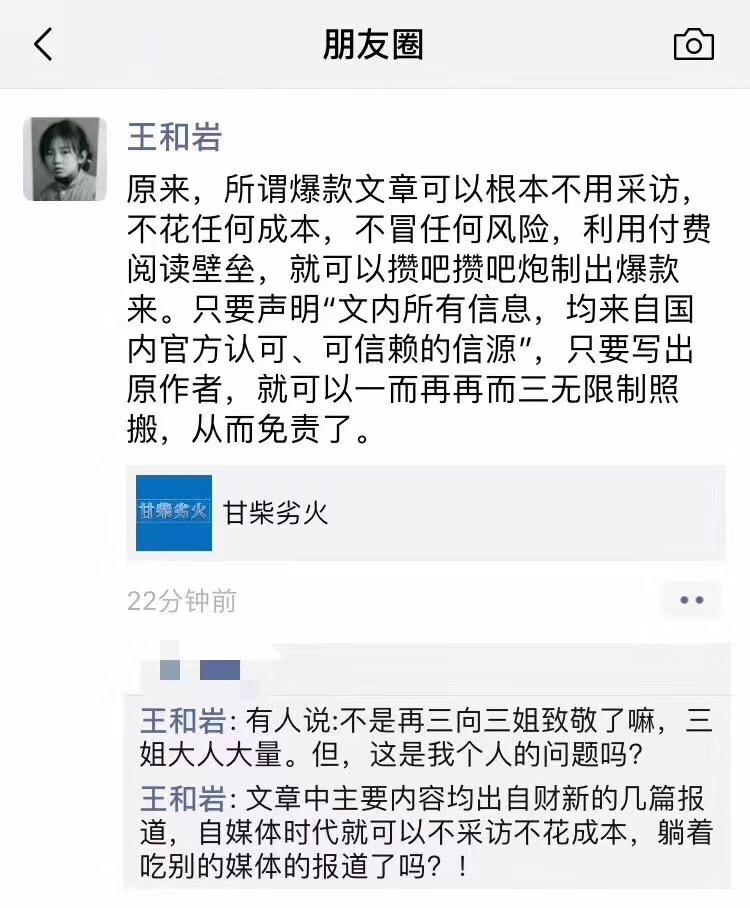

[[toc]]

# 黄志杰（呦呦鹿鸣的鹿鸣君）

## 甘柴劣火

呦呦鹿鸣的鹿鸣君呦呦鹿鸣2019年1月11日

本文所有信息，均来自国内官方认可、可信赖的信源，敬请诸君知悉。

### 1

既然已经看到了这里或那里冒出来的烟，他就决心找到火。  
——福克（检察官、美国“镀金时代”）

2016年1月7日15时40分许，甘肃武威市浙江大厦进行消防演练，不料，点火后处置不当，弄假成真，演习变
成火灾。

20分钟后，驻武威的《兰州晨报》新闻调查部记者张永生，从火灾现场1.1公里之外家里出发。

纵然浓烟滚滚，火势凶猛，也不会有人想到：这场小小的火灾引发的“震荡波”，将震动全国，持续经
年。42岁的张永生，成为新的导火索。

首先是报社领导惊诧莫名：张永生在采访途中失联了。次日夜晚，家属接到通知：到刑警队来，把车开
走。1月9日下午，警方通知：张永生涉嫌嫖娼，行政拘留5天。

事情的发展，越发蹊跷：《兰州晚报》和《西部商报》驻武威的两名记者，也失联了。

《拘留通知书》细节描述详细：1月7日17时许，刑侦一大队民警在执勤巡逻时，于“西津洗浴广场”307房
查获实施卖淫嫖娼的违法行为人张永生。

这个时间点，距离火灾发生1个半小时。

张永生是在哪里被抓的？张永生对辩护律师说：自己是在西关大街上被抓的；警方通报说：张永生在洗
浴城涉嫌嫖娼被抓；武威宣传部门向省里汇报说：张永生是警方在办案过程中发现违法线索被抓的，主
要违法事实是借舆论监督之名敲诈勒索。

1月14日，家属去拘留所接人，得到新的通知：张永生涉嫌敲诈勒索，刑事拘留。

虽然名目从嫖娼变更为敲诈勒索，但是，这一切都合乎规程。1月18日，武威市公安局公开通报：《兰州
晨报》张永生、《兰州晚报》记者雒某某、《西部商报》记者张某某涉嫌敲诈勒索罪，刑事拘留。

1月25日，张永生被凉州区检察院批捕。这一天早上，刑警递交了一份张永生亲笔书写的更换律师申请给
张的妻子，但张妻注意到：申请书中一关键位置上藏了一个字样——“VX”。**这是一个只有最亲近的人
才能读懂的暗示**：“我是违心的”。因为，在此之前，张永生也曾在一份非常重要的笔录上留下了同样
暗示。

虽然程序不允许，但办案民警主动安排了张妻到看守所会见丈夫。

铁窗之内，夫妻相见。

张永生：不要在媒体、微博、微信再发一个字的新闻，他们整人的办法多得很，我快受不了了。
妻子：律师合同已经签了，也交了钱，再说家里也没钱了，现在你要换律师，我怎么办？
张永生：不换就不换了吧。

妻子走出会见室，随行办案民警并没有一同出来，她只听到呵责声。随后，一名民警追出来：“你回来，
他的话还没有说完呢。”

妻子返回会见室，只见丈夫垂头坐在一旁：“律师换了就换了吧。”

1月27日晚间，凉州网（甘肃武威凉州区政府官方网站）发布消息：张永生被执行逮捕，《兰州晚报》记
者雒某某、《西部商报》记者张某某取保候审。

三人之中，张永生仍未得自由。此时，已经是腊月十八，大年夜越来越近了。

次日深夜，忍无可忍的《兰州晨报》决定维护记者的尊严，拿起自己的最重要的武器——文章，深夜发
出《致武威市凉州区委政法委的一封公开信》。此时，距离事件发生已经过去了20天，他们肯定已经用尽
了体制内所有渠道。《公开信》绝对是下下策，这意味着一家在省内政治地位一般的都市类报纸与武威
一个强力机构撕破脸，让一直在幕后报道新闻的新闻机构成为了新闻主角：

在火灾发生的1月7日早上，张永生在和同事曹勇聊天记录中，不止一次感叹：自己被“武威公安盯上了”、
“**恨不得把我赶出武威**”。

张永生曾接到凉州区公安局主要负责人要求不要刊发稿件的电话，遭到拒绝之后，该负责人说：**小伙子，
你是武威人，你这样做，你等着**。曾经威胁过张永生的，有市、区、乡（镇）三级领导干部，远不止
一个单位，一个干部。

报社认为，张永生遭遇了“钓鱼执法”，“建议”凉州区公安局应当主动回避，并公布案情。报社《公
开信》一出，网友大哗。

“钓鱼执法”（entrapment）是一个来自英美法系的专门概念，又译为执法圈套。它之所以广泛进入各
国法律，特别是欧美法律，是因为各国行政人员已将其运用得炉火纯青。

有好事者去现场探访，发现，张永生被抓几天后，西津洗浴广场也被关闭了。他们的老板大概不会想到，
远处浙江大厦的一场演习，竟扣下了让自己关门的扳机。

### 2

文章的主题是揭露无耻行为……那就意味着这样一个信念：有一种自尊需要触动，有一种耻辱需要清除。  
——斯蒂芬斯

兔死狐悲。张永生飘摇的命运，触发了同行的回忆。

湖北《长江商报》记者熊子熙说，2015年初，新华社报道荣华工贸向腾格里沙漠排污后，他跟着新华社
的报道线索前往武威，被限制人身自由6小时，被迫删除所有手机、相机资料，宣传部长现场撕掉采访笔
录，并勒令警察：“把这人送上高速，武威不欢迎他。”

一些网友找到了柴静《看见》一书中的段落：作者以央视记者身份去武威时，“我们刚坐下，大门咣一
响，来了五六个当地大汉，不说是谁，要赶我们走。”

武威，营造出针插不进、水泼不进的感觉。

新闻界忧心忡忡，一家报社的评论员发出哀鸣：“记者如果正常履职都要被追究的话，这个行业就**彻底
完蛋了**。”

舆论不断发酵，终于惊动了省里。2月5日的新闻媒体新春座谈会上，甘肃省委书记王三运不点名批评了“
武威抓捕三名记者”，要求全省各级党委和政府要真正敬重新闻监督。王三运说，在解决突出问题的过
程中，媒体监督发挥着重要的督促和推进作用，一些所谓的“负面报道”恰恰是在帮助改进工作、是正
能量，有利于鞭策审视自己，纠正错误。

省委书记这番话，通过《中国青年报》报道出来后，“新闻工作者”们终于松了一口气。第二天，2月6日，
甘肃省检察院发布通报：证据不足，撤销对张永生（因嫖娼）行政拘留出发决定，启动国家行政赔偿程
序，对执法过错责任人员停止执行职务，追究执法过错责任。但，检方同时认为：自2009年起，**七年以
来，张永生敲诈勒索人民币5000元**，“犯罪事实清楚”。

可以总结为：抓错了，查对了，5000块。

张永生在这一天获取保候审，得以在除夕夜与家人团圆，并一起度过他2月10日的生日。他还获得了
1098元国家赔偿。

一个消息说，所谓5000元，是历年相关单位逢年过节的礼品折算。

经历过里面那一切的人会知道，外面平淡无奇的，甚至带有灰霾污染的空气，是多么新鲜；经历过里面
那一切的人会知道，可以选择任何时间上厕所、洗澡，选择用任何一种姿势睡觉，是多么奢侈的幸福，
远胜任何酒店的总统套房。

恍如隔世。却只是被羁押一个月而已。

很快就来到是年3月的“两会”，甘肃代表团开放日，在一个多小时的提问环节中，多名记者多次大声呼
喊能否回应“武威抓记者事件”，但并未得到话筒。在见面会快结束时，《新京报》记者涂重航大声喊
道：“王书记，我想问下甘肃记者被抓您怎么看？您怎么看待舆论的监督？”但是，省委书记王三运没
有正面回应，听到主持人说“时间到了”，如释重负，快步离开了会场。在记者高声提问时，周围媒体
席骚动起来，很多记者过来给他拍照、录音，但代表团也没有对此作出反应。就此，网络媒体发布了一
条现场消息：《甘肃团开放日记者三问武威抓记者事件未获回应》。

这种打破常规的提问操作并不意外。相比于其他文化人群体，记者们多了一些“江湖气息”，概因他们
作为国家游走的监督力量，长年行走在危险境地，挖掘事实多于写作描写，没有朋友守望相助，甚至两
肋插刀，很难坚持下来。在某种惺惺相惜之下，一个地级市的领导，可以让一个人闭嘴，但不能让所有
人都闭上嘴。何况，这是在北京。

网友感叹：如坐针毡王三运，咄咄逼人涂重航。

情义总在人间。

王书记的表现，与那次两会的整体气氛，颇为不符。当年两会开幕之初，中纪委刊发文章，直接引用了
最高领导人讲话：“一些领导干部因违纪违法受到处罚，几乎都谈到班子内部监督不够，说没人提醒我，
**如果当年有人咬咬耳朵，也不至于犯这么大的罪**。小问题没人提醒，大问题无人批评，以致酿成大错，
正所谓‘**千人之诺诺，不如一士之谔谔**’啊！”

与之相应，政协新闻发言人王国庆明确表示：“越是敏感问题，越要想办法说清楚。”“记者提问不是
‘挑衅’而是挑战。”

随后，山西省委书记王儒林自揭家丑，黑龙江省省长陆昊回应天价鱼事件，辽宁省委书记李希回应前任
王珉被处理一事，海南省委书记罗保铭回应海南宰客现象。这些表现，赢得了会场内外的好评。

但是，王三运，一个主政一方的大员，在全国注意力最为集中的时节，坐在媒体开放日最重要位置上接
受提问，对于辖区最热点的事件，竟似毫无准备。

说他缺乏政治嗅觉，恐怕是低估了一个高级领导干部的感知力、判断力。他的异常表现，需要结合一年
后发生的事情才能看得更清楚。

### 3

千人之诺诺，不如一士之谔谔。  
——司马迁《史记》

严格来说，王三运只是被卷入了“抓记者事件”。张永生并未得罪王三运，他得罪的是火荣贵，时任武
威市委书记。

火书记的脾气，比他的姓还要火爆，对下属动辄拳打脚踢。财新网记者王和岩，江湖人称“三姐”，后
来报道了一些细节：

一次，火荣贵和几名下属乘电梯，电梯门开后，有位市委秘书长想先出去用手拦着电梯门，火荣贵以为
他竟敢先走，抬腿就是一脚，将秘书长踹飞在地，“顿时满嘴血，两颗门牙都被磕掉了”。

一次，火荣贵出席武威市凉州区的某项目开工仪式，火荣贵铲土奠基中，铁锹突然从把上脱落，火荣贵
顿时火冒三丈，立刻“手持铁锹把追打起区干部”。

一次，他嫌某副市长工作没有搞好，挥拳就打。

这种风格，倒是符合武威二字的字面意思，却与汉代那种发自根底的自信相差万里，更不用说现代文明
的规则了。骄于下而媚于上，在”李莲英式”风气的裹挟下，当时，**在火书记治下的武威，**即使正直
的人也很难独善其身，因为坚持自我几乎毫无出路。

火荣贵由甘肃省政府副秘书长、办公厅主任任上调任武威后，对张永生这样经常做监督报道“坚持自我”
的记者非常恼火，责令宣传部摆平。宣传部先是告诫张永生不要写，张永生不听，随后，又对《兰州晨
报》提出调走张永生，报社不听。2015年，武威新闻出版局说这个记者站是非法机构，要查封。张永生
拿出文件与之争辩，一年后，《兰州晨报》记者站并入《甘肃日报》记者站，以此续命。

2018年7月13日，甘肃廉政网发布消息，火荣贵涉嫌严重违纪违法，目前正接受调查。次日，关于当年抓
捕张永生的细节，才通过王和岩的报道得以披露于世：

针对张永生的《举报信》及抓捕行动，完全是武威宣传部门、警方**自编自导自演**。武威市凉州区宣传
部一个干部写了举报信，交给武威市公安局凉州分局；分局主要领导亲自改写《举报信》后，让部下到
武威市东大街邮政所，邮寄至武威市公安局；武威市公安局批转给凉州分局。此时，改写过《举报信》
的分局主要领导拿着《举报信》对部下说：查。

### 4

我们的国家与报业休戚相关，升沉与共。报业必须具有能力，大公无私，训练有素，深知公理并有维护
公理的勇气，才能保障社会道德。
——普利策

经此一役，甘肃省三家都市报驻武威记者折戟武威，悉数被取保候审。在舆论场中，来自武威的日常新
闻大为减少，出现了一个“空窗期”。

比如，在火灾发生十天后，2016年1月17日，武威市民政局副局长马生智在武威市政府大楼跳楼身亡，没
有甘肃和武威媒体进行采访报道，有关部门也没有主动发布。来自外省的媒体在2月2日披露后，武威市政
府才主动通过新华社等媒体发布了情况通报：马“长期患病、厌世自杀”。

武威仍然是有省级媒体驻地记者的，比如生于1952年的“马三爷”。

“马三爷”是江湖称呼，大名马顺龙，《甘肃日报》武威记者站站长。马顺龙1984年到任，一直干，干
成了《甘肃日报》史上驻站最长的驻站记者，干成了**一个“传奇”**。

“三姐”王和岩在财新网的报道中提供了“马三爷”如下细节：2012年7月，马顺龙到龄退休，报社正式
发文，下派新记者到武威驻站。然而，新记者到后，马顺龙不腾办公室，新记者被晾在一边，走也不是
留也不是，非常尴尬。更有消息说，武威官方也发函称只接受马顺龙驻站。此事在甘肃媒体圈广为流传，
《甘肃日报》派驻的新记者被戏称为“流亡政府”，最终只得被派往别处驻站。

王和岩记者在新闻一线，媒体圈一些人称之为“三姐”

马顺龙记者之所以称为马三爷，是因为“书记老大，市长老二，他老三”。

来自《决策》等媒体报道也说，多年经营之后，马顺龙在武威的地位比一般市局、委一把手地位还高，
并给同行留下这样的观感：“他从来把自己当作官员而不是记者。”武威市一些会议，马顺龙来了就会
和领导坐在主席台。

直到，火书记来了。

马顺龙的车在市委大院没有按规定停靠，新官上任的火书记非常恼火，抄起砖头砸将过去。马顺龙发现
车被砸，和书记大吵一架。之后一段时间，武威市委市政府开大会，马顺龙改坐记者席。

后来，也不知道马顺龙采取了什么办法，但至少包括在报纸上不遗余力地吹捧，火书记和马顺龙竟化敌
为友，打得火热，检查工作不带秘书带马顺龙，市委市政府开会时，马顺龙又坐回主席台。

简直是一段不打不相识的“佳话”。有心人发现：“马顺龙原来一直抽软中华，书记来了后，马顺龙改
抽印象云烟了，因为书记抽印象云烟。”

2017年4月，马顺龙被查办，据传，被查出资产近亿元，其中现金1800多万元。有关部门确认马顺龙的主
要问题有三：其一，插手武威人事安排；第二，长期违规开办个人实体公司，操纵舆情；第三，有偿新
闻。

这样历经33年的传奇存在，已然有“教父”的些许影子。

就目前公开信息而言，马三爷是**全国最富有的驻站记者**。有武威媒体人表示，张永生出事后，马顺龙
曾经发朋友圈，称赞武威官方敢于亮剑。

大奸似忠,大伪似真，世间巧人，每每如此。

### 5

我的这本小册子，记录耻辱，也记录自尊，既是不光彩的自供，也是荣誉的宣言……  
——斯蒂芬斯《城市的耻辱》

十八大后，多位省委书记落马。其中之一，便是在2016年两会上表现尴尬的甘肃省省委书记王三运。

2017年7月11日，中纪委发布消息，王三运接受组织审查。其时，王三运已离开省委书记岗位，在十二届
全国人大教育科学文化卫生委员会副主任委员任上。

中央纪委电视专题片《巡视利剑》披露了王三运家族腐败细节：“我（王三运）儿子和我两个外甥，他
们到甘肃来搞什么业务，搞什么承揽工程。我那两个外甥，对我们家的帮助都非常大，经常给我们出钱
装修房子，还给我们在贵阳买房子，这样实际上把这个关系就搞成一个相互利用关系了。”王三运先后
担任过贵州、四川、安徽、福建四省的省委副书记，不少在这些地区和他联系密切的老板，在他任职甘
肃省委书记后尾随而来。

2018年10月11日，郑州市中级人民法院一审开庭审理了王三运受贿一案。检方指控其在1993年至2017年，
为相关单位和个人在入股银行、工程承揽和职务晋升等事项上提供帮助，受贿6685万余元，王三运当庭
表示悔罪认罪。

恰如孔尚任在《桃花扇》给我们留下的名言：“眼看他起朱楼，眼看他宴宾客，眼看他楼塌了……”

这位在贵州出生的高级干部嗜酒，且只喝茅台，酒后即变身“麦霸”；爱戴名表，讲话动情，爱用排比
句。在甘肃，王三运提出三大示范区——甘肃建设华夏文明示范区、河西走廊生态文明示范区，以及以
兰州新区为核心的商务示范区。这三大示范区，除兰州新区是在前任省委书记任内立项，其他两个都是
王三运提出的。

甘肃的河西走廊，是蜂腰地形，有积雪的祁连山一线蔓延，祁连山国家级自然保护区所涵养的水源，是
500多万百姓赖以生存的生命线，但违规开发活动触目惊心，不少违规审批、未批先建，局部生态环境遭
到严重破坏。

由此可见，王三运所提的河西走廊生态文明示范区，只是表面文章。

2014年到2016年，最高领导人对祁连山生态保护问题多次作出重要批示，然而王三运只以形式主义相应
对。中央对祁连山生态破坏处理通告是这样说的：“虽然有体制、机制、政策等方面的原因，但**根子上
还是甘肃省及有关市县思想认识有偏差，不作为、不担当、不碰硬，对党中央决策部署没有真正抓好落
实。**”

《巡视利剑》批判说：王三运“自身有贪腐问题，在工作中必然不敢去动真碰硬，导致中央一些重大决
策部署在甘肃得不到落实，造成严重后果”。中央的调查说，王三运严重污染甘肃省政治生态，严重损
害党的事业和形象，必须严肃处理。

正是在这个背景下，2017年7月21日的《人民日报》头版上，有一个罕见的破例：左边是一篇是《中办国
办就甘肃祁连山国家级自然保护区生态环境发出通报》，右边评论员文章《扛起生态文明建设的政治责
任》。一般来说，人民日报的头版都是各地发展的经验总结、“正面报道”，但这次甘肃却被中办和国
办联合发文公开通报批评，加上党报评论员，如同两块示众的警示牌。

被《通报》点名的甘肃各部门计有：甘肃省委省政府、省安监局、省国土厅、省发展改革委、省环保厅、
省政府法制办、省林业厅、省水利厅、省能源局、祁连山保护区管理局、张掖市委市政府、张掖市肃南
县、武威市天祝县、甘肃电力投资集团等，涉及党口、政府口、企业等16家机关单位。

“在一个祁连山的生态问题上，多个部门都没有守住自己的责任和底线，让恶政一路绿灯。官场怠惰如
此，实堪痛心……”人民日报旗下的新媒体账号《侠客岛》，并将甘肃官场暴露的毛病总结为六个字：
拖、瞒、推、骗、怠、懒，最后是“无法无天”。“甘肃的官场生态出了大问题！各级干部不妨把这份
《通报》高悬案头，做一个当代的《官戒》。”

直到2018年4月，《侠客岛》仍在质问：“甘肃官场到底出了什么问题？”

### 6

领导也有糊涂的时候，领导糊涂的时候，群众是清楚的。  
——范长江《记者工作随想》1961年

甘肃，是呦呦鹿鸣的鹿鸣君常去的地方。鹿鸣君曾经花费一个月时间，完全在户外，与一众朋友徒步河
西走廊，接触沿线群众，品尝沿途无数种有名无名的各类面食。与其说，居住在这片土地底层人民，保
留着一种少有的淳朴，不如说，他们一直缺乏一个好的环境，将自己的天赋发挥到极致。某种程度上，
这个作为华夏文明发祥地之一的省份，甚至还没有完全彻底摆脱清末同治陕甘回乱的阴影，文化屡屡断
层。

在兰州城区，鹿鸣君曾注意到，有一句话被镌刻在显目处：“人一之我十之，人十之我百之”。这句来
自《中庸》的话，一度被有关方面提炼为“甘肃精神”，凸显甘肃人惯于吃苦的特质。

这句话容易让人瞬间记住，细想，却藏有一个缺陷：它并未解释，一个人，特别是一个官员，到底**为了
什么而“十之”、“百之”？**

**我们也不免疑惑：为什么**聪明的甘肃人，在一个历史悠久、资源丰富的省份如此吃苦耐劳，却不富裕，
甚至在西部还落后了呢？

这方面，“十年砍柴”的意见值得参考，鹿鸣君注意到：在一篇已经消失却令人印象深刻的网络文章中，
这位将甘肃视为第二故乡的文史作家，对今日甘肃表达了由衷痛心和着急：

“情何以堪呀，这四十年兄弟省份都在大步向前，而甘肃呢，几乎是在原地踏步踏。”

在改革开放最开始的1978年，甘肃还不算太落后，GDP超过了内蒙、贵州，和福建、云南差不多。而当时
的人口，甘肃是1870万，福建是2453万，云南3092万，贵州2686万，内蒙古1823万。到了2014年，不要说
和福建比，在整个西部，经济总量仅仅强于人口远少于自己的青海、宁夏、海南、西藏，连续五年平均
增长率为全国倒数第一。

甘肃资源丰富，今天甘肃的落后主要原因，不是自然条件，那是为什么呢？

作为观察者，十年砍柴认为，1978年及此前的计划经济时代，甘肃之所以发展相对还不错，还是人的因
素起最重要的作用。“一五”时期重点项目的建设，构筑了甘肃现代工业的基本框架，全国各地的优秀
人才涌向甘肃，兰州一跃成为中国西北工业重镇。东部、中部来的人才遍布甘肃各大厂矿、院校、医院、
科研文化单位和行政部门，使甘肃的政治生态和文化生态有了相当大的改观。“胡、温二位从清华、北
京地质学院毕业后同年来到甘肃，在此度过人生最美好的年华，然后进京，直到高位。这两人的经历就
是经典的事例。”

1974年，一位著名的地质勘查员在甘肃肃南县红山林场编写《1∶20万祁连山幅区域地质调查报告》时留
影。

这几十年来，孔雀东南飞，但甘肃人才流失尤其突出，云南、贵州、新疆为什么超过了甘肃？一大原因
是这二十年来甘肃干部队伍的本土化现象严重、“逆淘汰”效益凸显。兰州大学毕业的十年砍柴说：“
从**兰州大学校区折腾来折腾去最后搬到兔子不拉屎的榆中县乡村**就可以看出，甘肃官员的眼中，有没
有一所全国知名大学，似乎意义不大。”

还是回到人本身，“甘肃精神”所缺失的那个点：为了什么，去“人一之我十之，人十之我百之”？

### 7

倘若一个国家是一条航行在大海上的船，新闻记者就是船头的了望者。他要在一望无际的海面上观察一
切，审视海上的不测风云和浅滩暗礁，及时发出警报。
——普利策

很多事情，只有放在历史的维度，才会更加清晰。

在1988年4月1日的《中国青年报》头版上，鹿鸣君找到这样一篇报道《武威地市领导压制新闻批评大发武
威》，作者是马季元、孙凯、马应珊。

这篇报道讲的，是另一个媒体与武威市领导的冲突故事：武威市一届人大五次会议一个基层代表座谈会
上，代表们就农业生产、水利设施、粮食定购、农用物资、物价、教育、市政建设、干部作风等问题，
反映了基层的情况，提出了批评意见。

《武威报》记者，将座谈会发言整理为《**人民代表的心里话**》，经有关部门负责人阅后见报。不料，
武威市市长柳宏克看到报纸后大为恼火，地委书记杨作林与其他几位地委领导就这篇文章提出了六条看
法和五条建议，认为“报社处理方式不对”,“对领导作风的指责不准确、打击面太大”等等。地委决定：
扣发尚未发出的报纸，已发出的全部收回。

报社奉命派出8名记者，两人一组，沿武威市东西南北四条大街挨门收报。参加收报的一位记者说：“我
跑了一整天，去了几十个单位，接触了上百人，都说这篇报道说的是实话，是人民的心里话。”有订户
说：你们说清楚，这张报错在哪里？说出了，就拿走。

8名记者奔波一天，只收回了110份报纸。还有人挖苦说：‘武威报办了三年，就出来这么一期说实话的好
报，你再收掉，还办啥哩？’”事后，武威市满城风雨，人们争相传阅未被收走的报纸。

3月19日，订户们收到重印的16日报纸，一条一般性的会议消息代替了原来的座谈纪要，上面还刊出一条启
事，要求读者“**自行销毁前一张报纸**”。

在当时的甘肃环境下，《中国青年报》做出这个报道，并不容易。据一年多后的1989年8月期刊《新闻研
究资料》记载，当时，甘肃日报、新华社甘肃分社也都了解这一线索。新华社甘肃分社的记者采访后，
将报道发到总社，值班编辑不同意发稿，还同甘肃分社负责人争执起来，认为：“地委有权收报纸”。

只有《中国青年报》拍案而起。

报道引起时任甘肃省委书记的李子奇重视，1988年4月4日下午，甘肃省委召开书记办公会议，武威地委书
记杨作林汇报并检讨。李子奇严肃地批评了杨作林：在改革开放和加强社会主义民主和社会主义法制的
今天，在全国人大会召开期间，发生这样的事件，性质是严重的，希望武威地委很好地总结经验教训，
全省各级党委以此为戒。

4月7日，《中国青年报》发表《武威地委书记感谢本报批评》。最终，这组报道获得1988年全国好新闻评
选一等奖。

可惜，几十年过去了，当时报道的记者已经纷纷退休，在如何面对新闻媒体方面，武威似乎无视前车之
鉴，武威发得越来越狠。

### 8

真正的老兵，血不会冷。  
——2019.01.10

2018年7月13日，甘肃廉政网发布消息，火荣贵涉嫌严重违纪违法，正接受调查。2019年1月10日，甘肃省纪
委监委消息：火荣贵双开。

在405字的通告定性中，特别引起我注意的是这两点：“权力观、政绩观、道德观严重扭曲，心无戒惧，
蔑视纪律红线，胆大妄为；蛮横霸道，把主政地方视为私人领地和独立王国。”

曾经满怀新闻理想的《兰州晨报》记者张永生，在获释之后，再也没有从事新闻工作。被抓事件一年之
后，《上游新闻》记者去访问了他，注意到他烟瘾变得比以前大，每天经常闷在家抽一包烟，很少出门，
**走在路上会不时回头注意身后是否有人，和熟人谈话时会主动关闭手机。**

44岁的张永生是武威当地人，父母至今居住在乡下，两个弟弟在武威城里打工，家境都一般。张永生在家
里文凭最高，上过大学，在城里买了房，是一家的骄傲。

至少从公开信息看，无论是火荣贵，还是王三运，他们的下台，都与张永生记者被抓并无关联。在俩人
合计接近一千字的“纪委经查明”描述中，并无一字与其有关。

他们的命运曾经发生交集，纵使一度如火星撞地球般激烈，终归属于两个世界。

就在火荣贵被双开的同一天，《中国青年报》记者刘万永在微信朋友圈中写了一段话：“说着说着哭了；
说着说着笑了；一生中能有几个这样的夜晚，一生中能有几次不想说再见，谢谢你们，我爱你们。”这
段话，并未明言，但已经是一个私人宣布：即将离开已工作二十年的《中国青年报》。

```
【朋友圈】
刘万永
说着说着哭了
说着说着笑了
一生中能有几个这样的夜晚
一生中能有几次不想说再见
谢谢你们，我爱你们

昨天00:37
```

刘万永曾经是十八大代表，据我所知，是唯一一个以一线调查记者的身份入选的代表，因此，江湖人称
“刘代表”，亦有“藏獒记者”之名，其代表作包括《一个退休高官的生意经》《公安局政委女儿冒名
顶替上大学》等。“刘代表”的离开，在新闻界带来一片唏嘘。

1988年，是《中国青年报》写出《武威地市领导压制新闻批评大发武威》报道，其时，“马三爷”这样
的记者已经在武威担任站长4年；
2016年，是《中国青年报》报道了省委书记王三运对武威抓记者事件的表态，其时，“马三爷”这样的
记者已经在武威担任站长33年。

而今，在同一天，“刘代表”和“火书记”，一个主动，一个被动，宣布离场。与其说，这是一种巧合，
不如说，这是时代命运的注脚。

只是，故事当然远远还没有结束。

从南北战争结束到20世纪初，是美国历史上的“镀金时代”。工业高度发展，财富快速累积，一派繁荣下
也积累了诸多问题，比如，钱权交易、假冒伪劣，官商勾结，政治成了生意。此时，一批记者和媒体适
时崛起，掀起长达十年的“扒粪运动”，让当时的人们看到美国繁荣背后的不堪一击，于是，各方助力，
推进了一系列变革，使得政府改进了运作机制和方式，将大型企业置于公共控制之下，美国历史上的“
进步时代”，由此诞生。

那些监督报道，记录耻辱，也记录自尊，既是不光彩的自供，也终于成为荣誉与进步的宣言。那些扒粪
者，刚开始被美国民众讥讽，被美国政府打压，最后，几乎所有人都同意：锻造“进步时代”的他们，
恰是真正的爱国者。

一个国家的进步，从来不是靠自我吹捧，而是靠时刻自我批评与反省，以及一些人的牺牲。

历史不允许如果，但甘省之外的观察者还是不免惋惜：

**如果**在1988年，甘肃省就能真正吸取“武威收报事件”教训，形成共识：鼓励《中国青年报》式记者
站，而不是纵容马三爷式记者站。那么，到2016年，恐怕就很难出现“武威抓捕三记者”事件。

**如果**张永生这类记者可以有一个鼓励说真话的舆论场作为土壤，那么，动辄拳打脚踢的火书记们、各
种荒唐走板的王书记们，将不至于那么胡作非为，甘省官场不至于“逆淘汰”，甘省人才也可以在西部
保持一战之力。

在美国哥伦比亚大学新闻学院的铜像基座上，刻着普利策先生最重要的一句话：“**我们的国家与报业休
戚相关，升沉与共**。报业必须具有能力，大公无私，训练有素，深知公理并有维护公理的勇气，才能保
障社会道德。”

在2019年的年初，以北京的《法制晚报》《北京晨报》等为代表，中国大陆有数十家报纸休刊关门，但
是，与此同时，也有一批新的媒体正在诞生。她们的成长，正是与这个国家休戚相关、升沉与共。

在“刘代表”的那条辞职朋友圈，鹿鸣君留下了一句话：“代表是真正的老兵，血不会冷。”

---

## 相关争论

《甘柴劣火》被指洗稿，引发时事新闻版权争议（自媒体业者与机构媒体人士的纠纷）

- 2019年1月11日，资深媒体人黄志杰在他的个人公号“呦呦鹿鸣”发表文章《甘柴劣火》，从近期被处理的腐败案件切入，讲述甘肃官场和媒体之间的故事，一时间获得极高的传播度。
- 然而，财新记者王和岩在个人朋友圈指出：该文是无成本“照搬”自己发表在财新的、需要付费阅读的报道。
- 1月12日，呦呦鹿鸣发文予以反击《社会在崩塌——关于财新网记者攻击呦呦鹿鸣一事的说明》


