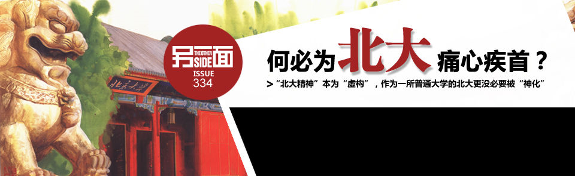

[[toc]]

# 网易新闻

## 网易新闻“另一面”：何必为北大痛心疾首？

### 何必为北大痛心疾首？

> “北大精神”本为“虚构”，作为一所普通大学的北大更没有必要被“神化”  

导语: 北京大学最近又处在了舆论的风口浪尖。这一次，是因其针对包括“思想偏激”在内的 10 类学生的“会商制度”。社会舆论普遍认为该制度与北大“兼容并包”精神相悖，不少作者更纷纷提笔“讨伐”北大。——可是，我们真的有必要为“尊荣不再”的北大痛心疾首吗？【详细】

### “北大精神”只是个传说

**历史书里的“北大精神”：知识分子曾经的“兴奋剂”**

在问答引擎“百度知道”上搜索“北大精神”四字，能轻易找这样的一段答案：“（北大精神）是一个是民族精神，和民族的苦难相联系的爱国精神；一个民族……需要有一个精神的支柱。北大就应该提供这样的精神力量”。

“北大精神”的确曾是中国知识分子的一剂“兴奋剂”。上过普通中学的中国人，大抵都能随口说出几件北大的“轶事”：1916 年的新文化运动、1919 年五四运动、1921 年中国共产党成立、1935 年“一二·九”运动……近现代史里写的大事件，几乎统统与北大脱离不了干系，只不过合上历史书后，北大就“不知所踪”了。【详细】

北大早年校歌《燕园情》中有如此一段：红楼飞雪，一时英杰，先哲曾书写，爱国进步民主科学。忆昔长别，阳关千叠，狂歌曾竞夜，收拾山河待百年约。

**“自由、兼容、独立”是北大人的特质，而非北大的“精神”**

北大老校长蔡元培提出的“兼容并包，有容乃大”办学方针，与至今仍立在北大校园里的“德先生”、“赛先生”雕塑，常常被人们引作“北大精神”的象征，但所谓的“北大精神”本不存在。北大之所以为北大，很大程度上因为那些与北大有渊源的名字：严复、蔡元培、蒋梦麟、胡适和傅斯年，也在一定程度上得益于北洋政府的“宽容”：在“武夫治国”环境中，这些知识分子一直被作为难得的精神文化力量。【详细】

通过追忆西南联大时代来替“北大精神”寻根，也是几近可笑的。毕竟，历史上再难碰到那样的特殊时代；更何况，联大的辉煌更多“归功于”清华而不是北大。假如“北大精神”真有之，马寅初的一个学术观点就该被容忍。独立思想和自由主义一直是许多北大人身上的特质，但北大从来不因此而成为“神话”。【详细】

**知识分子挂于嘴边的“北大精神”早就与北大无关**

2006 年，专栏作者许知远在其《走向封闭的北大精神》一文中感叹“北大精神”在商业和政治中的“没落”，却也不得不承认自己的无病呻吟，（因为）“念来念去，我们所有的感慨与追忆都发生在 1917 年—1929 年那个短暂的时代”。

而日前北大提出“会商制度”后，另一位专栏作者王锦思也感叹道，“近二十年来，中国一次次文化思想先锋运动与北大无缘，北大已离北大精神十万八千里，北大不过如此。北大情结正归于平淡，理想中的北大圣殿已然坍塌。”这两名作者都曾就读于北京大学，而早在他们步入燕园之前，那个“自由、兼容、独立”的代名词早就不一样了。【详细】

蔡元培可能是北京大学历史上最有名的校长。他留下的“八字箴言”一不小心就被演化成了“北大精神”。

**今日的北大，因“校园 BBS 风波”、自主招生和“会商”等政策成为焦点**

如果“北大精神”还是知识分子念叨的那个“北大精神”，它早就“没落”了。当代的北大依然是个出新闻的地方、依然被当成“社会的镜子”，只是此“镜”非彼“镜”，它不过是中国高校的缩影。2005 年，红极一时的北大校园 BBS 被关，自“北大未名”的转型后，全国高校纷纷跟进建立限制外部访问的“校内交流平台”；2010 年，北大率先引进自主招生，标准引发争议、被指沦为“掐尖大战”；2011 年，“偏激学生”、“会商制度”等名词又再度牵动社会的敏感神经。北大牵动公众神经的，不再是其在思想领域的作为，而是各种让人汗颜的举动。【详细】

### 北大甚至不是现代意义上的“名校”

**北大在思想界的作为几可忽略不计，难为“社会良心的最后堡垒”**

当中国高校争先恐后支持所谓的市场化时，台湾大学校长李嗣涔却“语出惊人”，指出“大学是社会良心的最后堡垒”。历史上，北大的第一任校长严复、以及他以后的蔡元培和蒋梦麟，都是或多或少掌握过中国文化命脉的有志之士，更是其时文化和道德的先锋。即使在那个被知识分子普遍视为“黄金时代”的 20 世纪 80 年代，活跃在知识界、思想界领军人物，也大多出自北大以外的大学和机构。

与北大毕业生在（包括政治舞台在内的）其他领域日渐丰满的作为相比，它在推动社会进步上的影响力堪称凤毛麟角。2008 年，司法改革的坚定支持者、国内知名法学学者贺卫方离开任教 13 年的北大，以“让胡适校长的精神活在我们心中”一辞作别。据媒体报道，他当时的去向是浙江大学光华法学院，这所在学术话语权上明显处于劣势的法学院，声称要恢复“教授治院”下的学术自由。【详细】

南京大学曾经做过一个统计，过去 30 年，人文社会科学领域学术刊物被引用得最多的作者，排名前几位不是学者、而是政治领导人。

**北大是一所副部级高校，却远非“世界一流大学”**

1998 年，北大庆祝百年校庆，建设“世界一流大学”一说也被提出。距离这一说法提出后的 12 年，退休不久的北大校长许智宏却公开表示，中国依然没有“世界一流大学”。

和与它齐名的清华一样，北大曾经是“教授治校”的典范，如今却也只是被批评为过分行政化的高校之一。北大是众多“一级政府”高校（中国公立高校分为副部长级、正厅级、副厅级等行政级别）中的“佼佼者”。作为副部级高校，北大的网络主页上一度出现过 27 个管理机构（2008 年）。与全国其他副部级院校引进地方官员出任党委书记的潮流相似，北大现在的校长原来也是一名主管教育的官员。【详细】

**即使不能对公共事务有益，大学至少不该将人“利诱成犬儒”**

北大享受着“中国第一、第二代自由知识分子基地”的盛名，但正如中国其他知名学府一样，它既没能避开行政化，也未能对功利化免疫。哈佛大学可能是公认的 “世界一流大学”，但这绝不仅仅因它的教授和学生在华尔街、硅谷和国会山取得的成就。

在 2008 年毕业典礼上，哈佛校长 Drew Faust 骄傲地分享了一组数字：尽管几乎一半学生（58%男生、43%女生）依然选择投身金融、理财行业（哈佛的传统强项），仍有很多毕业生选择投身别的职业——37 人参加了“Teach for America”（类似希望工程的公益项目）、1 名跳探戈舞的毕业生将到阿根廷从事“舞蹈疗法”、1 名学生将到肯尼亚为农业发展出一分力、1 名获得了数学学位的学生将改行去研究诗歌、1 名学生将投身对抗乳癌的研究。现代意义的高等教育不为求职，“而是为了生活”。【详细】

在国民政府最困难的时期，胡适当上了北大的校长。

### 北大既“死”，何须“烧纸”？

**一所大学从来不可能拯救一个社会，对北大抱有幻想的人“伤不起”**

论及“北大精神”、论及教育改革，每每都有精英忍不住呐喊：没有伟大的大学，能有伟大的国家吗？一个国家中最著名的大学缺乏反省精神，的确让人惋惜；但反过来说，除了几次历史性机缘巧合，光凭几所“伟大的大学”从来就不足以塑造一个社会的精神形态。

常态的社会不仅有“贤达”，更有“中间力量”，他们或为大学教授、或是律师、或是自由职业者，只是这样一个群体不可能来自几所“伟大的大学”。既然北大已不再是我们曾信仰的那种“北大精神”的捍卫者，何必不断重复那些回忆，试图证明它们曾经有过联系？【详细】

### 结语

除了一块“金漆牌匾”，北大和中国大部分高校已无本质区别。放弃对北大的幻想，不是放弃对教育的批判；恰恰相反，摒弃无谓的嗟叹才是让教育归位的前提。

---

## 北大将对“思想偏激”等十类学生进行会商

> `http://news.163.com/11/0325/03/6VV9LSVK00014AED.html`  
> 2011-03-25 03:26:15  
> 来源: 西安日报(西安)  

> 核心提示：去年11月起，北大在医学部、元培学院开始对十类学生试点会商制度。这十类学生含学业困难、思想偏激、心理脆弱等。这项制度预计今年5月份将在全校推广。对此，有舆论认为，北大以“兼容并包、思想自由”闻名，会商“思想偏激”的学生涉嫌“禁锢北大学生思想”。  

今年5月以后，北京大学将在全校推广实施对“重点学生”进行学业会商的制度，包括学业困难、思想偏激等十类学生将被纳入会商范围。其中对于“思想偏激”学生进行会商，引起了不少北大学生的争议。

从去年11月起，北大在医学部、元培学院开始试点学生学业会商制度。会商的“重点学生”包括：学业困难、思想偏激、心理脆弱、经济贫困、学籍异动、生活独立、网络成瘾、就业困难、罹患重大疾病、受到违纪处分等十类学生。

据了解，目前元培学院和医学部的试点已接近尾声。预计5月份之后，会商制度将在北大全校推广。

记者发现，对“思想偏激”学生进行会商，引起不少北大学生的争议。记者最早在某社交网站一名北大学生的网页上看到这一消息，该学生自嘲“已符合十类重点学生中的三项特点”。

也有北大学生表示支持会商“思想偏激”的学生，认为“有些学生太嚣张，经常因为一点小事就诋毁北大，应该将他们送到疯人院去。”但更多学生认为不应将“思想偏激学生”纳入会商范围。一名元培学院的大三学生告诉记者，元培学院的学生大多是以各省市前三名成绩入校的“天之骄子”，许多学生的言谈、思想都个性十足，因此很难界定谁属于“思想偏激”。“错误的会商很容易埋没这些学生的个性。”这名学生说。来自法学院的研究生小杨则认为，北大以“兼容并包、思想自由”闻名，会商“思想偏激”的学生很容易让人产生“校方禁锢北大学生思想”的理解。

对此，北大学工部副部长査晶表示，会商工作以关注学业困难、多次挂科的学生为主，主要是了解他们学业困难的原因。同时会商工作也会关注一些思想偏激的学生，主要是因为有一些学生经常夸大学校工作的一些细微漏洞，“比如动不动因为食堂饭菜涨两毛钱就批评学校。” （据《北京晚报》）

(本文来源：西安日报 )

---

## 《北大批判》：象牙塔到该大修的时候了(图)

> `http://news.163.com/09/1218/00/5QPC56I2000120GR.html`  
> 2009-12-18 00:32:00　来源: 金羊网-新快报(广州)  

《北大批判》：象牙塔到该大修的时候了(图) 白波

2005年，温家宝总理在看望著名科学家钱学森老先生时，钱老曾发出著名的“钱学森之问”：为什么我们的学校总是培养不出杰出的人才？

据悉，温总理曾为此认真求解，聘请了国内著名的大学校长和教育专家讨论，但得到的结果并不令人满意……如今钱老走了，“钱学森之问”依然是中国大学教育不得不面对的痛。

犹太人说：“宁可变卖所有的东西，也要把女儿嫁给学者。”犹太人又说：“假如父亲与教师两人同时坐牢而又只能保释一个人出来的话，做孩子的应先保释教师。”

正因为有对教育如此的观念，才造就了犹太人的聪明和富有。而我们，也曾有过尊师重道的传统，却没有得到良好的传承，“上大学是一个赔本的买卖”、读书无用论、“后悔上大学”之类的怪论，在这个时代此起彼伏、“毕业就失业”是尴尬的现实与大学收费过高的鲜明对比，让我们不得不审视我们的教育制度到底出了什么问题。

象牙塔越来越富丽堂皇的同时，内部的积弊也越来越多，到了该批判的时候了，到了该大修的时候了！

《北大批判》是针对中国教育积弊的力作，也是作者薛涌多年来从事教育工作的经验，他详细分析了西方大学教育的种种先进的理念与实践，从而对比分析出中国高等教育的种种缺失，力图为改正中国高等教育的弊端献计献策，提升中国高等教育的竞争力。

所谓“射人先射马，擒贼先擒王”，薛涌对中国高等教育的批判选择从北大“开刀”，是有深刻用意的。北大被公认为中国的最高学府，它是中国“新文化运动”与“五四运动”等运动的中心发祥地，也是多种政治思潮和社会理想在中国的最早传播地，有“中国政治晴雨表”之称，享有极高的声誉和重要的地位。所以北大看成中国的大学之首，对它的批判也就是对中国高等教育的批判。

首先是批判国人对大学理解上的错误。有人曾经对薛涌“言必称外国”很反感，但在对待大学的问题上，我们必须以外国为标准，因为大学是在1200年前后的欧洲诞生的。这是当时欧洲的神学和法学传统汇流的结果，所以讨论大学问题必须放在西方社会自治的传统中才能理解。

什么是大学的核心？在薛涌看来，“最重要的就是disputation（论辩）”。这种“论辩”，并不一定是公开的口头辩论，而更多的是在心灵中默然进行的是非辨析，是一种永无止境的精神努力。从大学诞生以来的八百多年中，“论辩”作为大学核心的精神从来没有丧失过。再看看我们现在的大学，“教授没精打采地讲着满堂灌的大课，下课后就无影无踪。学校高楼林立，却缺乏辩论切磋的风气，大部分课程都有给定的答案。就业的压力使学生和家长们最热衷什么是‘热门’，盘算着什么‘有用’，大学的传统，在我们这里似乎早已经失传了。”如此“现实”的、功利的甚至有些市侩的为学之道，怎么能培养出杰出的人才？

其次是批判大学教育在方向上的偏差。大学尤其是如北大这样的高等学府，应该培养时代的精英，“精英首先意味着对世界一些核心的抽象问题的关注和承担，如人生的意义和使命是什么？我们的价值观念是什么？人类的境况是什么力量塑造的？人类应该向何处去？等等。”

在美国的一流大学中，“历史、文学、社会科学、经济学（不是经管）、心理学等，是最主流的专业。只有在宾西法尼亚和康奈尔，商学和市场营销才比较有人气。应该说，美国大学的主流还是认识自己、认识社会、分析生活的文本。与此相对，北大最热的专业则在光华管理学院这种地方。”由此，薛涌先生不仅感叹道：“这个学院号称是‘拥有中国最具发展潜质的本科学生’。难道这些把大好青春花在什么市场营销上的真是‘最有潜质的本科生’吗？如果精英都成了推销员，未来谁来领导我们的社会、我们的文化？”

最后是批判大学教育关键细节的缺失。在薛涌看来，读和写是一个人成功的关键，“这方面不行的人很难在学术上有良好的发展”。《北大批判》一书中所举的一位留美中国学生与美国导师发生冲突，差点被开除，原因就是写作能力太差，交上来的东西要导师（也是世界顶尖的科学家）一行一行地改这个例子，以及作者北大四年，除了毕业论文和少的可怜的评论之外，几乎没有写作机会的事实，都可以说明，如今的我们大学对一些影响个人成败的基本功的忽视程度，如此培养出来的学生全像是“一个车床制造的标准化配件”。

《北大批判》像打开了一扇窗户，让我们看到了外国象牙塔是什么样子；犹如一面镜子，照出了我们象牙塔里的诸多弊病；同时也像一把钥匙，打开真正的象牙塔之门，让我们了解到大学的渊源和大学存在的核心。“为什么我的眼中常含泪水，因为我对这片土地爱得深沉”，为什么薛涌的笔下总是饱含批判，是因为他希望我们有一流的大学，培养一流的人才，进而成为一流的大国，也是希望“钱学森之问”不再存在。

《北大批判》 作者：薛涌　　出版社：江苏文艺出版社 定价：32元 

(本文来源：新快报 ) 

---

## 谢泳：西南联大知识分子群的形成与衰落

> https://www.163.com/news/article/5CUNIMVR00013FM4.html  
> 谢泳：西南联大知识分子群的形成与衰落  
> 2009-06-29 02:49:17　来源: 网易历史  

一、西南联大的设立

国立西南联合大学是与中国抗战共始终的一所著名大学，系由国立北京大学、国立清华大学和私立南开大学联合组成，简称西南联大。西南联大从1937年平津沦陷后在长沙组成临时大学至抗战胜利后复员北上（1937年11月1日－1945年7月31日），前后共计八年，为战时中国培养了大批人才，这些人直到今天依然活跃在各个学科领域（1955年中国科学院自然科学部委员中出身于西南联大的有118人，占学部委员总数473人的24.9％。参阅周发勤等：《西南联合大学的历史贡献》，《科学与研究》第8卷第2期，第22页，北京，1990年6月19日，黄志洵：《西南联大与中国自然科学家》，《百科知识》1986年第7期）。西南联大不仅培养了杨振宁、李政道等大批自然科学家，而且也培养了何炳棣、邹谠、王浩等人文科学家，还养育了像殷海光这样具有思想家气质的学者。西南联大的存在对于分析中国现代知识分子的活动有重要的意义。正如一位西南联大学生所言："西南联大便具备了双重意义。一个是表面的意义，那当然就如其名称所揭，是一个'学校'，是一座研究学问、传授知识的最高学府；但在另外却还有一重不为人们所见的隐潜意义，那就是一个酝酿舆论，领导思想的政治中心。这一面虽然潜隐不露，非能一望而知，但却是西南联大一个非常重要的'存在意义'。若弃此不顾，只谈上课讲学，那实在不能算是了解西南联大。"

西南联大的设立从一个侧面反映了当时国民政府对文化事业的重视，同时也说明当时中国知识分子在政府决策中所起的重要作用。西南联大设立的动议直接来源于胡适等人，1943年1月2日蒋梦麟致胡适的一封信中说："弟则欲求联大之成功，故不惜牺牲一切，但精神上之不痛快总觉难免，有时不免痛责兄与雪艇、孟真之创联大之议。数月前在渝，孟真怪我不管联大事，我说，不管者所以管也。"（中国科学院近代史研究所中华民国史组编：《胡适来往书信选》中册，中华书局，1979年5月）七•七事变前夕，蒋介石邀请了许多国内知名人土在庐山举行国是谈话会，当时北大、清华、南开三校的校长蒋梦麟、梅贻琦、张伯苓都应邀参加，同时还邀请了大批教授前往，如陈岱孙、浦薛凤、庄前鼎等。事变后，北方各校纷纷去电告急，要求几位校长返校应变。当时留在北平的教育界著名学者、教授李书华、陆志韦、查良钊、罗隆基、梅贻宝、郑天挺等21名教授联名致电庐山谈话会，要求守土抗战。同时潘光旦、查良钊等人致电蒋梦麟、胡适、梅贻琦："就同人观察，华北局面症结在地方最高当局对中央尚有疑虑，深恐地方对日决裂后中央反转妥协退，使地方进退失据。务请向介公进言，对地方作具体表示，俾祛除此种疑虑。"7月17日梅贻琦电告清华教务长潘光旦"今早重要会议，当局表示坚决，并已有布置。"在这样的情况下，国民政府决定将三校迁往湖南长沙组成国立长沙临时大学，此事经三位校长回南京和教育部进一步磋商后决定实施。8月148，教育部密电梅贻琦、顾毓琇：'政府拟在长沙设临时大学，特组织筹委员会，敦聘先生为委员……"8月28日，教育部高等教育司致梅贻琦一封公函说："奉部长密谕，指定张委员伯苓、梅委员贻琦、蒋委员梦麟为长沙临时大学筹备委员会常务委员。杨委员振声为长沙临时大学筹备委员会秘书主任。"梅贻琦接信后，立即赴长沙进行筹备工作。长沙临时大学即为西南联大的前身，1938年12月13日国民政府首都南京陷落，武汉告急。后经蒋梦麟亲自请示蒋介石，才决定将长沙临时大学迁往云南省会昆明，1938年4月2日，教育部以命令转知：奉行政院命令，并经国防最高会议通过，国立长沙临时大学更名为国立西南联合大学，7月1日正式启用关防。西南联大在昆明前后约八年时间。1946年7月，西南联大返回北方，分别重建清华、北大、南开大学。当时，国人对西南联大的成功有高度评价，认为这是"民主传统，宽容精神"的结晶。在国家面临危亡的历史时刻，那些教授身上表现出的吃苦耐劳、团结合作精神，实为中国现代知识分子的楷模。

西南联大的成功，是中国知识分子的一笔精神财富，我们今天迫切需要对联大精神，联大风格进行深入研究，以发扬中国知识分子的真精神。张申府在抗战即将胜利的时候，曾向政府进言，希望保护大学教授的热情，他的话也算是对西南联大精神的一种肯定。他说："这几年来，国人中表现的比较最规矩、最公正、比较最有知识最能感觉、最关怀国家、忍受的苦难也比较最多，最不失为固穷的君子的，就是若干大学教授。今后国家一切改革，总应该对他们多加些重视才是。"

二、西南联大知识分子群

所谓西南联大知识分子群是一个较为宽泛的概念，主要指在西南联大工作过的教授和学生这两部分人。由于在战争环境下，中国的大学教授和学生有较强的流动性，所以我不以在西南联大的时间长短来界定这个群体，而将所有曾和西南联大发生过关系的知识分子都算作西南联大知识分子群。所谓关系指在西南联大讲过课和西南联大聘任而未到任的教授，比如胡适，1938年1月20日西南联大聘其为文学院长，但他未到任。萧公权被聘为政治学系教授也未到校，还有1945年10月19日蒋梦麟辞去西南联大常务委员后，教育部聘任了傅斯年为西南联大常委，但傅斯年一个月后就离开了。另外钱穆、罗隆基、熊十力、钱钟书等只在西南联大作过短期停留，研究院还聘请过丁声树、李方桂为导师，笔者也将其归为西南联大知识分子群。需要略作说明的是这个群体并无组织、纲领，也没有多少联系，用群体概括是在抽象的意义上注意到他们价值观的一致性。以往对于西南联大贡献的评价，我们往往过于重视西南联大在八年中的成功合作，而忽视三校过去的传统，八年的成功合作只是结果，那么它的原因在哪里呢？我认为在于中国现代意义上大学的出现，从1898年京师大学堂（北京大学的前身）算起在抗战到来时已存在了近40年时间，这期间1904年京师大学堂派出第一批47人留学生，其中31人留日，16人留西洋。作为制度性的大学留学制度已经完成，清华大学的前身游美学务处成立于1909年，比京师大学堂的设立晚15年，但作为留美预备学校的清华学校，则完全是为留美学生而办的。到1928年国立清华大学的出现，虽然作为现代意义上的大学教育起步较晚，但到抗战前夕，不到40年的时间内，已经初步形成了可与世界著名学府相比的现代意义的大学教育体制。南开大学从1904年建立中学到1919年成立大学，时间比北大、清华稍晚，但大体在同一时间，根据以上的观察，我们可以说中国现代意义上的大学起步于二十世纪初，而在三十年以后已经发展到了很高的水平，这在世界教育史上也是个奇迹。西南联大就是在这样的背景下出现的，带有一定的偶然性，是抗战爆发的特殊历史条件，将当时中国最优秀的三所大学汇聚在一处，形成了西南联大知识分子群。

我们观察西南联大三位常委的年龄结构和教育背景。

姓名——生卒年——早年教育背景——留学国家——联大时年龄

蒋梦麟——1886～1964——上海南洋公学——美国——51——

梅贻琦——1889～1962——南开学堂——美国——54——

张伯苓——1876～1951——北洋水师学堂——考察日本教育——61——

从三位校长的年龄上看，他们基本是十九世纪末出生的人，他们出生的年代大致比北大、清华、南开初创的时间早15年左右，这决定了他们的小学和中学教育是传统的，而大学教育则是现代的，梅、蒋留美的教育背景大体代表这一代知识分子的一般状况，而他们前代的知识分子即梁启超那一代的教育背景则以留学日本为基本特征，中国现代意义上大学的建立，与西南联大知识分子群的形成大体是同步的。如果没有抗战，这个群体同样存在，只不过没有像现在西南联大那样密切合作而已。指出西南联大知识分子群的形成是想说明；中国在二十世纪初进入现代化起步阶段，本来有一个良好的开端，然而这个过程太短了，从清华1909年首次制度性派赴美国留学生，到抗战爆发，这期间实际上比较活跃的是两代知识分子，即十九世末出生的那一代人（以胡适为代表）和二十世纪初出生的那一代人（以钱钟书为代表）。本世纪三十年代前受过完整西方教育的知识分子几乎全部回到中国，当时中国的社会结构尚比较适于他们生存，这批知识分子中除少数人进入政府做官外，绝大多数成为大学教授，抗战爆发时，这两代知识分子中年长的是在50岁左右，更有像钱钟书、华罗庚、陈省身这样刚刚学成归来的少壮教授，他们的年龄不过30岁。西南联大的教授中以出身于清华的为多，这意味着它的美国化程度。以1909－1929年清华留美学生为例。在这期间每一年度的留美学生都有成为西南联大教授的，1909年梅贻琦，1910年胡适、赵元任，1914年金岳霖，1915年袁复礼，1916年吴宓、陈达、燕树棠，1917年查良钊、汤用彤，1918年刘祟鋐、叶企孙，1919年钱端升，1920年曾昭伦、萧公权，1921年浦薛凤、李继侗，1922年闻一多、罗隆基、潘光旦、吴泽霖、雷海宗，1923年顾毓琇、施嘉炀、吴景超，1925年汤佩松、李楫祥、庄前鼎、刘晋年，1926年任之恭、陶葆楷、贺麟，1927年柳无忌、丁佶，1928年陈之迈、赵诏熊，1929年张荫麟、王赣愚、沈有鼎、杨业治。从这个统计中可以看出除初期1911、1912、1913三个年度中没人进入西南联大外，在近20年的时间内每个年度都有留美的学生成为西南联大的教授，而且人数越往后越多。通过以上观察，我们大致可以说西南联大的知识分子群是中国现代知识分子的一个缩影，抗战前中国自然科学和人文科学的第一流学者主要集中在西南联大。

三、西南联大知识分子群的特点

从年龄结构上看西南联大知识分子群的下限为1920年前后出生的人，也就是说1920年前后出生的人是西南联大的最后一批学生，这个年龄段大致可以将1945年考入大学的学生包括在内。

西南联大知识分子群由教授和学生两部分人组成，我在本文中主要分析教授群体，学生群体另有专文论述。教授中年龄较大的是梅贻琦、张伯苓、陈寅恪、刘文典那一代知识分子，年龄较轻的是钱钟书、费孝通、陈省身、华罗庚这一批1910年前后出生的人。从教育背景上考察，陈寅恪那一代知识分子多数带有遗民色彩，他们中的多数人受的是完整的传统教育，但同时又有留学欧美的经历。钱钟书这一代知识分子多数也受完了传统教育，但其传统的深度与前一代有了距离，但总体上说，他们可算是中国传统教育的最后一批受惠者，加上比较完整的现代大学教育，他们这一代人中许多人成为中国新的人文学科的创始人。陈寅恪、刘文典那一代知识分子多治传统的中国学问，虽然已经使用了西方的方法，但从学科的角度看，他们多数是在研究中国的文学、历史、哲学。而从钱钟书、李景汉、潘光旦那一代知识分子之后，中国的社会学、心理学、经济学、教育学等新的学科才逐步建立和成熟起来，在自然科学方面，新的学科也是在1910年前后出生的那一代知识分子中成熟起来的。西南联大成功的主要原因是她的教授多数留学美国。1945年西南联大北上复员时，由西南联大学生编过一本《联大八年》的纪念册，这本纪念册的第四部分"联大教授"的前言中有一个统计："联大179位教授中，97位留美，38位留欧陆，18位留英，3位留日，23位未留学。三位常委，两位留美，一位未留学。5位院长，全为美国博士。26位系主任，除中国文学系及两位留欧陆，3位留英外，皆为留美。"这个统计充分说明西南联大带有极强的西方色彩，特别是她的教育思想和课程设计，主要受美国自由教育思想的影响。在西南联大，教授治校、思想自由、学术自由、兼容并包，已成为公认的价值标准。我们注意西南联大的贡献，不仅在于她为战时及后来的中国培养了许多专业人才，更在于她的融汇东西文化的优长为中国现代化进程提供了一个范例，就是说如果有较长时间的社会稳定，西方文化至少在中国的大学环境中是可以生根的。1947年马歇尔在国共调停失败后曾对自由主义知识分子在中国政治中所应有的地位寄予厚望，在他离华前发表的声明中曾预言："此种问题之解决，自余视之；须使政府中及各小群之自由分子获得领导权，此种人物颇为优秀，唯无政治权力以运用其控制力量。"马歇尔的这种评价直接源于他与西南联大知识分子的接触和了解，他的这种期望是极富远见的。费正清也说："我们在中国培养自由主义已有百年之久。我们的传教士曾带去个人价值的信息。中国官员曾研究我们盎格鲁－撒克逊式的制度。中国教育、新闻、银行、工业等方面的领袖人物曾学习我们的榜样。我们所知的近代中国，就是由那些借鉴我们经验的人建立起来的。"1942年费正清访问西南联大后，对这里的教授做出如下评价："这些在美国接受训练的中国知识分子，其思想、言行、讲学都采取与我们一致的方式和内容，他们构成了一项可触知的美国在华权益。"作为战时美国的外交官费正清希望美国政府能对"美国培养的昆明清华大学教授"给予援助，因为他们是"美国在华的一种投资和财富"。在昆明时费正清与陈福田、张奚若、钱端升等12位教授进行了交谈，认为他们是"中国接受西方文化教育熏陶的学术界人士中间的精英。"费正清虽然是从美国的在华利益方面着眼观察西南联大教授的，但他对这批教授的整体评价，符合当时的情况。西南联大知识分子群的另一个特点是虽然他们多数有留学欧美的经历，但在伦理道德层面却明显留有儒家文化的色彩，他们可以说在专业和政治结构上倾向西方。而在生活的层面上还完全是中国化的。这个特征使他们成为当时的道德楷模和精神领袖，任之恭回忆当年的经历时写下了这样的话："首先，战争时期为保存高等教育而奋斗的主要动机来自于中国传统的对学识的尊重，在以儒家为主的传统中，中国学者被认为是社会中的道德领袖，从某种程度上说，也是精神领袖，那么，从这一观点出发，战时大学代表着保存知识，不仅是'书本知识'，而且也是国家道德和精神价值的体现。"西南联大的知识分子群是承担了这种责任的。1941年国难当头，国家经济异常困难，当时教育部规定，凡属行政工作的教授每人发给一笔"特别办公费"，但西南联大的各院负责人不愿因此而引起广大教授不满，联名上书校方指出："抗战以来，从事教育者无不艰苦备尝……十儒九丐，薪水尤低于舆台，……故虽啼饥号寒，而不致因不均而滋怨。"表示拒绝领受这项特别补助，从中不难看出他们身上深重的中国文化影响。王浩说："我觉得当时联大有相当多的人在看事和做人上兼备了中西文化的优点，彼此有一种暗合视为当然的价值标准。"

四、西南联大知识分子群的生存空间

1949年前，对中国的大学教授而言，曾经有过一个较为宽阔的自由生活空间。国民政府虽然对思想自由、言论自由做过种种限制，但作为教授生活的几个基本条件并未丧失。首先教授享有自由流动的权利，其次有思想自由，学术自由。虽然有较为严格的新闻审查条例，但任何团体和个人都可以注册出版报刊，这是新闻自由的第一要义，政府可以查封甚至迫害，但从理论上还没有完全否定民间报刊的合法性。更重要的是当时的大学教授享有自由流动的权利。

所谓自由流动是一个较为宽泛的概念，这里主要指当时大学教授的主动选择。它包括：一，迁徒的自由（在国内外自由选择居住地的权利）；二，择业的自由。这两种选择完全以个人意志为转移，不受任何限制。从历史资料看，大学教授的这两种权利是得到基本保障的。我统计过北大、清华、南开、北师大1949年前的一百位教授的自由流动情况，他们当中自由流动三次为一般规律，多的有流动四五次的。

自由流动只是大学教授的一个普通权利，这个权利并非大学教授所独有，所以特别强调这个基本权利对大学教授的重要性是因为：大学教授作为知识分子在其谋生之外，有天然的关怀社会价值的倾向，就是说，他们在谋生过程中同时承担许多道义上的责任，他们要通过写文章、办报纸刊物、自由选择党派、随意批评政府等行为来体现自己的存在，这些特征决定了大学教授是一个主体性极强的群体，其生存环境也就具有相对的多变性，他们比其它阶层要难于在一个固定的环境中长期生活下去，这时候自由流动就必然成为他们生存的基本保证。如果失去这个，对大学教授来说实在太痛苦了。可以设想，当一个大学教授既不满足于自己的工作环境，又厌恶自己的顶头上司，可他又无法摆脱这样的困境，那么他们的才华不但得不到充分展示，而且会日益枯萎。从一般意义上讲，人们以为大学教授不宜于合作，但这只是基本的道德评价，对大学教授来说以道德评价一切显然是不够的，这个群体由于具有较强的专业特征，他们更追求志趣、见识、水平的大体一致，所以选择性也就较强，这种要求当然比一般随意混碗饭吃的谋生要多一点矛盾。但由于自由流动的权利存在，所以大学教授往往不会在矛盾激化的情况下才做选择而是感觉不适即主动回避。1926年鲁迅辞去厦门大学的教职而改任中山大学中文系主任兼教务长。但第二年3月，中大文学院院长傅斯年聘了顾颉刚来中大，而顾与鲁有积怨，所以鲁迅的第一个决定是和许寿裳迁居校外，一个月后鲁迅就辞去中大的一切职务，10月底便和许广平到了上海。以鲁迅的性格。如果他没有自由流动的权利，既应了中大的教职，而不能离开，那他非气死不可。但由于有这个权利，各人都可做主动选择，鲁迅不走，顾颉刚要么不来，要么来了也会走的，合则聚，不合则散，自由流动是最符合人性的活动规律。此类情况在当年大学教授中是常见的，那时大学教授终身只服务于一所大学的例子极少。

自由流动本是宪法中迁徒自由的具体化，它的实现与大学教授的经济地位直接相关，自由流动的存在必须以经常性的运作来体现，否则单说有这个权利，而实际生活中并不存在活动的实例，那自由流动也就是一句空话，1949年以前，大学教授的经济地位是较高的，我们从清华梅贻琦就任校长后的一项规定就可看出。当时教授的收入为300－400元，最高可达到500元，而且每位教授还可以有一幢新住宅；讲师的工资为120－200元，助教为80－140元，一般职员30－100元，工人9－25元。很显然教授工资（以最高为限）是工人的20倍，我们如果不以阶级的观点来评价这种差别，而从管理本身来看，这种差距是有其合理性的，经济地位的确立使自由流动成为可能，同时也激发了大学教授钻研学问的热情，因为它使每一位大学教授总能在不断的流动中找到自己最佳的工作环境，一旦不适，便又重新选择，在这样的流动过程中，从精神到物质，他们总能较长时间地保持最佳状态，多数人自觉固定下的大学，总是最心满意足的。闻一多在1926～1930年间流动于上海、南京、武昌和青岛的著名大学，最后于1931年在清华安定下来，朱自清在同一时间内也由杭州一师、扬州第11中学、吴淞中国公学、台州中学、浙江省立第十中学，最后固定在清华。自由流动本身是一种双向选择的过程，是一个活的机制，在这过程中，以趋同为基本特征，只育学术水平、爱好兴趣、道德水准都基本协调的人最终才会聚在一起，1949年前同一学科中水平接近的大学教授基本上都有过曾经同事或共处一校的经历，这对学术的发展是极为有利的。对大学来说，自由流动的结果总是能将磨擦和矛盾减少到最低程度，同时最大限度地保持教授间的平静与和谐，而自由流动又不断打破这平静与和谐，在流动中始终保持活力。

对大学教授而言思想自由和学术自由，最终都要体现在自己的思想和学术成果能否进入传播，在三十年代，传播的意义主要在于能否变成铅字，即能否以出版的形式流传。西南联大时期，集中体现教授这种权利的是教授的任何学术活动政府没有干涉，在教授中先后办有《当代评论》《今日评论》《战国策》这样政治倾向明显不同的时评周刊。对当时的学生来说，他们享受了和出版的自由，在校园内以各种形式的壁报来表达自己的观点，形成了一个较为活跃的思想空间。在整个抗战期间，西南联大做为自由精神的堡垒，自觉地抵制了国民党试图强加给学校的思想控制。这种来源于西方的自由主义价值观念影响了西南联大的学生，直到今天在中国思想文化领域中依然能见到西南联大知识分子群活动的身影。殷海光晚年谈到自己的人生经历，认为主要"受五四的影响和五四后期的西南联大的薰育。"他在西南联大时，受到金岳霖的赏识，这对他一生的思想具有决定作用。"他不仅是一位教逻辑和英国经验论的教授而已，并且是一个道德感极强的知识分子。昆明七年的教诲，严峻的论断，以及道德意识的呼吸，现在回想起来实在铸造了我的性格和思想生命。"（同上）王浩认为，对当时西南联大自由民主的学风，身临其境的人才有最亲切的感觉，这里不论年资权位，教师与教师之间，学生与学生之间，师生之间，可以说"谁也不怕谁。当然每个成员因为品格和学识不等，会受到别人的尊重或轻视，也有些人为了个人的复杂心理，作事对人不公正。但是大体上开诚布公多于阴谋诡计，做人和做学问的风气都是好的。"余英时论钱穆时曾说："他承认三十年代的中国学术界已酝酿出一种客观的标准，可惜为战争所毁，至今未能恢复。"实际上在西南联大时期，这个"客观的标准"还是存在的，真正的消失是1949年以后。

五、西南联大知识分子群的衰落

作为整体的知识分子群体，西南联大知识分子群从1949年后开始衰落。虽然西南联大知识分子群中的多数人在这一巨大的历史转折关头，留在了大陆，但他们的选择与他们曾经拥有的价值观念之间出现了巨大差距，这是困扰许多中国现代思想史研究者的问题。本世纪五十年代初期，大陆普遍对知识分子，特别是受过西方教育的自由主义知识分子进行思想改造，强迫他们放弃原有的价值观念。五十年代初，几乎所有在高校的自由主义知识分子都被送去"革命大学"洗脑筋。如果说初期的思想改造运动还仅是新政权试图以学习的方式，在短时间内强迫他们接受马列主义的话，那么1952年进行的高等院校院系调整，却从结构和体制上将西南联大知识分子群根本打散了。西南联大知识分子群的主体是出身清华的留美学生，但在这次院系调整中，清华受的打击最大，这所有自由精神和独特学术传统的综合性大学，被强行改成工科大学，使原有的充满活力的人文环境只剩下半壁江山，这个群体中的许多知识分子离开了大学而进入了受政府控制的社科院系统。随着自由流动权利的逐步丧失，几乎所有的知识分子都被固定在单位中。同人报刊的很快消失使知识分子表达思想的基本方式完全被纳入固定的意识形志中。朱光潜本来对自由主义价值观是很向往的，1947年《观察》周刊争论"自由主义往何处去"时，他也参加过论战，他认为自由主义者不属于一个政党，只体现一个中立的超然的态度。朱光潜认为，既然为自由主义知识分子，就不应该有组织。因为有组织就得遵守共同的信仰和纪律，因而难免"党同伐异""阿其所好"。这与自由主义的精神是背离的。他认为任何一个政党，都不应当仇视自由分子。他写到："我敢说在三十年乃至五十年的未来，中国真正的民意还要藉社会上少数优秀自由分子去形成、去表现。假使这一部分人被逼得终归于没落，民主政治的前途恐怕更渺茫。"正是这位朱光潜，在1949年后，作为北京大学西语系的主任，很快就发现自己不适于作领导工作，多次向校务委员会主任汤用彤辞职。但这也逃不出很快到来的知识分子改造运动。在这次运动中，朱光潜依然成为北京大学的重点批判对象。后来朱光潜认真研究过马列，并在1951年翻译出版了一本用马克思主义观点探讨艺术问题的路易•哈拉普的《艺术的社会根源》。按说朱光潜该是一个被人改造过的人了，但在1980年以后，朱光潜率先著文为沈从文鸣不平，并对自己在《西方美学史》中不敢提叔本华和尼采，表示强烈自责，认为"这是由于我的顾虑，胆怯，不诚实。"由朱光潜的经历中，我们或许可以看出自由主义知识分子在高压下的心态。冯友兰、金岳霖、贺麟等相当一批西南联大知识分子都有相似的经历。五十年代初，他们都曾努力否定自己的过去，以适应新的环境，但最终都未能逃出被批判的命运。晚年又都对当年的自我否定表示反省。金岳霖晚年曾说："在解放前，我没有搞过什么政治，那时我似乎有自知之明。我在解放后是不是失去了这个自知之明呢……"话虽婉转，但不难感到对自我否定的反省。

由批判电影《武训传》到批评俞平伯的《红楼梦研究》，前者的明显用意有否定陶行知教育思想的意味，因为陶是留美的学生。而后再将矛头指向以胡适为代表的自由主义知识分子，在大规模的批判胡适在思想文化领域里的资产阶级唯心主义斗争中，试图将西方的影响扫除干净，同时构造知识分子"原罪"论的神话，让知识分子从灵魂深处否定自己过去所受的教育。1957年反右运动的到来，终于导致西南联大知识分子群的彻底衰落。1957年的反右运动中，中国民主同盟从中央到各地的主要负责人几乎无一幸免，而民盟又与西南联大有较密切的关系。1942年底，民盟宣传部长罗隆基到昆明建立地方组织，罗隆基和周新民等人将西南联大许多教授吸收入盟，如闻一多、吴晗、潘光旦、费孝通等。这样到了1957年，西南联大知识分子自然也就在劫难逃。毛泽东曾说过："原本想用民主党派、民主人士的力量，帮助整党。想不到他们这样不可靠，最坏是民主同盟，他们是男盗女娼。"1957年以后，西南联大知识分子群中被打成右派的比例很高，从此作为二十世纪前半叶中国知识分子缩影的西南联大知识分子群体再也未能恢复元气。

---

## 贺卫方：我为什么要停招硕士生（资料）

> http://news.163.com/05/0629/12/1NDP067P0001122B.html  
> 贺卫方：我为什么要停招硕士生（资料）  
> 2005-06-29 12:10:28　来源: 中新网  

【内容提要】当一个社会有不合理现象的时候，我们每一个人，都有责任去表达我们的不满，这也就是德国的法学家耶林所倡导的"为权利而斗争"。这种表达是现代社会每一个公民的义务。如果大家面临不合理的东西都忍气吞声，不去表达自己的不满，其实伤害的不仅仅是自己，而且包括社会的整体利益。　　

按：我关于暂停招收硕士生的声明在学术批评网发表后，引起了不少关注和反响。6月24日晚上，博客中国的古川先生就此事对我进行电话采访，采访记录稿于25日上午发表于该网站。细读一过，发现一些字句上的讹误，便作了一些订正和修改，形成了这个修订稿。这里要感谢古川先生积极热情的工作，也感谢朱鲁子、李名梁、旺才、李强、江渚子以及无法一一列举姓名或网名的网友的评论。　　

贺卫方26日凌晨　　

编者按：2005年6月24日，北京大学法学院教授贺卫方发表了《关于本人暂停招收硕士生的声明--致北大法学院暨校研究生院负责同志的公开信》，引起巨大的反响，因此为了搞清楚事实的原因，博客中国对贺卫方教授进行了专访。以下为专访内容：　　

表达不满

博客中国：贺老师，您好，我是博客中国的，我们现在对您进行一次专访。您在今天发了《关于本人暂停招收硕士生的声明--致北大法学院暨校研究生院负责同志的公开信》，是什么原因促使您发了这样的公开信？　　

贺卫方：主要是研究生招生考试体制中存在的一些缺陷，需要我们去通过各种方式努力加以纠正，尤其作为一个学者，我认为这是关系到整个学术制度的建设和我们下一代学术人的培养的问题，是一个关系重大的问题。公开声明的方式看起来有些激烈，但这也是没办法的，借这种方式表达自己的一种希望甚至不满吧。　　

博客中国：为什么贺老师要发公开信，而不采取其他方式呢？　　

贺卫方：其实我们已经做了很多很多的努力。北大法学院2004-2005年研究生考试对于过去的考试方式进行了很大改造，主要是淡化了研究生入学考试的专业倾向，把13门“核心课程”都纳入到考试的范围。但是这种制度有很大的缺陷。最重要的是这种撒大网式的考试严重抑制了考试时应有的专业倾向。我们都知道一个报考特定专业研究生的考生意味着他希望将来从事这个领域的研究。为了达到这个目标，他们可以在自己读本科的阶段，尤其本科的大三、大四阶段，非常用心的去进行特定领域知识的积累，这种积累与将来的研究生考试是有着对应关系的。考试时固然要判断他在整个专业领域中知识的广度，但是，非常重要的是需要考察他对于报考学科知识把握的深度和分析能力。对于积累深厚的考生，他就会在这个自己最擅长的领域中间发挥出自己的特色和特长。过去制度一直是这样的，但是两年前为了所谓考察一个考生知识广度的动机而导致了我们另外的一种尝试。这样的话会导致很大的问题——将来从事研究型职业的学生，他们未必是各个方面兼顾得很好的学生。有时候我们常常说，如果每个方面都达到及格或及格以上的分数，但是没有一个方面有一种特长，我不认为这样的人适合做研究型的工作。　　

还有就是保送制度，我对保送制度一直有不同的看法。我认为保送制度存在很大的缺陷。北京大学这样的学校，对许多人来说，坦率地说是个很大的梦想，尤其是在大学高考的时候，因为不同方面的原因，使很多考生发挥得不好，他们就没有考到理想中的大学。有许多人，他们的梦想就是在研究生阶段到北京大学来读书。保送制度就使这样人的机会减少。声明里提到的数字，是我昨天在北大官方网站查到的，我觉得已经达到相当不合理的程度。保送生太多了。有两种保送生，一种是因为学习成绩优异而保送，就是在四年的学习过程中，各门的课程，尤其是主要的课程，考分都比较高，名列前茅。实际上，我们的经验表明，有许多优秀的学者，当年在本科阶段成绩却并非门门优异。保送生过分偏向于应试型，就是说考试非常厉害，但做学问不一定很好。还有一种保送生就是学生干部、特长生，所以我觉得这样的保送是更不合理的保送。这样出身的人很少有人能成为好的学者，所以我认为保送制度不合理。当然，这样的一种缺陷，从内部来讲，可以举出八条九条，但是对于外部的采访来说，单这一条就可以表明我们这种考试制度的缺陷了。　　

我有权利不招

博客中国：你是否认为你有不招收的权利，而学校是否会同意？　　

贺卫方：当然有这个权利。我想招的学生，有种种因素招不来，但是我不招总是可以的，我甚至辞职都可以嘛，所以消极的方面是可以去做的。　　

博客中国：你打算在什么样的情况下恢复招收？　　

贺卫方：如果考试制度恢复到非常重视选拔培养学术人才，这样的情况下，我是会恢复招生的。　　

博客中国：在您的公开信中，您说："即使教师都反对，决策者却依然我行我素。"决策者是谁？你们北大决策有什么样的程序？　　

贺卫方：事实上是这样的，我们在前不久开过一次教师座谈会，那次座谈会的主题就是研究生入学考试改革的问题，我的同事和我的观点非常一致，都认为目前这种制度是错误的。但是有关的部门似乎是已经有结论，再来开这样一个座谈会。座谈会没有办法改变任何东西。这样的决策者，包括大学的有关管理机构，我觉得他们并不是偶然的。其实我在自己的公开信里边，明确的表示教育行政管理部门，也就是教育部，他们对研究生考试制度，按照他们的意图去设计，这种做法损害了大学的自治。研究生考试制度如何设计是应当由教授们来决定的。长期以来，这类制度都被行政管理人员、官员们玩弄于掌股之间，从而严重违反大学自治、独立的准则。　　

变革不难

博客中国：对你所提的各种缺陷，在现行的招生体制下，是否有补救措施？　　

贺卫方：其实道理很简单，要改变也不难。在八十年代、九十年代相当长的一段时间，我们实行的考试制度是有它合理之处的，基本上没有太大缺陷。那种制度重视考试本身，同时也为某些特殊人才预留一定空间。事实证明，今天活跃在学术研究第一线的许多优秀学者都经历过那个时代的研究生教育。北京大学一个非常有力的例证，1978年考入北大西语系的张隆溪，他根本没有读过大学，但他直接考取了杨周翰教授的研究生，后来这个人成为在比较文学、文化研究方面非常重要的学者，现在在美国任教（贺卫方按：本文最初发表时把张隆溪先生的导师误为朱光潜先生，网友甘任远在关天茶社给予指正，这里表示感谢）。如果按照我们今天这样的体制，可能这个人就会被埋没。我的观点，就是回归那种制度，当然可以在一些枝节上加以完善，但不能像现在这样作剧烈的变动。现在我们的有关制度总是变来变去，朝令夕改。朝令夕改，则民无所错手足。我们应该有一个非常稳定的制度。　　

博客中国：您在北大，陈丹青在清华，从某种程度上说，是否体现出我们研究生招生体制上普遍性的失败？　　

贺卫方：我觉得目前这样的一种体制，确实存在着许多值得我们反思的地方，像艺术专业的招生，还要去考一些跟艺术毫不关联的东西，这哪里是选贤任能呢？做出陈丹青那样的决定，我觉得是不容易的，值得同情。因为他看着艺术方面非常有天分的人，被莫名其妙的标准挡在艺术学院的门外，而考上的人在艺术天资方面又根本不够格，这种情况让为人师者确实非常非常的痛苦。所以我觉得我们现在需要整体性的反思研究生考试制度，全方位的考虑各种因素。比如我们的法律专业，现在有两种，一种是法学硕士，一种是法律硕士，法律硕士是培养面向实务的复合型人才，这种专业的招生在我们这里已经远远超过法学硕士的规模。我们需要根据这样的情况考虑和设计法学硕士的招生和培养制度，把主要的目标设定为学术人才，我们要为将来的法学博士奠定基础。如果我们在招生的时候，不吸引追求学术目标的考生进入到法学硕士的行列，将来的法学博士招生又要以法学硕士为主录取的话，势必对法学博士甚至法学教授整体的素质带来潜在的损害。　　

大学就是教授

博客中国：你提到大学的独立方面与教授的独立，它们之间有什么样的关系？　　

贺卫方：所谓的大学，按照西方一个学者的说法，其实大学就是教授，教授就是大学的主人。大学里边相关的管理，学术制度的设计，学术政策的制定，都必须以大学教授的整体意志为转移。大学不应当变成听命于外部权力的一种群体或一种机构。所以我认为这两者是一致的。由于我们的大学是近代学习西方的产物，因此在官与学之间的关系方面一直难以很清楚地界定，大学自治和教授治校这样一种目标的实现一直面临着种种特殊困难。有许多人担心，大学独立会不会带来别的方面一些问题，比如说，不符合某些原则，带来某种不稳定，或者不接受外部权力的动员。我觉得一个国家，能够一声令下，全民都发动起来，这样的制度恰好最不具有稳定性。良好的体制下面，恰好是不同社会群体的独立性支撑了社会秩序的稳定。当某些危机或难题出现的时候，正是不同群体的独立带来了多样化的解决方案，使得各种才智得以展现，最终给社会带来秩序。过分迷信政府的权力，把公权力的威力发挥到无远弗届的程度，看起来很强大，但是，没有第三种力量制约，这种权力也非常脆弱，甚至动员得到的不过是阳奉阴违。无所不能的政府最终将一无所能；当人民对政府无可奈何的时候，政府将最终发现它对人民也将无可奈何。所以，那种只看到大学独立的弊端，而看不到它的好处的观点不仅是片面的，也是危险的。　　

有关方面没有反应

博客中国：对你的公开信，有关方面是否已经有反应？　　

贺卫方：没有反应，今天早晨刚刚写出来。　　

博客中国：你以前你是否发过这样的公开信，有什么样的反应？　　

贺卫方：以前写过一封公开信，各种网络媒体报道的比较多。　　

博客中国：你的公开信在博客中国发表以后，到目前已达到2000多的点击率，四十多条网友评论。有的网友说你"发出了多少老师敢怒不敢言的话"，对你的勇气很赞赏。有的网友把你称为"中国知识分子的脊梁！"、"中国教育的捍卫者"。你如何看待这些网友的评论？　　

贺卫方：这个太过誉了，我哪能达到那么高的境界。事关学者的追求和价值观，关系到我们的生存环境，如果我们眼看着我们的权利、我们所追求的目标一步一步被蚕食，被伤害的时候，大家都不发出自己的声音，任由那些缺陷存在，其实我们都知道，将来总有一天我们生活的基础将会被彻底摧毁。所以我们必须勿以善小而不为，况且这实在不是一个小问题呀。　　

公民行为的表现

博客中国：马丁?路德?金倡导"公民不服从"，您的行为是不是也算是公民不服从？　　

贺卫方：也许。当然，处境不一样了，马丁?路德?金需要到牢狱里去进行这种不服从。这样的意义在于，当一个社会有不合理现象的时候，我们每一个人，都有责任去表达我们的不满，这也就是德国的法学家耶林所倡导的"为权利而斗争"。这种表达是现代社会每一个公民的义务。如果大家面临不合理的东西都忍气吞声，不去表达自己的不满，其实伤害的不仅仅是自己，而且包括社会的整体利益。　　

博客中国：这种行为是不是也是公民社会公民独立行为的表现？　　

贺卫方：我想是这样的。公民社会或者市民社会，总是倾向于更多元化的社会。大家有不同的声音，对同样一个现象，可能有人说好，有人说不好，这是公民社会或者市民社会非常正常的现象。不同意见之间的一种互动、冲突、妥协才会带来整个社会的真正和谐，带来决策的更加合理化。　　

博客中国：北大在蔡元培时代就提倡"思想自由、兼容并包"，今天的北大离蔡元培时代有多远？具体表现在哪些方面？　　

贺卫方：蔡元培校长所倡导的那样一种"兼容并包，思想自由"的传统，实际上对北大后来的影响很大，属于这个传统的当然也包括后来的胡适校长。我觉得不应该忽视胡适先生所做的努力，我认为在20世纪的中国，胡适作为一个自由主义知识分子，他起的作用是重大的，影响面波及到人文社科的各个领域，甚至包括中国的政治发展。直到今天，对于许多在北大生活的老师和学生来说，这样的一种精神还是生生不息的活在校园里，活在大家的心中，尽管现实中还有太多不如人意的地方。　　

博客中国：您是毅然决然的？有没有顾虑过？　　

贺卫方：没有顾虑，这也不是什么敏感话题。　　

博客中国：你这样的行动会付出的代价？　　

贺卫方：我现在没有想到。我只是对制度框架的完善，做一点努力吧，我想象不出来这样的东西会带来什么不好的后果。　　

博客中国：你说自己是个弱者，弱者选择只有退让。你这样的选择是不是很无奈呢？　　

贺卫方：我自己前面说过，我自己了解到的情况是教师们的态度都非常一致，但是最后还是胳膊拧不过大腿。所以我们只能用这样一种方式表达愤怒吧。　　

博客中国：这种行为是不是一种消极的抵抗？　　

贺卫方：我觉得这是一种非常有力量的抵抗。我并不觉得很消极。我们社会经过改革开放20多年，已有很大的变化，大家并不觉得有权的人说的话都是对的，这个已经有很大的变化。　　

有所期望

博客中国：贺老师，对有关方面的反应是不是有期望呢？　　

贺卫方：我从自己的同事那里知道，许多人都说这个非常好，说得非常对。所以我期望大家在一起开一个座谈会，了解一下大家的心态是怎样的，再作出相对合理些的决策。重要的是不要在开会以前就形成定论，而是以一种真正民主的态度去对待。同时，我也希望教育行政部门能够真正意识到大学独立、教授治校的意义，对于现行的一切不符合这一原则的规则和做法逐渐地予以废除。　　

博客中国：谢谢贺老师，接受我们博客中国的专访。　　

贺卫方：别客气，博客是一种非常有前景的一种媒体形式，祝福你们的发展越来越好！　　　　

博客中国：谢谢贺老师，贺老师再见！　　

贺卫方：再见！

---

## 北大原校长许智宏:中国目前没有世界一流大学

> http://news.163.com/10/0415/01/649A3M490001124J.html  
> 北大原校长许智宏:中国目前没有世界一流大学  
> 2010-04-15 01:26:34　来源: 汉网-长江日报(武汉)　跟贴 1597 条 手机看新闻  

> 核心提示：“中国目前没有世界一流大学。”12日晚，做客华中科技大学“科学精神与实践”讲座的北京大学原校长、中国科学院院士许智宏如是说。  

北大原校长许智宏:中国目前没有世界一流大学
许智宏

汉网-长江日报4月15日报道 “中国目前没有世界一流大学。”12日晚，做客华中科技大学“科学精神与实践”讲座的北京大学原校长、中国科学院院士许智宏如是说。

中国目前无世界一流大学

许智宏认为，世界一流大学主要有3个标准：一是有从事一流研究工作的国际知名教授;二是有一大批影响人类文明和社会经济发展的成果;三是培养出一大批为人类文明作出很大贡献的优秀学生。

“如果满足这三个条件，才能称之为世界一流大学。”许智宏表示，虽然莫斯科大学的校长，还有季羡林教授都讲，北大已经是世界一流大学了，但他认为中国目前还没有真正的世界一流大学。

世界一流大学建设有些功利

据悉，中国建设“世界一流大学”的提法，源于1998年5月4日北京大学百年校庆典礼;这同时也是“985工程”名称的由来。据报道，“以当年财政收入测算，‘985工程’如果完全兑现，总投入在300亿元以上。”

“我们在进步，国外的大学也在进步。我没听过哈佛大学校长讲，哈佛就是世界一流大学。”许智宏认为，“985工程”的建设有些急功近利的味道。“世界一流大学建设不是一朝一夕能完成的，甚至都不是一代人、两代人就能完成的”。

中国大学软环境建设“很差”

许智宏介绍，现在的北大与耶鲁相比，论文数量上的差距不是那么大了。但他认为，中国整个大学的软环境建设，都没法和国外一流大学比。中国在这方面和世界一流大学相差“很远，很远”。

“一流大学是拿钱堆出来的。”。许智宏认为，大学最关键的，是应该培养更多优秀学者，培养更多优秀学生，一所大学何年何月成为世界一流并不重要。“如果大学的土壤变得非常肥沃，总有一天诺贝尔奖会在中国出现”。

(本文来源：汉网-长江日报 )

---

## 北大前校长:中国是级别社会 不赞成废大学级别

> http://news.163.com/10/0705/08/6AQM3PEL0001124J.html  
> 北大前校长:中国是级别社会 不赞成废大学级别  
> 2010-07-05 08:57:36　来源: 南方都市报(广州)  

南方都市报7月5日报道 

●三百六十行行行出状元，有北大毕业生去卖猪肉，卖猪肉有什么不好？卖猪肉我们也要做到最好。

●我在北大拿的工资就是北大最高一档教授拿的工资11万，还不如地方的校长拿得多，我很多学生在地方当校长，工资都比我要高。这使得我们的校长不可能把主要的精力放在教育上。我们可能根本就没有几个全职的校长全力以赴地办教育。

中国是个级别的社会，不光大学，医院还有级别，部级医院、副部级医院，甚至和尚还有级别的。这种状况下，我不赞成现在废除大学的行政级别，如果只是把大学的行政级别取消了，问题也都解决不了。

一年一度的高考已经结束，940余万年轻的后生面临着人生的抉择。

中国的大学，还能够承载青年人的梦想吗？大学何以为大学？“世界一流”的口号，是目标？是呓语？北大前校长许智宏的回答是：“大学走入了歧途”、“中国没有一流大学”。

1999-2008年，许智宏主持北大校政九年，在采访中他告诉记者，虽然退下来了，他的会其实变得更多了，他一直在反思这样的问题：处在转型期过程中的中国，大学精神应该如何重塑？他对目前大学局面的不满与忧虑溢于言表。

然而谈及最近沸沸扬扬的“大学取消行政级别”，这位副部级学者又面色迟疑，他说：在目前的中国处处谈级别的形势下，他不赞同立刻取消大学行政级别。一方面大力呼吁教育去行政化、呼吁政府要放权给高校更大自主性，一方面却又极力维护已有行政级别小心翼翼获得权力均衡——这矛盾的局面令人深思，是谁绑架了大学校长？

教育是用来培养自由之人

记者：整个社会对北大的期望很高，北大和世界一流大学的差距到底在什么地方？

许智宏：我在校长任上欠了很多人情债，当时很多学生关注我，希望我去演讲，但当校长的时候不可能，所以今年断断续续开始做演讲。现在我反思的核心是转型期中国大学精神的重塑。前段时间媒体对我的一次演讲议论纷纷，说许校长说中国没有一流的大学。如果去查查我九年的讲话，我一直是这么说的。

我认为，教育正在忽视一个大问题，就是教育本身的功能。我不当校长之后，一直在反思这个局面。教育的根本功能，就一句话，像康德讲的，教育是用来培养自由之人的。这个东西几百年来没有变。这是根本的问题，因为忘记了这一点，我们的大学走入了现在的歧途。

记者：大学的堕落，最重要的因素是大学内部的体制，还是外部制度环境的约束？

许智宏：对于中国，一个特殊的情况是，大学外部环境的因素与其他国家相比最突出。我觉得中国的学术界，大学以及科学界对这么多年来外部环境的变化准备不足。我1992年到北京做中科院副院长之前，是在上海做中科院研究所所长，当时的中科院院长周光召先生提醒我说，上海经济发展这么快，经济上的变化会影响到方方面面，包括科技。现在回过头来想想也的确如此，市场经济这只无形的手实际上带来了很多负面的影响。我们人大每年都审计出来那么多问题，这也说明包括大学在内的整个国家各方面都准备不足，或者整体的设计不够完善。

记者：近几年大学扩张放缓了脚步，是不是大学精神重塑的一个契机？

许智宏：扩招确实涉及到怎么扩大，以多大的速度来扩大。当然教育部已经意识到这个问题，这几年已经大大放缓，这跟高中毕业生的高峰已经过去也有关。扩招的表象背后有一个重要问题，就是我们的办学出现了模式化。大学出现了翻牌的潮流，很多专科学院都变成大学，大学要变成综合性大学，要变成研究型大学，都要设博士点、硕士点。现在中国的博士可能已经超过了美国，研究生数量增加得很快，实际上美国也只有少部分大学能够设立博士学位。

这种现象有悖教育的发展规律。教育是需要有层次的，像美国有com m unity college——社区大学，各州也有自己的大学，还有常春藤大学就是研究型大学。像我们中国现在也有两千多所大学、学院，那么我们这些大学是不是有必要搞一个模式，将要成为一个面孔？

治理学术腐败的关键是要启动程序调查

记者：北大的培养目标在大学扩招后有没有变化？

许智宏：北大清华目前的定位还是精英教育，但我也强调，领袖不是当政治家。真正的精英教育是培养各行各业的领军人物，以多样性保证各行各业都不会短腿，保证社会生命的各种机能。

三百六十行行行出状元，即使做社区工作，也必须把它做到最好。有北大毕业生去卖猪肉，我一直讲，卖猪肉有什么不好？卖猪肉我们也要做到最好。北大毕业的陈生就是一个典范，他毕业当公务员，后来下海，到深圳卖过菜，做过房地产，都不成功。不过他毕竟在北大学过经济，后来搞了点市场调研，最后很成功。据我了解，广州要想真正打入猪肉市场也不是那么容易，它有一个传统的利益格局，就像北京菜市场有山东帮、安徽帮什么的。他是面向高档需求把市场做好做大，据说他现在在广州做得最大。

记者：你觉得这几年大学的校园文化有没有什么变化，有没有受到这种大环境的冲击？有没有感觉学生的公共精神在淡化？

许智宏：这是一个现实，目前的社会以及整个国家都出现了两极分化，校园文化也是如此。不少学生沉溺于虚拟之中，其实也是一种对现实责任的逃避。我经常说学生，你们看书没时间，但是你们有时间半夜里起来偷菜啊，种瓜啊？大家追求虚拟世界，但不要忘记现实世界更精彩。

记者：近几年，学术不端行为非常普遍，比如清华大学教授汪晖涉嫌抄袭事件，最后上升到了路线之争。

许智宏：改革开放三十多年，“文革”的遗风还是未能彻底地去掉，我们应该抛弃的是运动式思维，需要全社会对大学教育的深思，当然我们首先应该采取措施。西方大学腐败的情况也有，像东京大学或者美国的名校，但问题出来以后都有一个制约和监督程序，能够杀一儆百。过去我们的大学没有这种体制，现在各个大学都有这种制度了，关键是要启动程序调查。

我希望大学是缓慢的一步步的改革

记者：你在校长任内参与了很多改革，尤其是2003年的北大人事改革，你为什么要推动这样一个改革，改革遭遇的问题和障碍又在哪里？

许智宏：世纪之交，大批教师退休，腾出很多空位，我们需要招聘很多人，可是北大也不可能无限制让我扩大教授名额，所以我认识到，必须要建立一个比较好的机制，能够使我们的教员有进有出。北大要不断吸收最优秀的人才，当然了，我不讲“淘汰”这个词，而是说要能够使不同水平的人各得其所。有些人的确不适宜这里，或者他在别的地方更有发展前途，就应该让他高高兴兴离开北大。

人才和资金的流动问题解决不好，要建设创新型国家的目标都是空话。我想如果北大清华复旦每年源源不断地，有一批教师到别的大学去，到省里面去，那我们可以腾出空位来给真正需要的优秀教师，那整个高等教育的水平就提高了。中国的高等教育必须要建立这种流动，北大副教授到别的地方当教授，对大家都是好事情。

记者：当时你是出于这样的考虑吗？

许智宏：当时就是从这个角度想的。北大学科在变，我们也需要发展。当时我们可以很快把位置填满，但填满的结果就是同步老化，又出现我们原来的问题，所以我们必须要改变这种机制。媒体一直讲我们要解雇多少的教师，我一直讲，这不是我们的目的，我们的目的是使大家明确北大要真正打破原有体制。我们老早就不是吃大锅饭了，但是吃大锅饭的体制并没有被打破。

记者：北大面临的这个问题，其他学校并没有这么跟进，很多学校依然是封闭的体制。

许智宏：其他学校也在做，只是北大树大招风引起了很大关注，压力也是比较大的。但我也很坦然，我就是要让大家明白，北大不是每个讲师最后都可以永远留下的，过去是今年没评上明年再报，副教授今年没有升，有的七年八年地报，每年在熬年头。我们要给大家一个信号，北大不是每个讲师都能升到副教授，每个副教授也不一定就能升到教授，大家要有这样的心理准备。这个目的我觉得我们达到了，这几年虽然没有被淘汰的，但教师进进出出的情况越来越普遍，改革基本是成功的。我是学生物的，相信达尔文进化论，我希望是缓慢的一步步的改革，不太希望激烈的革命。

SCI论文变成大学的G DP

记者：你对九年校长生涯有什么总结和思考？

许智宏：这些年大学自主权是一个关键问题，我们也需要呼吁，虽然一时解决不了，但并不意味着在校长的职权范围内什么事都不能做。有很多地方还是可以想办法慢慢做的，至少做得好一点吧。大学不可能离开社会独立存在，因此会受到各个方面的挤压和侵蚀，但大学至少应该保持一定的距离，要守住我们最基本的底线。现在的问题是学术界很多方面跨越了底线。过去十年中，很多硬指标我们都达到了，像在Nature、Science这样国际第一流杂志上的论文数目，但仅看这些硬指标是不够的。中国很多事情到一定的时候都会走极端，有大学校长说过，SCI论文变成大学的G DP了。大学是最不能量化的，这是我几年来最大的感触之一。

另外一个，从我九年北大校长下来，最深的体会是我们的基础教育实在是太差了，大学所做的工作就是把基础教育误导所形成的习惯纠正过来。

记者：你曾多次提到蔡元培校长，他是教育家们的偶像。温家宝总理也多次说要让教育家来办大学，在你的心目中，教育家应该是什么样的标准？

许智宏：温总理也讲教育家办学，但中国这个现状，我接触的很多校长也不能说没有很好的教育理念，而是很多想做的事情不能做。北大这几年经费增加了很多，但是作为校长我也是不能动用的。这个经费是北大用来买醋的，这个经费是用来买盐的，如果我说把买醋的经费省点下来买别的，是不行的。所以现在很多校长在呼吁，要给大学更多的自主权。

但另外一方面，光有自主也不行，内部也要有规章，不能乱搞。现在很多大学校长的办公室建得比我的好几倍，又如扩招要占用很多地盘，增加很多的教室，但是也要跟我们的国情相适应。因此，大学校长也要有一个自我约束的机制，这部分人应该是道德高尚有很高理念的人，不能乱来，否则会给整个社会带来很大的负面影响。

现在中国的体制，并不是一个严格的校长治校的体制。校长也没有实行年薪制，很多大学的校长还要代课，我在北大拿的工资就是北大最高一档教授拿的工资11万，还不如地方的校长拿得多，我很多学生在地方当校长，工资都比我要高。对我这种有了孩子年纪大了的人没关系，但如果是年轻人呢，他就会想着去搞科研项目的钱，这使得我们的校长不可能把主要的精力放在教育上。我们可能根本就没有几个全职的校长全力以赴地办教育，这是体制上的原因，也是不利于我们培养一批真正的教育家的原因，大家都有后顾之忧。我觉得离中国出一批真正优秀的教育家还需要很长很长的距离。

我不赞成现在废除大学的行政级别

记者：你如何看待北大校长的副部级待遇？

许智宏：实际上我从来都没有把它当一回事，副部级也没有增加我工资。我不当校长可以当教授，可以去教书，并不靠这个副部级头衔吃饭。对于大部分校长而言，并不把这个太当一回事的。

记者：现在教育部推行大学的改革，要废除大学的行政级别。

许智宏：中国是个级别的社会，不光大学，医院还有级别，部级医院、副部级医院，甚至和尚还有级别的。这种状况下，我不赞成现在废除大学的行政级别，如果只是把大学的行政级别取消了，问题也都解决不了。大学去行政化的关键有两点：一，政府主管部门要给大学更大的自主权，二，大学内部要有规范管理，这就是我制定北大章程的原因。很遗憾这个我离任了还没有完成，这个章程相当于是“北大宪法”，不能老是修改，还是要谨慎。

让大学彻底去行政化，我是双手赞成，但是国家很多政策要配合要适用。大学的书记很多，像北大清华有的是义务干部，很多教授来当，但也有很多大学是由地方干部来做的。如果想从大学流动到政府，又会是什么级别呢？目前整个国家是级别制的，人是无法流动的。

记者：建设世界一流大学自1998年起一直被作为一项国家战略，你认为政府在大学的发展中到底应该扮演什么样的角色？结合过去十二年的经验教训，政府的一流大学战略是否需要进行调整？

许智宏：首先是政府要真正放权，让大学有更多的自主权，让大学校长有更多自主权，自主办学。第二个，大学内部要规范，使教授有更多的发言权，包括学生自己也是。具体的，就是校长治校，教授治学。北大已经是一个很民主的大学，但是北大几万人，每件事都让教授来决策，教授也不一定会来。北大很多会议，教授是不会参加的，这个很忙那个很忙，这个出差那个出差。所以接下来要思考如何构建一个可以发挥各方力量的比较好的相对定型的民主机制。这是今天的大学最急需的。

（未经受访者本人审定）
(本文来源：南方都市报 )

---

## 回首中国教育百年：从理想主义到功利化的教育畸变

> http://media.163.com/04/1231/11/18U8DFND0014183F.html  
> 回首中国教育百年：从理想主义到功利化的教育畸变  
> 2004-12-31 11:52:16　来源: 21世纪经济报道  

“为什么要搞新教育实验？有人说这是一个理想主义者的乌托邦实验，我从来都不想否定这样的称谓，而且坚持认为，一个没有理想的人不可能走多远，一个没有理想的国家不可能走多远，一个没有理想的教育不可能走多远。”

在南通陶行知研究会2004年年会上，面对台下来自江苏各地的上百名教育工作者，朱永新已经记不清楚这是三年来的第几场演讲了。

对于这个兼有博士生导师、全国政协常委和苏州市副市长头衔的中年人来说，对教育的热爱是他牺牲休息时间的全部理由。让他从书斋走出来，身体力行地在全国建立起三百多所新教育实验学校的动力，是他在《中国教育缺什么》里的呼吁：中国教育缺钱，缺人才，缺公平，缺教育观念，缺服务意识，缺人文意识，缺特色，最重要的就是，缺理想！

他像所有的理想主义者一样乐观，然而，如果他不是苏州市分管教育的副市长，他可能要遭受同样的尴尬。在他前面不乏一连串光辉的名字——王国维、蔡元培、鲁迅、梁漱冥、陶行知、晏阳初……这些名字下面，都似乎刻着一行铭文：理想主义者的百年孤独。

似乎是宿命，中国近现代教育在百年之后，仿佛又站在了它原来的起点上。我们不知道理想主义者朱永新能走多远。

王国维：“德育为主育”

从1877年到1927年，王国维在世的50年，恰好是中国近代史上最为纷乱的时代。甲午战争，戊戌变法，辛亥革命，袁世凯复辟，军阀混战，国共两党之争，这三千年未有的大变局给身处其中的晚清知识分子以极大的家国危机与文化危机感。国家的积弱与心灵的困顿彷徨使他们起而寻找一条强国之路。

1905年，统治摇摇欲坠的清政府下令在翌年废止科举时，支撑这个庞大帝国精神体系的儒家文化正面临着外来文明冲击的严重危机。中国传统知识分子赖以安身立命的旧有信仰和权威都在西学东渐的风雨中日渐被解构。

历史学家陈旭麓称：“晚清新政中最富积极意义而有极大社会影响的内容当推教育改革。”而当时构成其主要制度框架的“癸卯学制”主要就是借鉴自日本。

1903年8月中旬，深受日本教育观念影响的王国维在《教育世界》发表了《论教育之宗旨》一文，提出自己的教育观念，“使人成为完全之人物”。他的标准是人的能力发达而且调和，做到真、善、美三位一体。他主张教育应该分为智育、德育、美育、体育四部分。

这种后来被蔡元培发展成“完全之人格”的教育观念，在当时的中国还是一种寂寞之音。正值甲午之战后国势极弱时分，教育的第一要务，是“师夷技长以制夷”以图强国富民。王国维提出以“德育”为主育“完全之人物”的教育观显然是超越了那个时代，甚至到现在依然如是。

在给时任学部大臣的张之洞的一封题为《奏定经学科大学文学科大学章程书后》，他对张之洞关于经学科大学与文学科大学课程设置的改革方案提出尖锐批评，说：“其根本之误何在？缺哲学一科而已。”他主张把经学科大学与文学科大学合并，分为经学科、理学科、史学科、中国文学科、外国文学科，每一科内都设置哲学课程。

但王国维的悲哀在于他生不逢时。中国传统的实用性知识观念一直服务于其道德观念，知识从来都不是独立的。这种强烈而自觉的功利主义使中国的文化中充斥着道德说教和执着于生活欲望的乐天精神，缺乏对现实的批判。包括当时的康梁在内，都是习惯把学术当成议政手段，留学生们以学术奔走竞逐名利。在他的时代，学术独立只能是风中叹息。在这种价值观念下，他的“使人成为完全之人物”、“人格独立”的理想看起来更像是自言自语。但是，他影响了蔡元培。

蔡元培：人格独立与教育独立

1917年1月，蔡元培入主北大。这是五四前夕的中国，仿佛破曙之前，在最浓重的黑暗里有无数的思想和力量交织而行，潜流暗涌。而此前的北大，充斥着功利主义的乌烟瘴气，学生不喜欢认真的专职教员，“对于行政司法界官吏兼任的，特别欢迎……因为有师生关系，毕业时可引为奥援”。

受德国教育家洪堡思想影响颇深的蔡元培，提出把北大建成一个像柏林大学那样学术独立、追求自由的教育机构。洪堡反对以就业成为大学教育的根本功能，认为大学是“对各学科进行研究的机构。”蔡元培追求着大学教育的灵魂——“兼容并包”，特别提出自身的独立和人格的完整，试图以这样的理念去颠覆“学而优则仕”的传统教育模式，在北大，他得到了部分的成功。

几十年后，有当年的北大校友回忆说，那是北大最令人怀念的时光。但在新旧政权交迭的空隙中用理想和人格支撑起北大“和而不同”精神氛围的蔡元培，终究是孤独的，甚至他的好友胡适、陈独秀都未能全部理解他的教育主张。

这是一个逆风前行的理想主义者的奋战，在“极端实利主义”教育高踞其位时，蔡元培的“德育”的影响，也只是过眼烟云。为实现理想，蔡元培对北大进行的系列改革，沟通文理科、实行选科制、教授治校等，虽然取得暂时的繁荣，但在最后都不可避免地陷入现实的困境。

1928年，蔡元培等到了另一个机会。为实现自己教育独立于政党和教会、培养独立之人格的理念，他出任全国最高学术教育行政机关——大学院的院长，在浙江、江苏等地陆续推行大学区制。这是一个乌托邦式的架构——在全国分出若干个大学区，每区设一大学，所有教育事项和学术研究都由大学教育所组成的教育委员会来主持。这个试图将教育独立于政治之外的实验，不出一年即宣告失败。

陈平原教授指出，“北伐成功，国民党统一中国，开始实行‘党化教育’，教育界的情况于是发生了根本的改变，不只是‘教育独立’的口号被禁止，连大学课程的设置都必须接受检查，教授治校的有效性受到了严峻挑战，自由表达政见的文化空间也岌岌可危。不识时务的胡适，继续‘妄谈人权’、‘批评党国’，受到了政府的严重警告，差点被肉体解决。蔡元培名气更大，地位也更高，可照样无法挽狂澜于即倒。”

黯然而去的蔡元培，在港岛度过他的最后岁月。在他离去之后，中国政局变幻频仍，蔡元培所坚持的以西方自由主义为代表的五四精神，迅速被新兴的社会思潮所代替。“完全之人格”、“教育独立”的理想，终于只是理想，写在发黄的历史书页中，在数十年的光阴后孤独地凝视着我们。

陶行知：“社会即学校，生活即教育”

如果没有杜威，还会不会有陶行知？

深受西方人道主义思想熏陶的陶行知，将杜威当时在中国大兴其道的“学校即社会，社会即生活”改为“社会即学校，生活即教育”，在后面又加了一句：“教学做合一。”

这是1925年左右，时年陶行知34岁。他和同事，东南大学教授程其宝一起提出了以教育入手促进中国现代化的主张。当时微露端倪的“教育救国”说被很多人非议，认为“迂缓而不切实际”。而张彭春在一篇文章中指出，“教育救国可能迂缓，但并非不切实际。教育发展是中国现代化最基础、最实在的一项系统工程。为挽救时衰国危，所谓‘积极革命’、‘振兴实业’、‘整理财政’等，终究不是根本的办法。教育救国是在最细微处入手、注意底层的培植，所求的是永久建设，非暂时之破坏，对国家的未来，期望最大。”

这番宏辩，正是陶行知的“大教育”观的方向所指——教育是民族救亡、社会改造的支点，是中国成为现代化国家的必由之路。而中国的教育思想要突破狭义教育的范畴，应当从“大教育”的角度出发。

他清醒地认识到，人的价值才是社会的终极与核心价值。但在中国数千年的传统文明与价值体系中，一种功利至上的人性观左右着人们的行为，这种扭曲的价值体系不仅使生命卑微，造成人的异化，也使得国家失却内在的生命力，终至贫弱。而生命至上的国度，往往是强国。中国的振兴也只有改造传统价值体系，提升社会观念中生命的地位才能实现，归根到底，就是“以人为本”。

这又是一个凌越于时代的洞见。超越者总是孤独地在风中飘扬，承受一切，而下面，万物纹丝不动。陶行知决心唤醒民众，用平民教育为“中国教育寻觅曙光”，他认为中国教育改造的根本问题在农村，主张“到民间去”，并发愿要筹措100万元基金，征集100万位同仁，提倡开设100万所学校，改造100万个乡村。

这个堪称宏大的愿望有了一个小小的开端。1927年，陶行知在南京创办晓庄师范，实践他的生活教育，促进中国乡村教育运动。这是一场以大众为受众的教育，其中相当大部分是农民。

晓庄学院之后，是湘湖师范。然后还有其弟子在江苏淮安创立的怀安小学。晓庄学院在1930年由于抗议活动，被正在和冯玉祥大战的蒋介石下令关闭，陶行知被迫流亡日本。

1935年陶行知拟订的《国难教育方案》，在当时也遭到了左翼人士的批评，指责陶行知还是“实验主义的理论，行为派的思想，杜威氏的教育”，是过时的套路。不仅如此，一位左翼文人在1940年初对“生活教育”的系统性檄文则认为，真正的生活教育实现，只有在没有人剥削人的制度中存在，忽略了时下推翻剥削制度的政治革命任务而去妄谈生活教育，无疑是本末倒置。

历史的怪圈

1950年初，中国社会在经历了政治经济制度的革命后，开始对过去五十年的旧教育制度进行强烈的批判和彻底改造。

50年代在教育制度上的一系列改革包括，学习和移植苏联的教育模式，将教育纳入计划经济体制内。教育实现国家控制，私立学校和教会学校被取缔，民间与私人办学基本上不可实现。

在上世纪五、六十年代，毛泽东对于传统教育的批判态度是激烈而不妥协的，但用暴力的破坏性手段破而不立，没有用更为现代的思想、文化和组织资源实现更高的历史起点，对教育来说无异于一场灾难。

有人指出20世纪中国文化思想实际上是一个不断激进变化的历程：从康、梁开始起否定传统文化，但仍要保留其旧有形式，对辛亥革命的否定使康梁变成保皇派；崇尚西方自由主义的五四文化否定了改良主义，却又被苏俄验证的社会主义思想颠覆；而新民主义的纲领在启始不久就被超越，社会主义建设尚未完全在路上，大跃进又开始了“一步进入共产主义”的昂首阔步。

这场否定之否定之否定的否定构成中国百年教育史的迷茫怪圈。激进的变革者们试图以“不破不立”来重建现代文明，却不知道“破”了之后何以立、以何立。也许，“不立不破”或者“立而后破”是一种未雨绸缪的选择，但在这百年中，短视和急功近利成为主流，于是一次次波澜壮阔的运动后，留下的是满目创痍和无所适从。

功利化社会的教育畸变

后来的时代似乎没有主角。

1977年冬，在中国中断了十年之久的高考制度恢复。没有人知道过去的十年将会给中国的未来造成什么样的影响。在当时，整个社会被长期压抑的对教育的渴望，迅速转化为对考试和学历的热切需求。张默生，一位在高考恢复当年考上华南师大的下乡知青，通过上大学摆脱了可能一辈子被下放农村的命运，他回忆当时的情况，不胜庆幸，当年和他一起到陕西的知青们，几乎有一半人到现在还留在原来的地方。

如今他的孩子今年也将要参加高考。当年可以通过高考改变自己命运的他，看着自己的孩子挤进这条千军万马厮杀扭打的羊肠小径，身为安徽某中学校长的他没有办法帮上更多的忙。在全社会都以考试制度为中心，以大学为晋身之阶的强力运转的涡轮中，他所在的重点中学不过是其中一个小小的零件，为着升学率疲于奔命。

张默生理想中的自己和孩子不是现在这个样子，而应该是在宽松自由的学习环境下让孩子充分发挥自己的个性。在自己的学校中，他也进行一些可能范围内的改革——但很难推行下去。更为可悲的是，尽管素质教育已经成为整个国家的共识，但在大部分的学校中，还是打着素质教育的旗号，实际上搞着为考试而教育的一套。

像张默生这样陷入困局的教育者不在少数。有识者指出，从高考恢复之后，中国教育几乎是未加选择地回到了50年代，再度恢复重点学校制度、智育第一、考试至上和升学率为导向，文理分科，重点学校的层层设置，使基础教育被纳入升学教育的窄巷中，为如火如荼的考试竞争所包围，这既背离传统文化又无法吸纳现代文明的基础教育之畸变，几乎令人始料不及。

这种失去制衡力量的制度安排在90年代被命名为“应试教育”。朱永新指出，应试教育忽略了基础教育提高国民素质的主旨，用竞争和筛选的办法制造出一大批“失败者”，使他们成为教育的牺牲品。这种教育制度下塑造出来的国民，没有学习的兴趣与动机，更无法妄谈心灵提升与理想实现。过分重视知识和技术而忽略了情感道德和个性发展，削弱了教育的人文内涵，在很大程度上造成了道德和理想的缺失。

而这一切的恶果，可能会在数十年后显现出其巨大的影响。而目前正陷入能立竿见影的应试教育的狂热之中，人们来不及考虑中国的未来。

一种理想沦丧的文化是不可能创造出现代的文明制度，在中国急欲与全球融合跨入现代社会的激变中，作为文化制度基石的教育却仍旧在急功近利的旋涡中挣扎。百年后，我们发现自己似乎还站在一个“零公里”的起跑线上，面对似曾相识的奇特处境。身处农业文明、工业文明与后工业文明三种文化形态挤压下的中国，选择什么作为突围的利器？一个刻不容缓的巨大难题正在等待答案。

本报记者　马潇然

---

## 哈佛校长给2008届本科毕业生的致词

> http://peng7188.blog.163.com/blog/static/30338879201031214123630/  

#### **中文翻译**

哈佛校长给2008届本科毕业生的致词

纪念教堂马萨诸塞州的教堂

2008年6月3日

在这个庄严的时刻有一个奇怪的习惯，我发现我自己站在你们前面并且被希望告知你们一些永恒智慧的言语。

我站在这个讲坛上，像一个主教一样致词，这就像一个幻影，它可能使我的那些杰出前辈感到恐惧，也可能让我追随他们来消除这种迷惑。这个时刻很可能使Increase和Cotton变成一个真正的“马瑟泡沫。”但是站在这儿的我和站在那儿的你们在此刻都是为了追求真理。

你们已经在这儿读了四年书。我也一直是你们那位没辞职的校长。你们已经知道了三个校长，一个毕业班，哪儿有对经验的声音的谎言？可能你们应该提供智慧。或许我们应该调换一下角色，而且可能我会在下一个小时以哈佛法学院的风格给你们来一个意外的恶作剧式电话。我们似乎已经做到了这一点——或多或少做到了一些。尽管最近我了解到自从5月22号以后我们就没再给你们提供晚餐。

我知道我们需要以这种方式送别哈佛的你们。但我不知道我们做的如此的缓慢。现在让我们回到冷电话的概念中一会儿。让我们设想这是Q & A形式的毕业生服务社，你们正在问一些问题。“福斯特校长，生命的意义是什么？在哈佛的四年意味着什么？

福斯特校长，从你四十年前毕业到现在，你一定学到了一些东西”（40年，我将大声的说出来，因为我生活中的每一个细节——自从我获得Bryn Mawr学位以来—现在看来似乎都是公开的，但请记住，我在我们班上是年轻的）。从去年以来，我就一直在从事Q & A这种工作。尽管在这些问题上，你们的问题有些狭隘。我一直在试图想出我能如何回答，或许更有趣的是指出你们为什么这样问。

让我来解释一下，这实际上发生于我在07年冬天被任命为校长后遇到UC时。然后当我在苏格兰教会吃午饭时以及在Levrett用晚餐时，当我在办公室遇到学生时，甚至是在国外遇到一些最近的毕业生时，这些疑问仍继续着。他们问我的第一件事不是课程，不是建议，不是教员的合同，也不是学生的空间。事实上，甚至不是饮酒的政策。而是反复问我：为什么我们中的很多人都跑到华尔街去了？

为什么哈佛有如此多的人从事金融，咨询和银行。 这儿有很多方式思考和解答这个问题。有一个威利.萨顿方式。你可能知道当他被问到为什么偷银行时，他回答的是“因为那儿有钱。” Claudia Goldin 和Larry Katz教授，这两位是你们在经济学研究时可能会遇到的， 他们根据70年代以来学生职业生涯选择的研究而得出了相近的结论。他们发现尽管从事金融行业有较高的回报，但是很多学生仍然选择做其他事情。

事实上，你们中的37个人可能当老师；一个人可能在阿根廷跳探戈为舞蹈治疗服务；一个人可能去肯尼亚的农业发展部；另一个在拿了数学荣誉学位后可能去研究诗歌；还有一个可能去USAF作为航天员接受培训；还有一个为解决乳腺癌而战斗。你们中的一些人将去法学院，医学院和研究生院。但是和Claudia Goldin 和Larry Katz教授研究一致的是，你们中有相当一部分人要选择金融和咨询。去年Crimson报道的这一数据是男生58%，女生43%。今年，尽管经济形势严峻，但是仍高达39%. 高的薪水，对你们中的很多人来说是个无法拒绝的诱惑，这将确保你们中的大多数在纽约能工作、生存以及和你的朋友享受生活，以及有趣工作的许诺——有很多方式来解释这种选择。对你们中的一些人来说，这仅仅是一年或两年的义务。而他人则认为他们一做就能做得很好。然而，你们却问我为什么你们要选择这条路。我发现自己感兴趣的不是回答你们这些问题，而是指出你们为什么要考虑这些。

如果Claudia Goldin 和Larry Katz教授的研究是正确的，如果金融确实是一个理性的选择，为什么你们仍要向我提出这个问题？为什么这个理性的选择被你们认为不可理解，被认为是完全非理性的，被认为是被迫或必须的选择而不是自愿的选择？为什么这个问题困扰了你们中的很多人？我想你可能问我生命的意义，尽管你已经解构了你的问题——伴随着看得见的可衡量的高级职业选择前景而不是抽象的、难衡量的、尴尬的形而上学领域。生命的意义——字母S和M——一个陈词滥调很容易作为一个Monty Python电影或辛普森事件而不是作为一个关于敢承认怀有严肃关注的事件来处理。但是现在让我们抛弃哈佛的基因，抛弃我们的冷静，抛弃我们的坚强，让我们试着去寻找这些问题答案的序曲。我认为你担心是因为你希望你的生活不是传统意义上的成功，而是充满了意义，而你不确定这两者是否能一起实现。你不确定在一个有威望的大公司拿着一份丰厚的薪水，并且有着光明的前景的状况能不能滋养你的灵魂。你为什么这样担心？

部分是因为我们的错误。从此刻起我们已经告诉你，你来到这儿，你就将是一个负责将来的领袖，你是最好的也是最有前途的，是我们将来最能依靠的，你将改变世界。我们赋予你的不是小的期望。你已经做了显著的事情来实现这些期望：在课外活动中展示了你对服务的献身精神；在你持久的、精力充沛夺冠时表达的你对地球将来的关注，在参与今年的总统选举时你对美国政治的鼓舞。但是你们中的很多人正想知道这些公益活动适合职业选择吗？是否有必要在有利的工作和有意义的工作之间做出选择？如果是二选一，你该选哪一个？

是否有办法二者都选。你在问我和你自己一些基本型问题，它是关于价值，关于试图融合潜在的竞争性物品、关于认识到你不可能有这些。你在此时此刻需要做出选择。而且只有一个选择—一个工作，一个职业，一个研究生项目—不能多选。每一个决定都意味着在得到的同时也要失去——在拥抱的同时也有放弃。对我来说，你的问题就是关于什么东西也不带的路上损失了什么。金融，华尔街，“征募”已经变成了进退两难的象征，代表了一些更宽泛、更深入的问题而不仅仅是职业道路。这些问题将以不同的方式出现，使你（毕业于医学院选择了特别的专业）面对家庭的实践或皮肤病学，当你决定是否选择用你的法律专业为你的公司工作或作为公共保护者，当你决定是否在你拥有TFA两年后呆下来教书时。你担心是因为你想既拥有有意义的生活，又拥有成功的生活；你知道你被教育来做出不同决定不仅仅是为你自己，为你自己的舒适和满足，也为了你周围的世界。现在你必须指出做出这个可能性的方式。我认为你担心的第二个原因是你想快乐。

你们已经涌进了积极心理学的课程中—心战1504—和快乐的科学。但是我们如何能发现快乐呢？我能提供一个令人鼓舞的答案：变老。调查的资料显示——我的年龄——报道显示他们比年轻人更快乐。但是或许你根本不想等待。当我听到你在我面前谈论选择时，我听到你勾画了你关于成功和快乐关系的担忧——或许，更精确的说，如何定义成功以致它能产生和拥有真实的快乐，不仅仅是为了钱和尊严。你担心，报酬最高的选择可能不是最有意义的和最满意的。但是你不知道作为艺术家、演员、公益服务者或高校教师是否能存活？在你完成了多年的研究生学习和博士论文写作后，你是否发现作为一个英语教师的工作。答案是：你不尝试的话你是永远不知道的。但是你不去尝试你所爱——无论是绘画、生物还是金融；如果你不去追求你认为最有意义的事情，你将遗憾。

生命是很长的。由时间实行B计划，但是不要从B计划开始。我认为这个是作为职业选择的停车位理论，我已经在几十年中和学生分享了这个理论。不要把车停在离你目的地还有20条街区那么遥远的地方，因为你认为你将不会发现空间。去你想去的地方，然后返回你不得不到的地方。你很可能喜欢投资银行、金融或咨询。这对你来说很可能是正确的。或者，你可能像我在苏格兰教堂吃午饭时遇到的刚从西海岸的一家有名的咨询公司面试回来的大四学生.“我为什么要做这个？”她问。“我讨厌飞行，我讨厌宾馆，我不喜欢这个工作”寻找一个你爱的工作。如果你花费超过你醒着时一半的时间去做你不喜欢的事情，你是很难快乐的。但是最后最重要的事情是你们问的这个问题——不是为我，而是为了你们。你正选择道路，与此同时你也在挑战你的选择。你知道你想要的生活，但是不确定你选择的路是否能把你带到那儿。这就是最好的消息。

我希望从某种程度上来说，它也是我们的错误。关注你自己的生活，思索一下，考虑你如何能过好它，扪心自问一下如何能做好它。或许文科教育赋予你能做一些有价值的事情。文科教育要求你活在自我意识中。它使你求索和定义你所做事情的内在含义。它使你能进行自我剖析和批评，一个人如果能以这种方式生存他就能做到收放自如。 文学科目是自由的。他们赋予了你实践、发现意义和做出选择的可能性。拥有一个有意义的、快乐的生活的最有效方式就是努力去争取它。不要犹豫，准备好改变路线吧。记住那些我们要求你的不切实际的期望，甚至认识到他们是不可能的，记住当他们作为北极星引导你朝你自己的世界前进时是多么的重要。你生活的意义是你自己创造的。我迫不及待的想看到你们将如何绽放。到时候一定要回来告诉我们，让我们知道你活得是多么的精彩！

#### **英文原文**

Baccalaureate address to Class of 2008

The Memorial ChurchCambridge, Mass.

June 3, 2008As prepared for deliveryIn the curious custom of this venerable institution, I find myself standing before you expected to impart words of lasting wisdom. Here I am in a pulpit, dressed like a Puritan minister — an apparition that would have horrified manyof my distinguished forebears and perhaps rededicated some of them to the extirpation of witches. This moment would have propelled Increase and Cotton intoa true “Mather lather.” But here I am and there you are and it is the momentof and for Veritas.

You have been undergraduates for four years. I have been president for not quite one. You have known three presidents; I one senior class. Where then lies the voice of experience? Maybe you should be offering the wisdom. Perhaps our roles could be reversed and I could, in Harvard Law School style, do cold callsfor the next hour or so.

We all do seem to have made it to this point — more or less in one piece. Though I recently learned that we have not provided you with dinner since May 22. I know we need to wean you from Harvard in a figurative sense. I never knew we took it quite so literally.

But let’s return to that notion of cold calls for a moment. Let’s imagine this were a baccalaureate service in the form of Q & A, and you were asking thequestions. “What is the meaning of life, President Faust? What were these four years at Harvard for? President Faust, you must have learned something sinceyou graduated from college exactly 40 years ago?” (Forty years. I’ll say itout loud since every detail of my life — and certainly the year of my Bryn Mawr degree — now seems to be publicly available. But please remember I was young for my class.)

In a way, you have been engaging me in this Q & A for the past year. On just these questions, although you have phrased them a bit more narrowly. And I havebeen trying to figure out how I might answer and, perhaps more intriguingly, why you were asking.

Let me explain. It actually began when I met with the UC just after my appointment was announced in the winter of 2007. Then the questions continued when Ihad lunch at Kirkland House, dinner at Leverett, when I met with students in my office hours, even with some recent graduates I encountered abroad. The first thing you asked me about wasn’t the curriculum or advising or faculty contact or even student space. In fact, it wasn’t even alcohol policy. Instead, you repeatedly asked me: Why are so many of us going to Wall Street? Why are wegoing in such numbers from Harvard to finance, consulting, i-banking?

There are a number of ways to think about this question and how to answer it. There is the Willie Sutton approach. You may know that when he was asked why he robbed banks, he replied, “Because that’s where the money is.” ProfessorsClaudia Goldin and Larry Katz, whom many of you have encountered in your economics concentration, offer a not dissimilar answer based on their study of student career choices since the seventies. They find it notable that, given thevery high pecuniary rewards in finance, many students nonetheless still chooseto do something else. Indeed, 37 of you have signed on with Teach for America; one of you will dance tango and work in dance therapy in Argentina; anotherwill be engaged in agricultural development in Kenya; another, with an honorsdegree in math, will study poetry; another will train as a pilot with the USAF; another will work to combat breast cancer. Numbers of you will go to law school, medical school, and graduate school. But, consistent with the pattern Goldin and Katz have documented, a considerable number of you are selecting finance and consulting. The Crimson’s survey of last year’s class reported that 58 percent of men and 43 percent of women entering the workforce made this choice. This year, even in challenging economic times, the figure is 39 percent.

High salaries, the all but irresistible recruiting juggernaut, the reassurancefor many of you that you will be in New York working and living and enjoyinglife alongside your friends, the promise of interesting work — there are lotsof ways to explain these choices. For some of you, it is a commitment for only a year or two in any case. Others believe they will best be able to do goodby first doing well. Yet, you ask me why you are following this path.

I find myself in some ways less interested in answering your question than infiguring out why you are posing it. If Professors Goldin and Katz have it right; if finance is indeed the “rational choice,” why do you keep raising thisissue with me? Why does this seemingly rational choice strike a number of youas not understandable, as not entirely rational, as in some sense less a freechoice than a compulsion or necessity? Why does this seem to be troubling so many of you?

You are asking me, I think, about the meaning of life, though you have posed your question in code — in terms of the observable and measurable phenomenon of senior career choice rather than the abstract, unfathomable and almost embarrassing realm of metaphysics. The Meaning of Life — capital M, capital L — is a cliché — easier to deal with as the ironic title of a Monty Python movieor the subject of a Simpsons episode than as a matter about which one would dare admit to harboring serious concern.

But let’s for a moment abandon our Harvard savoir faire, our imperturbability, our pretense of invulnerability, and try to find the beginnings of some answers to your question.

I think you are worried because you want your lives not just to be conventionally successful, but to be meaningful, and you are not sure how those two goalsfit together. You are not sure if a generous starting salary at a prestigiousbrand name organization together with the promise of future wealth will feedyour soul.

Why are you worried? Partly it is our fault. We have told you from the momentyou arrived here that you will be the leaders responsible for the future, thatyou are the best and the brightest on whom we will all depend, that you willchange the world. We have burdened you with no small expectations. And you have already done remarkable things to fulfill them: your dedication to service demonstrated in your extracurricular engagements, your concern about the futureof the planet expressed in your vigorous championing of sustainability, yourreinvigoration of American politics through engagement in this year’s presidential contests.

But many of you are now wondering how these commitments fit with a career choice. Is it necessary to decide between remunerative work and meaningful work? If it were to be either/or, which would you choose? Is there a way to have both?

You are asking me and yourselves fundamental questions about values, about trying to reconcile potentially competing goods, about recognizing that it may not be possible to have it all. You are at a moment of transition that requiresmaking choices. And selecting one option — a job, a career, a graduate program — means not selecting others. Every decision means loss as well as gain — possibilities foregone as well as possibilities embraced. Your question to meis partly about that — about loss of roads not taken.

Finance, Wall Street, “recruiting” have become the symbol of this dilemma, representing a set of issues that is much broader and deeper than just one career path. These are issues that in one way or another will at some point face you all — as you graduate from medical school and choose a specialty — familypractice or dermatology, as you decide whether to use your law degree to workfor a corporate firm or as a public defender, as you decide whether to stay in teaching after your two years with TFA. You are worried because you want tohave both a meaningful life and a successful one; you know you were educated to make a difference not just for yourself, for your own comfort and satisfaction, but for the world around you. And now you have to figure out the way to make that possible.

I think there is a second reason you are worried — related to but not entirely distinct from the first. You want to be happy. You have flocked to courses like “Positive Psychology” — Psych 1504 — and “The Science of Happiness” in search of tips. But how do we find happiness? I can offer one encouraging answer: get older. Turns out that survey data show older people — that is, myage — report themselves happier than do younger ones. But perhaps you don’twant to wait.

As I have listened to you talk about the choices ahead of you, I have heard you articulate your worries about the relationship of success and happiness — perhaps, more accurately, how to define success so that it yields and encompasses real happiness, not just money and prestige. The most remunerative choice, you fear, may not be the most meaningful and the most satisfying. But you wonder how you would ever survive as an artist or an actor or a public servant ora high school teacher? How would you ever figure out a path by which to make your way in journalism? Would you ever find a job as an English professor afteryou finished who knows how many years of graduate school and dissertation writing?

The answer is: you won’t know till you try. But if you don’t try to do whatyou love — whether it is painting or biology or finance; if you don’t pursuewhat you think will be most meaningful, you will regret it. Life is long. There is always time for Plan B. But don’t begin with it.

I think of this as my parking space theory of career choice, and I have been sharing it with students for decades. Don’t park 20 blocks from your destination because you think you’ll never find a space. Go where you want to be and then circle back to where you have to be.

You may love investment banking or finance or consulting. It might be just right for you. Or, you might be like the senior I met at lunch at Kirkland who had just returned from an interview on the West Coast with a prestigious consulting firm. “Why am I doing this?” she asked. “I hate flying, I hate hotels, I won’t like this job.” Find work you love. It is hard to be happy if you spend more than half your waking hours doing something you don’t.

But what is ultimately most important here is that you are asking the question— not just of me but of yourselves. You are choosing roads and at the same time challenging your own choices. You have a notion of what you want your lifeto be and you are not sure the road you are taking is going to get you there. This is the best news. And it is also, I hope, to some degree, our fault. Noticing your life, reflecting upon it, considering how you can live it well, wondering how you can do good: These are perhaps the most valuable things that aliberal arts education has equipped you to do. A liberal education demands that you live self-consciously. It prepares you to seek and define the meaning inherent in all you do. It has made you an analyst and critic of yourself, a person in this way supremely equipped to take charge of your life and how it unfolds. It is in this sense that the liberal arts are liberal — as in liberare — to free. They empower you with the possibility of exercising agency, of disco vering meaning, of making choices. The surest way to have a meaningful, happy life is to commit yourself to striving for it. Don’t settle. Be prepared to change routes. Remember the impossible expectations we have of you, and even as you recognize they are impossible, remember how important they are as a lodestar guiding you toward something that matters to you and to the world. The meaning of your life is for you to make.

I can’t wait to see how you all turn out. Do come back, from time to time, and let us know.

---

## 刘军宁：北大使命再追问

> http://news.163.com/08/0320/09/47FFLQ4H00012GGF.html  
> 刘军宁：北大使命再追问  
> 2008-03-20 09:01:48　来源: 南都周刊(广州)  
> 作者：刘军宁 知名学者，文化部中国文化研究所研究员。著有《民主、共和、宪政》、《权力现象》和《保守主义》等著作。  

一所大学影响一个国家

自1898年创办京师大学堂至今已有110个年头了。自1998年北大百年第一次大规模讨论北大精神与传统以来，又是10年过去了。那次讨论有个重大收获，就是重新接续了北京大学的自由主义精神传统。因此，有必要继续发掘北大的传统，再现北大的精神，以求得我们对北大精神、北大使命的真理解。而且，在我看来，发掘北大的自由传统，就是发掘中国的自由传统；重振北大的自由精神，就是重振中国人的自由精神；确立北大的使命，就是确立中国大学的使命。

北大是中国的大学理念和自由精神的发源地和养育地。可以说，北京大学及其所形成的精神传统对中国现代社会的影响是非常重大的。北京大学及其早期精神传统深深地影响了此后中国的思想状况。可以说，自由主义在中国的传播，北大功居其伟。北大是近代中国为数不多的精神家园。北大对中国精神传统的影响，高于任何一所大学对一个国家的影响：不论是哈佛、耶鲁之与美利坚，还是牛津、剑桥之与大不列颠。一所大学能在本国的思想进程中起到如此重大作用的，全世界似乎只有北京大学。没有一个大学像北大那样如此奠定了一个古老文明的新精神传统。

北大的精神应该是中国的精神，北大的传统应该是现代中国的传统，北大传统的命运就是现代中国的命运。北大的自由传统是中国人争取自由的传统的一个重要部分。北大传统不仅在北大，而且在每一个北大人身上，在每一个受北大精神熏陶的中国人身上。北大传统，不仅是属于北大的，而且是属于中国的，不仅是属于过去的，而且是属于现在的。北大的精神性格就是、也应该是未来中国的精神性格。今天的中国，比任何时候都需要北大的精神传统。

北大的使命是什么

110岁后的今天，北大向何处去？北大如何重新确立自己的使命与目标？

或曰，北大的目标应该是争创一流、跻身于世界一流大学之列。我以为不然。北大的使命不是争创世界一流，而是应该成为国人的精神基地。对于北大来说，守住自己的精神传统比成为所谓的一流大学要重要得多。一个大学的使命是塑造并光大一种自由的精神传统，而不是争创一流。成为一流只能是个副产品，而不是大学意义和使命的全部。大学还是应该以精神为上，应该是社会的思想库，是为追求真理的先知提供优越成长环境的温室。北大尤当如此。

或曰，北大的使命是为社会培养人才，为伟大事业培养接班人。我亦以为不然。如果大学的使命是制造人才，那就把“人”转化为“才”了，活的人变成了没有生命的才。当大学的目的是为了培养人才或官僚接班人的时候，学校就变成统治机器的一个组件。这样的教育制度不把每个个人当作“人”，而是当作“才”，当作国家建设的原料，当作国家机器的螺丝钉。一旦变成“才”的时候，99%的都要被扔掉。若国家只取个人中的“才”那一部分，那么剩下的个人本身就成了废料。不论国家有什么样的需要，国家都不应该把个人当作国家所需的工具或才具。

北大的使命，乃至整个教育事业的目的是要把个人变成自主、自尊的独立个体，而不是为了把个人变成为权力服务的“才”。教育应该培养人格的独立，培养自由的公民、自主的个人，而不是让个人依附于国家。北大不应沦为“南书房行走”的养成所。北大的精神传统应该在朝，北大的学者教授应该在野。而不是相反。

教育需要独立于权力

北大的未来，乃至整个中国教育的未来，相当程度上在于北大所代表的精神传统的复活。“北大精神”是“思想自由、兼容并包”的精神，归根结底，就是自由的精神。北大应该是最为开放包容的大学，应该是完全独立、自治的大学。自由是北大精神的内核，包容是北大的象征。北大曾经是以自由、开放、宽容而闻名于世的。蔡元培校长在其《我在教育界的经验》中就明确地说过：“我对于各家学说，依各国大学通例，循思想自由原则，兼容并包。”胡适对国民党当局向大学及教育机构安插党羽，酿成风潮，明确表示反对，呼吁“多多减除行政衙门的干涉，多多增加学术机关的自由和责任。”北大的使命不是做大一统权力机器上的组件，而是做一个社会的精神公器。

长期以来，中国实行的政(治与)教(育)合一，导致包括高校在内的整个教育事业高度行政化、官僚化。国家掌握学校的政治与经济命脉，教育听命于权力。教育与学校便成了权力的附庸，教育和教育机构便失去了自主性与独立性。

由于没有取得独立于权力的自治的法律地位，大学的独立性没有任何法律的依据与保障。为了获得相对稳定的财政支持，大学被迫蜕变为追求利益最大化的体制内准官僚名利场，完全按照官僚机构的模式构建与运作。于是，大学纷纷向利益叩拜，向权力雌伏；一方面是收费的巨人，另一方面是精神的侏儒。这样的大学不过是学位与职称的批发基地。在很短的时间内，中国高等教育依然落后，却成为世界上最大的博士与教授的制造国。面对这样的氛围，北大又岂能置身其外？蔡元培和胡适先生最不能认可的，就是大学成了行政机器的一部分，学校管理层成了官员队伍的一部分。

北大和所有中国大学的未来都取决于权力与教育的关系。从世界各国近代教育的发展历程来看，国家最好不要“重视”教育，不要主抓重点大学，要让公民自己重视教育，让教育界重视教育，让愿意参与教育的公民重视教育。在今天，世界上最好的大学是私立大学。所以，学术要自由，大学要独立，国家就应该放弃它对教育方面的垄断，就要限制国家对教育的无节制干预。到目前为止，包括北大在内的高校改革只涉及到中国教育改革的一个方面，即它只涉及到大学内部怎么样进行优化组合，怎么样调动一部分教师的潜能，怎么样树立学术规范和公平的教授制度，怎么样发挥教授更大的作用。但是根本的问题则没有被触及。这个问题就是治理大学的权力是从哪来的。像北大传统的奠定者们所主张的那样，教育应该与权力相分离，所有大学，不论公立、私立，作为有组织的社团，都独立于权力。国家应该允许教育机构自主、自治。学校的管理权应该属于独立的校董事会，即使在公立学校也应如此。

结束语

大学是驱动文明的精神力量。大学是一个社会的精神与道德高地，如果不是，那就是大学的失职。如果北大不是，那就是北大的失职。大学应当是一个社会思想成就的顶峰，北大应该是中国思想成就的顶峰。这样的大学才是称职的大学，值得尊敬的大学。大学是知识、智慧与文化的制造者与传播者。否则，象牙塔就坍塌了，精神家园就沦陷了。

未来的北大，应该像其早期那样，是中国新思想的策源地，是诞生那些追求真理的先知的地方。北大需要的不是楼堂的高度，而是精神的厚度。没有精神传统的大学，就不是大学，没有自由精神传统的北大，北大就不是北大。自近代以来的中国，北京大学所孕育、传播的精神传统虽然迄今在这块土地上尚未制度化，但是不能否认的是，北大一直担任着普世价值与自由思想的输出者，自由传统的确立者。

期待北大永远担当好这个角色！期待更多的大学分担这个角色！ (本文发表时略有删节，小标题由编者所加) 
