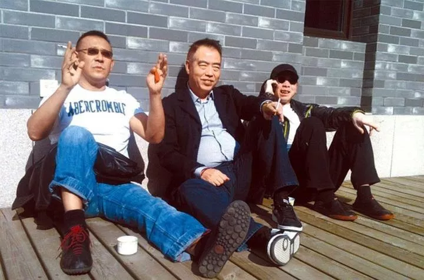

# 赛人（黄勇）

## 陈凯歌天真，张艺谋心狠，冯小刚悲凉，姜文羞涩

> 赛人，原名黄勇，笔名取自海妖的英文Siren。国内知名影评人。现在央视电影频道担任栏目策划。曾供
> 职多家电影媒体。早期，老家卫生防疫站工作，2001年（29岁），他进入《看电影》杂志，成为骨干编辑，
> 2002年任《新电影》杂志主笔，2005年任《电影世界》杂志副主编，同年，在CCTV6《电影报道》(前身为
> 《中国电影报道》)担任策划一职，并工作至今。
> 
> 除在所在杂志发表80余万字电影文章外。《环球银幕》、《中国银幕》、《电影艺术》、
> 《世界都市I LOOK》、《周末画报》、《南都周刊》、《琵雅》、《明星》、《新京报》，
> 以及新浪等门户网站也刊载其发表大量影评类文章。
> 
> 与他人结集出版过《热春光》、《十导演批判》(论述陈凯歌、王家卫)、《中国电影百年》、
> 《电影+2005》等书籍。2016年出版《与光同尘：漫谈110年以来的中国电影》。

**陈凯歌天真，张艺谋心狠，冯小刚悲凉，姜文羞涩 | 赛人评四大导演**

赛人
2017-12-31

过去三十年，从长度和高度两方面而论，中国大陆最重要的导演有四个人。

按照当导演的先后顺序，是陈凯歌、张艺谋、冯小刚、姜文。

再也增加不进去一个名字，也无法减少一个名字。

这个冬天，四大导演中有两位，推出了自己的新片。冯小刚的《芳华》和陈凯歌的《妖猫传》。

这篇文章，赛人把四个人合起来，从他们看待死亡、性的态度，及各自不同的幽默感和人生旨趣，比较
四人，畅快淋漓！

2010年的秋天，陈凯歌、冯小刚和姜文在中国电影公司的制作基地，有了一张合照。

姜文年纪最小，也最意气风发，他脸上没有笑容，但表情极配合当天的阳光。

另两位都笑容可掬，陈凯歌看上去，有些不适应镜头，很少见他有如此淡然的形神。

而冯小刚则还是像我们在胡同里，经常能迎面撞上的熟人，你只要敢搭腔，他就能如黄河水之泛滥而不
可收拾。

当时，三人都在准备各自影片的后期，分别是《让子弹飞》《赵氏孤儿》和《非诚勿扰2》。

冯小刚曾说，陈凯歌这种导演，就该老老实实呆在象牙塔里，他就是什么也不干，国家也得好好养着他，
让他想拍什么就拍什么。

他说姜文，先降低自己的身段，称自己的作品顶多是解渴，是葡萄汁，而姜文的电影是酿好的葡萄酒。
他还说姜文的电影是向高处去，而他是往宽处行。

吊诡的是，在岁末交出的这份答卷里，《非诚勿扰２》最没贺岁的架势，以通体的凉意，丁点抚慰都吝于
出手的姿态，逼向人生的终局。这到底是宽还是窄，是削尖了脑袋，还是放松了肚皮，都可两说。

> 《非诚勿扰2》（2010）

作为2010年中国电影的掩卷之作，《非诚勿扰2》的让人心情跌到谷底，又不盼着升上来的诸端情意结，
得首先归于「干一行厌一行」的著名编剧王朔。

这部电影的象征意味能从时代的反光中，折射出多少终极命题所带来的无法逃遁的紧张感。属于冯小刚，
也属于他的战友们，如陈凯歌和姜文。

王朔与冯小刚

我期待着后两位也能在作品中面对「死亡」，用人生的最后的一杯酒，说出他们的呢喃和私语。我相信
那时候，陈凯歌不会急于去盖棺论定，姜文也不必忙于展现不屑，视生死为寻常事。

但他们已在《赵氏孤儿》和《让子弹飞》里分别表现了死亡，都各有各的视生命如无物。

《赵氏孤儿》是总有一个人的命比自己的命更宝贵。《让子弹飞》里则一次次将死亡充当尊严的证明。
有人划破了肚子，有人的屁股挂在了树上，有人想体面「离去」而不得，后面还有九种死法在等着他。

> 《赵氏孤儿》（2010）

> 《让子弹飞》（2010）

还是在2010年，张艺谋也没闲着，推出了《山楂树之恋》。**这是他自《英雄》以来，最好的一部电影。
**

> 《山楂树之恋》（2010）

那里也有人在死去，老三临终前想听一听静秋叫一下自己的名字，一向乖顺的静秋连这样小小的要求也
没有满足对方。她在哭，她是一定要把遗憾让生者和死者各领一份的。

每看到此，我的后脊梁就发凉。张艺谋的心可真狠呀。

> 《山楂树之恋》（2010）

按当导演的先后顺序，是陈凯歌、张艺谋、冯小刚、姜文（后两位几乎是同一年推出了各自的处女作）。

这四位中国最重要的导演，对死亡的态度，也暗合了他们对电影的心结，这方面，**陈凯歌要天真一些，
一死仿佛就能化解千愁万绪**。

这在《黄土地》《霸王别姬》《搜索》《妖猫传》里都相当显著，且都有一种壮别天涯的况味在，这四
部影片里都有自决或准自决的场景。

**冯小刚这方面思量倒不多，他惟一安排有自寻死路的场景**，是在《我不是潘金莲》里，但公映版对此
作了删改。

> 《我不是潘金莲》（2016）

**张艺谋和姜文则浪漫些，不太纠缠生命告别之后的戚戚然，而更愿意将这视为仪式化的转换。**

在张艺谋饱受诟病的《三枪拍案惊奇》里还玩了一把还魂。《鬼子来了》则将死不瞑目以一张笑脸的形
态示人，《一步之遥》里马走日从高空坠下，他应该感受到死的速度比生的速度要慢，或者说死是对生
的「放大」。

> 《鬼子来了》（2000）

这也许是他们最重要的迥异之处，你怎么看待死亡，就会怎样去看待生存。

人生说白了，就是一场又一场为了告别的聚会。这样来看，《非诚勿扰2》真是特例中的特例，即使在某
些人看来，冯小刚与王朔写就的还只是表面文章，但聊胜于无吧。

> 《非诚勿扰2》（2010）

与死亡真正对应的叙事母题，倒不一定是「生」，而是**「性」**。

**这方面，冯小刚好像有些羞于启齿。**他的两个最重要的文学老师王朔与刘震云，都不愿去钻这个常常
湿漉漉的牛角尖。

《芳华》讴歌了那么譬如朝露、去日苦多的身体意志，但离香艳二字还是远的很。

> 《芳华》（2017）

冯小刚最顽皮的一次，是在《夜宴》里，他用一场舞蹈来展现皇后和太子的欢好。

> 《夜宴》（2006）

张艺谋不绕这么多弯子，他的大部分电影，都与性脱不了干系，**他津津乐道于壮男、衰佬、欲女所组成
的三角关系**，在这其中女性在奖品与祭品之间兜转，而男性要靠些证明自己价值之所在。

我并不苟同张艺谋是在为女性大唱赞歌或挽歌，而是将「旧」女性渴望占有又畏惧蹂躙的心理建设安插
进自己的入世之道中来。

陈凯歌的《大阅兵》被关锦鹏指为有断袖倾向，陈凯歌后来终于认同，但**陈凯歌的情欲书写，实在最为
凶狠、乱伦、虐恋、SM、恋尸都相拥而上。**

> 《大阅兵》（1986）

「性」在陈凯歌这儿，倒不是一种身份的彰显和能力的证明，更多的是一种规避、一种逃窜，是要与世
俗拉开一段距离。

说到姜文，外界总误会他的荷尔蒙会顶到嗓子眼，而实际上，**他比冯小刚还要害羞。**

马小军和李东方都是闻女色变的大男孩，《让子弹飞》里的张牧之刚把手放到女人的胸部，手一挪开，
就以闪电的速度倒头就睡，这份专属男性的娇羞实在可爱得紧。

> 《让子弹飞》（2010）

姜文所陈述的男性，他们认为最好的「性」，存留于脑海最好，若付诸于行动，对方若不叫好，岂不是
丢人丢到家。姜文电影中的「性」，都充满了想象力，也隶属于想象力。他们也就随之把别人的家当成
自己的家，把别人的爱情当成自己的爱情。这在《阳光灿烂的日子》最为明显。

> 《阳光灿烂的日子》（1994）

除冯小刚外，其他的三位导演，都不惮于他们对欲望的窥伺，不止步于这仅仅是关乎身心的痛并快乐，
也不会一味赞美性乃唤醒解放的吹鼓手。而将男女间的互通有无，视为一种与自己、与世界对话的方式，
只是畅所欲言的境况少，准暴力不合作的时候多。

他们这四位，要找到他们的共通点并不难。他们都有着不俗的演技，都能自己亲手写本子，论文笔，陈
凯歌是最好的，冯小刚也不弱。

他们都有幽默感，张艺谋是最出色的，**《有话好好说》是中国电影史上最好的喜剧之一。**

> 《有话好好说》（1997）

他们都与上世纪八十年代末以来中国最优质的男演员之一的葛优，有过相当精彩的合作。冯小刚和葛优
在相当长的时间内，都是互相成全。

张艺谋的《活着》则将葛优推到戛纳影帝的宝座。他们都有着轻重不一的军队背景，他们都拍过文革。
他们的电影都有着精神自传的倾向。他们最大的共同之处，都爱探究个体与集体之间的唇齿相依或唇亡
齿寒。

> 《活着》（1994）

《芳华》和《妖猫传》实际说的都是一回事，都是对宏大叙事的质疑，都表现了对集体生活的又爱又恨。

> 《妖猫传》（2017）

**张艺谋一开始，是有着捣不清、泄不完的愤恨。**

《红高粱》、《菊豆》、《摇啊摇、摇到外婆桥》里都少不了有仇必报的主，都有着一桩桩血淋淋的刺
杀行为。《有话好好说》发生了转变，刺杀成了一出闹剧，对象和动机被越来越多的看客所干扰所破坏。

> 《红高粱》（1988）

《英雄》是彻底放弃了，你可以说这是为和平主义或大一统所作出的妥协，但也是「杀了XXX，自有后来
人」式的自我安慰。

> 《英雄》（2002）

到了《归来》，陆焉识手拿不起眼的「凶器」，临了还是罢了手，冤冤相报何时了。

> 《归来》（2014）

陈凯歌最早的，也是他最好的三部作品，即《黄土地》《大阅兵》和《孩子王》讲的都是个体融入集体
时的不达、不安和不适。

> 《黄土地》（1984）

《搜索》所描述的互联网时代，则是一种更无声、更无形的集体意识在肆虐。姜文仿佛继承了五四以来
的作家对愚民的态度，他是不会输入哀其不幸、痛其不争的情结，他只是以精英的姿态在冷冷的旁观，
颇为促狭的看着他们的熙熙攘攘，看着他们如潮水般聚拢，又如潮水般退去。

> 《搜索》（2012）

有必要说明一下的是，很多人观影的时候还停留在孩提时期，总要问大人，谁好谁坏，希望有个大是大
非来判定一个左右忠奸。人是如此，由人组成的集体他们也希望如此。

在审美意义上的集体生活，若一棍子打死，只会成为另一利益集团的帮凶，温婉一点的说法，只是为他
人作嫁衣裳。

就这一命题荡开来，中国电影极少建筑纯粹专属个体的、泛人性化的空中楼阁（像蔡明亮这类自说自话
的导演实在是异类中的异类）。

这也导致，最为教条也最为通行的电影评论方法，是尽力从最浮泛的影片中，考究出社会学的议题来。
人是一切社会关系的总和，你必须把人放到社会环境中去体察，才能判定人之为人的诸多证据。这是不
是惟一可行的方法，在此不再讨论。

> 陈凯歌、张艺谋、冯小刚、姜文。

这四位导演好就好在，**他们能自觉或不自觉地去表现，那些阳光还未照到的、风还没有吹过来的模糊地
带。****他们深晓集体的不可或缺性，也深晓总有一处闲庭供个体去信步，是艺术、是爱情、或者是一
个说不清楚的梦。**

不要忘了，马小军最怡然自得的时候，是独自在房顶上行走。李香山在公墓前感慨：生前人挤人，死后
还这样，还是扬了吧。更不要忘了《孩子王》中的老杆告诫他的学生，不要再抄了，连字典也不要抄了。
真是了不起的电影！

> 《孩子王》（1987）

他们也知道，最广泛的国人最大的愿望是活给别人看，又丝毫不挂怀别人到底要看什么。他们就这样也
毫不迷惘的姿态，一步一个脚印，清醒地活着。
