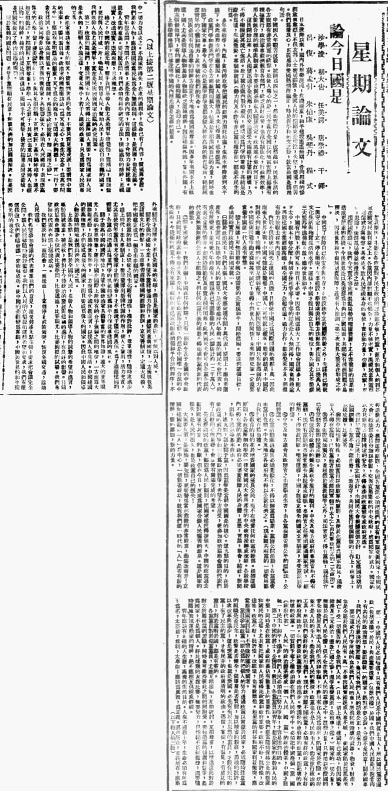

# 沙学浚 等

## 论今日国是

> 大公报（天津）1946 年 1 月 6 日第 2 版的文章《论今日国是》（星期论文）。  
> 作者：沙学浚、初大告、任美锷、唐崇礼、干铎、吕复、蒋孟引、朱伯康、吴斐丹、程式

日本投降以来，国内外形势混沌，危机严重，和平建设遥遥无期，骨肉相残的惨剧愈演愈烈；不但友邦人士密切关怀，全国人民的情绪更是彷徨，失望，忧虑，痛苦。我们为着良心，正义感和爱国热情所驱使，特于教学和研究之余，就当前国是讲几句话。

中国因八年艰苦抗战，被称为四强之一，然而实际力量，依然薄弱，民族生活的各方面都有非常严重的缺点。最使人痛心的是三民主义在全国任何地区实际上都没有积极实行，政治军事经济教育各部门，缺乏良好政策，也没有制度化，行政无效率，用人并无合理的标准与制度，主要由派系和私人关系决定。政风遂不免江河日下。

复员开始以来，人人渴望迅速安全返乡，但因交通遭受大规模有计划的破坏，乃不得不继续度其流亡生活。壮丁被迫做内战的炮灰，破坏成为斗争的策略，其结果是庐舍为墟，生民涂炭。专制和统制（势力所及不许有非己党的报存在）都是不民主的行为。

多年来战争，内乱，贪污榨取等把国民的经济力消耗殆尽，生活水准降低到水平线下。由此而形成的普遍穷困，使国人道德堕落，文化衰退，社会混乱。

政党斗争和派系斗争在各方面展开而扩大，结果是互相消灭自己的力量，同时也贻误了国家大事。最令人痛心的是党争派争竟然也侵入神圣高尚的教育场所，耗蚀纯洁青年的心灵和精力，甚至牺牲他们的生命。

民族必须有独立自尊的精神方能立于大地而为他国所尊重。因多年来国事不上轨道，国人尤其是领导人物和基干人物都缺乏这种精神，因而迷信外国，盲从外国，有的主张仿效甲国，有的要乙国化，俯仰随人，忘却自己。

上举荦荦几点，已够说明中国的内部危机是怎样的严重。

推其原因，主要是各政党对于民主政治的认识都不够，把党、派系和个人的利益放在国家民族利益之上。各党因内部组织不够健全，力量不够充实，漠视民意与选票，迷信武力与地盘。其次是多数人民忽视本身的地位，实任和力量，旁观，沈默，忍，退缩，使混乱局势益无澄淸之法。

环顾国际环境，我们今天实不容此种混乱局势的继续发展，尤不容发展的结果而造成更严重的危机。今后世界是以英美苏为主角的三国局面，其间尙有种种问题不易解决，因此世界和平尙无切实保障，甚至有人惟测「第三次世界大战正在形成之中」。

中国为了保障自己的安全与生存必存，必须设法中立于国际纠纷之外，先谋自己的统一与安定——立即停止冲突，从事建设，学习欧美科学方法与生产技术，以提高人民文化生活与物质生活的水准。这样，中国才能以独立自主的地位，与各国尤其英美苏三大盟邦增进传统友谊，维持世界和平。

中国有内战，不但可耻，而且不必要。因为中国这样大，工作机会这样多，而人才太少，根本不够分配，何须乎拚死争夺！争夺的结果是人人无所得，国家也无前途。再则建国大业经纬万端，竭全国之力，急起直追，通力合作，都感觉来不及，那还有余力余暇去从事内战！

内战不但将使中国失去建国的良机，且将使中国成为国际问题的焦点；万一因此而牵入世界大战，中国可能就是战场，中国人民可能就是炮灰。战争的结果，中国绝对得不到好处，能得到的可能是衰弱甚至亡。原因很简单：中国只有很薄弱的力量。中国假使因战争而更衰弱甚至灭亡，并得不到世人的同情；未来的历史家一定还要责备中国这一代人没有智慧。

据上所述，可知目前中国急切需要的是实现和平，开始建国。要达到这个目标，必须同时实行政治民主和国家统一。

（一）关于政治民主，我们主张：国民大会应从速召开，其代表，原则上，应由普选产生，盖普选可以反映全国人民的意见，是否要维持八年前所选的国民大会代表，抑或有所变更；并可使八年前没有，而现在已有选擧权的人民（据估计约一二千万人）有表示意思的机会。如因时间迫促及事实上种种困难，此次国民大会可由各党各派的代表及无党无派的公正人士组织之。但任何政党代表的总数不得超过无党无派的代表的总数。

（二）关于国家统一，我们主张：中国在任何时期，只有一个政令及于全国的中央政府，目前国民政府其政令虽未及于全国，在宪政实施之前，仍然是中国唯一合法的中央政府。今后任何政党不得私有军队，政府的更迭或改组必须循和平合法的程序，不得凭借武力。根据这些原则，全国各党派必须把他们的私有的军队交与国家，由国民大会织整军委员会加以编，交与实施宪政的中央政府，成为国家的武力。国家的武力只能用以保障国家的安全，不得牵涉到政党竞争或政府更迭。

（三）以切实实行三民主义为立国方针，由国民大会根据这个方针订定建国时期的建国纲领，各党不论在朝在野，一致遵守，共同在推行这个纲领的工作上，政策上，表现成绩，比赛优劣。

（四）因中国情形特殊，必须实行以政驭军的原则，及便于化党军为国军起见，现役军人不得有党籍，已有党籍者脱党或离开军籍（日本之亡由于军政对立的二元政治）。

（五）为了保证司法独立，并超然于党派竞争之外，司法官吏不得有党籍，现任法官已有党籍者应即脱党或辞职。

（六）为保证行政体系的健全与放令推行的顺利。中央及地方政府的事务官均不得有党籍，现任有党籍的事务官应令其脱党或辞职。事务官之任用须经过国家考试，一经任用，不得无故空缺。唯有这样，中国才能建立健全的国家文官制度，不受党派竞争的影响。

（七）中央及地方议会及政务官之由选举产生者，由各党根据妥善公平的选擧法，公开竞选。

（八）政党活动应该而且必须业余化，不得以办党为职业。党务公开活动，各党党费由党员负担。中央及地方各政府均不得以公款接济之。（现在国共两党的一切费用都由我们老百姓负担。）

（九）教育的目的在于培养国家的优良公民，而不在培养任何政党的干部。根据这个原则，各政党所办的学校一律交与国民大会所产生的中央政府接办或改组。各级学校内不得有党的活动。政府必须切实保障人民的身体，思想，言论，集会，结社，新闻，出版，通讯等基本自由。

上述九点，部是关于党，因为党争是当前中国国是的核心。这九点的目的，在于使政党的武力斗争如何化为政治竞争，希望各方接受，使参加政治协商会议的代表们有了良好的心理基础，会议便有圆满完成的希望。

英美苏诸国的政党，都能为人民福利，把国家建设得很强大。中国的政党过去都对国家有其重要的献，但在今日，反成为国家分裂人民痛苦的源泉。这是国家的损失，是人民的损失，也是政党自己的损失！

大家要反省，要忏悔，要觉悟，更要警惕当前危机的非常严重，而痛改前非！立国和建国都以「人」为中心，一切能否成功，就看我们这一时代的「人」是否有新的精神，新的认识，新的力量。

第一，中国的人民必须知道，只有我们人民是中国的真正主人，所以国民党要还政（包括军权）于民，共产党要还军（包括治权）于国。我们中国人民都是同胞骨肉，有共同的政治理想，要组织统一的国家，绝对不要分裂。分裂不是民意！关于国事，我们人民有最后的发言权，也只有我们人民的话最公正，最有力。

要知道武力斗争所流的血是我们人民的血，所消耗所毁坏的武器，物资，财产，也是全属于我们人民所有。万一不幸因国错误或人事不臧，使国家陷于混乱甚至灭亡，受一切痛苦的，全是我们人民。（日本一切上轨道，建国早已成功，但因国策错误及二元政治，遭致亡国之惨，还争什么党派，是前车之鉴。）国家的一切力量，虽属于我们人民全体，但不全在我们人民的掌握之中。这些力量，只许用以保证国的安全和发展及增进人民的生活和幸福，不许用来化人民为炮灰，陷国家于危险。政府并不是人民的主人，而是我们人民的仆役，政党也不是人民的主人，而是推行政治的工具，所以我们要好好的使用他们。现代政治离不开政党，必须有好的政党，才有好的政府与政治。我们要使政党竞争，政治进步。爱护好的政府好的政党，拒绝坏的政府坏的政党。一切赏罚予夺之权必须振在我们人民的手中。必须把中国几个「党–>（国政府代表）–>人民」的政治体系变成一个「人民–>国–>党」的政治体系，中国才能统一，民主，和平，进步。我们人民必须自己努力争取，才容易达到目的。

第二，中国的将士，公务员员，教员，各党党员和青年，都是国家的基干和人民的中坚，同时是在政党，或政府里占有数量上的重要性。我们应当随时保持公正的态度和国民的立场，尤其要把国家和人民看得比政党和政府重要。政府不好，批评他，改造他，政党不好，批评他，改组他，也可脱离他。如果党的利益和国家利益冲突，应当维护国家利益，不惜做脱党的爱国者。

党员参加政党，原是为的把个人的努力透过政党以贡献于国家，必须随时注意党的组织是否民主，政策是否健全，领导层是否贤能，加以精审的观察，勇敢的批评，以求改革与进步，这是爱党，也就是爱国。必先有有民主思想的党员，才能有民主的党；有了民主的党，才有民主的政府与淸明的政治。迷信，盲从，有偏见，有成见的党员，对于党对于国，都是有害的。

各党党员对于他党党员，尤应互相接触，互相研讨，互相尊重，以增进彼此对于对方所属政党的认识，同时也可维持彼此之间的同胞爱。要知道党的竞选和竞争，是为国家，不是为个人。好比球类的友谊比赛，虽要努力，但情绪不妨轻松些，还要随时随地表现运动家的精神，绝不应相互仇视或轻视。

青年应该有正确的人生观，高尚的生活目的。人生不过数十年，生命必须有所为：为名，太空虚，为利，太卑俗；应该为真理，为正义。真所在，正义所在，应集中一切力量以求之。不论成败得失，在求的过程中，生命已有了内容，价值与安慰。我们基干人物，应该为国家为民族为全人类谋福利。这样做，是真理，也是正义。

青年很苦闷，苦闷不是坏事，正是生命的内容，有苦闷，才会努力去解脱他。这就是人生的意义。要解脱苦闷，我们必须有科学研究的方法，积极进取的精神：正视现实，改造现实，崇高理想，追求理想。

总之，中国的前途光明，系于我们基干人物尤其是青年能觉悟，能团结，能振奋，更能与人民打成一片，唤起人民，领导人民，帮助人民，去建设自由幸福的国家。我们基干人物尤其是青年，实在是民族兴衰国家治乱的决定因素。

第三，政党的领袖们，应该把国家和人民看得比党和个人重要，因为国家和人民是永久的，而个人不论怎样，究竟太渺小，若干人组成的政党，只是为国家人民做事的工具。

政治家应该有远大的眼光，能看到世界的全部，不要只看见党或派；要看到中国的未来，不要只看目前。政治家的理想应该是「为天地立心，为生民立命，为万世开太平」；应该有光明磊落的态度，天下为公的抱负，宽闳博大的胸襟；一言一行，要含有真诚，善意和高尚价值。有了这种种，再去谈政治技术，即「运用之妙」。

政治家同时是以身教以言教的教育家，其影响很大，必须在人民面前，表现崇高伟大的人格，留下优美深刻的印象印象。与其互相指摘，互相攻讦，甚至祸蚌相争，远不如互相批评，互相谅解，互相尊重，学学「古之君子，其责己也重以周，其待人也轻以约」的精神，前者的结果是两败具伤，而国事不可救药；后者的结果是同登圣城，并为国家奠立了政治道德的规范。

关于当前的国是问题，希望各党能顺从民意，和衷共济的加以圆满解决。如果因外来关系才能解决，不但是国家的耻辱，而且是国家的危机，无以对人民。

关于今后的建国大业，希望各党能够通力合作，根据民意与国情，一方面吸收英美诸国文化的优点，一方面学习苏联建国的经验和教训，立完善制度，定远大规模，把中国建立成为一个自由幸福的国家。

关于政党的组织，必须使之民主化而有韧性，准许批评，尊重理性，随时求进步，赶上时代；在人事制度上，要能发挥出新陈代谢的作用，使人才辈出，活力充实，尤其要使青年党员有充分发挥才能的机会，才不致流于僵化与落伍。为了适应建国的需要，各党必须把过去偏重斗争的风气转变为和平合作从事建国的风。

关于提高中国的国际地位，希望中国政治家具备丰富的世界知识，远大的世界眼光，高超的世界理想，运用中国在国际上所特有的介于强弱之间的地位，一方面为大国排难解纷，以维持世界和平，一方面为小国仗义直言，以提高人群生活。中国建国的最高理想，不但要成为强大的国家，而且要成为伟大的国家。因此中国人民和领导人物要随时随地表现出泱泱大国之风。

上述各点，是我们对于全国的人民，基干人物和领导人物的诚挚的希望和进言，亟盼能被尊重，被接收，俾对于今后政治的发展与建的进行，有良好的影响。目前政治协商会议是各位代表比赛学问，比赛道德，比赛眼光，比赛胸襟的试场。我们希望每位代表在会议上都能成功。

我们坚决反对一面开会，一面流血——立刻停止武装冲突，恢复全国交通，协助人民还乡。

我们希望参加会议的代表尊重我们的意见，接受前述九点主张；要求把会议完全公开，让人民能够随时批评监督。我们以人民的立场提出这些希望和要求，我们有权这样做，我们祈祷会议一定能够成功。使中国的悲剧变为喜剧，中国与世界的和平获得光明的前途。

