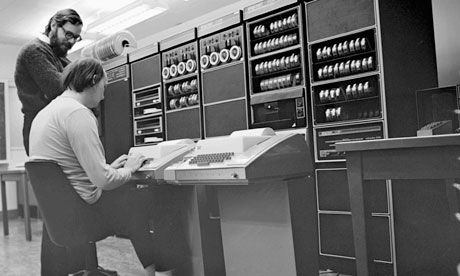
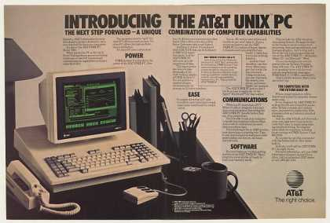
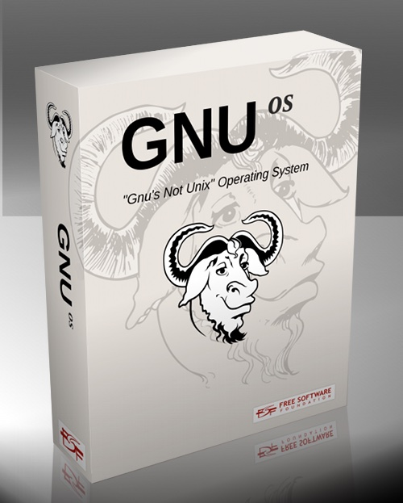
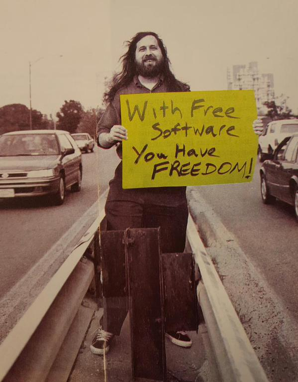
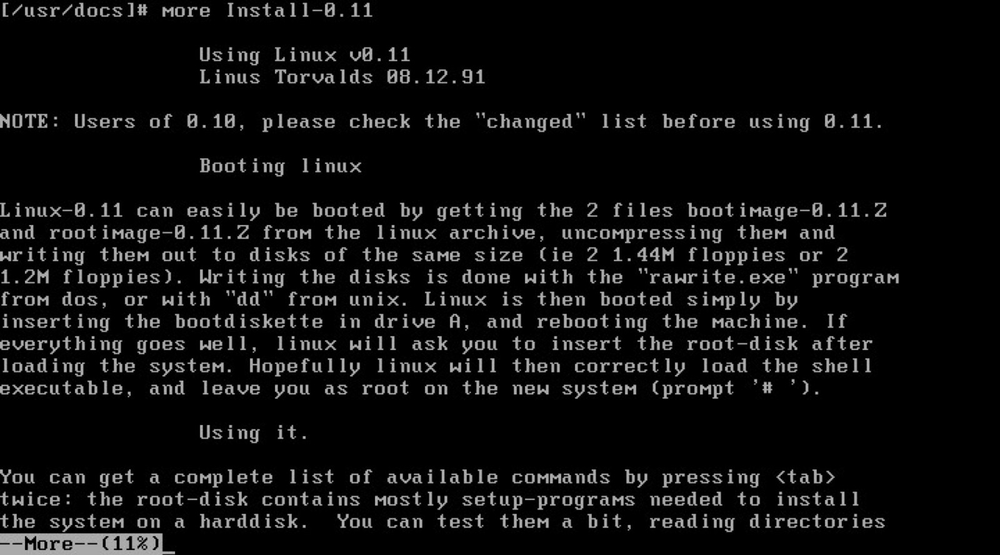
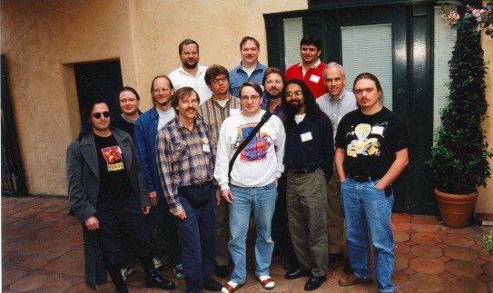
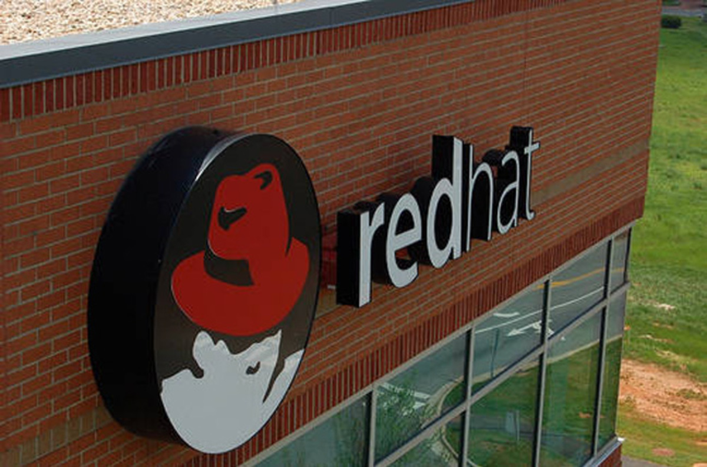
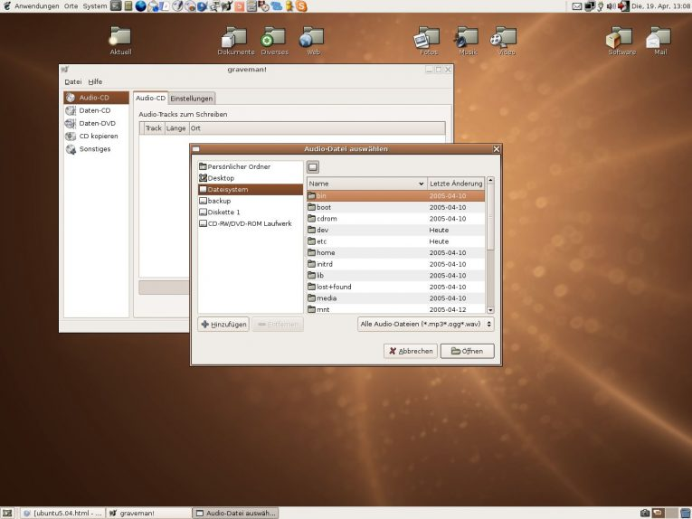
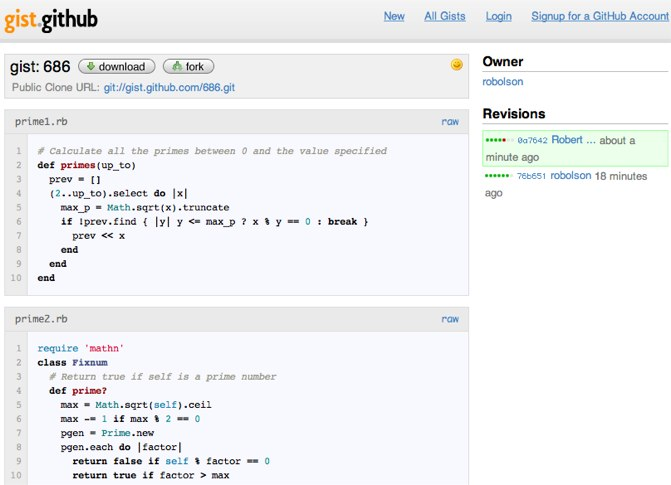

# Christopher Tozzi

## Unix to GitHub: 10 Key Events in Free and Open Source Software History

《从UNIX到GitHub：十个关于自由和开源软件历史的重要事件》

### 说明

作者：Christopher Tozzi

文章来源：

- 原文：[The VAR Guy, 原文（失效）](http://thevarguy.com/open-source/unix-github-10-key-events-free-and-open-source-software-history),
- 翻译： OSChina 编辑部的故事, 从 UNIX 到 GitHub, [linux.cn 转载](https://linux.cn/article-8998-1.html)

### 正文

<!-- tabs:start -->

#### **English**

##### Unix to GitHub: 10 Key Events in Free and Open Source Software History

> t's easy to take open source software for granted today, but free and open 
> source software as we know it is the product of a long series of developments 
> that stretch back a half-century. Here's a look at some of the big moments in 
> free and open source history -- from the heyday of free Unix, to the birth of 
> GNU and Linux, to the GitHub's democratization of coding, and everything in between.

> These are just some of the big events in FOSS history. For a more complete 
> narrative and analysis of the historical events that created the free and 
> open source world in which we live, check out Christopher Tozzi's new book, 
> For Fun and Profit: _A History of the Free and Open Source Software Revolution_.

###### 1969: Birth of Unix

In 1969 programmers at AT&T's Bell Labs began work on Unix. Unix was never a
free or open source operating system. It was born before the concept of free
or open source software even existed. Until the early 1980s, source code was
almost always available to anyone who wanted it. In this respect, Unix played
little role in promoting the idea of sharing source code.

Still, the culture that grew up around Unix played a foundational role in
birthing what would later became free and open source software ideologies and
communities. Unix programmers and users saw themselves as rebels against the
increasing corporatization of software. They shared code with each other
freely. They collaborated on the development of the Unix system in a
decentralized fashion.

###### 1984: AT&T Commercializes Unix

For the first fifteen years of Unix's existence, AT&T, which owned the
operating system, was forbidden by court order from profiting off of it. (The
order dated to 1956, when the federal government, in an effort to prevent
monopolization, issued a consent decree that forbade AT&T from generating
profits in markets other than telecommunications.)

Things changed in 1984, when the consent decree was lifted and AT&T was able
to begin selling Unix at a profit-generating price. The Unix source code
remained available. However, AT&T's decision to transform Unix from a research
project into a commercial product engendered a crisis within the community of
Unix hackers. They began looking for an alternative Unix-like system that was
not encumbered by commercial trappings.

###### 1984: Birth of GNU

In the same year that AT&T commercialized Unix, Richard Stallman launched the
GNU project. GNU was a "complete Unix-compatible software system which I am
writing so that I can give it away free to everyone who can use it,"as
Stallman put it in 1985. In other words, GNU was a free alternative to newly
commercialized Unix.

When the GNU project was launched, the modern concept of free software was
only just coming into existence. Even Stallman had not yet fully fleshed out
what "free"meant. It was easy for followers of the GNU project in its early
years to assume that Stallman was interested merely in developing software
that did not cost any money.

Yet over the next several years, as it became increasingly uncommon for
developers and companies to give away source code with their programs, GNU's
true significance became clear to programmers and users. GNU's importance
hinged on the project's commitment to making all source code freely available.

###### 1985: Creation of the Free Software Foundation

As Stallman's vision for promoting software freedom evolved and matured, he
realized that writing and giving away GNU source code was not enough. Along
with other GNU collaborators, he founded the Free Software Foundation, or FSF.
The FSF helped to create the legal and institutional framework that protected
GNU and other free software projects.

###### 1991: Birth of Linux

Although GNU programmers succeeded in writing a great deal of important
programs, their efforts to create a Unix-like kernel to complete the GNU
system chronically stalled. (The GNU kernel, called Hurd, remains under
development today, but after nearly three decades of work it is still not
close to being usable for production.)Meanwhile, the free software kernel from
the BSD project was encumbered by legal difficulties.

This created an opening for Linux. Linux was born as the pet project of Linus
Torvalds, a Finnish undergraduate who in the spring and summer of 1991 wrote a
Unix-like kernel from scratch and gave the source code away. (Initially,
Torvalds protected Linux with a crude license he wrote himself, but he
switched after a few months to the GPL license, which the GNU project used.)
Linux provided filled the gap that GNU users needed to be able to run a
complete Unix-like system using only free software.

###### 1998: Open Source Summit

By the later 1990s, free software from GNU, Linux and other important projects
(such as Apache)was becoming widespread. It was no longer the niche of obscure
hackers with what seemed to outsiders like socialist agendas.

Yet all was not well within the free software community. Fissures began to
emerge as some hackers, led by figures like Eric S. Raymond, started to worry
that Stallman and the FSF laid the ideology on too thickly when promoting the
sharing of source code. Raymond and his followers believed that for free
software to succeed with the public at large, the messaging of its proponents
should focus on the practical importance of making source code available,
rather than philosophical principles involving sharing and morality.

This concern led to a summit in 1998 between about a dozen prominent members
of the free software community. (Stallman, however, was not invited.)The
participants decided to begin using the term open source software instead of
free software to promote software whose source code was publicly available.
They believed that open source sent a clearer message to the public regarding
what free software was and communicated its value in a less ideological way.

###### 1999: Red Hat's IPO

Proof of the commercial significance of free and open source software arrived
in August 1999, when Red Hat became the first open source company to begin
trading publicly.

Although other open source companies that went public in the same period --
notably VA Linux -- fared much less well, Red Hat remains a leading company
within the open source market today.

###### 2004: Launch of Ubuntu

By the late 1990s there were many dozens of GNU/Linux distributions available.
But GNU/Linux struggled to overcome an image as a type of operating system
that was difficult for anyone except geeks to use.

The birth of Ubuntu in 2004 helped to change this. Founded by Mark
Shuttleworth, a South African philanthropist and onetime space tourist who had
made his fortune selling proprietary software, Ubuntu was tagged as "Linux for
human beings."

With its slick interfaces and thriving user community, Ubuntu is by most
counts the most widely used GNU/Linux distribution today. It arguably did much
to put free software in the hands of people who otherwise would never have
tried their hands at anything with Linux in its name.

###### 2007: Launch of Android

The software project that has placed free and open source software into the
hands of the most people is undoubtedly Android, an operating system for
mobile devices. Android is the most widely used mobile platform by a large
margin.

Although most Android users probably don't know it, Android is based in part
on the Linux kernel. This fact does not sit well with all free and open source
software advocates, who often complain that the licensing of Android does not
project software freedom, and that Android devices tend to be locked down with
proprietary components and bloatware -- the types of annoyances that, in the
desktop world, push people toward GNU/Linux. For their part, Android
developers have contended that "Android is not Linux,"despite the platform's
roots.

###### 2008: GitHub Democraticizes Open Source

Initially, contributors to most free and open source software projects
collaborated via email or through privately hosted version control systems
like Subversion or BitKeeper. This practice was not only clunky because there
was no centralized, streamlined location for finding and contributing to open
source projects, but also because some version control systems were
proprietary.

The launch of GitHub in 2008 changed this. GitHub provides hosting for
repositories that are built using Git, an open source version control system
that Linux kernel developers created started in 2005 to replace BitKeeper, the
closed-source solution they had been using.

Although you don't need to use GitHub to use Git, GitHub arguably
democraticized open source by making it easy for anyone to submit code or host
an open source project. Thanks to GitHub, you no longer need to know where to
open source projects (virtually all of them now host their code on GitHub),
and you don't need to gain privileged access to developer communities in order
to participate in open source development.

...

---

##### **中文翻译**

##### 从 UNIX 到 GitHub：十个关于自由和开源软件历史的重要事件

> 现在看来，大家很容易会把开源软件当作是理所当然的，但事实上，我们应该知道自由和开源软件是经历了长达半个世纪的一系列漫长发展的产物。

> 本文记录了自由和开源历史上的一些重要时刻，也称得上是 FOSS 历史上的大事件。从 UNIX 的全盛时期，到 GNU 和 Linux 的诞生，再到 GitHub 将开源“民主化”，以及在它们之间的一切。

###### 1969：UNIX 的诞生

1969年，AT&T贝尔实验室的工程师开始开发UNIX。此后的10年，UNIX在学术机构和大型企业中得到了广
泛的应用，当时的UNIX拥有者AT&T 公司以低廉甚至免费的许可将UNIX源码授权给学术机构做研究或教
学之用，许多机构在此源码基础上加以扩充和改进。后来AT&T意识到了UNIX的商业价值，从1979年
UNIX的版本V7开始，不再将UNIX源码授权给学术机构，并对之前的UNIX及其变种声明了版权权利。事实
上，UNIX在自由或开源软件的概念存在之前就已诞生，可以说，UNIX从来都不是一个自由或开源的操作
系统。从某种意义上来说，UNIX在促进共享源码方面起了很小的作用。

然而，围绕UNIX而成长起来的文化在后来的自由和开源软件的意识形态和社区诞生过程中起到了奠基性
的作用。UNIX的开发者和用户把自己看成是对抗软件商业化的“反叛者”，他们自由地共享源码，以分
散的方式共同合作开发UNIX系统。

###### 1984：AT&T 将 UNIX 商业化

从UNIX诞生起的前十五年，UNIX操作系统的拥有者AT&T是被法院禁止从中获利的。起因是1958年AT&T
为避免美国司法部起诉它违反《反垄断法》而签订的和解协议。AT&T垄断了美国长途电话业务，因此它
同意不进入计算机行业，不销售任何与计算机有关的产品，UNIX是计算机操作系统，所以AT&T不能销售
它，任何要求得到源码的机构，都能免费得到。

然而在1984年，事情发生了变化，当时对AT＆T的限制法令被解除，AT&T开始以能获利的价格销售UNIX。
UNIX的源码依然可用，但AT＆T将UNIX从研究性质的项目转变为一个商业项目，这在UNIX黑客社区里产
生了危机。他们开始寻找一个可替代的类UNIX系统，且不受商业陷阱的阻碍。

###### 1984：GNU 的诞生

在 AT&T将UNIX商业化的同一年，理查德·斯托曼（简称RMS）发起了GNU项目（GNU's Not Unix!的
递归缩写），目标是创建一个完全自由且向下兼容UNIX的操作系统。RMS在1985年曾说过，GNU是一个我
正在编写的完全兼容UNIX的项目，所以我可以让每一个使用它的人都能自由地使用。

GNU项目刚启动时，自由软件这一现代概念也才刚刚诞生，即便是RMS也没能充分表达其中“自由”的含
义，早期GNU项目的追随者轻易地认为RMS只是旨在开发不收任何费用的软件。

然而，在接下来的几年里，由于开发者和公司越来越少地在发布程序的同时提供源码。此时，对于程序
员和用户，GNU的真正含义开始变得清晰。GNU的重要性体现在项目承诺所有的源码都能自由使用。

###### 1985：自由软件基金会的建立

随着RMS推动自由软件发展和成熟的愿景日益强烈，他意识到仅通过编写和分享GNU代码是远远不够的。
于是，他建立了自由软件基金会来协助该计划。

自由软件基金会（简称FSF）是一个致力于推广自由软件的美国民间非营利性组织。它于1985年10月由理
查德·斯托曼建立。其主要工作是运行GNU计划，开发更多的自由软件。FSF帮助创建了保护GNU和其他
自由软件项目的法律和制度框架。

###### 1991：Linux 内核的诞生

作为操作系统，GNU最大的问题是具有完备功能的内核尚未被开发成功。虽然GNU项目的开发者成功编写
了大量重要的程序，但他们努力创建一个类似UNIX的内核来完善GNU的工作却长期停滞不前。GNU的内
核，称为 Hurd，是自由软件基金会发展的重点，今天仍在开发中，经过近三十年的开发，它仍然不能
可靠地用于生产环境。同时，BSD项目的自由软件内核也受到法律方面问题的困扰。

这为Linux内核创建了一个开放的机会。Linux内核是1991年Linus Torvalds在其大学时期开发的一
个项目，并将代码贡献了出来。最初，Linus采用的是自己拟定的许可证，这个许可证会限制商业使用，
后来他转用了GNU项目使用的GPL许可证。当时GNU项目仍未完成，GNU系统软件集与Linux内核结合后，
GNU软件构成了这个POSIX兼容操作系统GNU/Linux的基础。

所以，Linux内核填补了GNU用户需要完整的且使用自由软件的类UNIX系统的空白。

###### 1998：开源峰会 (Open Source Summit)

到了20世纪90年代后期，GNU，Linux以及其他重要项目（如Apache）的自由软件越来越普及。

由于像Eric S. Raymond这样的黑客们开始担心RMS和FSF在推动自由软件的时候，受意识形态的影响
太深，从而与现实脱节。Raymond和他的追随者认为，为了自由软件尽可能大范围地取得成功，他们应
该侧重于提供源代码的实用价值，而不是过多的涉及共享和道德的哲学原则。

同时期，Netscape宣布将其Navigator浏览器的源代码在Internet上公布。这一系列举动使得在
1998年2月3日，资深黑客Eric S. Raymond邀请了大约十几个自由软件社区的著名成员一起开会（RMS
没被邀请），希望可以促使更多公司能够理解黑客社区早已行之有时的开放式软件开发流程的独特优势，
使这种先进流程能够得到更广泛的应用。与会者都认为，这是一个有助于消除过去人们对“自由软件”
存在误解的大好时机，除了free（免费？自由？）这个词的含混之外，还有自由软件给公众留下的宗教
化和喜对抗的印象，从实际出发，针对企业的顾虑，将自由软件中实用和有助于业务的核心理念推广出
去。

与会者决定使用“开源软件(open source software)”来代替“自由软件(free software)”，以
推广开源这一概念，让大众更清晰地明白其与自由软件之间的差别，并以较少的意识形态方式来传递价
值。

###### 1999：Red Hat 的 IPO

1999年8月11日，红帽公司正式上市，成为第一家开始公开交易的开源公司，这是自由和开源软件具有商
业意义最有力的证明。
虽然在同一时期上市的其他开源公司——尤其是VA Linux，它的表现并不好，但红帽仍然是当今开源市
场中的领先公司。

###### 2004：Ubuntu 的推出

到20世纪90年代末，已经提供了许多GNU/Linux发行版。但因为缺少对用户友好的图形界面程序，除了极
客之外，极少的用户能熟练使用。

诞生于2004年10月20日的Ubuntu改变了这个情况。Ubuntu由南非慈善家和企业家Mark Shuttleworth
所创立，被称为“为人类而生的Linux”。

Ubuntu的目标在于为一般用户提供一个最新同时又相当稳定且拥有友好的界面，主要以自由软件构建而
成的操作系统。Ubuntu目前拥有蓬勃发展的用户社区，具有庞大的社区力量支持，用户可以方便地从社
区获得帮助，是目前使用最广泛的GNU/Linux发行版。

###### 2007：Android 的推出

将自由和开源软件提供给最多人使用的软件项目无疑是Android移动设备操作系统。Android是使用最
广泛的移动应用平台。

虽然大多数Android用户可能不知道Android部分是基于Linux内核的，然而，很多自由和开源软件的
倡导者抱怨Android的许可证没有提供软件自由，而且Android设备往往会被专有的组件和预装软件限
制着，类似这种使用的不便，更多人倾向于使用GNU/Linux。对于这种情况，Android的开发者认为“
Android不是Linux”，尽管有这个平台的根源。

###### 2008：GitHub 将开源“民主化”

最初，大多数自由和开源软件项目的贡献者通过电子邮件或私有的版本控制系统（如Subversion或
BitKeeper）进行协作。这种做法不仅笨重（因为没有集中的、精简的位置来查找开源项目和为其贡献）
，而且某些版本控制系统还是专有的。

诞生于2008年的GitHub改变了这一情况。GitHub提供使用Git进行版本控制的软件源代码托管服务。
Git是一个开源的分布式版本控制系统，由Linus Torvalds开发，于2005年在GPL开源许可证下发布。
最初目的是为更好地管理Linux内核的开发，用于替代他们曾经使用的闭源解决方案——BitKeeper。

GitHub的出现，使得更多开发者能更方便地参与开源项目，为开源项目贡献，任何人都可以轻松提交自
己的代码，并在GitHub上托管自己的开源项目。

因为几乎所有人都把自己的代码托管在GitHub上，所以更容易查找开源项目，而且协作方式的改变，开
发者也不再需要获得开发者社区的权限才能参与开源项目。

<!-- tabs:end -->
