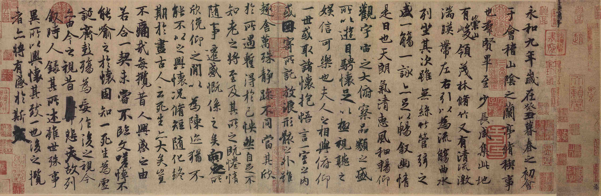

[[toc]]

# 王羲之

## 兰亭集序

<!-- tabs:start -->

#### **简体中文**

永和九年，岁在癸丑，暮春之初，会于会稽山阴之兰亭，修[^1]稧[^2]事也。群贤毕至，少长咸集。此地有崇山峻领[^3]，茂林修竹；又有清流激湍，暎[^4]带左右。引以为流觞曲水，列坐其次。虽无丝竹管弦之盛，一觞一咏，亦足以畅叙幽情。

是日也，天朗气清，惠风和畅。仰观宇宙之大，俯察品类之盛。所以游目骋怀，足以极视听之娱，信可乐也。

夫人之相与，俯仰一世，或取诸怀抱，悟言一室之内；或因寄所托，放浪形骸之外。虽趣舍万殊，静躁不同，当其欣于所遇，暂得于己，怏然[^5]自足，不知老之将至。及其所之既倦，情随事迁，感慨系之矣。向之所欣，俛[^6]仰之间，以[^7]为陈迹，犹不能不以之兴怀；况修短随化，终期于尽。古人云：“死生亦大矣。”岂不痛哉！

每揽[^8]昔人兴感之由，若合一契，未尝不临文嗟悼，不能喻之于怀。固知一死生为虚诞，齐彭殇为妄作。后之视今，亦由[^9]今之视昔，悲夫！故列叙时人，录其所述，虽世殊事异，所以兴怀，其致一也。后之揽[^10]者，亦将有感于斯文。

#### **繁体中文**

永和九年，嵗在癸丑，暮春之初，會於會稽山隂之蘭亭，脩[^1]稧[^2]事也。羣賢畢至，少長咸集。此地有崇山峻領[^3]，茂林脩竹；又有清流激湍，暎[^4]帶左右。引以為流觴曲水，列坐其次。雖無絲竹管弦之盛，一觴一詠，亦足以暢敘幽情。

是日也，天朗氣清，恵風和暢；仰觀宇宙之大，俯察品類之盛。所以遊目騁懐，足以極視聽之娛，信可樂也。

夫人之相與，俯仰一世，或取諸懐抱，悟言一室之內，或因寄所託，放浪形骸之外。雖趣舎萬殊，靜躁不同，當其欣扵所遇，暫得扵己，怏然[^5]自足，不知老之將至。及其所之既惓，情隨事遷，感慨係之矣。向之所欣，俛[^6]仰之閒以[^7]為陳跡，猶不能不以之興懐；況脩短隨化，終期扵盡。古人云：「死生亦大矣。」豈不痛哉！

每攬[^8]昔人興感之由，若合一契，未嘗不臨文嗟悼，不能喻之扵懐。固知一死生為虛誕，齊彭殤為妄作。後之視今，亦由[^9]今之視昔，悲夫！故列敘時人，錄其所述，雖世殊事異，所以興懐，其致一也。後之攬[^10]者，亦將有感扵斯文。

<!-- tabs:end -->

[^1]: 脩，通“修”。
[^2]: 稧，通“禊”。
[^3]: 领，通“岭”。
[^4]: 暎，同“映”。
[^5]: 亦作“快然”。
[^6]: 俛，同“俯”。
[^7]: 以，通“已”。
[^8]: 揽，通“览”。
[^9]: 由，通“犹”。
[^10]: 揽，通“览”。
