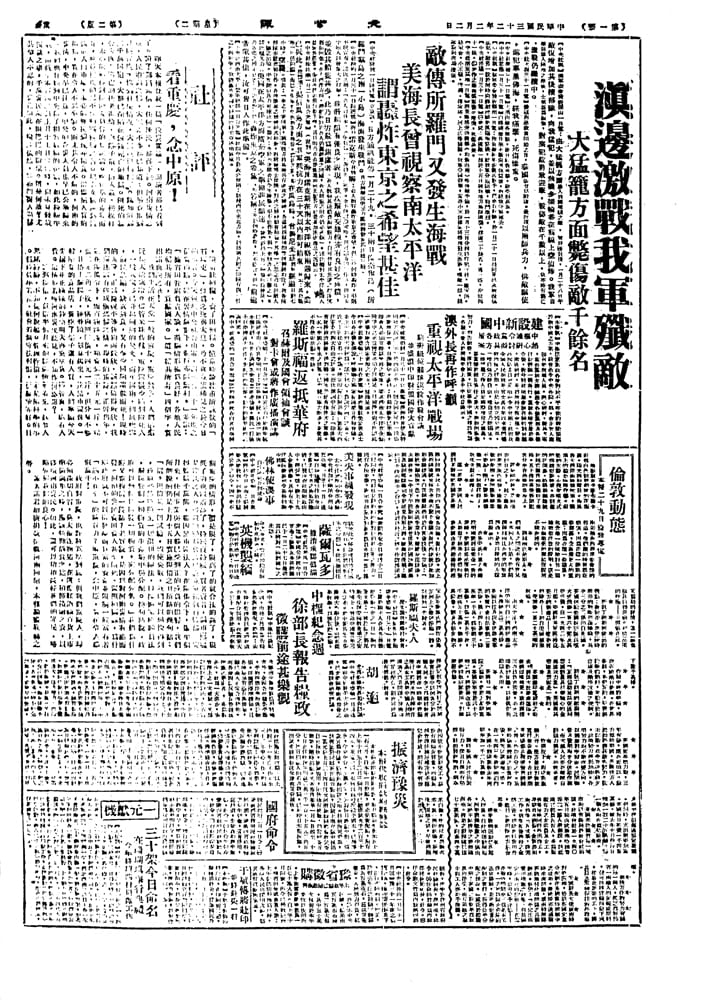

# 王芸生

## 社評：看重慶，念中原！

　　昨天本報登載一篇「豫災實錄」，想讀者都已看到了。讀了那篇通信，任何硬漢，都得下淚。河南災情之重，人民遭遇之慘，大家差不多都已知道：但畢竟重到什麼程度，慘到什麼情況，大家就很模糊了。誰知道那三千萬同胞，大都已深陷在饑饉死亡的地獄。餓死的暴骨失肉，逃亡的扶老攜幼，妻離子散，擠人叢，挨棍打，未必能夠得到賑濟委員會的登記證。吃雜草的毒發而死，吃乾樹皮的忍不住刺喉絞腸之苦。把妻女馱運到遙遠的人肉市場，未必能夠換到幾斗糧食。這慘絕人寰的描寫，實在令人不忍卒讀。而尤其令人不解的，河南的災情，中央早已注意，中央的查災大員也早已公畢歸來，我們也聽到中央撥了相當數額的賑款，如此紛紜半載，而截至本報通訊員上月十七日發信時，尚未見發放賑款之事，千萬災民還在眼巴巴的盼望。這是何故？

　　尤其令人不忍的，災荒如此，糧課依然，縣衙門捉人逼拶，餓着肚納糧，賣了田納糧。憶童時讀杜甫所詠嘆的「石壕吏」，輒為之掩卷嘆息，乃不意竟依稀見之於今日的事實。今天報載中央社魯山電，謂「豫省三十年度之徵實徵購，雖在災情嚴重下，進行亦頗順利。」並謂：「據省田管處負責人談，徵購情形極為良好，各地人民均罄其所有，貢獻國家。」這「罄其所有」四個字，實出諸血淚之筆！

　　我們生活在天堂一般的重慶，重慶無冬，人們已感近幾天的寒冷。儘管米珠薪桂，重慶還很少聽到餓死人，一般人家已升起熊熊的炭火，而在河南，朔風吹雪，飢民瑟縮，缺衣無食，又有多少同胞凍餒而死！現時的重慶，正為慶祝平等新約而歡欣，誠然值得歡欣，我們還應該有些戒慎恐懼之情。現時的重慶，正近舊年，雖在限價令下，而百物跳漲，雞賣到二十五元一斤，雞蛋二元二角一枚，豬肉照限價十四元一斤，但分量不夠，且搭上爛腸子，硬骨頭，划算起來，比黑市還貴。一般摩登的食品店，賣空了架子還有人買，人們寧願今天先撂下花花綠綠的鈔票明天再來拿貨。儘管貴，總有人買。這情形若叫河南災民聽見，不知作何感想？

　　河南的災民賣田賣人甚至餓死，還照納國課，為什麼政府就不可以徵發豪商巨富的資產並限制一般富有者「滿不在乎」的購買力？看重慶，念中原！實在令人感慨萬千！

　　政府對重慶，也許將寬厚到底：但我們重慶人，卻必須深切自省，莫太徵逐物慾，在這燈紅酒綠百貨上市準備過年之時，應該勉抑酒食之慾，稍節饋贈之資，以移賑河南災民。如此，還可以稍稍減輕我們的罪戾，略略安慰我們的良心！

　　（大公報社評，原載於1943年2月2日）

