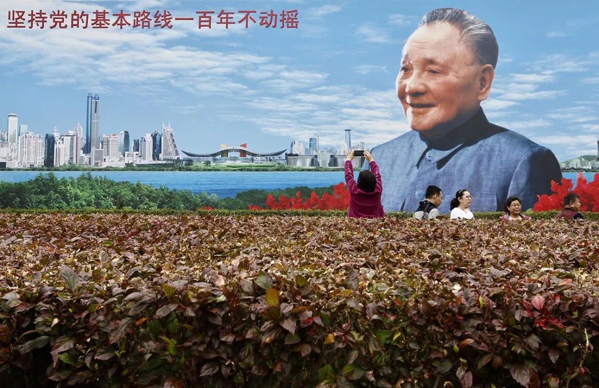

[[toc]]

# 王志纲

## 再回首：邓公的遗产 | 邓小平逝世 22 周年

> **22 年前，1997 年 2 月 19 日，小平同志离开了我们。**
> **小平同志曾说：“我是中国人民的儿子，我深情地爱着我的祖国和人民！” 他用行动践行了自己的誓言。**
> 
> **22 年里，中国的进步是巨大的，而这一切源于 40 年前小平领导的改革开放。改革开放在 30 年前经历过挫折，沉闷了几年。但这种沉闷又被 1992 年的小平南巡讲话所打破，这位当时已经 88 岁的老人用最后的努力推动中国向前走了一大步。**
> 
> 今天岛君推荐一篇王志纲的经典文章《邓公的遗产》，读起来，仍觉荡气回肠。

**邓公的遗产**

作 者：王志纲 志纲智库创始人  
来 源：正和岛

人类历史上，面对民族灾难，国内外都不乏勇担大任、置生死荣辱于度外的先贤。时势与英雄交织，构成了一个个波澜壮阔的大时代。

前些年提名奥斯卡最佳影片的电影《至暗时刻》，讲的就是面对”二战”这样千古未有之变局，纳粹大军压境英伦三岛，丘吉尔以救火首相的身份，掌舵英国这样一个夕阳下的庞大帝国。如果不是他力排众议，打倒绥靖主义，坚持抵抗到底，英伦三岛可能就此沦陷。丘吉尔带领英国走出了至暗时刻，历史造就了他，他也改变了历史。

我年轻的时候很喜欢读《光荣与梦想》，其中描述了 1932 年到 1972 年的美国清明上河图式的全景画卷。当时美国面临经济大危机，资本主义体系摇摇欲坠。身患残疾的罗斯福史无前例地四次当选总统，推行新政振兴经济，在“二战”中纵横捭阖，挽狂澜于既倒，使美国再次强大起来，并站在世界之巅七八十年，让美国成了全世界的“光荣与梦想”。如今的特朗普喊着“让美国再次伟大”的口号，可能也是想做“罗斯福第二”吧。

纵观中国历朝历代，从商鞅变法到王安石的熙宁新政，再到万历年间的张居正，改革者前赴后继，然而终究失败者多，成功者少，且大多以悲剧收场。面对改革开放这道难题，其局面之复杂、变化之深刻、影响之广泛可以说亘古未有。**邓小平以明知不可为而为之的勇气，虽千万人吾往矣的决心担此大任，这种气魄本身就非常了不起，而且他最终成全了这份伟业**。

1978 年的 12 月 18 日，十一届三中全会的召开距今已经 40 年了，97 年小平与世长辞，到如今也有 21 年了。一切作为旨在讨好世人的政治人物，只能叫作政客；政治家的伟大需要用时间来衡量。小平在世时背负了很多骂名，百万大裁军，推动老干部退出历史舞台，国企改革、工人下岗……但 40 年后回头看，桃李不言下自成蹊，我们都是改革年代的受益者和过来人。

隆重的纪念活动看似已经尘埃落定，但真正的纪念绝不仅仅是鲜花与掌声。以史为鉴，可以知兴替。当下特朗普掀起围堵中国的浪潮，国内外面临空前复杂的矛盾。全社会充斥着各种疑惑、迷茫、焦虑，甚至不同的声音，中国又一次走到历史的十字路口。**只有彻底地回顾、整理、继承邓公的遗产，洗尽铅华，继往开来，才是对小平和这个伟大时代最好的纪念**。

有关改革开放的大道理，社会各界已经讲了不少，在我看来，改革开放不是动听的小夜曲，也不是恢弘的交响乐，更没有什么故弄玄虚、高深莫测的理论。某种程度上，小平是个俗人。我们也是俗人，我通过自己的经历，讲一些再通俗不过的道理，或许能够从中找到这个古老大国突围与复兴的密钥吧。

**一个早以远逝的政治人物，为何每逢重要的时间节点，老百姓都会怀念他**？其原因再俗不过，并非小平其人其事有多么伟大，而是因为每个人的生活都因他而变好，每个人的生存权、发展权、追求幸福自由的权力都得到了尊重。可别小看这一点，在漫长的几千年封建史，几百年近代史，数十年新中国史里，阶级歧视牢牢的钳制着人们的思想。就算在自诩为最公平的年代里，人们依然按照血统被划分为三六九等，政治贱民和知识分子被打入永世不得翻身的地狱。而这一切不公平都在小平手中被颠覆。

**世界上永远不可能有“终点”的公平，但是小平起码给人民以“起点”上的公平**，无论你是农民、工人、还是知识分子、右派、社会边缘人士，只要你努力、勤奋、敢于挑战、永不放弃，你就有可能改变自己的命运。

这次所表彰的 100 名改革先锋中的企业家群体，谁不是通过自己的双手改变命运？马云、马化腾、李彦宏……全都是以普通人身份崛起并成就了一番伟大事业的奋斗者。这也是这个伟大时代最有魅力、最引人向往之处。海为龙世界，云是鹤家乡，在这个野心年代里，能升起来的都是太阳，成功者不必感谢谁的恩赐，失败者亦无愧平生，毕竟曾经努力过，奋斗过。

无需否认，这四十年当中依旧存在着很多不公平、不合理的现象，道德问题、生态问题、制度问题……还有太多痼疾急需解决，但每个人头顶的天花板已经打破，人能够为自己的命运做主，这种“公平”才是邓公留下的最宝贵的政治遗产。

站在当下回头来看，小平如何开创了这个伟大的时代？客观上的政治遗产背后，主观上的思想遗产又是什么？这就要从小平的个人经历开始讲起：

### **01 时势与英雄**

英雄造时势？还是时势造英雄？人们为这个问题争论了上千年，可能还会一直争论下去。但在小平身上，我认为“英雄”与“时势”，应该是六四开。

美国著名的中国问题专家傅高义曾经说过：“**中国并不是必然会出现一位邓小平这样的政治家，他出现了，并且改变了中国，这是中国的幸运**” 。

如果没有复杂多变，惊心动魄，九死一生，惨绝人寰的中国近代史，难以筛选和锤炼出像邓公这样的伟人。常人印象中的小平，是一位打桥牌和麻将、抽香烟、喜欢读武侠小说的老人，很少有人记得，他年轻时也是从死人堆里走出来的。1948 年的淮海战役，小平担任总前委书记，指挥 50 万大军，那真是一将功成万骨枯。**血与火让他养成了不世出的直觉和掌控力，也养成了泰山崩于前而色不变的气度**。别人感觉天都要塌了的时候，他根本不当一回事，虽然平时话不多，但每一句话都分量很重。这些个性都是在千军万马中锤炼出来的。

除了战争，小平的政治生涯也很跌宕，一辈子三落三起，可谓是九死一生。但所幸的是，1933 年小平第一“落”，是被当成毛派的头子“挨整”，所以日后虽然几次遭难，但毛泽东始终把邓小平的问题当作内部矛盾，处理起来也留有余地。其中原因，除了看中小平的才华，可能在内心最深处的敌我之分里，还是把小平当成了自己人。76 年批邓的风潮中，小平被撤销党内外一切职务，但保留党籍，以观后效。这最后的温柔——“保留党籍”，对于日后小平再次复出起到了相当重要的作用。

74 年和 75 年上半年，我刚好 20 岁，已经非常关心政治了。当时全国稍有点头脑的人，都明显地感到日子好过了些。小平主持工作以后，用他独特的方式，从整肃铁道部门开始，恢复生产，整顿科技，鼓励文艺发展，逐渐纠正十年浩劫期间造成的整个国家的紊乱和无序。

然而好景不长，以清华大学党委副书记刘冰的上书事件为导火索，政治局势发生了 180 度大转弯，矛头开始指向邓小平，反击右倾翻案风一浪接一浪。当时我们真的很绝望，在黑云压城中好不容易看到一点亮光，一下子又阴云四合，整个中国又要走上极左的不归路。

稍微有点文化的人都感到心情非常沉重。中国向何处去？我们向何处去？在本来就很压抑的环境下面，天灾人祸又接连发生，唐山大地震，天降陨石，朱德去世，最让人悲痛的莫过于 1976 年 1 月突然传来周总理去世的消息。周总理辅政 26 年，经济、外交、教育、国防、科技各个方面可以说全部一肩挑，尤其是在文化革命中，独撑危局长达十年，以至于大家都养成了习惯，只要周恩来还在，这个国家就垮不了。

但是没有想到，周总理突然就走了，他 1972 年就查出了癌症，又带病工作三四年，已经是药石无救。一位伟大政治人物的离世，让很多有远见的人都感到大厦将倾，国家要出大问题了。但没有想到，周总理的追悼会，居然是小平来致悼词。大家又心存侥幸，虽然一边在批邓，但一边还得让小平致悼词，他还是主持工作的常务副总理。大家对小平的能力充满期待，充满信心，认为还有一线希望。没想到，总理的尸骨未寒，小平马上就被打倒。

这一下子，老百姓心里面所憋的怨气，对国家的绝望，和十年难以容忍的愤怒，终于到了 1976 年清明的时候爆发了。各界民众涌入天安门，在天安门前发泄怒火，悼念周总理，这期间留下了很多经典的诗歌。最经典的一首就是：欲悲闻鬼叫，我哭豺狼笑。洒泪祭雄杰，扬眉剑出鞘。**有很多人甚至在天安门的纪念碑上吊了很多小瓶子，用象征性的方式呼唤小平**。

终于十月春雷，天不负我。“四人帮”倒台，具体故事就不讲了，但其中以叶剑英元帅为代表的党内健康力量起了很大的作用。希望虽然来临，但还是那个问题，中国向何处去？没有一个经天纬地的人，根本把不住中国这艘破船。在这个问题上，叶帅确实了不起。他深知只有邓小平能堪当此大任，所以他强烈呼吁，利用他的影响力，联系党内很多积极的健康力量，让小平出来工作，这一点应该说是功劳卓著。

最后小平终于又走到了政治舞台上来。印象特别深，我在贵州大山里面闭塞的小县城中，成天竖着耳朵关注北京的新闻，20 来岁是最关注政治的，因为政治和我们的命运太关联了。

终于有一天，一个在北京体育学院读书、比我大几岁的老兄回来了，他一回来等于带来一个中央电视台，我们都围过去，听他从北京带回来的消息，其中最震撼性的就是小平复出了。

他讲到，在北京工体一场香港足球队同中国青年足球队的比赛里面，他们突然看到小平出现在了主席台上。全场站起来鼓掌欢呼，球都顾不上看了。民心向背，可见一斑，大家对邓小平就给予了很高的期望。

这里面讲个小故事，我几年前遇到了小平的妹妹邓先群女士，她退休前曾经是总政群工部的部长。那天我们在三亚正好一起吃饭，邓女士特别和蔼，在聊天过程中，我越看她长得越像晚年的小平，于是我顺势问了个问题：“你们邓家是不是有长寿的基因啊？”她说在邓家，90 多岁是很常见的。

我后来开了一个玩笑，我说小平幸好长寿，小平不长寿的话，中国的改革就完了。她说怎么这么讲？我说：“你想想，如果小平只活到 75，就不可能当改革开放的船长；如果小平只活到 80 岁，中国的改革就会中途颠覆，如果小平只活到 87 岁，他就不能南巡，然后左倾主义就要冒头；**幸好小平活到了 93 岁，最后才能够以 88 岁的高龄南巡，终于把中国这艘航船推上了改革开放的不归路**。”

小平作为一个政治家，从死人堆里走出来，政治上三起三落，在中华民族处于“危急存亡之秋”的时候担任船长，不仅是罕见的高寿，更没有老糊涂，反而是老而弥坚，带领我们走出激流险滩。这点上我真的只能归结于冥冥当中的天意了。

我们经常讲时势造英雄，我想在中华民族命运转折点上，特别归结到邓小平身上，时势顶多只占了 40%。中国近代史上的艰难困苦，九死一生，复杂纷呈的时局，再加上个人跌宕的命运，终于磨练出这么一个伟大的政治家。

剩下的 60%，则是英雄造时势，正是小平的高寿、正是小平的睿智、正是小平从青年开始，长达七八十年的风风雨雨所磨练出来的非常卓越的的才干和掌控能力、面对惊涛骇浪化险为夷的能力，正是这种不世之才，才使得人类历史上可以说是几乎没有先例的改革，在中国获得了基本的成功。

回头看整个社会主义体系的国家，几乎都在搞改革。苏联干脆把自己改没了，整个东欧也是改得七零八落，朝鲜到现在也在艰难的尝试中，唯独一个在改革上尝到甜头的是越南，**我们叫改革开放，越南叫革新开放。名字只改了一个字，内容上更是照搬中国，利用后发优势，萧规曹随，竟然也获得了成功**。这也算是邓公遗产的国际化案例吧。

历史选择了邓小平，邓小平也改变了历史，那他究竟如何改变了历史？

### **02 尊重人性，尊重常识，顺应规律**

贯穿邓小平思想最核心的东西，我认为有三点：尊重人性，尊重常识，最后必然顺应规律。

**小平有别于几乎所有政治人物的最大特点，就是尊重人性**。这点听起来简单，但绝大多数政治人物做不到，人一旦站得太高，权柄太重，随便的一句话、一个决定，带来的可能是一代人的命运转身。被权力绑架的人，肯定会丧失对人性最基本的尊重，对人性的扼杀在极左年代里尤为普遍。

而小平不一样，他非常珍惜平凡人的家庭生活。尤其是对子孙，毛毛（邓小平女儿）的回忆录中写到，在江西的日子里，他经常给身患残疾的儿子邓朴方擦身子、洗尿片，我们能感受到他作为父亲的那种痛苦，他认为自己拖累了孩子。在江西三年多的时间，是小平政治生涯中的最低潮，也是他个人和家庭生活最艰难的时候。这期间他通过汪东兴多次给中央写信，在这些信中，他很少对自己个人的工作和生活安排提出要求，但却充满了对家人的关爱。1978 年，小平复起之后，**虽然日理万机，他依然尽量每天晚上全家上下一起吃饭，享受“四世同堂”的天伦之乐**。

除了对自己的子女舐犊情深，小平的感情同样寄托在人民身上。

举个很简单的例子，就是农村改革。我出生在贵州最穷的地方，我深深地知道农民们的辛苦。 60 年代最困难的时候，所谓的“三年自然灾害”，其间造成不少农民死亡，我很多农村的亲戚都在这场灾难中饿死，这也是我们那代人的集体回忆。

后来我在兰州大学读书，甘肃和贵州一样，也是非常赤贫，所以我对饥饿和贫困有着深刻的感受。所以在政策和政治风向稍微松动以后，最先要改变命运的就是贫穷地区的农民们。甘肃、贵州、还有安徽等地，农民开始选择大包干。

现在想起来这是多么的可笑啊，农民在自己的土地上想按自己的方式去种自己想种的东西，都成了犯天条的事情。小岗村的农民们甚至要签订“生死契约”，交代好子女的身后事，才敢自己种粮食，可想而知极左对人性的扼杀到了何等程度。

60 年代的安徽省委书记曾希圣曾经因为尊重农民的选择，文革期间遭到严重的迫害，英年早逝。所以很多地方对于农村出现的“大包干”现象，习惯性地进行打压。在这个时候，小平发挥了非常重要的作用。时任安徽省委书记的万里在支持大包干这件事上，受到了很大的压力，小平鼓励他“不必陷入争论，你这么干下去就是了，就实事求是地干下去”。有一次万里遇到一个农业部的副部长在批评包产到户，他辛辣地讽刺道：“看你这个家伙肥头大耳，农民却饿得皮包骨，你怎么能不让这些农民想办法吃饱饭呢”？

就在摒弃掉教条，敢于放手后的短短几年时间，全中国释放出了巨大的活力，耕者有其田，耕者会种田，短短两年时间，农民就解决了几十年解决不了的吃饭问题。不仅解决了吃饱饭的问题，而且还释放出了 80%的剩余劳动力。最开始的政策叫作“离土不离乡”，农民可以离开土地搞乡镇企业 ，但不能离开这个区域，这种政策为乡镇企业创造了土壤，很多日后的大企业都诞生于这个时候。

伴随农民的能量越来越大，乡镇企业已经束缚不住他们的活力。在小平的默许下，这批青年们开始走州串县，开始闯上海、下广东、甚至奔北京，这上亿的青壮年走入城镇，走向工厂，他们是全世界最庞大的劳动力群体，他们身上迸发出的活力成了中国最强的竞争力。珠三角和长三角成为世界工厂，极大地推动了中国的工业化进程。这批生力军同时也成了最强大的建筑大军，推动了中国令世界瞩目的城市化。他们的收入寄回家乡，使偏远地区也得到了很大的发展……

取得了如此辉煌成就的农村改革，当初的蓝图却并不远大，甚至有些寒酸：所谓的农村改革，无非是为现实所逼迫，要让农民活下去、有饭吃，怎么有饭吃怎么来。

**小平说过：我是中国人民的儿子，我深深地爱着这块土地。所以他不会被僵化的教条所拘束、被高大上的口号所绑架，而是站在中华民族的根本利益上来考虑问题**，小则让中国不被开除“球籍”，中则为人民谋幸福，最后才是顺其自然的屹立于世界民族之林，他一切改革的出发点都是对人性的尊重。

邓小平的第二个特点，尊重常识。这里讲一下民营企业的故事，我在新华社所接触过的改革名人中，傻子瓜子的创始人年广久算是一个。

年广久是安徽芜湖人，但他在当地口碑相当坏，因为他是从社会底层走出来的人物，也没什么文化，有点钱后就吃喝嫖赌。但他的确炒的一手好瓜子，本来只是摆摊做生意，没想到瓜子越卖越火。于是他开始雇工，最后甚至雇了 12 个人，其中还有个女雇工跟他姘居。

马克思在《资本论》中曾经说过，雇工不能超过 7 个，超过 7 个就存在剥削。改革开放之初，关于雇工 7 个还是 8 个的争论非常激烈，现在看起来简直可笑，但在当时，“七上八下”却被教条的马克思主义者奉为金科玉律。再加上年广久这个人私德又有问题，吃喝嫖赌，当地人也很讨厌他，所以很多人都盯上了他，要求严肃处理。

但是没想到，这个消息传到小平那去，他看问题的角度和别人不一样：一个被叫做傻子的人，又没文化，又没地位，凭自己的能力，不仅能养活自己，还能养活十个二十个雇工，这意义非常大，为什么用意识形态来衡量它呢？其次，如果我们把他打掉，牵一发动全身，那就可能会扼杀掉一批新生的、自力更生的城市失业人口。为什么不看一看？让“傻子瓜子”经营一段。怕什么？伤害了社会主义吗？

**小平发话，终于把这件事压下来，决定放一放、看一看再说**。这一放就扶持了一棵幼苗，带出来一大片草原，形成了一个森林，私营企业就是这样被“放”了出来。

**伴随一个傻子瓜子被肯定，整个中国的个体户开始风起云涌，成千上万的万元户开始崛起，民营企业的滚滚洪流开始不停向前**。中国第一次有了“海”，就是体制外，下海成了当时最火热的词，这片“海”最先形成的地方，就是珠三角。

如今的珠三角，已经是世界级的大湾区，但创造这一奇迹的每个人都是俗人。农民工背井离乡不是为了一个伟大的理想，而是为了解决生存问题，在家里面只能脸朝黄土背朝天，修理地球。然而到珠三角挣到了钱，比家乡多的多，还可以赚钱回家盖房子。所以离开了老婆孩子热炕头，他们付出很大的代价，但获得的也许是明天、是未来，就是这一点期待，使上亿的农民成为中国巨大的人口红利。

港澳的那些商人也不是国际友人白求恩，他们同样是来挣钱的。把欧美的订单拿到手，跑到老家珠三角，找到当地的大叔大妈，找块地，租一个厂房，不断地扩大规模再生产，在中间吃水。就这样很多老板发了财，他们也是出于俗人的一己私利，但一不小心就推动了世界工厂的形成。

另外珠三角的本地农民也很简单，他们就是为了收点租金，在土地上盖了很多厂房，出租出去挣点钱，也是为了一己私利。

珠三角的领导人同样非常朴实，改革开放之初的广东省委书记习仲勋说过：“千言万语说得再多，都是没用的，把人民的生活水平搞上去，才是唯一的办法。不然，人民只会用脚投票”。广东改革开放的实际操盘人任仲夷说：“见了红灯绕道走，见了绿灯赶快走，没有灯要摸着走”。蛇口的创始人袁庚说：“向前走，别回头”。每句都是大白话，没有什么大道理。

四十年过去了，珠三角顺利地实现了工业化，由珠江东西两岸构成的工业走廊，成了全世界极具竞争力的产业集群，无数的民营企业在这里蓬勃发展。圣人在哪里？没看到。伟大的道德观在哪里？没看到。只是俗人按照常识做事，但最后却收获了圣人的结果。

从年广久的瓜子到珠三角万亿规模的民企集群，中国民企的命运一脉相承，如今的民营经济，已经贡献了中国 50%的税收、60%的 GDP、70%的技术创新、80%的就业岗位，90%以上的企业数量。这都是原来改革开放之初想象不到的。这一切都是常识的力量。

还有一个典型的例子，就是恢复高考。温元凯曾经告诉我，在 1977 年 8 月的高等教育研讨会上，初生牛犊不怕虎的他，关于高考制度改革提出了四句话：“自愿报考，领导批准，严格考试，择优录取”。他当时还不敢把话说太满，不敢说恢复高考、择优录取，他觉得自己说的已经够过头了。他说，他当时说的时候，他旁边的教育部长刘西尧一直皱眉头。

没有想到这四句话讲完以后，小平不假思索，接过话头就说：“温元凯你这四句话，去掉一句话，保留三句话够了：自愿报名、严格考试、择优录取。不要“领导批准”，这领导一批准问题就变性了！”通过这种下意识的反应，就能看出小平内心深处对于人性和常识的尊重。

因为教育和学习本来就是常识，没有哪个国家民族会不重视教育、不尊重科学。文革给人带来的灾难，不光在肉体上，更重要是在精神上。当时管知识分子叫臭老九，知识越多越反动。所有人都远离知识，知识就是麻风病，就是瘟疫。在这种背景下面，整个民族对知识产生了严重的认知障碍，对知识的载体知识分子丑化到了无以复加的地步。

**正是在这样的背景下，才有了小平对高等教育制度的迫切改革，“一万年太久，只争朝夕”**。现在回头看，多抢出来的那一年，意义非常大。从中央到地方，哪一级别的官员不是高等教育改革的受惠者，如果这个时候台上的是张铁生和那些造反派，中国会是什么样的格局？还有往美国派遣留学生，当时无数人反对，认为那边是资本主义的大本营，花花世界，我们的精英送过去就回不来了。的确，有很多人没有回来，但小平坚信，当国家越来越强大的时候，他们终归会回来的。果不其然，越来越多的归国学子为中国的科技发展提供了强大的动力。

如今回过头来看，哪有什么高深莫测，无非是对常识的尊重与坚守，再加上过人的胆魄罢了。

尊重人性与尊重常识，九九归一，最后自然就会顺应规律。规律是什么？2000 多年前的经济学家和政治家管子说的已经很明白了，“衣食足而知荣辱、仓廪实而知礼节。”用邓公的话来讲：发展就是硬道理。用“十九大”的报告来说：人民日益增长的美好生活需要和不平衡不充分的发展之间的矛盾是当今我国社会的主要矛盾。这就是人性、这就是常识、这就是规律，一切改革的肇始与归依，也都应当如是。

### **03 不唯书、不唯上、只唯实**

除了对人性与常识的尊重，和对规律的顺应。小平在具体工作中最大的优点就在于不唯书、不唯上、只唯实，实事求是。

他深知治大国如烹小鲜，作为领导人，最忌讳的就是事无巨细、往上管天管地，下管鸡毛蒜皮。他像一个老成持重的观察者，重复发挥群众的创造性，遇到新鲜事物，先放一放，看一看，成功的经验推广到全局，失败了总结教训。这是改革开放探索当中最低成本的玩法。

推动广东早期改革开放的任仲夷用的也是这套工作方法：先斩后奏、边斩边奏、斩而不奏，改革总是从违法开始的，很多事情可以先去探索。永不探索、永不走路、永不摔跤，这是极端教条主义的做法。探索肯定会摔跤，摔了跤站起来接着走就行。

对于这套工作方法，我总结起来就是三句话：“**逼出来的改革、放出来的活力、摸出来的市场”， 可以说它几乎贯穿了 40 年的每一个阶段，特别是重大的危机阶段**。

有人批评小平不懂创新，其实领导者根本不需要创新，毛泽东说：“人民群众是真正的英雄”。再伟大的人也只有一个脑子想问题，他做的无非就是判断和承认，好的东西承认并推广，不好的吸取教训就够了。

还有人批评小平“摸着石头过河”，没有一套完善的制度设计，这更是无稽之谈，戈尔巴乔夫设计了一整套理论，从经济基础到上层建筑，全部都设想好了，被很多中国的知识分子奉为圭臬，甚至用来攻击邓小平的“土鳖”法子，结果如今的苏联已经灰飞烟灭，而中国正在一步步走向崛起。

所有的改革都只能一边摸索、一边学习。小平被称为中国改革开放的“总设计师”，但他只做方向性的设计，改革不同于修桥盖楼，没有事前设计好的图纸，必须“走一步看一步”和“摸着石头过河”。只要大目标不变，长计划短安排，在实践当中随时的调整修正，大方向就不会出问题。所以与其说小平是“总设计师”，我更愿意称呼他为“总舵手”，实事求是，把握方向，随时调整。

讲两个我直接或间接参与的故事吧。改革开放之初，大家还都处在一种前所未有的共识蜜月期，84 年国庆节游行，北大学子自发拉开的“小平您好”横幅，标志着邓小平的个人威望达到了巅峰。然而随着经济改革和政治改革的失衡，85、86 年开始，共识已经开始破灭，有的人嫌慢了要往前走，有的人嫌快了怕翻车，自由化的浪潮和保守封闭的力量此消彼长，一个政治人物取悦天下的时代已经结束了。

1988 年，中国的改革进入了深水区，政治上自由化浪潮泛滥，很多人质疑改革开放的正确性，经济上由于双轨制带来的腐败问题长期得不到解决，政府在物价闯关期间又引发了严重的通货膨胀，各种矛盾空前尖锐。

当时 33 岁的我，作为新华社记者在全中国进行了一组大跨度、长时间的综合性采访，其间采访了很多封疆大吏、著名学者，也走访了各地资深的记者，收集了很多珍贵的第一手资料，最后写了一份内参，叫《中国走势采访录》，主要讲的是中央和地方的矛盾、沿海与内陆的冲突、开放和改革的失衡。这份内参引起了很大的反响，我也因此被请到中南海进行汇报，在汇报中我痛陈了问题的严重性，甚至直言不讳：环境脏了可以用水来洗，人心脏了可能就要用血来洗了。

不到一年，随之而来的政治风波成为了整个中国改革开放史上遇到的最大危机，外部有欧美制裁，内部也处在惶惶不可终日当中，中国崩溃论甚嚣尘上。一个月以后，小平终于走出来了，发表了一次讲话，这次讲话给了所有人一颗定心丸，一下子稳定了军心，稳定了党心，稳定了民心。

现在回头看，印象最深的就是几句话：“这场风波迟早回来的。早来比晚来好”。那种“孤舟蓑笠翁，独钓寒江雪”的大气磅礴和镇定自若，真的太了不起了，**中国的很多关键节点没有这么一个伟人，真的扛不住**。

在风波结束后，小平也正式宣布了退休，他已经八十五岁高龄，也该去安享晚年了。但是没有想到，他又一次发挥出了人们穷尽想象都想象不出的巨大历史作用。

90、91 年，极左力量开始抬头。党内总结教训，认为“放”得太开，导致资产阶级自由化泛滥，反击的办法就是搞社会主义教育，甚至要割资本主义尾巴，一些文革时的东西开始复辟，很多企业选择“带枪投靠”。整个中国处于停滞状态。

大概是 1991 年 10 月份左右，中央终于开了风波后的一次全会，我看了公告以后，觉得语言老套，波澜不惊，不由有些失望。没想到 10 月底的一天，社里突然叫我接电话。我进了采编室把电话拿起来，原来是新华社总社社长穆青给我打的电话。穆青这个人有个特点，非常平易近人，他不摆架子，所以我们都对他很尊重，有的时候也亲切地喊他为“老头子”。

他在电话里说“小王啊，我是穆青，我过几天要来广东，主要是对广东进行一次认真的了解和采访，至于写不写和写什么再说，你得陪着我。”我说“现在宣传广东不合时宜吧。”他说不对，最近中央开完全会，这次全会一个最重要的贡献就是再次坚持和强调，以经济建设为中心。我说这不都是老生常谈了么。他说：“错了，在此之前的风向是要废除掉这句话，甚至回到老路上去。这次再次重申，非常了不起，就像一辆车在往下滑的时候刹住了。那么另一个非常重要的问题就是，广东作为改革开放的前沿阵地，到底站不站得住？广东的探索到底是不是中国的未来之路？众说纷纭，我作为一个老记者，一定要亲自去看一看。”

现在回头来看，穆青同志真是有着极高的新闻敏感度，他和小平几乎是前后脚到的广东，穆青是 91 年 12 月中旬来的，苏联解体是 12 月 25 号，小平开始南巡是 92 年 1 月 18 号，也就是苏联解体后的 20 来天。因为苏联和东欧的剧变，国内的政治局面进一步恶化，很多人也在怀疑红旗还能扛多久，停止改革开放，关起门来稳定意识形态的说法甚嚣尘上。

那个夜晚我至今印象深刻，完成了深圳、珠海特区的重点采访后，我们落脚顺德的顺峰山仙泉酒店小住。那天我和穆青正在讨论稿子，突然接到电话，新华社广东分社的副社长打来的，他说，我们从珠海到顺德的这五天时间里，小平已经到了广东，而他负责全程陪同。

他还汇报说：小平此行本来是高度保密，但前两天已经被香港媒体泄露出去了。原来是小平去了深圳的锦绣中华参观时，被一个有新闻敏感的香港游客拍到了，这个游客倒头过了罗湖口岸就以 10 万块港币的价钱将照片卖给了香港报社，这家报纸立刻刊发了头版头条独家新闻“小平南巡”，一下子全世界的目光都集中到了广东。

原广东省委副秘书长陈开枝是我的好朋友，他负责整个接待流程。后来我们聊天的时候，他谈到了当时的很多细节。小平来的时候，其实是带了一肚子火的，一路上接见各省大员的时候都在说：“书记大人们，你们要看就看广东，别学北方那群老爷，还要记住一点，不改革就要下台！”到了深圳后，小平看到特区翻天覆地的变化，越看越高兴，回到宾馆，老人家却说了一句令人意料不到的话：“那些人尽讲屁话！”直接批评那些肆意非议特区的人。

当时广东省委希望能够借小平来的这股东风扫去原本沉闷的气氛，广东省委请示小平，希望把南巡的事件公开报道，小平话也不多，就说“不开这个口子”，大家也就没什么办法。

但是有关方面还是不死心，当时的省委书记谢非同志和小平的女儿毛毛，认为鉴于香港已经炸营，各界都在议论纷纷。希望穆青同志以新华社的名义向中央打个报告，同意将小平南下公开报道。

我当时在旁边听着很激动，忙不迭的直劝穆青，希望他接受这个建议。没想到穆青足足沉默的抽完一只烟后，才说“唉，谁能做得了老爷子的主啊”。意思就是老爷子自己都说不让发，那谁说也没有用的，穆青是多年的老党员，非常讲原则、讲党性，所以放过了最直接的报道机会。

新华社不公开报道，但没想到被一个老江湖、老狐狸抓到了机会，就是深圳的市委书记李灏。后来我见到写那篇名文《东方风来满眼春》的作者陈锡添，我就问他：“当时新华社广东分社的副社长也在随行，掌握的信息比你还多，为什么你写了这篇名震天下的文章，他却没有写出来呢？”

他说李灏书记当时跟他说，不管能不能报，你都全文记录下来，不要遗漏。谢非的秘书陈建华也有很高的政治敏感性，为了保密，他亲自去买了一个走私的小录音机，把真实的历史资料抢救了下来。这也从侧面说明当时所有人都措手不及，原来以为只是接待而已，谁都没有想到历史在眼前爆炸，他们都成了历史的参与者。

以往，小平在各地参观时，基本都不说话，但是那次来深圳，他一反平时的沉默寡言，激情飞扬，不停地问，不停地阐述他的思想，“贫穷不是社会主义”“发展就是硬道理”“社会主义有市场、资本主义有计划。计划经济和市场经济不是属于哪一个阶级的，是人类共有的”“谁不改革谁下台” “**今天和未来的中国既要防右，更要反左，更主要的反左**”……句句都力拔千钧。

从深圳到珠海的船上，小平甚至一口气讲了一个小时，这对于一个 88 岁的老人而言，无论是身体上，还是精神上，都是巨大的损耗。小平仿佛是在交代自己的政治遗言，也仿佛是他历经风风雨雨后所得出的炉火纯青的判断，中国之命运、中国之未来、中国之道路究竟在哪里，这些问题解答不清楚，他不会有半点懈怠。

中国的历史就在这关键的时候发生了转折，小平南巡之前，仿佛雷暴将至，乌云滚滚，接下来是黎明还是黑夜？谁都说不清楚。小平最后这次四两拨千斤的南巡，”寒凝大地发春华” “于无声处听惊雷”，终于把中国这趟脱轨的列车又推回到正轨上来。此后的中国围绕着经济建设，几无偏离，成就了人类历史上罕见的发展奇迹，而我有幸成为这一历史节点少数的间接和直接的观察者之一。

回到我跟小平的妹妹邓先群女士所聊的那个话题，小平的长寿可以说得上是“天佑邓公、天佑中华”。如果棋至中盘下棋的人弃盘而走，工程做了一半工程师却不见了，那局面将会彻底无法收拾。从善如登，从恶如崩，无论小平再伟大，他只能以失败者的形象留在历史上，那真是“倘使当时身先死，一生功过有谁知”了。索性小平用自己毕生的功力，在广东把这盘长棋圆满收关，他也完成了自己伟大的历史使命。

### **04 尾声**

我从大学就开始学习马克思主义，多年以来一直是坚定的唯物主义无神论者。然而越到晚年，我就越倾向于不可知论，前沿物理学理论的探索也印证了这一点，现有技术手段无法观察、无法解释的现象，不一定都是迷信，都是唯心主义。

从逼出来的改革，到放出来的活力，再到摸出来的市场，40 年来中国面临无数次危机，稍有不慎就会全盘倾覆；74 岁再出山的船长邓小平，更是垂垂老矣，中国很多方向性的抉择却又不得不系于他一身；全世界最杰出的经济学家、诺奖得主、投资天才都一次次预言中国要崩溃，一浪浪的时代红利又推动着中国不断向前，产业链转移、互联网浪潮、消费升级……

40 年过去，中国居然就这么走了下来，甚至走到了和“伟大、光荣、正确”的美国直接对话的位置上，仿佛冥冥当中，真的有一种挡不住的国运在庇佑着中国。

如今的中国确实面临着暂时的困难与危机，很多企业家朋友来找我，诉说他们遇到的困难和想要“换船”的打算，我都会告诉他们，**困难只是暂时的，我依旧坚定地看好中国**。

只要我们不走回头路，不犯颠覆式错误，能够光大邓公的遗产：尊重人性、尊重常识、顺应规律、实事求是，中国的崛起是挡都挡不住的。因为中国从来就不是一个暴发户，所谓的崛起，只不过是历史的回归罢了。

### **作者后记**

《邓公的遗产》发布后，我突然就成了所谓的“爆款文”作者，这让我始料未及的同时，也不由让人想起了 20 年前那个倚马可待、青春作赋的记者时代。当时的我尚不知道电脑与互联网，只能在逼仄的陋室里慢慢爬格子，虽然客居岭南多年，但还是难以忍受羊城的酷暑，实在热得扛不住了，只好去水房接一桶凉水，从头淋到脚，回来再接着奋笔疾书，但每一篇写好的文章登报后，总会收到雪片般的读者来信，数量以麻袋计，拆信、读信和回信是专属于那个年代的痛苦又快乐的体验。

当时的云山珠水是最令人向往的热土，遍地是改变命运、发家致富的神话。与之形成强烈对比的是，我们这批在改革开放第一线的新闻工作者依旧家徒四壁，常年衣无领、裤无裆、光着屁股走四方。不过虽然清贫，我们依旧心忧天下、满怀壮志，因为有幸遇到了一个激情燃烧的岁月，中国在发生天翻地覆的变化，为那个伟大的时代鼓与呼就是我们新闻人的使命。

1994 年离开新华社后，我一直从事战略咨询行业，走遍了中国的山山水水，从沿海、沿江、延边到沿线，我接触了成百上千的基层企业和区域政府，也与无数达官显贵、豪商巨贾打过交道，因此对民间的喜怒哀乐感同身受，对改革开放给中国带来的改变也有了更加深刻的认识。

如今世事倥偬，二十年过去，我也从风华正茂的记者“王”变成了年轻人口中的“老王”。在瞬息万变的互联网时代里，信息高度碎片化甚至粉尘化，人本身也仿佛沦为一种快速消费品。40 年前的那场变革，显得遥远而陌生，而我有幸躬逢这一伟大的时代，作为改革开放四十年的亲历者、收益者、观察者甚至推动者，在这个特殊的时间节点上，于情于理，我都应该写些东西来纪念邓公，致敬这个伟大的时代，于是才有了《邓公》一文的由来。本来就是个人的纪念之作，所以文中也没什么大道理，更多是自身经历与思考的总结，用一个俗人的视角来讲一些朴素的规律。

没想到这篇“俗人俗事”的文章发出来后，引来反响无数：有党内的老同志托人捎来谢意，认为本文讲出了他们的心里话；也有经年未见的老朋友特地打电话来说，看了这篇文章很感慨，想起了我们这代 50 后中国人波澜起伏的一生；有正值壮年的企业家，留言感恩这个龙蛇出没、英雄辈出的年代，成功者不必感谢谁的恩赐，shibai 了也无愧平生，这一切都肇始于邓公。

让我意外的是，本来和我们这代人没有任何共同话题的 80 后、90 后们，也因此文而产生了共鸣，他们从文中了解到这一切的来之不易；有人说，之前受极左思维影响甚深，对改革开放和小平常怀偏见，读完此文后，不由幡然悔悟；更有不少读者留言，在这个浅阅读时代，竟然能字句不差的读完一篇一万两千字的长文，甚至读到激动处泪流满面……

地不分南北，人不分老幼，地位不论尊卑，学问不论高低，无数人都被这篇文章打动，究其原因，并非这篇小文的价值有多高，写的有多好，无非是大家都沐浴在邓公的遗产中，天同此道、人同此心，心同此理罢了。

文章发出后，我更收到了一份意外之喜，礼物虽不大，却算是难得的润笔吧。

>【图略】

我在后台看到的几千条留言中，绝大多数网友对邓公的怀念与感恩真切感人，虽然也有寥寥“端起碗吃饭、放下碗骂娘”的人、改革中利益受损害的“失意人”们恶言相向，但毕竟只是极少数。真理自在人间，怀念邓公、发扬邓公遗产的声音终究占了主流。

时势与英雄交织，构成了一个个波澜壮阔的大时代。如今我们又面临着内忧外患交织的严峻局面：贸易冲突、债务危机、资本寒冬、股市暴跌、裁员潮给马上到来的 2019 年蒙上一层阴影。在辞旧迎新的时候，大家总是衷心的希望一切好起来，或许政策层面上会再出一些利好，或许经济在去年的下行期后，很快就会反弹……我无意给大家泼冷水，但也不想去说那些花团锦簇的吉祥话。

经济长期结构性的失衡、红利的减退与国家崛起过程中必然面临的打压，共同导致了这一场漫长的寒冬，翩然而来的 2019 年并不是春天的信使，但就像邓公说的那样：“这场风波早晚要来，晚来不如早来。”我还是《邓公的遗产》一文中的观点，困难只是暂时的，我依旧坚定地看好中国。而这篇文章的反馈给了我更多信心，一篇普普通通怀念邓公的文章能打动这么多人，说明邓公的遗产已经深入我们的骨髓，指引着我们的前进，只要我们尊重人性、尊重常识、顺应规律、实事求是，不犯颠覆式的错误，中国的崛起是挡都挡不住的。

对遭遇苦难、不公和不堪，感到无望而抱怨一切的朋友们，我也想送给你一句话，世界上永远不可能有“终点”的公平，但是邓公给了我们以“起点”上的公平，让我们去闯荡大江大海，帝王将相宁有种乎？只要你不要放弃，不要颓唐，无论将来成败几何，老去的时候，你总归可以对自己说一句无愧平生，无愧时代了。
