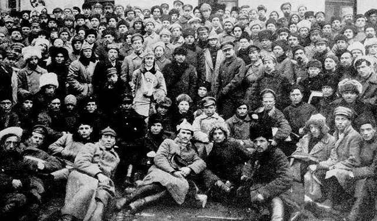

# 雪珥

## 激进主义害死中国

雪珥2013年10月14日10:21

雪珥，澳大利亚华人，中国改革史研究者，著有《国运1909》、《帝国政改》、《大国海盗》等。

### 两起骚乱
1905年的中国和俄国，从来没有这么相似过，甚至如同孪生兄弟。并且，这种相似将持续近一个世纪。
这一年，这两个国家的大多数精英都相信，他们正在成为最后两只专制恐龙，面对立宪的世界而倍感孤
独。因此，他们几乎同时启动了政治改革。
转型是痛苦的，甚至是血腥的。

大清帝国政改所收获的第一个结果，是9月份在北京CBD爆炸的一颗自杀性炸弹，直接造成了24人伤亡，北
京城内风声鹤唳。刺客是27岁的安徽桐城人吴樾，秘密组织“军国民教育会”及其“暗杀团”的成员。这
个“暗杀团”中，还有另一位日后更为著名的安徽青年，名叫陈独秀。

袭击案的次日，《华盛顿邮报》报道了中国驻美公使梁诚的谈话：“这起可怕的事件，发生在中国开始
走向复苏的时刻，十分不幸。毫无疑问，肇事者以及他背后的团伙，应该对此罪行承担完全的责任。在
中国有两个党，一个是‘改革党’，它希望从西方文明和模式中汲取借鉴好的东西，为中国政府和人民
谋利益；还有一个党，就是你们所说的‘无政府主义者’，他们蔑视一切原则，无论是政府或是别的,嫉
妒和仇恨推动着他们每一言行。正如刺杀你们总统的无政府主义者一样，他们寻求的仅仅是破坏。最近
的事件向全世界表明，中国政府学习外国政治模式的举动，深深地激怒了他们。”

《纽约时报》则揣测说：“可能是俄国的无政府主义者在北京执行改变中国人宗教信仰的任务，为中国
刺客提供了炸弹。确实，炸弹在中国是如此新鲜的事物，足以令人想到幕后是俄国人在训练中国人投掷，
其本身就是外国人幕后策划和协助的证据。”

这不是大清国所发生的第一起激进主义者搞的恐怖袭击，但却是最为著名、影响最大的一次，也是西方
舆论将其与俄国激进主义联系起来的第一次。

与9个月前圣彼得堡的局面相比，北京的这颗炸弹简直如同爆竹般渺小。1月22日，圣彼得堡20多万人前往
冬宫外广场示威，遭到军警的实弹射击，死伤惨重，史称“流血星期日”。这一事件引燃了整个俄国，
各地暴动纷起，民族冲突、阶级冲突纠缠交错。

“流血星期日”之后，远在日本的梁启超发表《自由乎？死乎？》，对这一惨剧进行了报道和述评，并
感慨道：“改革事业，如转巨石于危坠，非达其最终之目的地不止。”

沙皇当局的反应还是相当及时的。沙皇尼古拉二世立即撤换了内政部长，并组建了一个调查委员会，彻
底调查流血事件及导致工人大罢工的深层原因。这个调查委员会，破天荒地邀请工人代表参加，但因激
进党阻止民众与政府的合作，导致调查委员会无疾而终。

沙皇的政改迅速地展开了。3月份，发布了《布雷金诏书》，准许成立咨政团体、包容各种宗教、开放语
言自由等；5月份，允许召集成立人民代表会议（即“苏维埃”）；8月份，批准成立国家杜马（即国会）
的成立……最终，在北京的炸弹炸响后的1个月，沙皇发布了“十月宣言”，明确宣布“任何法律未经国
家杜马认可不得生效”。

### 以俄为镜
当时的世界上，没有任何一个国家会如同中国那样，关注着俄国的政治改革。

从甲午战争失败之后，中国就在睁大双眼，寻找适合自身的改革榜样，日本成为效仿的榜样。而日本再
度赢得日俄战争的胜利之后，大清国更是从中看到了制度的力量。朝野上下与俄国一样，都认为日俄两
国政治体制的优劣，造成了这场战争的胜负，立宪制度在战场上打败了专制制度。中国的舆论宣称：“
世界进化之运，及于二十世纪，举全地球中万无可以复容专制政体存在之余地，立宪自由主义所向无敌，
遇者死，当者坏，苟顽然不知变计者唯有归于劣败淘汰之数而已”（《时报》1904年6月17日）。梁启超
更是断言：“二十世纪之国家，终无容专制政体存在之余地，以顽强之俄罗斯，遂不能与自由神之威力
抗。呜呼!举天下之恶魔，遂不能与自由神之威力抗”。

俄国的政改，迅速成为中国媒体关注的焦点，一些媒体甚至担心，俄国的立宪，将令中国成为被世界潮
流所抛弃的最后一头专制恐龙，“使俄国之立宪竟成，则其立宪之实际虽未谂若何，而世界之专制国仅
仅余一中国，亦必有被及之影响，特今日犹未可知耳”（《中外日报》1905年3月30日）难得的是，体制
内也罕见地与体制外一起，将俄国政改作为参照的对象，并最后促使中央下决心政改。

没有足够的史料，能支持美国报刊对中俄两国激进分子之间存在联络的推测，但可以肯定的是，在官方
和精英阶层以俄为镜、呼吁政改的同时，中国的激进分子们在诸多方面也的确表现出了与俄国同行们诸
多的相同之处。无论他们在彼时是否真有联络，他们在“彻底砸烂一个旧世界，才可能获得一个新世界”
方面，并无二致——尽管他们对于如何建立一个新世界、尤其是如何防止这个新世界依然出现旧世界的
同样问题毫无准备。

俄国激进主义信奉“斧头”原则，将砸烂一切作为武器，高呼“不要调和！”“不要改革！”，“否定
就是我的上帝！”（别林斯基），“能打碎的就打碎，经得起打碎的就是好的，打碎了的则是一堆废物，
不管怎样要大打一场，这不会有害处，也不可能有害处。”（皮萨列夫）。1900年因刺杀广东巡抚恩寿
未遂而被处决的史坚如，也曾说过:“今日中国，正如数千年来破屋，败坏至不可收拾，非尽毁而更新之
不为功。世之谈变法者，粉饰支离，补其罅漏，庸有济乎?”

但是，此时无论俄国还是中国，激进主义并没有成为主流的选择，改革仍是社会各界的基本共识。

### 共识改革

被后世史家有意无意忽略的是，1905年9月份的北京自杀式炸弹，吹响的不是暴动的号角，而是体制内外
对在稳定基础上推行政改的集结号。

舆论对于暴力阻挠改革基本持否定态度。上海《时报》评论道：“五大臣此次出洋考察政治，以为立宪
预备，其关系于中国前途最重且大，凡稍具爱国心者宜如何郑重其事而祝其行。乃今甫就道，而忽逢此
绝大之惊险，虽五臣均幸无恙，然此等暴徒丧心病狂一至于此，其罪真不容诛哉！”《南方报》呼吁政
府不要退缩，考察宪政应该继续进行，不可因此而“寒其改良政治之初心”。天津的《大公报》则旗帜
鲜明地表态：“此事实为推动清政府立宪之一大动力……我若畏难而退，彼必趁虚而入……我政府即迎
其机而速行改革，以绝彼党之望，宣布立宪，以固其内力……奋勇前进，急行其志，无俟踌躇”。

上海的《申报》进一步认为，革命党的炸弹攻击，恰恰反证了立宪对政府是大大有利的，政府应该更加
坚定立宪的决心：“凡物莫不有反动力，政府之欲摧锄民权也，而民权之说愈沸腾不可遏，其反动力使
然也；民党之欲摧锄立宪也亦然，挠之愈力，而立宪之成立将愈速。……今日爆烈弹之一掷，实不啻以
反对党之宗旨，大声疾呼于政府，俾知立宪之大有利于皇室，而不可不竭力以达成之。”

体制内的诸多官员，也因这一事件，而开始旗帜鲜明地公开表态支持政改，并要求中央在压力面前不要
退让，进一步公示政改的决心。

大清国中央最后决定，宪政考察团将继续出行，同时欢迎和鼓励民间精英出洋考察政治，这种开放，在
政治一贯属于“肉食者”才能“谋之”的中国，具有开天辟地般的意义。并非官办、更无需拍马的《大
公报》相信：“五大臣联翩出发之日，即为我中国转弱为强之日”，“今何幸于昏雾沉霾、暗无天日之
中，忽放万丈光彩，而开琳琅璀灿之政花。凡我国民喁喁向风，疲惫疾老愿须叟毋死，亲见治安，是即
派使出洋考查政治，以备立宪政策之谓也。特诏风行，颂声雷动，凡有血气全体欢迎，即东瀛士女、西
国官商莫不以手加额，而为中国四百兆人民之前途贺甚盛事也。”

同样的，在北京炸弹袭击案1个月后，已经确定了杜马的立法机构定位的俄国，官方的政改姿态，也得到
了社会主流的欢迎和支持，全俄各地的大多数动乱因此而迅速消失。其中，反对改革的保守者，在此前
的一连串动荡中，已经失去了战斗力和话语权；而另一群反对改革、希望采用暴力方式解决问题的人，
则因缺乏民意的支持而被官方迅速地镇压并分化。他们中的激进分子，因此而变得更为激进，武装夺取
政权迅速成为他们的首要、乃至是唯一的目的。

### 不择手段

沙皇的“十月宣言”，宣告俄国进入了政改的深水区。即便在推翻帝制的“二月革命”后，这种对改革
的探索，也并未因为政权的更替而停止，直到“十月革命”的爆发。

同样的，发端于1905年宪政考察的中国政改，即便在经历了辛亥年的狂飙之后，也在新生的民国得到了
延续，直至1913年宋教仁的离奇被刺，国民党领袖不顾党内外的强烈反对、而最终选择了以战争方式解
决本该在宪政和法律的框架内解决的问题。

在这段以改革为主轴的年代，无论在俄国还是中国，激进主义始终只是一小部分不得志也不得势的知识
分子的宠物，并且，他们一直试图以此动员更为强大的民粹力量。

实施了1905年自杀炸弹袭击、并为此捐躯的吴樾，信奉的就是暗杀救国：“今日之时代，非革命之时代，
实暗杀之时代也。”他呼吁“手提三尺剑，割尽满人头。”在这些激进主义者眼中，“建立汉族新国”，
比建立宪政、实现富强更为重要。2年后因刺杀安徽巡抚恩铭而被处决的徐锡麟坦言：“满人妄想立宪便
不能革命，殊不知中国人的程度不够立宪。以我理想，立宪是万万做不到的，革命是人人做得到的。若
以中央集权为立宪，越立宪的快，越革命的快。我只是拿定革命宗旨，一旦乘时而起，杀尽满人，自然
汉人强盛，再图立宪不迟。”

多年后刺杀摄政王的汪精卫也说：“如果变革失败，充分说明清政府的欺骗性；如果立宪成功，无非意
味着汉人还要继续受到满人的压迫和统治。所以无论立宪成功与否，作为汉人都应该竭力反对。”

章太炎则毫不掩饰地希望：满人“愈材则忌汉之心愈深，愈智则制汉之术愈狡……但愿满人多桀纣，不
愿见尧舜。满洲果有圣人，革命难矣。”章太炎还说：“逆胡羶虏，非我族类，不能变法当革，能变法
亦当革；不能救民当革，能救民亦当革”。

对此，梁启超曾反驳道：“章炳麟氏之言曰：‘不能变法当革，能变法亦当革；不能救民当革，能救民
亦当革。’嘻!此何语耶？夫革之目的，岂以快意耶？毋亦曰救民耳。”

同样，俄国的激进主义也将不择手段当作原则，“搞政治动员的人就像没有偿还能力的负债人，可以轻
易许诺，一旦自己的目标达到以后，就亳不顾忌地毁约，谁要是敢再提旧帐，就把它从肉体上消灭，反
正群氓的利用价值已经发挥完毕。”（金雁《倒转红轮》）“革命解放运动所固有的这种极端主义思想，
是俄罗斯整个民主运动遭到失败的主要原因。”（格奥尔吉耶娃）。

善良的学者将激进主义者们形容为“完美主义者”（萧功秦《超越左右激进主义》），这实在是过于以
君子之心、度小人之腹。因追求完美而导致激进，需要有一个基本假设前提：那就是高举激进大旗的人
是言行一致的。但是，历史却似乎更多地展现了相反的事实，在激进主义的狂飙突进中，有信仰的书生
是少数，而搞投机的野心者却是大多数。

对于那少部分“完美主义者”来说，他们将那种只能在实验室状态下、甚至只能在理论假设的前提下才
存在的虚幻的“完美”，当作不惜亿万人抛头颅、洒热血也要尝试一把的超级实验。现实中根本难以找
出无尘、无菌、无风乃至一切物体都在做直线匀速运动的超级实验室，这样的乌托邦实验注定是灾难。
中国与俄国，一百年来已经多次被当作这种超级实验室，而实验的结局无一不是祸国殃民的“人祸”。
至于这种实验宣称要解救的民众，则成为小白鼠那样的实验垃圾。

激进主义者中的大多数，是怀揣个人野心的投机者。激进主义只是他们的投枪和匕首而已，并非真正的
信仰。毕竟，信仰做不得杀人的工具，更不能确保自己能有足够的勇气揩干净身上所沾的“他人的”的
血迹、掩埋同伴或敌人（也是“他人的”）的尸首，继续前进。

### 激进之药

萧功秦对中国的激进主义做出了相当精当的描述，但他对催生激进主义的历史描述未必尽然。他将从鸦
片战争到辛亥革命的近代史，概括为三句话：第一，保守的统治者在危机中才进行迟误的新政改革；第
二，一场迟误的改革引起一场不成熟的革命；第三，一场不成熟的革命造成了二十世纪前期中国大分裂
时代的来临。

我只认可第三句话，而对前两句话都有不同意见。中国迄今150年的“改革-革命史”，前50年的晚清改革，
并没有如主流解释那般“迟误”，之所以感觉“慢”，不是其真慢，而是其跟不上人们的期待、尤其是
后世的期待。并且，改革的成效不彰，往往是时人的“大跃进”心态造成的。

在大跃进心态下，无论是经济改革还是政治改革，都有着不切实际的一蹴而就的期望，这在政经两个领
域都造成了大量的金玉其外、败絮其中的“豆腐渣工程”。其实，先有问题，再行改革，本是常态。一
个机制如果没有问题，有什么必要和动力进行改革呢？期待未雨绸缪、先知般的改革，不仅不切实际，
而且无法检验，更因可能给野心者提供机会而十分危险。

至于革命的出现，无论从中国还是俄国的历史实践来看，并非改革迟误的必然产物，而是改革被异化和
绑架、以及“有力者”逐鹿的结果。导致革命的真正原因，一是改革在过程中被一小部分既得利益集团
利用和绑架，导致异化，二是饿狼试图驱逐饱狼、“彼可取而代之”的夺权。前者加剧了社会各界的“
大跃进心态”，导致改革失控，成为革命的“宿主”；而后者则直接诉诸暴力夺权，最后或许能解决权
力归属问题，却难以解决改革本身致力解决的国计民生问题。

必须承认，激进主义的泛滥，除了一小群原教旨主义者，和一大群伪装成原教旨主义者的投机分子推波
助澜之外，执政者也的确常常火上浇油。如果权力是最好的春药，那么失控的公权力则是刺激激进主义
的最好的春药。生产这种春药的是两种人，一部分是贪官污吏及酷吏，他们的传导机制就是传统的官逼
-民反；而另一部分却是个人品德或许相对洁净的改革实践者，他们极端不明智地将治国的大多数“技术”
问题，予以泛意识形态的浪漫解读，将“技术”改革带来的成就，非要与自己的意识形态挂钩，而导致
了在面对更多的难题和问题时，令自己宣扬的意识形态陷入了极大的被动。

### 沉默的大多数

“温和、务实、理性，这是绝大多数中国人的期望，也是我们经历过激进灾难的中国人，对百年先人、
对我们未来子孙的责任所在。”萧功秦的这个判断是正确的。

激进主义正因为无所顾忌及不择手段的“激进”，而能大大放大自己的话语权，最后裹挟“温和、务实、
理性”的“绝大多数”。激进主义的虚妄，不仅在于成事不足败事有余，更在于其装腔作势——近现代
的激进运动，基本都演变成为指望着用他人的鲜血去为自己铺路的“博傻”游戏兼“厚黑”游戏。

但是，关键在于，“温和、务实、理性”的“绝大多数”也往往是沉默的。他们的温和造就了软弱、务
实造就短视、理性造就了随风倒，他们最容易被这群或那群人所“代表”。他们或许是有力量的，最初
只是不愿多说、或者不屑多说，而等到他们被裹挟在洪流之中后，想说也说不出来了、说出来也不被听
到了。

我们曾经很多次地跌下了激进的悬崖，却总是归咎于一小撮“万恶”的人蒙蔽和裹挟。“温和、务实、
理性”的“绝大多数”要发出声音，这或许才是悬崖勒马的力量所在？
