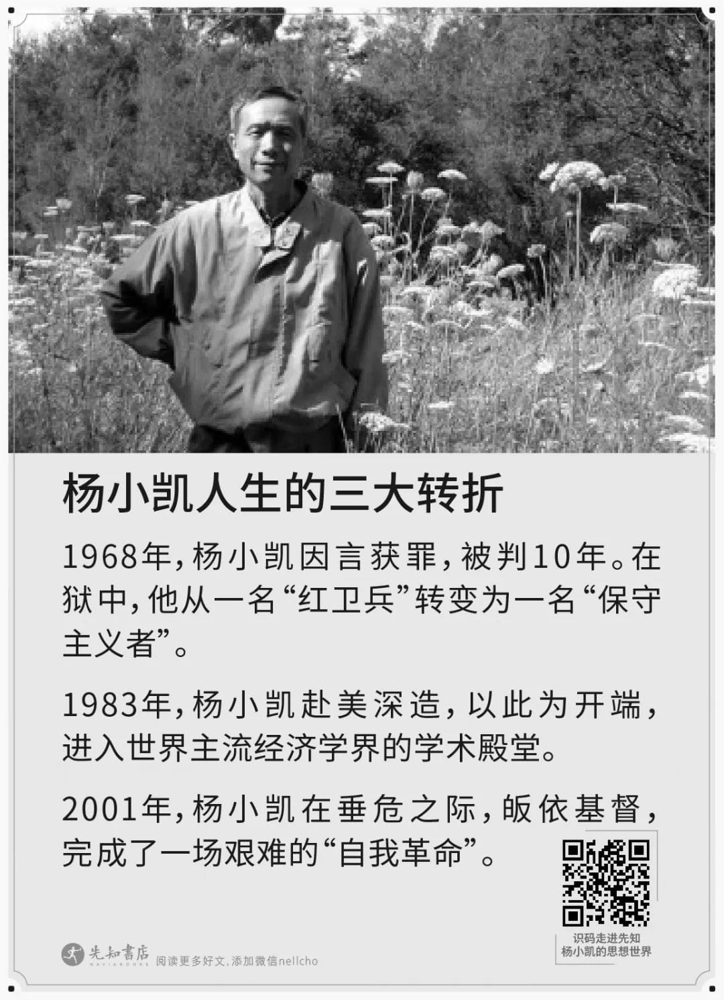

# 杨小凯（杨曦光）

## 我的一生

### 正文

#### **我的一生（经济观察报）**

作者：杨小凯

来源：[经济观察报]2004年7月19日

我原名杨曦光，杨小凯是我的乳名，1978年以后重新起用的名字，1948年出生于吉林，从小在湖南长沙
长大。我的祖父是个地主，在乡下开办学堂。他受过严格的儒家教育，清末的兴洋学运动中，他也进过
洋学堂。我们的父辈从小也受过儒学教育，记得我上小学时，父亲就请姑爹在家里教我读《论语》。

我的父母都是1938年参加革命的。我父亲原来是湖南省委的高级干部，他在1959年因支持彭德怀的观点，
反对大跃进、公共食堂，就被打成右倾机会主义分子，那是1959年秋天的事情。当时我还很小，有天爸
爸把我抱到窗边，亲切地对我说：“干部在上面机关里时间长了，对下面基层的情况不了解，所以要到
下面去了解情况。”我看着窗外的一颗大枫树上的红叶，有点奇怪爸爸当时的态度为什么出人意外地温
和。爸爸那些天情绪不好，常常和妈妈争论问题。三年后，我才知道爸爸1959年被打成右倾机会主义分
子。爸爸告诉我那年1962年为他平了反，承认他们1959年的观点是正确的。

**《中国向何处去？》**

1966年爆发了文化大革命，由于我父母都比较同情刘少奇的观点和彭德怀的观点，又被打成反革命修正
主义分子，在文革中我们就成了黑鬼的家庭非常受歧视。当时我是长沙一中高一的学生，因为受歧视不
能参加红卫兵，就参加了反对红卫兵的造反派。我参加的组织叫做“夺军权战斗队”，属于“省无联”
组织。当时在学校里红卫兵和造反派的分歧就是红卫兵都是出身好的，造反派大多是出身不好的。所以
在文革中我们就是支持造反派反对红卫兵，当时在高中的造反派主要反对的是“血统论”。在文革早期，
群众可以自己组成组织，可以按自己的观点参加不同的组织。到了1967年，军方取缔群众组织，不准群
众搞政治组织。1967年2月4日这一天，中央文革突然下令湖南省军区出动军队，镇压湖南的第一大造反组
织“湘江风雷”，抓捕了上万人。这样造反派就和官方发生了冲突。当时我们的造反派组织“夺军权战
斗队”也卷入了这场冲突，我被抓进了长沙市公安局看守所，关了两个多月。

那一次被释放出来以后，我陆陆续续写了很多大字报，包括《中国城市知识青年上山下乡的调查报告》、
《枪杆子里面出政权》等等。1968年，我写了一篇大字报《中国向何处去？》，主张中国实行巴黎公社
式的民主政体，这篇文章在当时产生了很大影响。当时湖南省革委会筹备小组的第二把手在看到了《中
国向何处去？》以后，就连忙在当时的省级干部中打招呼，进行定性。很快，我的文章被报送到了中央
文革。

1968年1月24日晚上九点，有些领导人在北京人民大会堂湖南厅接见湖南省革命委员会筹备小组成员与湖
南省一些造反派组织代表，就宣布镇压湖南的一个名为“省无联”的造反组织问题，做了一些很严肃、
语气很重的讲话与指示。在接见中，康生几次点到了“一中的杨曦光”与《中国向何处去？》一文，说
那是“反革命的‘战马悲呜’”。康还断言说：“我有一个感觉，他（指我）的理论，绝不是中学生，
甚至不是大学生写的，他的背后有反革命黑手！”江青说得更直接：“那个什么‘夺军权战斗队’，让
它见鬼去吧！”几天以后我就被“钦点”抓进监狱，关在长沙市公安局左家塘看守所。

我在看守所被关押了一年多，到了1969年秋天，我在10月份从拘留转为正式逮捕。不久，在11月一个晴朗
的冬日，我被以反革命罪判处有期徒刑十年，押送到岳阳洞庭湖边的建新劳改农场进行劳动改造，直到
1978年初刑满释放。

**十年铁窗**

《中国向何处去？》这篇文章不光使我自己身陷囹圄，而且也给我的家庭带来巨大灾难。康生在1968年
1月24日指示中说，省无联的《中国向何处去？》、《我们的纲领》、《关于当前形势的决议》不是中学
生写得出来的，也不是大学生写得出来的，后面一定有黑手操纵，要揪出这些学生后面摇鹅毛扇子的陈
老师。我母亲正好也姓陈，在康生那个指示传到长沙后，她被多次批斗，手被用墨汁涂黑并被强迫跪着
示众。涂黑的手象征着“黑手”。她受尽侮辱后，不堪羞辱而悬梁自缢。我母亲被逼自杀后，我两个妹
妹就没有了家，我父亲被关在“毛泽东思想学习班”，一个妹妹下放到湖南西部的山区，另一个妹妹跑
到山西去投靠亲戚，哥哥也被开除公职赶到乡下去了。

在左家塘看守所关押的一年半时间里，我找了位教师学英文，找了位电机工程师学电机，找了位机械工
程师学机械制图。我还读《世界通史》，马克思的《资本论》，和一本叫《毛泽东思想万岁》的书。我
向同时被关押的一位陈老师借了《资本论》，这样我就在左家塘读完了厚厚的三卷《资本论》。《资本
论》最初给我的印象相当好，学术味道浓得多。等我看完第一、二卷后，我却发现劳动价值论忽略了决
定价值的另一个重要因素——使用价值。很多年后我才知道马克思称为使用价值的概念在当代经济学中
叫做效用。但我相当喜欢马克思对亚当·斯密的分工论的发挥。看完《资本论》，我不知为什么心中期
望未来的我成为一个经济学家。我有了三个念头，一个是把使用价值在价值论中的重要性搞清，第二个
是把分工问题糅合到价值理论去，第三个是把价值理论数学化。后来我在劳改队沿着这个思路写了一本
经济学笔记。好多年后我才发觉，这些思想早就在现代经济学中变成高明得多的理论了。把经济理论数
学化的观点，我最早是在北京大学的一张大字报上看到的。那时另一张刺激我的大字报是关于中国已形
成特权阶层，需要用马克思的经济分析方法重新分析中国社会。那个刺激是我后来写《中国向何处去？》
的思想起点。

坐牢以后，我的政治哲学已经和写《中国向何处去？》时非常不同。写那篇文章时，我有对理想主义的
追求，我认为民主政体应该是民选的，而坐牢的时候我已完全没有理想主义了。我相信人判断自己所追
求的价值标准会随历史而变化，所以历史会怎么发展远比理想的目标更重要。以前我关心的问题是“什
么是好的，什么是坏的，这个世界应该怎样”，在监狱里我问的却是：“这个世界会怎样发展”。最坏
的事也许就发生在我们一生的时间内，因此关于好坏是非的主观判断没有任何意义，如何适应环境生存
下去才是重要的事情。

在监狱里我学了一些数学，想着用数学来重新想价值理论，想着把当时能够看到的一些马克思的和古典
的关于分工的思想数学化，然后慢慢就有了一些想法。由于当时自己也不相信官方的政治经济学，也没
有西方的新古典经济学的训练，所以比较自由，在那种与世隔绝的状态中就有可能出现一些新思想。在
劳改队，我自己推导出“戈森第二定律”（每一块钱的边际效用相等）、层级理论、纳什议价模型以及
劳动分工理论，我以为这些都是自己的伟大发现，但当我能看到更多书时，才发现这些思想早就被西方
经济学家发展成数学模型。不过，可庆幸的是，这些是自己想出来的东西，“英雄所见略同”，我也是
英雄之一了！

我这十年的经历都写在了牛津大学出版社1997年出版的《牛鬼蛇神录》一书中。
牛刀小试

1978年4月刑满释放以后，我回到了长沙，由于没有单位敢接收我这个《中国向何处去？》的作者，我就
在父亲的家里待了一年，这一年在湖南大学数学系旁听了一年的数学课，这些旁听都是由湖南大学刚复
职的一些右派教授安排的。这时候，我开始重用乳名杨小凯。后来，我就在邵阳的湖南新华印刷二厂做
了半年的校对工人。

1979年我报考中国社会科学院经济所硕士生，但因为“反革命历史”，被拒绝参加考试。1980年我又再
次报考，在当时的中国社会科学院副院长于光远的帮助下，终于获得参加数量经济学考试的机会，通过
考试后被录取为实习研究员，开始在中国社会科学院数量经济和技术经济研究所工作了近两年。

从1979年到1982年，我很系统地学了新古典经济学，当时经常到一些大学去听课，到北京图书馆去借书，
也参加过计量经济学的培训班，学一些系统论、信息论、控制理论、运筹学的东西，作一些计量经济学
的研究，计算一些影子价格，翻译了一本经济控制论的教材，出版了《经济控制论初步》和《数理经济
学基础》，大概是中级微观经济学的水平，当时还很新。后来我碰到很多人到国外去读书，都说当时他
们在国内对西方经济学的主要了解就是看我的这两本书。

到了1982年，我被武汉大学聘为讲师，在武汉大学工作了一年半，教授数理经济学和经济控制论课程。
这一段时间我又出版了《经济控制理论》和《数理经济学基础》，同时我开始准备出国留学。由于我的
这几本书中的一些计量经济模型引起当时在武汉大学访问的普林斯顿大学教授邹至庄老师的注意，在邹
教授的帮助下，1983年我被普林斯顿大学经济系录取为博士研究生。出国的时候，由于我还没有被平反，
出国政审通不过，这个时候还是靠邹志庄教授的帮助，他写信给领导人，希望得到帮助。后来这封信被
转到了武汉大学当时的校长刘道玉那里，请他办理。结果刘道玉校长批准了让我出国的手续。1983年我
就到了普林斯顿大学。

同时，在有关领导“杨曦光的问题要由法院依法处理”的批示下，最高法院即责成湖南省高级法院重新
审理我的“反革命”问题。到了1983年，湖南省高级法院审判委员会一致认为：《中国向何处去？》“
属于思想认识问题，不具有反革命目的，不构成犯罪。椐此，原一审、二审定性判处不当，均应予以撤
消，对杨曦光宣告无罪。”潜龙腾渊我的劳动分工理论初步形成是在我坐监狱的时候，真正成熟还是在
普林斯顿读博士学位的时候。读博士的时候，有两年的课程学习时间，这两年我就慢慢比较主流学派的
思想和我的想法的差别。在北京的两年我基本上是把自己想的东西放在一边，去系统地学习新古典经济
学。新古典经济学的很多东西都是那两年学的。到普林斯顿以后，学习的一些课程我原来在国内都教过，
因此就把新古典的思想和我的思想去比较，看看到底有没有差别，看看我想过的那些东西哪些有价值、
哪些没有价值，比如我原来在监狱里用数学自己推导出戈森第二定理，当时认为这是一个发现，一出监
狱就发现在100年前人家就知道了。层级理论、纳什议价模型我都在监狱里想过，在我的《经济控制论初
步》中都把这些理论写了进去。我发觉有很多问题我想的不如人家，比如后来我就发现纳什创建的议价
模型比我想的好多了，我就放弃了。不过这对我也有一个鼓励：别人想过的很多东西我也想得出来，这
就是所谓的英雄所见略同。

读的书多了就发觉要有所创新很难。人都是很类似的，你能想到的别人也能想到。我刚去美国就是这种
感觉。我是一个新想法比较多的人，以后看的东西比较多了，发现很多所谓新想法其实几百年前就有人
想过。慢慢看过他们的东西，自己的想法原来一点都不新。不过我的运气还好，读了很多书以后，最后
比较下来发现我想过的有些东西还没有被别人想到，这就是劳动分工理论的均衡模型，后来这就变成了
我的博士论文。

1987年我的论文通过答辩，之后我去了耶鲁大学经济增长中心做了一年的博士后。一年以后我到澳大利
亚莫纳什大学经济系教书。1989年升任高级讲师，1992年成为正教授，1993年当选为澳洲社会科学院院士，
2000年升任讲座教授。这些年来，虽然我一直在莫纳什大学教书，但是每年差不多有三分之一的时间在
美国、香港、台湾作客座教授。从1998年开始回国的时间也比较多了，并担任北京大学和复旦大学的客
座教授。

（本文系经济观察报记者肖瑞、李利明2003年采访杨小凯时，根据其口述整理而成，并经其本人审校修
改，编辑时有所删减。）

---

#### **我的一生:杨小凯自述（微博/微信）**

我的一生:杨小凯自述
文：杨小凯
编：白格尔、李强
（来自微博/微信）

我原名杨曦光，杨小凯是我的乳名。

我1948年出生于吉林，从小在湖南长沙长大。我的祖父是个地主，在乡下开办学堂。他受过严格的儒家
教育，清末的兴洋学运动中，他也进过洋学堂。我们父辈从小也受过儒学教育，记得我上小学时，父亲
就请姑爹在家里教我读《论语》。

我的父母都是1938年参加革命的。我父亲原来是湖南省委的高级干部，他在1959年因倾向彭总的观点，
被打成右倾机会主义分子，那是1959年秋天的事情。

当时我还很小，有天爸爸把我抱到窗边，亲切地对我说：“干部在上面机关里时间长了，对下面基层的
情况不了解，所以要到下面去了解情况。”我看着窗外的一颗大枫树上的红叶，有点奇怪爸爸当时的态
度为什么出人意外地温和。

爸爸那些天情绪不好，常常和妈妈争论问题。三年后，我才知道爸爸1959年被打成右倾机会主义分子。
爸爸告诉我1962年为他平了反，承认他们1959年的观点是正确的。

**中国向何处去？**

1966年爆发了wg，由于我父母都比较同情刘主席的观点，又被打成反gm修正主义分子，在wg中我们就成了
“黑五类”的家庭，非常受歧视。

当时我是长沙一中高一的学生，因为受歧视不能参加红五类，就参加了反对红五类的派系。我参加的组
织属于“省无联”组织。当时在学校里红五类和造反派的分歧就是红卫兵都是出身好的，造反派大多是
出身不好的。

在wg早期，群众可以自己组成组织，可以按自己的观点参加不同的组织。到了1967年，群众组织被取缔了，
我被抓进了长沙市公安局看守所，关了两个多月。

那一次被释放出来以后，我陆陆续续写了很多大字报，包括《中国城市知识青年上山下乡的调查报告》
等。1968年，我写了一篇大字报《中国向何处去？》，主张中国模仿巴黎公社，这篇文章在当时产生了
很大影响。

1968年1月24日晚上九点，有些领导人在北京人民大会堂湖南厅接见湖南省革命委员会筹备小组成员与湖
南省一些造反派组织代表，就宣布镇压湖南的一个名为“省无联”的造反组织问题，做了一些很严肃、
语气很重的讲话与指示。

几天以后我就被“钦点”抓进监狱，关在长沙市公安局左家塘看守所。

我在看守所被关押了一年多，到了1969年秋天，我在10月份从拘留转为正式逮捕。不久，在11月一个晴朗
的冬日，我被以反gm罪判处有期徒刑十年，押送到岳阳洞庭湖边的建新劳改农场进行劳动改造，直到
1978年初刑满释放。

**十年铁窗**

《中国向何处去？》这篇文章不光使我自己身陷囹圄，而且也给我的家庭带来巨大灾难。

我母亲被多次批斗，手被用墨汁涂黑并被强迫跪着示众。涂黑的手象征着“黑手”。她受尽侮辱后，不
堪羞辱而悬梁自缢。

我两个妹妹就没有了家，我父亲被关在一个学习班，一个妹妹下放到湖南西部的山区，另一个妹妹跑到
山西去投靠亲戚，哥哥也被开除公职赶到乡下去了。

在左家塘看守所关押的一年半时间里，我找了位教师学英文，找了位电机工程师学电机，找了位机械工
程师学机械制图。我还读《世界通史》，马克思的《资本论》和一本叫《毛泽东思想万岁》的书。

看完《资本论》，我不知为什么心中期望未来的我成为一个经济学家。我有了三个念头，一个是把使用
价值在价值论中的重要性搞清，第二个是把分工问题糅合到价值理论去，第三个是把价值理论数学化。

后来我在劳改队沿着这个思路写了一本经济学笔记。好多年后我才发觉，这些思想早就在现代经济学中
变成高明得多的理论了。

把经济理论数学化的观点，我最早是在北京大学的一张大字报上看到的。那时另一张刺激我的大字报是
关于中国已形成特别阶层，需要用马克思的经济分析方法重新分析中国社会。那个刺激是我后来写《中
国向何处去？》的思想起点。

坐牢以后，我的政治哲学已经和写《中国向何处去？》时非常不同。写那篇文章时，我有对理想主义的
追求，但现在我相信人判断自己所追求的价值标准会随历史而变化，所以历史会怎么发展远比理想的目
标更重要。

以前我关心的问题是“什么是好的，什么是坏的，这个世界应该怎样”，在监狱里我问的却是：“这个
世界会怎样发展”。最坏的事也许就发生在我们一生的时间内，因此关于好坏是非的主观判断没有任何
意义，如何适应环境生存下去才是重要的事情。

在监狱里我学了一些数学，由于当时自己也不相信官方的政治经济学，也没有西方的新古典经济学的训
练，所以比较自由，在那种与世隔绝的状态中就有可能出现一些新思想。在劳改队，我自己推导出戈森
第二定律、层级理论、纳什议价模型以及劳动分工理论。

我以为这些都是自己的伟大发现，但当我能看到更多书时，才发现这些思想早就被西方经济学家发展成
数学模型。

不过，可庆幸的是，这些是自己想出来的东西，“英雄所见略同”，我也是英雄之一了！

**改变我命运的几位师长**

1978年4月刑满释放以后，我回到了长沙，由于没有单位敢接收我这个《中国向何处去？》的作者，我就
在父亲的家里待了一年，这一年在湖南大学数学系旁听了一年的数学课。

这时候，我开始重用乳名杨小凯。

1979年我报考中国社会科学院经济所硕士生，但因为“反革命历史”，被拒绝参加考试。1980年我又再
次报考，在当时的中国社会科学院副院长于光远的帮助下，终于获得参加数量经济学考试的机会，通过
考试后被录取为实习研究员。

从1979年到1982年，我作了一些计量经济学的研究，计算一些影子价格，翻译了一本经济控制论的教材，
出版了《经济控制论初步》和《数理经济学基础》，大概是中级微观经济学的水平，当时还很新。

后来我碰到很多人到国外去读书，都说当时他们在国内对西方经济学的主要了解就是看我的这两本书。

到了1982年，我被武汉大学聘为讲师，在武汉大学工作了一年半，教授数理经济学和经济控制论课程。
这一段时间我又出版了《经济控制理论》和《数理经济学基础》。

由于我的这几本书中的一些计量经济模型引起当时在武汉大学访问的普林斯顿大学教授邹至庄老师的注
意，在邹教授的帮助下，1983年我被普林斯顿大学经济系录取为博士研究生。

出国的时候，由于我还没有被平反，遇到了困难，刘道玉校长批准了让我出国的手续。

到了1983年，湖南省高级法院审判委员会一致认为：《中国向何处去？》属于思想认识问题，不具有反
革命目的，不构成犯罪。椐此，原一审、二审定性判处不当，均应予以撤消，对杨曦光宣告无罪。

**留给世界的遗产**

我的劳动分工理论初步形成是在我坐监狱的时候，真正成熟还是在普林斯顿读博士学位的时候。

到普林斯顿以后，学习的一些课程我原来在国内都教过，因此就把新古典的思想和我的思想去比较，看
看到底有没有差别，看看我想过的那些东西哪些有价值、哪些没有价值，比如我原来在监狱里用数学自
己推导出戈森第二定理，当时认为这是一个发现，一出监狱就发现在100年前人家就知道了。

层级理论、纳什议价模型我都在监狱里想过，在我的《经济控制论初步》中都把这些理论写了进去。我
发觉有很多问题我想的不如人家，比如后来我就发现纳什创建的议价模型比我想的好多了，我就放弃了。

不过这对我也有一个鼓励：别人想过的很多东西我也想得出来，这就是所谓的英雄所见略同。

读的书多了就发觉要有所创新很难。人都是很类似的，你能想到的别人也能想到。

我刚去美国就是这种感觉。我是一个新想法比较多的人，以后看的东西比较多了，发现很多所谓新想法
其实几百年前就有人想过。

最后发现我想过的有些东西还没有被别人想到，这就是劳动分工理论的均衡模型，后来这就变成了我的
博士论文。

1987年我的论文通过答辩，之后我去了耶鲁大学经济增长中心做了一年的博士后。一年以后我到澳大利
亚莫纳什大学经济系教书。1989年升任高级讲师，1992年成为正教授，1993年当选为澳洲社会科学院院士，
2000年升任讲座教授。

这些年来，虽然我一直在莫纳什大学教书，但是每年差不多有三分之一的时间在美国、香港、台湾作客
座教授。从1998年开始回国的时间也比较多了，并担任北京大学和复旦大学的客座教授。
