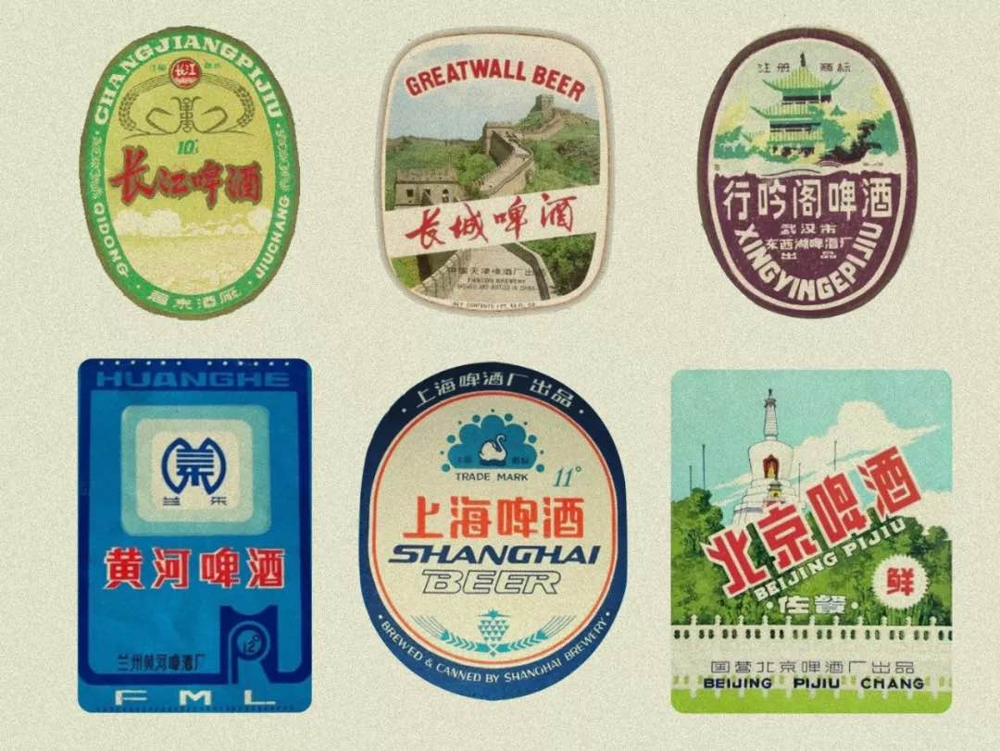

[[toc]]

# 叶首部

## 家乡啤酒兴亡史｜大象公会

原创：大象公会 Elephantia 
2018-07-30

**曾几何时，几乎每个人的家乡都产过自己的啤酒。家乡啤酒都哪儿去了？还有多少人依旧可以喝到自己家乡的啤酒？**

文｜叶部首

1978 年的夏天，中央台第一次偷信号转播了世界杯。那时看球，没有中国队、也没有冰凉的啤酒。如今，我们又习惯了一次没有中国队的世界杯，但没有冰啤酒的话，可以说是辜负了整个夏天。

曾几何时，绿色玻璃瓶上的城市、5A 景区、名山胜水的名字组成了中国的啤酒版图，几乎每个人的家乡都产过自己的啤酒。

歌德曾经教导我们：了解各个地方，与其研究各种理论，不如遍尝世间啤酒，这才是真正的地理学。

只是，这句话在今天已不再成立，五花八门的地方啤酒，不知何时已消失在历史的尘埃里。

家乡啤酒都哪儿去了？还有多少人依旧可以喝到自己家乡的啤酒？

### 舶来的液体粮食

公元 1860 年，是中国啤酒迷应当记住的一年。在第二次鸦片战争战败的大清国，被一头摁进了不列颠治下的和平。

女王、皇帝、总统的公使们集聚于北京东交民巷的王府和教堂，礼服领结，在灰扑扑的北京城里开辟了他们在东方的一片乐土。作为舶来品的啤酒，也同他们一道传入中国。

**▍东交民巷公使馆区入口**

据说最先喝上啤酒的中国人，是在为使馆锄草干活的华工。公使夫人出于客气，拿出这种欧洲最普通、最平价的饮料啤酒分予他们。这种色似马尿、味同汤药的洋货就这样在中国人的喉咙里扎下了根。

中国早期的啤酒厂是欧洲人盖起来的，清光绪二十六年（1900 年），俄国人在哈尔滨建起乌卢布列夫斯基啤酒厂，也就是今天的哈尔滨啤酒前身。之后，生活在中国其他地方的欧洲人纷纷效仿，使得青岛、北京、上海等地也出现了啤酒厂。这些酒厂成了日后各地方啤酒竞相追忆的先祖，至少在自述厂史时是这么认定的。

**▍1897年，德国军队就占领了胶州湾，其中一大原因：「胶州湾的气候良好，很适宜欧洲人居住，青岛啤酒也随之而来。」**

不过，这时的啤酒，多供给在华的欧洲人消费。在中国人的嘴里，这种低度「饮料酒」与中国自身以饮高度「燃料酒」为主流的酒文化格格不入。故当时国人对这种八国联军带来的「半殖民地」酒并无兴趣，除草工们对使馆礼遇的态度大概也颇可怀疑。

后来，北洋政府的大衙门和大学里的知识阶层逐渐开始接受了这种「杀口」的酒：「昔日饮酒，公推柳泉居之黄酒，今则非三星白兰地、啤酒不用矣」。

不过生产啤酒要消耗大量的粮食，所以在中国人吃不饱饭的时代，啤酒并不能成为接地气的大众饮料。共产党在革命期间为了节省粮食限制了饮酒，由此开始了对酒精的垄断管理。

**▍老北平飞马啤酒，战争期间只供应给在华日军，不知和马尿的典故是否有渊源。**

1949 年后，啤酒仍限于那些率先西化了的大城市。尤其是在上海这个 1949 年前「有三类市政机关，三个司法体系，四种司法机构，三个警察系统，三个公交系统，三个供电系统」的城市，已有了挪威、英国、法国、日本的多家啤酒厂。虽然，所有的外国啤酒都被国产光明牌取代，口号变成了「喝啤酒，喝光明」。

**▍光明牌啤酒不再，但上海人民还可以吃国营益民食品一厂光明牌冰砖**

进入饥饿时代，靠粮食生产的啤酒改为凭票供应，几乎丧失了市场渠道，喝到也就是尝尝而已。但据《北京志-综合志-人民生活志》记载：

> 1959 年以后，居民口粮减少，副食品供应不足，营养缺乏是普遍现象。居民为了增加热量，尽管当年啤酒、露酒被列入凭票限量供应范围，但酒的消费量依然增加。

原来是当时的人们吃不上饭，所以要喝啤酒解决温饱。诚可谓现代版「何不食肉糜」了。

七十年代末，改革开放结束了粮食危机，啤酒需求量大增，产量却跟不上。如果那时在大街上看到大罐车后拖着碗口粗的管子在倾倒液体，人们手拿所有可以盛液体的容器排队人头攒动，那并不是哪个小区断水了的救援车，而是在卖啤酒。

> **▍人民群众拿着各种容器打啤酒**

瓶啤罕有，冰箱未普及，让散啤（散装啤酒）成为了几乎唯一的销售模式。一些有啤酒厂的城市也出现了自带容器「打」散啤的奇特景观。

北京人排着长龙，拎着家里暖瓶、铝锅甚至塑料脸盆去饭馆打散啤，沈阳人直接用舀子盛鲜啤酒（这样粗狂的操作也让珍贵的泡沫几乎消失殆尽），都成为那个时代喝啤酒的标准场景。而对岸的台湾，当时已有六百多家夜总会了。

> **▍「还没有包装前装在袋子里很新鲜喔！」**

不过，中国酒鬼对享受啤酒还是不那么自信，用脸盆敦敦敦喝完几乎已经被晃悠没汽的啤酒之后，还要看不上地带上俩句：这没劲儿，不过瘾，当水喝。

但即使啤酒厂工人勤于喂马的印象已经深入人心，啤酒的冰爽、低度数和廉价还是让人欲罢不能。散装啤酒是那个时代廉价的享乐方式，就像一个融合了经济改革和思想解放的混合体。

跟着这阵吹满地的改革春风而来的，是 1985 年「啤酒专项工程」实施。中国建设银行出资 8 亿，地方自筹 26 亿，加上国家用以购买先进流水线的 2000 万美金，中国正式打开了「土创」啤酒的开关。一时「诸侯经济」四起，短短几年大生产，地方啤酒品牌的数量就达到了 813 家之多。

彼时，「村村冒烟、户户上班」，几乎每个县都有了自己的啤酒厂。土创啤酒打破了计划经济体系下的原料统销限制，改由酒厂自采原料、自销啤酒，价格随行就市。一时间冰镇啤酒成为了群众夏日最重要的冷饮。

> **▍电视剧《一年又一年》剧中人物 1985 年在家看国足冲击世界杯失败（519 惨案）时桌上的啤酒是「白牌儿」北京啤酒。瓶啤渐渐多了起来，啤酒瓶子也成为了愤怒的球迷手中的新「家伙事儿」。**

这股啤酒生产热潮最先成就的，是新疆的啤酒花。新疆气候干燥，昼夜温差大，蒸发量高，水源充沛，十分适合啤酒花的生长。比之前在山东和东北种植的啤酒花不知道高到哪里去了。

一时间,全国所有的啤酒厂都要仰仗新疆啤酒花。由于产量根本满足不了雨后春笋般出现的啤酒厂，当地甚至为了控制啤酒花的分销，还推出了啤酒花签证——「出疆证」，一时引发了全国啤酒厂争抢。理所当然地也引发了之后的「大干快上」酒花泛滥。新疆边陲的啤酒厂也就这样依靠天山水源、本地酒花开始了蓬勃的发展。

> **▍啤酒花不是花，蛇麻草的名字更形象。**

地方啤酒的大时代，就此开场。

### 啤酒的战国时代

在街头斗殴的时候，啤酒瓶应该是不次于红板砖的趁手家伙事儿，回想原来的香港黑帮片，打群架抢地盘之前必碎啤酒瓶以示郑重。硬气功也不吝惜地将啤酒瓶和红板砖向脑袋上招呼。

其实不仅仅是啤酒瓶，啤酒也一直与斗争有着紧密的联系，这种斗争有着明显的抢地盘特征。这一切的根源就是中国未曾削弱的地方主义。

> **▍青岛啤酒**
> **▍燕京啤酒**

酿酒耗费粮食，而酒精又具有一定的成瘾性，因此无论古今中外，酒都是与经济政策、财政政策密切相关的一种商品。自古以来，酿酒业自带高税收、高利润，给地方财税带来的贡献非其他产业可以相比。

改开后兴起的地方啤酒自然也是如此。到 1980 年代中期开始施行的财政包干制度下，地方企业税甚至占到了地方财政收入的 90% 以上，新兴的啤酒产业遂成了地方政府的钱包之一。

1985 年财政部关于酒类产品税征税办法中，规定了高达 40% 的税率。2001 年国家税务局对啤酒又加收了额外的消费税：高档啤酒（出厂价格大于 3000 元/吨）每吨 250 元、低档啤酒（出厂价格小于 3000 元/吨）每吨 220 元。

要知道，现在中国国产啤酒每吨的成本也不过 2000-3000 元。比如，2008 年的时候，乌苏啤酒销售收入达到了 9 亿元，对当地财政税收贡献了 3 亿元。

从这点来说，啤酒真是液体黄金。在重视扩充税源的时代，必定会引起地方保护主义的兴起。

茅于轼提到过：「地方保护主义较为普遍的保护对象是啤酒生产。因为啤酒利税较厚，生产啤酒对当地政府增加收入有明显好处，所以许多地方政府都想方设法禁止外地啤酒进来，叫消费者喝本地产的啤酒。」

813 家啤酒厂带来了繁荣，也制造了狼多肉少的买方市场。不同啤酒品牌开始着眼于产地市场之外，积极参与扩张与竞争。地方政府为了保护本地市场和本地啤酒企业对财政税收的持续贡献，当然会支持当地土创啤酒做大。

> **▍1980 年 7 月 13 日《北京日报》1 版（左）与 1993 年 8 月 19 日《北京日报》1 版（右）**

一时间，各地为推动本地人喝本地酒怪招迭出，甚至会强买强卖当地啤酒。阻止「外地」啤酒进入本地市场的手段也层出不穷。

2001 年，湖北武穴市委、市政府号召：

> 全市各级、各部门、广大党员干部和人民群众，要爱我武穴，喝我武啤，为此，经研究，在全市范围内开展「武穴人爱武穴，武穴人喝武啤」爱心大购买活动。

随后开展了一次轰轰烈烈的全市分配购买啤酒的行政任务。

2008 年，内蒙古通辽市酒监局对外地啤酒提出了贴「流通标识」的要求，不贴不能卖。这些「标识」需要商家自行去酒监局请，每个啤酒瓶子都要贴上。虽然不贵但也耗时耗力。类似的还有在齐齐哈尔更早发明的「送酒员证」。

同一时期，四川南部县以整治啤酒市场、检查食品安全为由，致力于查扣重庆山城啤酒。县税务部门要求销售山城啤酒的商户，按每种品类 2 万元额外交税，以图阻止山城啤酒的经销商渗透。

除了官方行为，民间从啤酒厂到促销员也发明了各种花式抢市场手段：用集瓶盖返钱来贿赂餐馆，还算正常的商业 lobby；到威逼利诱终端经销商曝晒对手啤酒，就有些不大对劲了。到了竞争最激烈的时期，各地甚至出现了因啤酒销售而发的暴力事件——「看谁还敢卖 XX 啤酒！」

像在黑龙江五常的「酒霸」，以砍外地啤酒经销商出名，一度迫使哈尔滨啤酒给其经销商全部投保。青岛、重庆、金龙泉等品牌的经销商也频遭毒手。

各地方之间的激烈对抗，让人想到 1920 年代的联省自治。而啤酒业也定会逐渐从地方割据走向大一统。

格局的变化始于 2001 年：中国入世了。

> **▍远不如中华烟有名的中华啤酒**

### 大鱼吃小鱼，虾米也吃小鱼

一句「外国人不懂中国啤酒」，很好地概括了入世之初，外国啤酒兴冲冲杀入中国时的竞争状态。

例如可以代表德国啤酒的 Beck’s（贝克牌），1992 年与中国一酒厂合作授权生产。德方坚持用正宗德国配方酿造重口味的贝克绿标系列，而中国啤酒厂则希望生产受中国消费者喜爱的清淡口味啤酒。二者互不相让，最终分道扬镳。

**▍白框内为贝克啤酒在《我爱我家》中的植入广告**

就在 Beck’s 找到下家准备重新开厂之际，第一家却因不愿意拱手让出努力开拓出的品牌市场，选择以半价出售 Beck’s 啤酒存货。这样两败俱伤的报复让 Beck’s 的正宗德国啤酒在中国一下跌入万丈深渊，从此消失在了人们的视野里。

在中国栽跟头的，也不止贝克一家。像 Blue Ribbon（蓝带）啤酒、Coors（银子弹）啤酒、Heineken（喜力）啤酒这样的国际啤酒大牌，几乎都因为「不懂中国啤酒」，最后只能用国际大牌的身份卖个反差萌，在中国充当了「杂牌」啤酒的角色。

但是，外国啤酒的失败，未必就是本土啤酒的胜利。

外国啤酒虽然受挫，但 WTO 引来的外国资本却在中国啤酒业一路攻城略地。Anheuser Busch（安海斯-布希）、InBev（英博啤酒集团）、SABMiller（南非酿造-美乐啤酒集团）和 Carlsberg（嘉士伯）这四家世界顶级啤酒资本集团的进入给地方啤酒带来了新的冲击。

与此同时，中国的青岛啤酒、燕京啤酒这类由土创啤酒发展起来的啤酒资本集团也开始了扩张。虽然有些国产品牌得以做大做强，但更多的故事，还是地方啤酒小厂被吞并、被收购，最终消失在人们眼里和嘴里。

其中存活下来的强者，还得说新疆的乌苏啤酒。

1986 年，乌苏啤酒借着「啤酒专项工程」的东风在天山北坡的乌苏县建成。它的强大对手是省会乌鲁木齐的新疆啤酒，不仅掌握着几乎全中国啤酒花供应的新疆啤酒花公司，还收购了吐鲁番玻璃厂，成为了一家从原料到包装全产业链的啤酒厂商。憋屈的乌苏啤酒一度毫无还手之力。

但在 2006 年，趁着新疆啤酒国企改制失败经营不善，乌苏啤酒一举将新疆啤酒集团整个吃了进来，相当于把新疆啤酒、昌吉啤酒、喀什啤酒、霍城啤酒、天山啤酒、托峰啤酒等新疆品牌尽收。

这个从前的小县城，在大鱼吃小鱼的收购兼并中一下子成了新疆啤酒地方市场的绝对霸主，中国啤酒行业中以小博大的典范，也从此成为一代新疆人地域认同的寄托。

不过，后来乌苏啤酒还是被更大的鱼吃了。

2015 年，嘉士伯完全收购乌苏啤酒。凭借此举，嘉士伯在掌握了重庆啤酒集团（山城啤酒、天目湖啤酒、大凉山啤酒等）、拉萨啤酒、大理啤酒、黄河啤酒之后，真正意义上地拿下了整个西部啤酒产业。

扎巴依们一片哀嚎：新疆再无乌苏，喝起来！幸运的是，乌苏并没有被摘牌下架，继续带着在江湖上「夺命大乌苏」的传说走出了新疆。不过这是否是用自己的瓶子帮别人的啤酒开拓市场，可能还是得看乌苏啤酒是否能继续夺命了。

除了嘉士伯，最初进入中国的四大啤酒资本集团中的 Anheuser Busch（安海斯-布希）和 InBev（英博啤酒集团）已经合并成为 ABInBev（百威英博），像湖北金龙泉啤酒、哈尔滨哈啤，如今其实都已是百威英博的品牌。ABInBev 后来又收购了另一家巨头 Sab Miller（南非酿造-美乐啤酒集团），整个地球上仿佛就剩两家卖啤酒的了。

当然，国内的啤酒巨头也没闲着。

谁能料想到，之前被戏称为「农民啤酒」的燕京啤酒最终能将桂林漓泉啤酒、泉州惠泉啤酒、杭州千岛湖啤酒、包头雪鹿啤酒、郑州金星啤酒等地方品牌啤酒等尽数收购。青岛啤酒则在收购崂山啤酒、汉斯啤酒、山水啤酒同时，把眼光放到更远的海外市场。

在这样的品牌兼并中，被市场淘汰的品牌是大多数，只有有价值的地方品牌才可能被资本集团收购。幸运的，可以留个名字让消费者喝个情怀，不幸的，只能在被收编之后改旗易帜。

而最不幸的，就是落到了华润雪花的手里。

> **▍早年间，华润雪花是由华润集团和 Sab Miller 合资创建的。后因 Sab Miller 被百威英博收购，为避免中国的反垄断调查，将 49% 股权出售。最终华润公司将其收回，华润雪花也成了华润集团全资的附属公司。**

华润一直奉行的单一品牌策略。这样的策略成就了雪花啤酒作为单一品牌在全球第一的销量，但也消灭了许多有特色的地方品牌。

其中最惨烈的要数安徽啤酒的全军覆没：蚌埠圣泉、阜阳相王、淮北雪地、滁州圣力、安庆天柱、舒城龙津、五河皖啤……

此外还有四川蓝剑啤酒、深圳金威啤酒、湖北行吟阁啤酒、黑龙江三星啤酒、辽宁大连啤酒、大雪啤酒、吉林雪豹啤酒等品牌，都因被雪花收购而从中国啤酒市场上销声匿迹。

对此类企业并购，地方政府一反几年前地方啤酒大战时睚呲必报的保护主义豪情，反而积极予以配合。因为大企业的技术、管理和规模经营可以大幅提高效益，而就业与税收依然留在当地。

### 杂牌、歪招

虽然很多地方品牌消亡了，但除了作为偶尔忆旧时的谈资，中国人对过去的地方啤酒并没有多少怀念和深情。

毕竟，从 1980 年代至今，中国啤酒的一贯工业拉格风并没有多大改变，只不过不再有「怪味」，也难再见到「无汽」啤酒的粗糙，变成了像人民情绪一样稳定的清淡。

这种清淡在国际著名的啤酒评分网站 Ratebeer 也获得了「肯定」，像哈尔滨啤酒、青岛啤酒、燕京啤酒的总评分基本稳定在了 2-4 分（100 分制），稳居所有啤酒品牌的后百分之五。

> **▍Ratebeer 的总评分即图中蓝底的 overall 一项，由该类啤酒的消费者评分（即右侧 5 分制评分）在所有啤酒品类中的排名得出。此外还有一项品类内评分，即图中绿底的 style 一项，由其在品类内的排名得出。而这些中国啤酒即便在较低档的拉格淡啤（Pale Lager）一项中依然排名靠后。**

像雪花这样熟练掌握了高浓酿造稀释技术的啤酒，分数低到只有 0-1，成就了「如何用雪花啤酒试出一个人酒量」的未解之谜。

当然，也有不少地方啤酒尝试过用创新产品的方式保存自己的品牌，但大多用力过度。

诸如人参啤酒、枸杞啤酒、玛咖啤酒、苦瓜啤酒、贡菊啤酒这样的新概念啤酒，大多已成为传说。

> **▍从植入贝克牌沦落到为苦瓜啤酒代言的贾志新**
> **▍黑啤下面有「枣味」二字**

此外，还有像茅台啤酒王、狗不理啤酒这样的跨界啤酒——

只是令人大开眼界之余，实在难以催生「来一瓶」的兴趣。

在可见的未来，家乡的啤酒品牌仍将继续消失，但是中国啤酒厂养马的传统，定会传承下去。
