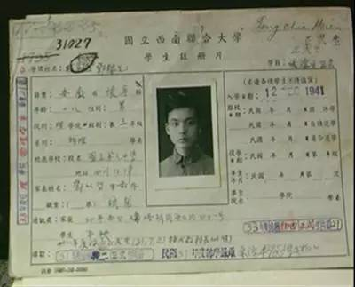
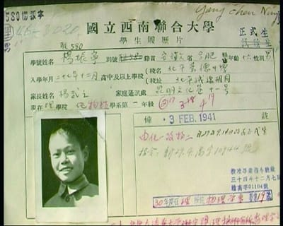
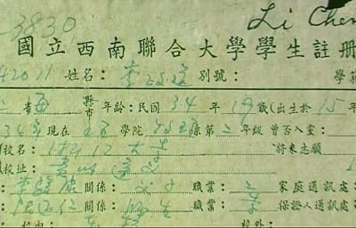
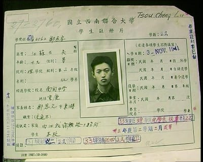
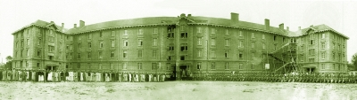
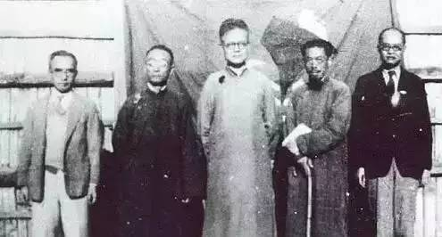
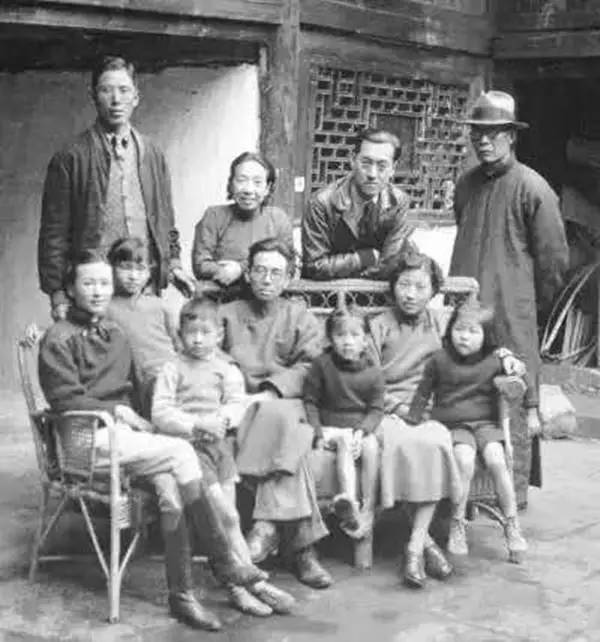

# 张曼菱

## 烽火读书声

烽火读书声
——抗战时期的学校与教育

作者：张曼菱
《光明日报》（2015年08月21日13版）

- 
- 
- 
- 
- 
- 
- 

在抗日救国的呐喊声与杀敌声中，还有另一股隐忍强劲的大潮在集结行动。一批批的青年与导师们冲出
沦陷区，去建造战火纷飞下的另一座校园。这是一部中华民族在危亡关头用文化的武器进行拼搏的历史，
里面的人、学校、思想、言行、著作都闪耀出迷人的风采与巨大的光芒。

1998年秋，我在北大朗润园与季羡林先生谈起“西南联大”的往事。先生说出一番话来：“本来读书需
要安静，可是西南联大在战争环境里，书却读得那么好，出了很多人才，民主运动也轰轰烈烈。这个，
值得研究。”

季羡林没有经历中国的抗战，战火阻隔，当时他在德国的灯火管制之夜里留学。他对中国焦土上有这样
的战时大学感到惊讶。

这位世纪老学人用质疑的声音，在追索一份失落已久的历史档案。

中国人民对法西斯的战斗，开始于1931年“九一八”事变。“一夜之间，中国好似在睡梦中被砍掉了脚
的巨人，突然惊醒，全国游行，呼喊口号‘打倒日本帝国主义，誓死复土！’但喊声只有自己听见。那
时的世界仍在殖民地时代，有制裁力的强国几乎全是殖民国家。当时的国际联盟为九一八事变后派遣到
中国的‘李顿调查团’，然而毫无成果。世界上从无真正公理。”在《巨流河》一书中，齐邦媛的回忆
沉痛，令人震动。

那时有一句话：“华北之大，已经放不下一张平静的书桌。”

我是在著名小说《青春之歌》里面读到这句话的。书里面的进步青年有的参军了，到东北加入抗联，或
者西去延安革命。这是我们所熟知的那个年代的主旋律。

而寻找“西南联大”的过程，对于我却有另外的发现。

### **读万卷书 行万里路**

> **十一月四日星期四**
>
> 阴，大雾，晨 8：00 后，即独至东车站，紫祡城为浓雾所蔽，街上行人尚少。
>
> **晓发北平十一月四日**
>
> 十载闲吟住故都，凄寒迷雾上征途。
> 相携红袖非春意，满座戎衣甚霸图。
> 乌鹊南飞群未散，河山北顾泪常俱。
> 前尘误否今知悔，整顿身心待世需。
>
> ——《吴宓日记》

1937年吴宓凄然告别北平。列车上的日本军人对中国乘客不屑一顾。可这个文弱的教授却说自己是“上
征途”。

当陈三立绝食殉国后，著名世家出身的学者陈寅恪在父丧未举之际，秘密地离开了北京。在王国维死后，
陈寅恪被人们期待为“一代文化托命人”。他深知自己肩负的使命，决不愿意落入日寇之手。他携带着
珍贵的佛家经典随学校南迁，因为“救国经世，尤必以精神学问为根基”。

象牙塔在战火中倒塌，象牙塔里的人们走了出来。

北大、清华、南开三校奉教育部之命转移长沙，组成“临时大学”。

数学家江泽涵对家人说：“奉召而去”，只身赶往长沙。

朱自清说，文人至此，唯有“弦诵不绝”报国。

陈省身回忆：“1937年抗战开始，清华要我回来，在数学系做教授，所以我离开巴黎，先到美国，然后
1937年8月到上海。”“我们那个时候都痛心于祖国的弱啊！恨日本侵略啊。但是一个念书的学生，也没
有什么很具体的办法。所以先回来再说了。”

在当时知识界与政界中，有一股失去民族自信心而投靠日本的逆流。陈省身认为，一群留学生在抗战开
始之际归来了，这让人们觉得，“中国是可以站起来的”，这是“很了不得的，最基础的贡献”。

当“长沙临时大学”再次转移迁滇，以李继侗、曾昭抡、闻一多等教员为首的师生们组成了一个“湘黔
滇旅行团”，简称“步行团”。

步行团成员吴征镒说：“虽然叫行军，但我们这些知识分子，也不习惯像军队一样排好队走，而是稀稀
拉拉地拉得很长。有的同学搞社会学的，或者搞文学的，还深入到民间，去访问民族歌舞、语言、风俗
习惯等等。我们常常和闻老师、李老师坐在公路边上，互相议论国事，谈学问，谈所见所闻。”

中国古人有“读万卷书，行万里路”的求学之道。在学校流亡民间的途中，乡绅是他们最有力的基层支
持者。“步行团”路过贵州玉屏县时，县长发布告说：“凡县内商民，际此国难严重，对此振兴民族之
领导者——各大学生，务须爱护借重，将房屋腾让，打扫清洁，欢迎入内暂住，并予以种种之便利。”

在偏僻的贵州，有一支童子军的队伍来欢迎他们。

在抗战岁月，几乎所有的中小学生都要接受“童子军”的训练。我曾经看见过母亲的一张照片，少女的
她威武如军人。母亲告诉过我，那就是童子军。她还教我唱：“不怕年纪小，只怕不抵抗”。母亲终身
保持着那一代人的坚韧和对日本入侵者的民族仇恨。

“七七事变”不久，中国大地就出现了一批批的战时大学，战时中学和小学。

危急关头，为了保全血脉，北中国的家庭自愿分散，学子们追随学校，少年人追随老师，开始了他们艰
辛不屈的转移与读书生涯。

许倬云先生写道：“当学校的队伍，列队走过家门口时，每一个年轻的孩子，身穿制服，就像行军的军
人一样，背一个背包和口粮，两双草鞋，列队进行。祖母看见二哥在队伍之中，实在舍不得，哭着要我
的母亲，将二哥从队伍中撤出来。母亲答道：‘我们的孩子，能留一个，就是一个。国家快亡了，这些
留下的种子，也许可以为我们再造中国，扳回自由和独立，不做日本人的奴隶。’”

齐邦媛回忆，她的父亲带着学校和自己的孩子们一起走：“这迁移的队伍白天赶路，晚上停在一个站。
一路上，我们住了无数住店。学生们都被安排住在各处学校的礼堂、教室或操场，当地驻军会分给一点
稻草和米，大家都睡在稻草上，每餐还能有一些煮萝卜或白菜。”

随着日寇的入侵，一些在南方的大学和中学，也纷纷内迁，每一个省的教育厅，都在各地设立临时的联
合中学，沿途收纳逃难的青年。在内移的过程中，学校教育没有中断。这些学校各自落脚在内地的偏僻
地方，恢复正常的课业。

除了这些有组织的迁移，沦陷区还有无数的青少年不愿受日本教育，纷纷逃到后方，有的投靠亲友，有
的流落各方。

王鼎钧先生写道，陈立夫当时主张收容教育沦陷区青年：“当年他有一句话遍告政要：‘孩子进流亡学
校，至少他的父母不会去当汉奸。’他也一向反对把学生编进队伍当兵，又有一句话遍告政要：‘现在
还没到送学生上前线的时候。’他这两句名言作用很大，成全了千万矢志向学的下一代，功德无量。”

1994年，陈立夫出版回忆录《成败之鉴》，把这一段政绩说个详细。他“不顾当时行政院政务处和财政
部内部人员反对”，批准了救济战区（沦陷区）青年的方案，沦陷区青年在后方中等以上学校读书，由
国库支给贷金。书中说“这一笔庞大的费用，在国家财务支出上仅次于军费”。

事实上，得到“贷金”救助的不只是沦陷区学生。在我所采访过的西南联大校友中，如当时从缅甸回来
的华侨学生王汉斌以及云南本地白族子弟王希季等，他们都说，自己是靠着“贷金”度过读书岁月的。

### **弦诵不绝 英才云集**

齐邦媛说，当时的老师们有一股“楚虽三户，亡秦必楚”的气概。“自离开南京到四川自流井静宁寺，
整整一年。颠沛流离有说不尽的苦难，但是不论什么时候，户内户外，能容下数十人之处，就是老师上
课的地方。学校永远带着足够的各科教科书、仪器和基本设备随行。”“在战火延烧的岁月，师长们联
手守护这一方学习的净土，坚毅、勤勉，把我们从稚气孩童拉拔成懂事少年，在恶劣的环境里端正地成
长，就像张伯苓校长说过：‘你不戴校徽出去，也要让人看出你是南开的。’”

张校长对南开学生们的警句是：“中国不会亡，有我！”

1937年11月1日，长沙临时大学正式上课。蒋梦麟说：“虽然设备简陋，学校大致还差强人意，师生精神
极佳，图书馆虽然有限，阅读室却座无虚席。”

很快长沙被轰炸。到1937年底，发生了震惊世界的南京大屠杀。在长沙临时大学，学生们发生过“是读
书还是参军”的争论。最后大家认为：因为抗战不是三五天的事，所以学业不能中断。

钱穆教授说：“如果我们把到后方来读书当作是苟安，不如上前线去作战的好。我们既然到了这里，就
要用上前线的激情来读书，才对得起国家和前方将士。”

任继愈回忆，到昆明后，“钱穆的《国史大纲》出版的扉页上写着‘谨以此书献给抗战的百万将士’。
这部中国通史成为各大学首先选用的教材。”“历史系雷海宗讲授中国通史，结合他丰富的世界史知识，
把中国古代史放在世界历史的大范围来观察。”像雷海宗、陈寅恪这样的学者讲课时，都从不翻书，娓
娓道来，令人忘倦。

百家争鸣的学风在西南联大盛行。“罗庸讲《唐诗》，第二年闻一多也开《唐诗》。闻一多讲《楚辞》，
第二年罗庸也开《楚辞》。两人的风格、内容各异，同学受益很多。沈有鼎为哲学系开《周易》课，只
有三五个学生来听讲，闻一多也坐在学生中听讲。郑昕开‘康德哲学课’，数学系程毓淮也来听课。陈
寅恪讲‘佛典翻译文学’，中文系、历史系、哲学系的助教、讲师多来听课，本科生不多，遂有‘教授
的教授’的称号。”

学生中跨系听课蔚然成风。联大工学院的学生有的走好几里路到校本部听文科的课。

“联大老师讲课是绝对自由，讲什么，怎么讲，全由教师自己掌握。”“大学入学考试的标准也没有标
准一说。”何兆武先生回顾当时的教育，说：“如果大家都按一个思路想，科学怎么进步？包括爱因斯
坦的理论也不应该成为标准，否则永远不可能超越。”“而老师的作用正是在于提出自己的见解启发学
生，与学生交流。”

梅贻琦的名言道出了中华独有的大学理念。“所谓大学，非有‘大楼’之谓也，乃有‘大师’之谓也。”
它与《陋室铭》的优秀传统遥相呼应，在这个学术与教育流亡的战争年代里，更显示出一个民族的文化
自信力。

一批由著名建筑家梁思成夫妇设计的土坯铁皮屋出现在昆明城西。这就是西南联大的“新校舍”。从这
些铁皮或草顶的土屋里，走出了使中华民族崛起的一代精英。

“两弹元勋”邓稼先，当初逃出北平，来到昆明，遵照父亲送别时的悲壮叮嘱，“学科学能救中国”，
他报考了西南联大物理系。

地质学家郝诒纯，曾被联大人称为“校花”。她长得漂亮，功课好，是篮球队长，学生会主席。人们认
为这样的女生应该学外语，她却选择了地质。“我转地学系，也是受一位教授的影响。他是袁复礼，第
一届跟外国人合作组成西北考察队的队员。”袁复礼深感外国人的考察企图，是为了预备掠夺我国的矿
产资源。他用这一段经历教育学生。郝诒纯将终生献给了野外考察。

邹承鲁说：“对我一生影响比较大的是杨石先，后来的南开大学校长，我就记得后来选择生物化学专业，
是受他的影响。”邹后来成为胰岛素人工合成的带头人。

被誉为“中国火箭之父”的王希季回忆：“我们还要跑警报，跑完警报照样上课，照样工作。”“我们
那个时候，整个的爱国热情是很高的。学，就是为了要打赢日本人。”

由于战时的条件限制了研究的进行，大师们转向投入“本科”的教学，这使得西南联大的学生一入门就
受到“研究生”规格的启蒙。

带着一封浙大导师的推荐信，李政道在战火中艰辛奔赴昆明。“我是1945年转到联大的。我一年级在浙
大，二年级转学到昆明。”吴大猷通过解题验证了这名物理奇才。“带我的主要是吴大猷先生和叶企孙
先生。他们答应我，选二年级的课，教我三年级的。”其实，对李政道的发现是从浙江大学开始的。这
是战火中的“人才接力棒”，包含着中国“师道”中“惜才”的美好传统。

在中国被封锁的年代里，梅校长托人从欧美购来大学教科书的样本，在上海的商务印书馆成批复印，又
辗转香港运到昆明，使得西南联大的教学一直与国际一流大学接轨。

当杨振宁等人在1945年后“留美”，他们发现自己并不比别人差。

### **为人师表 声名远播**

西南联大有“民主墙”。

赵宝熙说：“那天我正在民主墙那儿，因为我们刚出来一期壁报。忽然看见冯先生走进校园来了。那天
天气很好，也许他是来学校转转，也许是有人告诉他，他来看壁报了。”因为冯友兰将《贞元六书》题
词献给蒋介石，有学生就画了一幅漫画，题名叫“登龙有术”，意思说，用献书达到做官的手段。后来，
冯先生跟别人说，“画得还挺像。”

联大有一个公示栏。师生们有什么想法，可以张贴，每天都会有校工来收走，由梅贻琦校长次日作出答
复。

赵宝熙说起一桩趣事：“梅贻琦的女儿，梅祖彤，梅三儿。有一个学生追她。”这位男生想送花给她，
就写了一个呈文，请求送花，请梅校长批准。“结果弄得大家老去看，一看，他上面就写：某某人所请
不准。”

一个年轻人的恶作剧的条子，日理万机的梅校长并没有回避，照样给了明确的答复，维护了制度的一贯
性。

联大生活就是如此，浪漫而有一定之规，有趣而不失风范。

化学系有位老师，为补贴家用种了些花。当鲜花终于含苞欲放，却在一个夜间全部失窃了。有人告诉他：
到女生宿舍去看看吧。他的满园花朵正安插在女同学们的玻璃瓶和土罐里呢。原来，一伙男生早已经看
好了这些鲜花。虽然是靠“贷金”吃饭，一面“跑警报”一面也要谈恋爱。“记得少年春衫薄”，老师
也只能摇头一笑了之。

师长们的爱与宽容，传承了中国古代“一日为师，终身为父”的师道，兼容了现代民主的理念。联大的
学生虽然流亡，然而温馨、有幸福感和希望。

我父亲时常回忆起，当年西南联大的老师们在昆明为市民举办讲演的盛况。潘光旦讲“优生学”，刘文
典讲《红楼梦》，闻一多讲《楚辞》，吴晗讲时事，梁思成讲“中国古建筑”。讲到国破家亡，台上痛
哭流涕，台下群情激愤。

西南联大洒下的文化雨露，对于父亲后来坎坷的人生是一份滋养。“每天，市民都看见他们，夹着一包
书，就用本地的土布包着，走着穿过小城去上课，回家。几位先生的蓝衣衫都破了，打着不同颜色的补
丁。有位穿皮夹克的先生，夹克穿得很脏也不洗，说要等打败了日本才洗。还有两位先生，胡子很长了
也不刮也不修剪，也说要等胜利了，才剃掉。”

学者们走向民间，将读书人的斯文与气节在乡土中国传扬。他们在漫长的抗战岁月中保持贫寒操守，再
现了“先天下之忧而忧，后天下之乐而乐”的高风亮节。

梅贻琦夫人率领一群教授夫人们推磨做点心，提篮到昆明“冠生园”去卖的故事，成为“抗战一定要胜
利”的无声楷模。“为人师表”的学者们在烽火岁月中磨砺和打造了自己，成为那个时代的伟岸君子。

在中国，自古有“读书人”的称谓，不似职业，却高于职业；不指人品，又对其人品有高要求。知识分
子不仅仅意味着拥有知识，也应该是一个时代道德与精神的体现。这也是全人类的期望。

七十年过去后，许倬云先生将中国的抗战大转移譬喻为“历史上难得见到的中国版的《出埃及记》”，
这确有相似点，其性质都是要摆脱奴役与亡国灭种的命运，团结起来作一次全民族的生死搏斗。

可以说，抗日战争的历史，就是一部中国人民的《圣经》，值得每一个中国人熟知与温习。这是“根性”
的记忆，关乎一个民族的立足点，利与害，还有传承。

严峻时代，中华民族倾举国之力，坚持战时教育。国运与文脉始终相衔。

烽火读书，保存了世界上唯一“有古有今”的文字记载和历史最悠久的中华文明。

烽火读书，是中华民族对法西斯毁灭人类文明的正义反击。

> （作者曾为天津作协专业作家，后返回云南，致力于“国立西南联大”历史资源的抢救、整理与传播工作。创作有电视纪录片《西南联大启示录》，音像制品《西南联大人物访谈录》，史话《西南联大行思录》等。）
