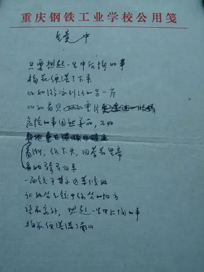

[[toc]]

# 张枣

## 《镜中》

<!-- tabs:start -->

#### **全诗**

**《镜中》**
张枣

只要想起一生中后悔的事
梅花便落了下来
比如看她游泳到河的另一岸
比如登上一株松木梯子
危险的事固然美丽
不如看她骑马归来
面颊温暖
羞惭。低下头，回答着皇帝
一面镜子永远等候她
让她坐到镜中常坐的地方
望着窗外，只要想起一生中后悔的事
梅花便落满了南山

<!-- tabs:end -->

### 附录

