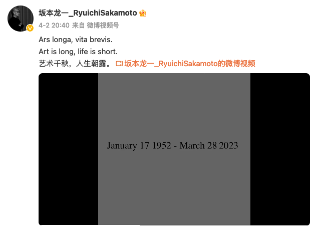

# 坂本龍一（坂本龙一）

坂本龍一/さかもと・りゅういち （1952-2023）日本音乐家。

### 格言

::: info

> [!quote]
>
> 『一市民として黙っていてはいけない』
>
> > "As a citizen, I could not remain silent,"  
> > “作为一名公民，我（们）不能保持沉默。”——坂本龙一在采访中转述，2023。 

:::

相关：

- [对坂本龙一的书面采访](../post/sakamoto-2023.md)
- 坂本龙一告别信（讣告）：
  - 
